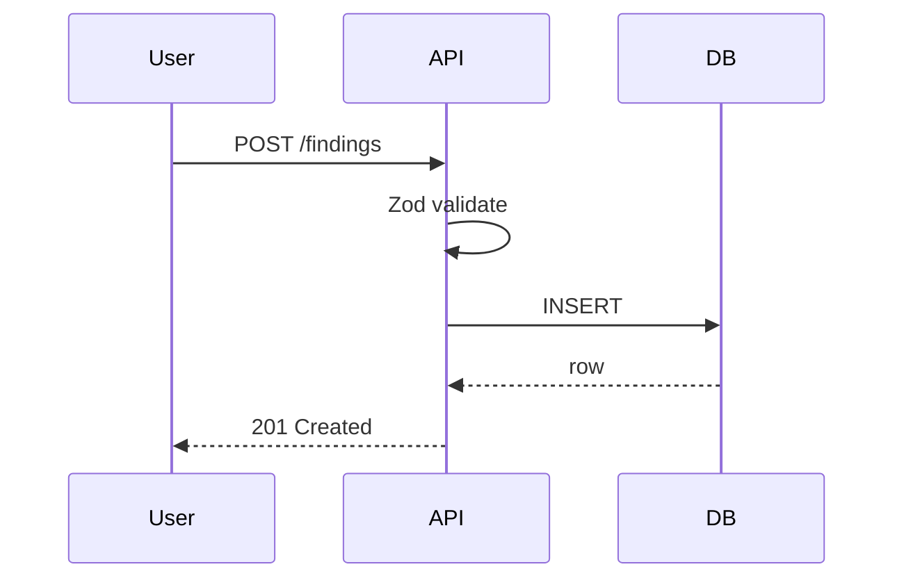

# Documentation

> Four kinds of documentation. Docs as code. ADRs for significant decisions. READMEs for modules. JSDoc for public APIs. Runbooks for operations. Written when the code is written — never "later."

---

## 1. Four Kinds of Documentation (Diátaxis Framework)

We use the **[Diátaxis](https://diataxis.fr/)** model — four distinct doc types, each with a distinct purpose. Mixing them confuses readers.

| Type | Purpose | Example |
|------|---------|---------|
| **Tutorials** | Learning-oriented; beginner | "Build your first standard pack" |
| **How-to guides** | Task-oriented; steps to solve a problem | "How to add a new tRPC procedure" |
| **Reference** | Information-oriented; complete + accurate | API reference, schema docs |
| **Explanation** | Understanding-oriented; background + rationale | "Why we chose tRPC over GraphQL" |

Each doc is explicitly one type. Mixing = confused reader.

### Where each lives
| Type | Location |
|------|----------|
| Tutorials | `docs/tutorials/` |
| How-to guides | `docs/guides/` |
| Reference | Auto-generated (TSDoc, OpenAPI) + `docs/reference/` |
| Explanation | `docs/explanation/` + ADRs (`docs/adr/`) |
| Module overview | `README.md` in the module |
| Inline rationale | JSDoc / comments |
| Runbooks | `devops/RUNBOOKS.md` + `runbooks/*.md` |
| Architectural decisions | ADRs (`docs/adr/NNNN-*.md`) |

---

## 2. Documentation Layers

```
  Reader intent        Doc type              Lifetime        Audience
  ──────────────────   ──────────────────   ────────────    ──────────────
  "I'm new here"       Tutorials             Quarterly rev.  New engineers
  "I need to do X"     How-to guides         Evergreen       All engineers
  "Complete spec"      Reference             Always current  All engineers + API users
  "Why are things …"   Explanation + ADRs    Immutable (ADR) Curious engineers
  "What's in this?"    README                Evergreen       Module maintainers
  "How does this fn?"  JSDoc                 With function   Callers
  "It broke — fix?"    Runbook               Tested monthly  On-call
  "What's changing?"   CHANGELOG / release    Per release     All
```

---

## 3. The Docs-as-Code Principle

- Docs live in the repo alongside code (or in a `docs/` folder)
- Written in Markdown
- Reviewed in the same PR as the code they document
- Versioned with the code
- Generated / validated in CI
- Deployed alongside code releases

Never:
- Confluence-only docs (drifts fast, no versioning)
- "Internal wiki" separate from repo
- Docs team as a separate group

Docs are engineering output.

---

## 4. README Files

### Every workspace package has a README
```
packages/validation/README.md
packages/standard-packs/README.md
apps/api/README.md
apps/web/README.md
```

Each answers:
- **What** is this?
- **Why** does it exist?
- **How** do I use it (quick start)?
- **Where** to learn more (links to deeper docs)

### README template

```markdown
# <Package Name>

> One-sentence description.

## Purpose
What problem this package solves. What it's responsible for.

## Quick start
Minimal usage example.

## Key concepts
(Optional) Core terms / abstractions.

## API overview
(Optional — link to generated reference for details.)

## Development
How to run, test, and build *this package* specifically.

## See also
Links to deeper documentation.

## Ownership
Team: @team-name
Slack: #channel
```

### Sub-module READMEs for complex areas
If a subfolder (e.g., `src/features/approvals/`) warrants context, add a `README.md` there too. Keep it short.

### Update as you go
README drift is the #1 documentation problem. Rule: if a PR changes the public API of the package, the README is updated in the same PR. Reviewer enforces.

---

## 5. JSDoc for Public APIs

Every exported function, class, type from a module has JSDoc. Internal helpers often don't need it — but JSDoc for public surface is mandatory.

### Minimum JSDoc

```ts
/**
 * One-line summary of what this does (imperative mood).
 *
 * Longer description if needed — constraints, side effects, important context.
 *
 * @param input - What this parameter represents
 * @returns What the return represents
 * @throws {DomainError} when X condition is violated
 *
 * @example
 * ```ts
 * const result = await approveFinding({ id: "fnd_abc", reviewerId: "usr_xyz" });
 * ```
 */
export async function approveFinding(input: ApproveInput): Promise<Finding> { ... }
```

### Types + Interfaces
```ts
/**
 * Shape of a finding in its display form.
 *
 * Note: `elementValues` is polymorphic; structure depends on the engagement's
 * standard pack. See `data-model/standard-pack-schema.ts`.
 */
export type FindingView = {
  id: FindingId;
  /** The current workflow status. See {@link FindingStatus}. */
  status: FindingStatus;
  /** Free-form title set by the author. 10–240 chars. */
  title: string;
  /** Pack-driven element values. See pack def for keys. */
  elementValues: Record<string, unknown>;
};
```

### JSDoc tags we use
- `@param`, `@returns`, `@throws`
- `@example` — at least one for non-trivial APIs
- `@deprecated` — always with replacement + removal date
- `@see` — link to related docs / APIs
- `@internal` — NOT part of the public API; may change without notice
- `@remarks` — extended explanation

### What JSDoc catches
TypeDoc generates a reference site from JSDoc. Writing good JSDoc forces clarity about API shape + invariants.

### Typedoc generation
```bash
pnpm docs:api     # generates docs/api/ from JSDoc
```

Output hosted at `docs.aims.io/api-reference` — always current.

---

## 6. Architecture Decision Records (ADRs)

ADRs document significant architecture decisions. Once written, they are **immutable** — future decisions that change direction create new ADRs that supersede.

### When to write an ADR
- Choosing between architectural alternatives
- Introducing a new technology / tool / dep that affects multiple teams
- Changing a contract (API, event schema, data model) that consumers rely on
- Declining to adopt something with strong advocacy ("we considered, rejected, and why")
- Policies that affect all engineers (e.g., "we use Zod not Joi")

### When NOT to write an ADR
- Routine refactors
- Small tooling choices (package A vs package B, both acceptable)
- Implementation details that can be changed without affecting architecture

### ADR template

```markdown
# NNNN — Title

- Status: Proposed | Accepted | Rejected | Deprecated | Superseded by NNNN
- Date: YYYY-MM-DD
- Deciders: @names
- Consulted: @names (optional)
- Tags: #architecture #api #security

## Context
What is the problem? What constraints are we operating under? What's the background?

## Decision
What did we decide? State the chosen option in one short paragraph.

## Alternatives considered

### Option A: (chosen / rejected)
- Pros
- Cons

### Option B: ...

### Option C: ...

## Consequences

### Positive
- What we gain

### Negative
- What we give up / take on

### Neutral
- Side effects, things to keep an eye on

## Validation
How will we know if this decision was right?
What would cause us to revisit?

## References
- Relevant specs, blog posts, RFCs
- Linked tickets / PRs
```

### ADR numbering
- 4-digit sequential: `0001-standard-pack-versioning.md`, `0002-trpc-over-graphql.md`
- Never re-used; even rejected/deprecated ADRs keep their number
- `docs/adr/README.md` is an index of all ADRs + status

### ADR review
- Async in `#architecture` Slack (48h review window for normal decisions)
- Sync meeting for controversial ones (max 60 min)
- Once merged, an ADR is immutable. Change your mind → write a new ADR that supersedes.

---

## 7. Inline Comments

See `CODE-STANDARDS.md §10` for rules. Summary:
- Explain *why*, not *what*
- JSDoc for public APIs
- Link to external context (docs, RFCs, tickets)
- TODO / FIXME with author + issue ID
- Remove obsolete comments

---

## 8. CHANGELOG / Release Notes

Two artifacts, two audiences:

### `CHANGELOG.md` — for engineers
- Generated by Release Please (see `devops/RELEASE.md §4`)
- Every PR's commit contributes an entry
- Technical; internal jargon OK
- Committed to repo

### `docs/release-notes/YYYY-MM-DD.md` — for customers
- Curated from CHANGELOG by product team
- Customer-friendly language
- Grouped by "New", "Improved", "Fixed"
- Published to docs site + email to tenant admins (opt-in)

---

## 9. API Reference

### Generated, not hand-written
- **tRPC**: type-inspector generates schema docs + example inputs
- **REST**: OpenAPI spec (`api/rest/openapi.yaml`) → rendered via Redoc / Swagger UI
- **Webhooks**: event schemas → rendered as table of events + example payloads

### Published where
- Public API customers: `docs.aims.io/api` (public)
- Internal engineers: same URL, auth-gated sections show internal procedures

### Kept current by CI
- OpenAPI regenerated from code + committed
- If PR changes API surface but didn't update the spec, CI fails

---

## 10. Tutorials

Step-by-step walkthroughs for beginners. Each tutorial:
- Has a clear outcome ("By the end, you'll have built X")
- Walks linearly; skipping steps breaks things
- Is tested — scripted walkthrough run quarterly
- Updated when tooling changes

### When we write tutorials
- New engineer onboarding (major subsystems)
- External integrator onboarding (REST API, webhooks)
- Standard pack authoring (complete walkthrough)

### Catalog (Phase 1)
- `docs/tutorials/new-engineer-setup.md`
- `docs/tutorials/authoring-a-standard-pack.md`
- `docs/tutorials/first-tenant-onboarding.md`
- `docs/tutorials/rest-api-quick-start.md`
- `docs/tutorials/webhook-integration.md`

---

## 11. How-To Guides

Short, task-focused. Answer "how do I …" without backstory.

Examples:
- "How to add a new tRPC procedure"
- "How to write an integration test with Testcontainers"
- "How to debug a failing k6 load test"
- "How to roll back a production deploy"
- "How to add a new permission"

### Pattern
```markdown
# How to <verb the task>

**Prerequisites**: list

1. Step
2. Step
3. Step

**Verify**: how to know it worked.

**Troubleshooting**: common issues + fixes.
```

Short; scannable; focused.

### Catalog grows organically
Whenever someone asks a question in Slack that could be a how-to, we write it down. Stack grows over time. `docs/guides/` indexed with tags.

---

## 12. Explanation Docs

Discursive prose for understanding. Can be long. Examples:
- "Why we use RLS for multi-tenancy"
- "Standard pack immutability explained"
- "The audit log hash chain and why it matters"
- "Approval workflow semantics"

Pairs with ADRs (which capture decisions) — explanations capture the *concepts*.

### Concept docs near the code
- `database/` has explanation docs for data model concepts
- `data-model/` for standard-pack concepts
- `auth/` for auth concepts

---

## 13. Diagrams

### Mermaid (preferred)
Text-based; diffable in PRs; renders in GitHub.

```markdown


### draw.io / excalidraw
For more complex visuals. Store SVG + source `.drawio` side-by-side so anyone can edit.

### No binary screenshots of diagrams
Screenshots rot — can't edit. Use source-code diagrams (Mermaid) or version-controlled vector (SVG + draw.io source).

### Diagrams in ADRs
ADRs with architectural implications include at least one diagram.

---

## 14. Runbooks

See `devops/RUNBOOKS.md` for full catalog. Runbook docs additionally:
- Have a "Last tested" date
- Link to related alert
- Are **tested** (not just written) — quarterly drill
- Are owned by the team that operates the relevant service

---

## 15. Documentation Site

### Built with
- **VitePress** or **Docusaurus** — Markdown-first, fast, customizable
- Deployed as static site to `docs.aims.io`
- Previews per-PR (via Vercel / CloudFlare Pages)

### Layout
```
docs.aims.io/
├── /              ← landing / search
├── /learn/        ← tutorials + getting started
├── /guides/       ← how-to guides
├── /reference/    ← API reference, schema reference
├── /concepts/     ← explanation docs
├── /adr/          ← ADR index
├── /standards/    ← compliance docs (public-safe parts)
└── /release-notes/
```

### Sections
- **Public** — customer-facing docs (API, webhooks, standard pack authoring)
- **Authenticated** — tenant-specific docs (if any)
- **Internal-only** — engineering docs (ADRs, runbooks, internal guides)

Hosted separately or same site with auth-gated routes.

---

## 16. Writing Style

### Tone
- Direct. "To create an engagement, call `engagement.create`." — not "You might want to consider that it could be possible to…"
- Active voice. "The API validates the input" — not "The input is validated by the API."
- Present tense. "The system emits …" — not "The system will emit …"
- Explicit. No "obviously", "simply", "just" — what's simple to you isn't to the reader.

### Length
- Ruthless editing. Cut everything that doesn't add value.
- Shorter > comprehensive; comprehensive > clever.

### Lists + tables beat prose
When the info is structured, show it structured. Prose for narrative; tables for reference.

### Code examples
Every non-trivial API has a runnable example. Copy-paste and it works.

### Domain vocabulary (consistency with `CODE-STANDARDS.md §2`)
- "engagement" not "project" / "job" / "audit"
- "finding" not "issue" / "observation"
- "tenant" not "org" / "company" / "customer"

Docs + code use the same vocabulary. Users shouldn't have to translate.

---

## 17. Documentation Metadata

Every doc has frontmatter:

```yaml
---
title: How to Add a New tRPC Procedure
description: Step-by-step guide for adding a new procedure to the API
type: how-to         # tutorial | how-to | reference | explanation
audience: engineers   # engineers | integrators | end-users
status: current       # draft | current | deprecated
last-reviewed: 2026-04-20
owner: @aims-backend
---
```

CI verifies metadata:
- Required fields present
- `last-reviewed` not > 12 months stale (warning)
- `status: draft` doesn't make it to public docs
- `type` matches folder it's in

---

## 18. Deprecation

### Deprecating a doc
- Mark `status: deprecated`
- Add `Deprecated: use <link>` banner at top
- Keep for 6 months, then archive

### Deprecating an API
- JSDoc `@deprecated` tag with replacement + removal date
- Deprecation warning at runtime (console.warn or logger)
- Release notes mention
- Removed per schedule (usually ≥ 2 minor versions later)

### Archived docs
Moved to `docs/archived/`, not deleted. Search results exclude; direct links still work. Useful for understanding history.

---

## 19. Docs In CI

### What runs on every PR
- Markdown lint (`markdownlint`) — consistent heading levels, link checks
- Frontmatter validation (required fields)
- Broken link check (internal)
- Spell check (`cspell` with AIMS dictionary)
- Prettier (formatting)

### Scheduled
- External link check (daily)
- "Stale docs" report (weekly) — docs not reviewed in 12 months
- Diátaxis type audit (quarterly)

### Build check
- VitePress build succeeds
- No 404s in generated site

---

## 20. Ownership

### Every doc has an owner
Frontmatter `owner:` field — team's GitHub handle. Owner is responsible for:
- Reviewing quarterly
- Responding to issues filed
- Deprecating when obsolete

### Docs with no owner
Weekly report flags; someone claims or we archive.

### No doc without a maintainer
Prevents orphaned docs that mislead.

---

## 21. Documentation as Engineering Output

### Part of Definition of Done
A feature isn't done until:
- [x] Code reviewed + merged
- [x] Tests reviewed + green
- [x] Public API JSDoc'd
- [x] README updated if public surface changed
- [x] ADR written if decision was significant
- [x] Release notes entry drafted
- [x] Runbook updated or created if operational impact
- [x] Monitoring (logs + metrics + dashboards) updated

See `QUALITY-GATES.md §5`.

### Performance metric
"Documentation contributions" counted equally with code contributions in engineering reviews. Great docs is a career-advancing activity.

### Backfill time
10–20% of engineering time is budgeted for doc improvement / backfill (not just new features). Scheduled quarterly "docs day" per team.

---

## 22. What We Don't Do

- **"Let's write docs when we have time"** — never happens; doc drift = fact drift
- **Docs in Confluence only** — repository is source of truth
- **Stale ADRs** — superseded explicitly, never silently rewritten
- **Screenshots for things that should be code blocks** — text is searchable + copy-able
- **"RTFM" without a good M** — if the question repeats, improve the docs
- **Private Slack threads as docs** — public channel + write up summary

---

## 23. Related Documents

- `CODE-STANDARDS.md` — comments + JSDoc rules
- `REVIEW.md` — ADR review process, doc reviews
- `QUALITY-GATES.md` — docs in Definition of Done
- `../devops/RUNBOOKS.md` — operational docs
- `docs/adr/README.md` — ADR index (when populated)
- `implementation/adr-template.md` — starter template
