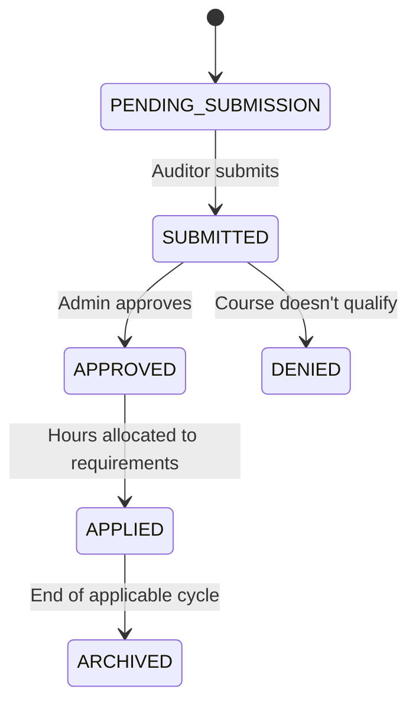

# CPE (Continuing Professional Education) Rules

> Per-pack continuing professional education requirements for auditors. Different certifications require different hours, cycle durations, subject categories, and documentation standards. When multiple packs are attached to an engagement, the auditor must satisfy every applicable CPE requirement independently — this is a union dimension in the strictness resolver, not a max. This document catalogues the pack-specific requirements, the union semantics, and the AIMS CPE tracking workflow. Pairs with [`strictness-resolver-rules.md §3.4`](strictness-resolver-rules.md).

---

## 1. Why CPE is a union dimension

Unlike retention (where the longest retention wins) or cooling-off (where the longest wins), CPE requirements *combine*. A CIA-certified auditor working on a GAGAS engagement must simultaneously:
- Meet IIA CIA requirements (40 hours/year)
- Meet GAGAS requirements (80 hours/2 years with 24 governmental)

Both sets of requirements apply independently; a single course often satisfies both (a class on governmental audit procedures counts toward both GAGAS governmental hours and IIA general CPE), but the auditor must document compliance with each requirement separately.

This is the `union` strictness direction per [`strictness-resolver-rules.md §2.2`](strictness-resolver-rules.md).

### 1.1 Implications for tracking

The auditor's CPE record must be detailed enough to:
- Allocate each course to each applicable certification/requirement
- Track category allocations per requirement (e.g., ethics, governmental, industry-specific)
- Show compliance per requirement independently
- Export evidence for each certification's external review

### 1.2 Implications for engagement assignment

Before an auditor is assigned to an engagement, AIMS checks:
- Is auditor's current CPE compliance status "green" for every pack attached to the engagement?
- If any is "yellow" or "red," can the auditor complete missing CPE before engagement starts?

Non-compliant auditors cannot be assigned unless CAE explicitly overrides with documented reason.

---

## 2. Per-pack CPE requirements

### 2.1 GAGAS CPE requirements

**Source**: GAGAS 2024 §4.26–4.34

**Requirements**:
- **80 hours per 2-year cycle** for all auditors performing GAGAS work
- **24 of those hours must be governmental audit specific** (auditing government entities, GAGAS, government standards, public-sector accounting)
- **24 of those hours must be on topics directly related to government audit** (includes governmental topics above but also includes general auditing, ethics, data analysis techniques applicable to government)
- **No more than 24 hours in any single category** (prevents over-concentration in one area)
- **Minimum hours per year** — typically 20 hours per year (though 80 hours/2 years is the primary metric)
- **Ethics CPE** — required; typically 2-4 hours per 2-year cycle

**Cycle start**: The 2-year cycle can start on any date; once started, it's fixed. Most organisations start cycles aligned to calendar or fiscal years.

**Category tracking (GAGAS-specific categories)**:
1. Government auditing (GAGAS-specific topics)
2. Government accounting
3. General auditing (GAAS, PCAOB, AICPA topics)
4. Government law and regulations (procurement, grants management, etc.)
5. Ethics and professional conduct
6. Data analysis and audit technology
7. Risk assessment and internal controls
8. Report writing and communication
9. Industry-specific (healthcare, education, etc.)
10. Other

**New employee requirements**: auditors hired during a cycle have prorated requirements based on months remaining in the cycle.

**Supervisory review of CPE**: the AIC or engagement partner reviews team members' CPE compliance before engagement assignments. The CAE reviews CPE compliance at the annual level.

### 2.2 IIA CIA (Certified Internal Auditor) CPE requirements

**Source**: IIA Professional Responsibilities Handbook, IIA Code of Ethics

**Requirements**:
- **40 hours per year** (calendar year, Jan 1 - Dec 31)
- **No minimum category allocation** (unlike GAGAS) — flexibility in topic selection
- **At least 2 hours of ethics every 2 years**
- **Organisational affiliation** — hours must be earned from recognized providers or qualify under IIA's CPE acceptable categories
- **Rolling 3-year average** — IIA applies some flexibility; if an auditor falls short in one year, the next year's excess can make up

**Certificate maintenance**: the CIA certificate is maintained via CPE compliance; lapses can result in certificate suspension.

### 2.3 PCAOB CPE requirements

**Source**: PCAOB Rule 3500T (Continuing Professional Education)

**Requirements** for audit personnel working on PCAOB-regulated engagements:
- **20 hours per year**
- **40 hours per 2-year cycle** (total)
- **Minimum 2 hours per year in auditing or accounting topics**
- **Specific topic requirements**:
  - Specific PCAOB standards and PCAOB practice
  - Ethics
  - Quality control
  - Independence and related matters
- **Must include PCAOB-specific CPE** — at least 8 hours per 2-year cycle specifically on PCAOB standards, rules, and related topics

**Firm-level requirements**: the audit firm must ensure all personnel meet these requirements; non-compliance is a firm-level issue with PCAOB registration implications.

### 2.4 AICPA CPE requirements

**Source**: AICPA Professional Standards; State Board-specific requirements

**Requirements vary by state, but typical**:
- **40 hours per year** (or 80 per 2 years in some states)
- **Ethics course required** — typically 4 hours annually
- **Accounting and auditing topics** — specific minimums per state
- **Government auditing** — some states require additional governmental CPE
- **CPA certificate renewal** depends on state board requirements

**Cross-compliance**: AICPA members performing GAGAS work generally meet both GAGAS and AICPA requirements through the same courses, but must document compliance separately.

### 2.5 ISO 19011 CPE/Competency requirements

**Source**: ISO 19011:2018 §7.3 (Competence Requirements)

Less prescriptive than other packs:
- **Ongoing professional development** is required; specific hours not prescribed
- **Evaluation of competence** per engagement — auditor must demonstrate relevant competence for the audit subject
- **Organisation-defined competency framework** — tenant defines its own competency maintenance standards

AIMS supports this with a flexible competency tracking model that tenants can customise.

### 2.6 ISSAI CPE requirements (post-MVP)

Reserved for future. ISSAI defers to INTOSAI guidance and member SAI requirements. Reserved in packs system.

### 2.7 State Board / Jurisdictional CPE requirements

For AICPA-adjacent work, state boards impose jurisdiction-specific requirements. AIMS supports per-jurisdiction requirements as overlay packs (e.g., `AICPA_STATE_TX:2024` with Texas-specific additions).

---

## 3. Union resolution in practice

### 3.1 Oakfield FY27 auditor — Priya (CIA-certified, CPA-certified)

Priya holds:
- CIA certification (IIA)
- CPA certification (AICPA, New York State)
- Is performing a GAGAS engagement
- Is on the Oakfield FY27 Single Audit

Her CPE requirements union:

**GAGAS requirements (2-year cycle)**:
- 80 total hours
- 24 governmental
- 24 related-to-government topics
- 2 ethics
- Max 24 in any category

**IIA CIA requirements (annual)**:
- 40 hours per year
- 2 hours ethics every 2 years
- Any topic qualifying under IIA categories

**AICPA / NY CPA requirements (annual — let's assume NY CPA):**
- 40 hours per year
- 4 hours ethics
- Specific governmental topics if working on GAGAS

**Union requirement**: Priya must meet ALL of the above independently. Aggregate yearly requirement is ~40-80 hours depending on cycle math; ethics must total 4+ per 2-year cycle; governmental topics must total 24+ per 2-year cycle.

AIMS presents this to Priya as a dashboard with per-requirement progress:
```
Priya's CPE Compliance — Year 1 of 2027-2028 cycle

  GAGAS cycle 2027-2028           ████████░░ 42/80 hours
    Governmental topics                      ██░░░ 12/24
    Ethics                                   █░░░░ 2/2 ✓
    Related-to-government                    ██░░░ 14/24
    
  IIA CIA 2027                    ███░░░░░░░ 28/40 hours
    Ethics                                   █░░░░ 2/2 ✓
    
  NY CPA 2027                     ██░░░░░░░░ 18/40 hours
    Ethics                                   █░░░░ 2/4 🔶 Need 2 more
    Governmental                             █░░░░ 12/24 🔶 Need 12 more
```

Visual green/yellow/red indicators per requirement.

### 3.2 Course allocation

When Priya attends a course, she (or the training provider) submits course metadata. AIMS evaluates:
- Which pack requirements can this course count toward?
- Does it qualify under each pack's category rules?
- How much credit is allocated per pack?

A single course often counts toward multiple requirements. E.g., a course on "Grants Management Audit Procedures" (5 hours) counts as:
- GAGAS: 5 hours governmental + 5 hours related-to-government (but capped at 5 hours total counted; specific allocation is handled by category tracking)
- IIA CIA: 5 hours general (no category constraint)
- AICPA: 5 hours governmental (if jurisdiction recognises)

### 3.3 Topic-specific requirements

Some courses satisfy specific topic requirements that are otherwise constraining:
- **Ethics courses** — most are short (2-4 hours) but count toward all ethics requirements
- **PCAOB-specific courses** — only PCAOB-accredited courses count toward the PCAOB 8 hours/cycle requirement
- **State-specific courses** — state-board-approved courses fill state requirements

AIMS flags each course with applicable topic tags; requirement tracking knows which courses apply.

---

## 4. CPE tracking workflow

### 4.1 Course submission



Auditor workflow:
1. Auditor attends a course
2. Uploads certificate of completion
3. Enters course metadata (title, provider, date, hours, topic categories)
4. Submits to AIMS
5. AIMS validates (course date within active cycle; hours reasonable for course duration; provider recognised)
6. Optional admin review (for unusual claims)
7. Approved courses count toward applicable requirements
8. Dashboard updates

### 4.2 Pre-engagement compliance check — graduated, not binary

A naïve hard-block on CPE non-compliance at assignment time is operationally broken. Reality: auditors are *always* behind on CPE until December of their cycle year — that's when year-end training happens, that's when conferences happen, that's when CPE sprinting occurs. If AIMS hard-blocks assignments every time a projection shows shortfall, CAEs will spend 15%+ of their week clicking "Override" just to staff their audits, and the override click becomes meaningless noise.

The realistic design is a **graduated compliance check** with three levels — GREEN, YELLOW, RED — each with distinct behaviour:

| Level | Definition | Assignment behaviour |
|---|---|---|
| 🟢 **GREEN** | Auditor on-track per projection (current trajectory hits all requirements before cycle end) | Assignment proceeds unblocked |
| 🟡 **YELLOW** | Auditor behind on projection but can catch up with realistic effort (e.g., 2 conferences + 3 webinars over remaining 4 months) | **Conditional assignment** — AIC/CAE approves with a specific condition; condition auto-tracked |
| 🔴 **RED** | Auditor materially behind and cannot realistically catch up before fieldwork begins | **Hard block with CAE override** — override requires documented rationale minimum 100 characters |

#### 4.2.1 The YELLOW path — conditional assignment

When an auditor is YELLOW, assignment does not hard-block. Instead, the assignment completes with a specific documented condition attached. Common conditions:

- "Assigned on condition that 8 hours of Governmental CPE are completed before Fieldwork phase begins"
- "Assigned on condition that 2 hours of Ethics CPE are completed within 30 days"
- "Assigned on condition that PCAOB-specific CPE deficit of 4 hours is closed before SOC 2 attestation work commences"

The condition is:
- Captured as structured data (not free-text)
- Visible to AIC, CAE, and the auditor on the engagement dashboard
- Tracked automatically — when the CPE entry is logged, the system reconciles against the condition
- Emails the auditor if they fail to progress; escalates to CAE if fieldwork start approaches without condition met
- Logged in the engagement audit trail for peer review

If the condition is not met by its deadline (typically fieldwork start), the engagement assignment escalates to CAE for real decision — at that point hard-block may be appropriate because fieldwork imminence makes catch-up infeasible.

#### 4.2.2 The RED path — meaningful blocker

RED state is genuinely rare (maybe 5-10% of YELLOWs escalate to RED; plus a few where the auditor is joining an engagement mid-year with severe pre-existing shortfall). At RED:

- Assignment hard-blocks; auditor cannot be added to the team by the default UI path
- CAE override exists but requires documented rationale
- Rationale examples that typically qualify:
  - "Auditor is a domain expert (only person in the firm certified in X) and engagement requires X; auditor is attending 16-hour catch-up training in the first two weeks"
  - "Auditor reassignment at this stage would cause the engagement to miss the Single Audit filing deadline; CAE is extending the auditor's CPE completion deadline to match engagement close, with formal documentation"
- Rationale examples that would not typically qualify:
  - "Auditor is convenient to assign" (no — use a compliant alternative)
  - "Client requested this auditor specifically" (insufficient; client preferences don't justify compliance deviation)

#### 4.2.3 Graduated compliance in the staffing UI

When the engagement-manager (typically CAE or Senior Manager) is staffing an engagement, each potential team member's CPE status appears as a traffic-light badge:

```
  Priya Sharma (AIC)                    🟢 GREEN — on track
  Anjali Das (Staff)                    🟡 YELLOW — 6 gov hours short, catchable
  Jin Kim (Senior)                      🟡 YELLOW — 4 ethics hours short
  Marcus Chen (CAE)                     🟢 GREEN
  David Park (Staff)                    🔴 RED — 18 hours behind, infeasible before fieldwork
```

CAE clicks "Assign with condition" for YELLOWs; clicks "Override" for REDs (with rationale).

This graduated approach keeps the compliance discipline intact (compliance status is visible, tracked, escalated) while not blocking normal operations (most assignments proceed without CAE override even when auditors aren't yet 100% on CPE). This is the operational balance that Gemini's Phase 3 review correctly pointed out was missing from the binary hard-block model.

### 4.2.4 Condition tracking as a first-class concept

Conditional assignments produce a first-class `EngagementAssignmentCondition` entity:

```ts
interface EngagementAssignmentCondition {
  assignmentId: string;
  auditorId: string;
  engagementId: string;
  conditionType: 'CPE_HOURS_DEFICIT' | 'INDEPENDENCE_REVIEW_PENDING' | 'TRAINING_COMPLETION_REQUIRED' | 'OTHER';
  deficit: { hours: number; category: string; packRequirement: string };
  deadline: Date; // Typically fieldwork start, configurable
  status: 'OPEN' | 'MET' | 'FAILED' | 'WAIVED';
  createdAt: Date;
  createdBy: string; // AIC or CAE who imposed the condition
  resolvedAt?: Date;
  resolutionEvidence?: string;
}
```

The condition is monitored automatically; resolution evidence (completed CPE, passed training) is required before the condition is marked MET. If the deadline passes without MET status, the condition transitions to FAILED and escalates.

This is distinct from other condition types AIMS might track (independence review pending, specific training required), but all follow the same pattern: structured condition with deadline, tracked automatically, escalated if unresolved.

### 4.3 Annual compliance reporting

At the end of each cycle:
- AIMS generates CPE compliance reports per auditor
- AIC + CAE review
- Audit Committee-level summary (if organisation requires)
- Evidence package for external review (peer review evidence bundle per [`../03-feature-inventory.md`](../03-feature-inventory.md) Module 11)

### 4.4 Documentation requirements

Per GAGAS §4.35 and IIA: AIMS maintains:
- Course certificate (PDF or image attachment)
- Course metadata (title, provider, date, hours, description)
- Allocation per requirement
- Approval history
- Cycle applicability

Retention: per the engagement's `DOCUMENTATION_RETENTION_YEARS` dimension (typically 5-7 years).

---

## 5. Organisation-wide CPE tracking

### 5.1 CAE dashboard

Marcus (CAE per [`../02-personas.md`](../02-personas.md)) views:
- Organisation-wide CPE compliance per requirement
- Auditors at risk of non-compliance (trending yellow or red)
- Course completion rate compared to typical curves
- Expected shortfalls by requirement

### 5.2 Audit Function Director dashboard

Kalpana (Audit Function Director, for multi-function organisations) views:
- Aggregate across CAEs/functions
- Benchmark against prior years
- Resource planning for CPE investment (budget for training, conference attendance, etc.)

### 5.3 Individual auditor dashboard

Each auditor sees their own status:
- All applicable requirements (GAGAS, IIA, AICPA, others)
- Current compliance per requirement
- Suggested courses to address gaps
- Cycle countdown ("X days until cycle end")

### 5.4 Compliance alerting

- 30 days before cycle end: reminder to auditors not yet at 80% compliance
- 14 days: warning
- 7 days: urgent
- Day after cycle end: non-compliance alert to CAE; engagement assignment blocks

---

## 6. Non-compliance handling

### 6.1 Grace periods

Some packs have grace periods for CPE completion:
- GAGAS: strict; must meet by cycle end
- IIA: flexible with rolling 3-year average; can make up in subsequent year
- AICPA: varies by state; typically 6-month grace with late fees
- PCAOB: strict; firm-level compliance issue if violation

### 6.2 Non-compliant auditor handling

If auditor fails to meet CPE:

1. Immediate: new engagement assignments blocked
2. Next-quarter: existing engagement participation may continue but auditor cannot be AIC or take new responsibilities
3. Documentation: CAE documents the shortfall; mitigation plan (accelerated CPE, temporarily redirect to non-audit work)
4. Repeated non-compliance: performance review implication; possible certification consequences

### 6.3 Engagement-level impact

If a GAGAS engagement has non-compliant team member at start:
- Team composition reviewed
- Either: swap non-compliant member for compliant replacement; OR: CAE documents exception with specific mitigation (must be rare and well-justified)

### 6.4 CAE oversight

CAE is accountable for team CPE compliance. Failures reflect on CAE performance and potentially the audit function's overall compliance. This is documented in the peer review evidence bundle.

---

## 7. CPE evidence for peer review

External peer reviews (per IIA GIAS Domain 4; GAGAS §5.60) require evidence that the audit function maintains CPE compliance.

### 7.1 Evidence bundle contents

Per auditor (per sample of engagements):
- Complete CPE history for the review period (typically 3 years for GAGAS triennial)
- All certificates of completion
- Course metadata for each
- Aggregate compliance per requirement per cycle
- Evidence of CAE review / supervisor oversight

### 7.2 AIMS evidence export

For a given review period and sample of engagements:
1. Generate per-auditor CPE summary
2. Collate certificates for courses within the review period
3. Produce aggregate compliance summary per requirement
4. Export as a PDF bundle + CSV manifest

This export is one-click from the peer review evidence bundle generator (per [`../03-feature-inventory.md`](../03-feature-inventory.md) Module 11).

---

## 8. Edge cases

### 8.1 Staff auditor without certification

Staff auditors (Anjali per [`../02-personas.md`](../02-personas.md)) may not yet hold CIA or CPA. Their CPE applicability:
- GAGAS: applies to all auditors performing GAGAS work, certified or not
- IIA: general professional development encouraged but no mandatory hours
- AICPA: no requirement for non-CPA
- State Board: no requirement for non-CPA

Anjali's dashboard shows only GAGAS compliance; IIA/AICPA are not tracked for her until she certifies.

### 8.2 Auditor with multiple certifications

An auditor holding CIA, CPA, and CISA (all three) has three sets of CPE requirements:
- IIA CIA: 40/yr
- AICPA CPA: 40/yr (jurisdiction-specific)
- ISACA CISA: 40/yr (3-year cycle)

Plus GAGAS if working GAGAS engagements.

AIMS supports arbitrary combinations. The dashboard shows all applicable requirements; the union is naturally the sum with category constraints per requirement.

### 8.3 International certifications

For international auditors (ICAEW in UK, CA in Australia, etc.), AIMS supports pack-authored certification profiles with jurisdiction-specific CPE rules.

### 8.4 Part-time auditor

Auditor who's only part-time: GAGAS allows prorated CPE in some circumstances but requires documentation. AIMS supports prorated tracking with CAE approval of the proration rationale.

### 8.5 New hire mid-cycle

An auditor hired mid-cycle:
- GAGAS: proration allowed based on months remaining
- IIA: first-year requirement based on months since certification (if fewer than 12)
- AICPA: per state rules
- PCAOB: full year required (registration dependent)

AIMS handles new hire onboarding with proration and special flags for first-cycle compliance calculations.

### 8.6 Mid-cycle certification change

Auditor earns CIA mid-cycle:
- New certification's CPE tracking starts from the certification date
- Existing GAGAS/CPA requirements unchanged
- Audit Committee notified of new certification (formal notification — Sofia-level operational item)

---

## 9. CPE curriculum guidance

Not enforced by AIMS but useful for auditors planning:

### 9.1 Recommended governmental topics (for GAGAS compliance)

- Government accounting standards (GASB)
- Government auditing standards (GAGAS)
- Federal grants management (Single Audit topics)
- Government ethics (includes Hatch Act, public records, etc.)
- Public-sector fraud detection
- Audit analytics for government data

### 9.2 Recommended IT topics (cross-applicable)

- Cybersecurity (relevant for ISO 27001, SOC 2, HIPAA engagements)
- Data analytics and audit analytics
- Privacy and data protection (GDPR, CCPA)
- IT audit procedures
- Cloud audit considerations

### 9.3 Recommended soft skills (cross-applicable)

- Professional ethics
- Communication and report writing
- Data visualisation
- Interviewing techniques

AIMS includes a recommended-courses surface that suggests courses to address gaps based on each auditor's upcoming engagement assignments.

---

## 10. Training provider integration

### 10.1 Recognised providers

AIMS maintains a list of recognised CPE providers (IIA, AICPA, PCAOB-approved, state boards, universities). Courses from recognised providers pre-populate with validated topic tags.

### 10.2 Unrecognised providers

Courses from unrecognised providers can still be submitted but go through admin review:
- Admin evaluates course content and applicability
- Approves with specific topic allocation (may be less favourable than auditor initially claimed)
- Documents reasoning

### 10.3 Internal training

Organisations conducting internal training:
- Training programs are set up in AIMS with topic tags
- Attendance automatically tracked
- Hours automatically allocated to attendees' CPE
- Evidence bundle includes internal training records

---

## 11. CPE automation and import

### 11.1 Certificate auto-extraction

For PDF certificates from recognised providers, AIMS can OCR and auto-populate course metadata. Manual verification still required; auto-fill reduces entry friction.

### 11.2 LMS integration

For organisations with internal Learning Management Systems, AIMS can integrate:
- Automated sync of completed courses
- API integration to pull attendance data
- Evidence automatically linked

### 11.3 External CPE platform integration

For providers that offer digital completion records (IIA's Learning, AICPA's CPE Direct, etc.), direct API integration possible post-MVP.

---

## 12. CPE analytics

### 12.1 Cross-organisation analytics

- Average hours per auditor
- Category distribution (where is training concentrated?)
- Provider distribution (which providers are most used?)
- Cost per hour (when cost is tracked)

### 12.2 Per-requirement analytics

- % of auditors meeting each requirement
- Trending — is compliance improving or declining?
- Comparative — how does organisation compare to industry benchmarks?

### 12.3 Forecasting

- Projected compliance at end of cycle based on current trajectory
- Hours needed organisation-wide to achieve target compliance
- Budget forecasting for training investment

---

## 13. References

- [`rules/strictness-resolver-rules.md §3.4`](strictness-resolver-rules.md) — CPE as union dimension
- [`rules/independence-rules.md §4.4`](independence-rules.md) — independence declarations (related auditor qualification)
- [`data-model/standard-pack-schema.ts`](../../data-model/standard-pack-schema.ts) — `cpeRules` per pack
- [`data-model/tenant-data-model.ts`](../../data-model/tenant-data-model.ts) — CPE tracking entities
- [`../02-personas.md`](../02-personas.md) — Priya, Marcus, Anjali, Kalpana
- [`../03-feature-inventory.md`](../03-feature-inventory.md) — Module 12 (Staff, Time, CPE)
- [`../04-mvp-scope.md`](../04-mvp-scope.md) — MVP 1.0 vs. 1.5 CPE features
- GAGAS 2024 §4.26–4.35 — full GAGAS CPE framework
- IIA Professional Responsibilities Handbook — IIA CIA CPE
- PCAOB Rule 3500T — PCAOB CPE
- AICPA Code of Professional Conduct — AICPA CPE (state-board-specific)
- ISO 19011:2018 §7.3 — ISO competency

---

## 14. Domain review notes — Round 1 (April 2026)

This document went through external domain-expert review as part of the Phase 3 rule-files review cycle. **Verdict: Approved with one specific refinement** (graduated compliance replacing binary hard-block).

### Round 1 — the CPE assignment blocker

Reviewer correctly flagged that a binary hard-block on CPE non-compliance at engagement assignment is operationally broken. Auditors are always behind on CPE until December of their cycle year — that's when year-end training happens, that's when conferences are scheduled, that's when catch-up sprinting occurs. If AIMS hard-blocks every time a projection shows shortfall, CAEs spend 15%+ of their week clicking "Override" just to staff their audits, and the override click becomes meaningless noise.

Fix applied to §4.2: replaced binary block-or-override with **graduated GREEN/YELLOW/RED compliance check**:

- **GREEN** (on-track per projection): assignment proceeds unblocked
- **YELLOW** (behind but catchable with realistic effort): **conditional assignment** with specific documented condition ("Assigned on condition that 8 hours of Governmental CPE are completed before Fieldwork phase begins"). Condition auto-tracked; resolution required before deadline
- **RED** (materially behind; cannot realistically catch up): hard block with CAE override requiring documented rationale (100-char minimum)

Added §4.2.1 (the YELLOW conditional-assignment mechanics), §4.2.2 (RED threshold and override criteria), §4.2.3 (graduated-compliance UI in the staffing view with traffic-light badges), and §4.2.4 (the `EngagementAssignmentCondition` first-class entity for condition tracking).

This preserves the compliance discipline (status visible, tracked, escalated) while not blocking normal operations — most assignments proceed without hard-block intervention even when auditors aren't yet 100% on CPE. This is the operational balance that the reviewer correctly pointed out was missing.

See strictness-resolver-rules.md §9 for the overall Phase 3 review verdict.

---

*Last reviewed: 2026-04-21. Phase 3 deliverable; R1 review closed.*
