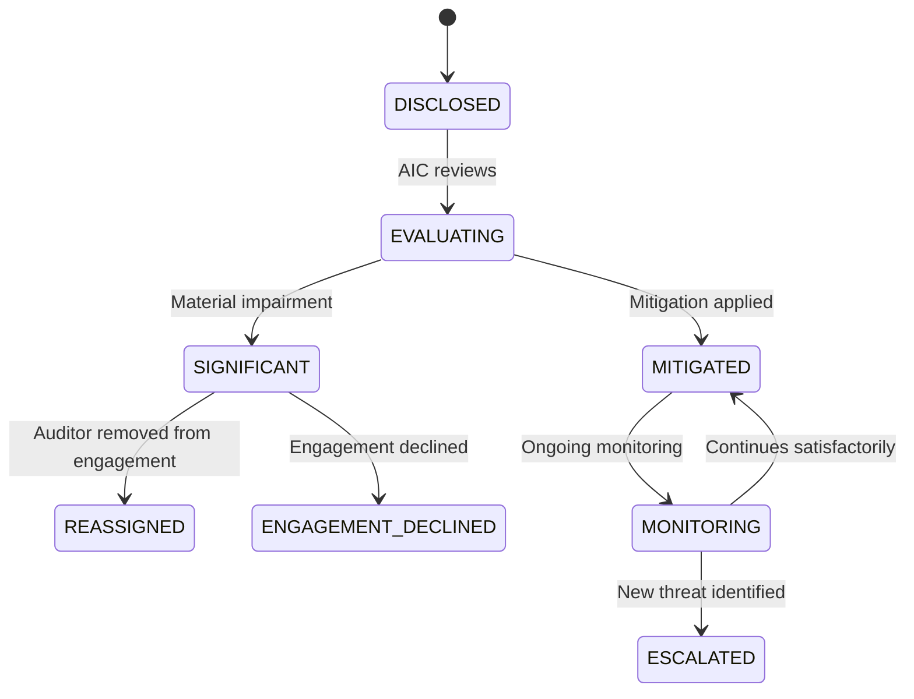

# Independence Rules

> Per-pack independence requirements — who must be independent of what, for how long, with what documentation. When multiple packs are attached, the strictness resolver picks the strictest rule per dimension. This document catalogues the pack-specific independence frameworks, the dimensions the resolver evaluates, and the workflow AIMS provides for declaring, tracking, and resolving independence. Pairs with [`strictness-resolver-rules.md §3.2, §3.10, §3.11, §3.23`](strictness-resolver-rules.md) for the individual dimensions.

---

## 1. Independence — the foundation of audit

Every audit standard has an independence requirement. The auditor must be independent of the auditee — in fact and in appearance — so the audit opinion can be trusted as unbiased. Different standards frame this differently:

- **GAGAS** separates independence "in mind" and "in appearance" (§3.25) and requires documented evaluation of threats and safeguards
- **IIA GIAS** requires organisational and individual independence; organisational structure + annual affirmation + per-engagement threat assessment
- **PCAOB** enumerates specific prohibited services + cooling-off periods for key partners
- **AICPA** uses a conceptual framework with identified threats and safeguards
- **ISO 19011** requires conflict-of-interest declarations and management system independence

When multiple packs are attached to an engagement, the auditor must satisfy all applicable requirements — often via a layered independence framework where each pack's specific tests apply.

### 1.1 Independence in mind vs. in appearance

Packs generally distinguish:

- **Independence in mind** — the auditor's actual state of mind, unbiased and free from influence
- **Independence in appearance** — whether a reasonable informed observer would consider the auditor independent

Both are required. An auditor may be subjectively independent but have relationships (family, prior employment, financial interests) that create appearance problems. These require mitigation or disclosure.

### 1.2 The threat and safeguard framework

GAGAS §3.36 and AICPA Code of Professional Conduct use a threat-and-safeguard framework:

1. **Identify threats** — self-interest, self-review, bias, familiarity, undue influence, management participation
2. **Evaluate significance** — is the threat at an unacceptable level?
3. **Apply safeguards** — controls to eliminate or reduce the threat
4. **Document** — evidence of the evaluation and safeguards

AIMS captures this framework per engagement per auditor. The engagement's independence declaration surfaces identified threats and safeguards applied.

---

## 2. Per-pack independence rules

### 2.1 GAGAS 2024 independence rules

**Source**: GAGAS §3.25–3.100

**Key requirements**:
- Independence **in mind** and **in appearance** (§3.25)
- Documented evaluation of threats at engagement planning (§3.36) and continuously during fieldwork (§3.38)
- **24-month cooling-off period** for key auditors transitioning to auditee employment (§3.95)
- **Prohibition on management functions** during and for 1 year preceding the audit (§3.87)
- **Disclosure of any identified impairment** — not just material (§3.98)
- **Per-engagement independence declaration** before fieldwork begins (§3.26)

**Threat categories GAGAS recognises** (§3.37):
- Self-interest threat
- Self-review threat
- Bias threat
- Familiarity threat
- Undue influence threat
- Management participation threat
- Structural threat (for government audit organisations)

**Documentation requirement**: independence evaluation for every engagement, maintained with work papers per §3.26. Pre-fieldwork evidence required.

### 2.2 IIA GIAS 2024 independence rules

**Source**: IIA GIAS 2024 Domain 2 (Independence and Objectivity), especially Principles 5, 6, 11

**Key requirements**:
- **Organisational independence** — internal audit function reports to Audit Committee (not to management being audited)
- **Individual objectivity** — auditors are impartial, unbiased, avoid conflicts of interest
- **Annual independence declaration** for each auditor (Principle 11.2)
- **Per-engagement declaration** for threats identified during engagement planning (Principle 11.2)
- **12-month cooling-off** for auditors who previously had responsibility for audited area (less strict than GAGAS)
- **Significant impairment threshold** — only significant impairments require disclosure (less stringent than GAGAS)

**Annual affirmation** — each auditor signs at least once per year that they are independent of the organisation and free from conflicts. Combined with per-engagement declarations.

### 2.3 PCAOB independence rules

**Source**: PCAOB AS 1005 (Responsibilities Regarding Independence), AS 3526 (Communication with Audit Committees Concerning Independence), PCAOB Rule 3520 (Independence), SEC Regulation S-X

**Key requirements**:
- **Engagement-specific independence** — evaluated and reaffirmed at each engagement (AS 1005)
- **12-month cooling-off** for partners in key roles (with 24-month for specific roles like lead audit partner per Section 203 of SOX)
- **Prohibited services list** — specific non-audit services that cannot be provided to audit clients (tax advocacy, legal services, etc. per Sarbanes-Oxley)
- **Financial interest restrictions** — audit firm and partners cannot have material financial interest in auditee
- **Employment relationship restrictions** — 12-month cooling-off before former auditor can take management role at audit client
- **Formal communication with audit committee** about independence per AS 3526

**Materiality of financial interest**: PCAOB is strict; even small direct financial interests disqualify. Indirect interests (e.g., mutual fund ownership) are permitted with limits.

### 2.4 AICPA independence rules

**Source**: AICPA Code of Professional Conduct ET 1.200 (Independence), 1.220 (Specific Independence Requirements for Attest Engagements)

**Key requirements**:
- Conceptual framework for evaluating threats and safeguards (ET 1.210)
- **Annual independence confirmation** — each professional staff completes annually
- **Engagement-specific evaluation** — for each attestation engagement, reconfirm independence
- **12-month cooling-off** standard; longer for specific relationships
- **Family and personal relationship restrictions** — close family relationships with auditee personnel create threats

### 2.5 ISO 19011:2018 conflict of interest rules

**Source**: ISO 19011:2018 §5.4 (Conflicts of Interest), §7.2 (Competence of Auditors)

**Key requirements**:
- **Conflict of interest declaration** before each engagement
- Less prescriptive than other packs — focuses on "reasonable and fair" audit execution
- **No specific cooling-off period** — but identified conflicts must be disclosed and mitigated
- **Team composition requirements** — audit team must have independence from the management system being audited

### 2.6 SINGLE_AUDIT:2024 independence rules

**Source**: 2 CFR 200.514–200.519

Single Audit largely defers to GAGAS for independence requirements. Additional specifics:

- Auditor must be independent under both GAGAS and AICPA rules
- **Cooling-off for former Federal employees** — 1-year restriction on auditing Federal programs where the auditor was formerly employed
- Disclosure of Federal employment history in independence declarations

---

## 3. Strictness resolver application

The resolver applies per [`strictness-resolver-rules.md §3`](strictness-resolver-rules.md) across the following independence-related dimensions:

### 3.1 Cooling-off period (`INDEPENDENCE_COOLING_OFF_MONTHS`)

**Strictness direction**: `max`

| Pack | Months |
|---|---|
| GAGAS | 24 |
| IIA GIAS | 12 |
| PCAOB | 12 (24 for lead audit partner rotation on large accelerated filers) |
| AICPA | 12 |
| ISO | N/A (case-by-case) |

**Resolved for Oakfield FY27 (GAGAS + IIA)**: `max(24, 12) = 24 months`. Driven by GAGAS §3.95.

### 3.2 Declaration frequency (`INDEPENDENCE_DECLARATION_FREQUENCY`)

**Strictness direction**: `min` (more frequent = stricter)

| Pack | Frequency |
|---|---|
| GAGAS | Per engagement |
| IIA GIAS | Annual + per engagement when threats identified |
| PCAOB | Per engagement |
| AICPA | Annual + per engagement when threats identified |
| ISO | Per engagement |

**Resolved**: `PER_ENGAGEMENT` (any pack requiring per-engagement supersedes annual-only).

### 3.3 Impairment reporting threshold (`IMPAIRMENT_REPORTING_THRESHOLD`)

**Strictness direction**: `min` (lower threshold = stricter)

| Pack | Threshold |
|---|---|
| GAGAS | Any identified (broadest) |
| IIA GIAS | Significant |
| PCAOB | Any identified (broader list of recognised impairments) |
| AICPA | Significant |
| ISO | Reasonable judgement |

**Resolved**: `ANY_IDENTIFIED` (driven by GAGAS or PCAOB if either attached).

### 3.4 Non-audit services restriction period (`NON_AUDIT_SERVICES_RESTRICTION_DAYS`)

**Strictness direction**: `max`

| Pack | Restriction |
|---|---|
| GAGAS | 1 year for management-functional services |
| PCAOB | 1 year for specified prohibited services (broader prohibited list) |
| IIA | N/A specific period; conflict-of-interest case-by-case |
| AICPA | Generally 1 year |
| ISO | Case-by-case |

**Resolved**: 1 year (365 days) for multi-pack engagements with GAGAS or PCAOB.

### 3.5 Threat framework (qualitative)

All major packs use the threat-and-safeguard framework. The union of recognised threats:

- Self-interest
- Self-review
- Bias
- Familiarity
- Undue influence
- Management participation
- Structural (GAGAS for government orgs)
- Advocacy (AICPA/PCAOB specifically for attestation)
- Intimidation

AIMS captures all of these in the engagement's independence evaluation regardless of which pack drives the declaration format.

---

## 4. Declaration workflow

### 4.1 Annual independence declaration

Each auditor completes annually (required by IIA GIAS 2024 Principle 11.2 and AICPA). Workflow:

1. Auditor opens personal profile → Independence tab
2. System presents form with sections:
   - Personal financial interests (current & recent)
   - Family relationships with any auditee personnel (in previous 2 years)
   - Prior employment relationships (within previous 2 years)
   - Non-audit services provided to current or recent audit clients
   - Outside business interests that could create threats
3. Auditor declares each item; indicates if it's ongoing or resolved
4. System identifies any potential threats based on declarations
5. Audit Function Director (Kalpana) or delegate reviews declarations
6. Approved declarations flow to auditor's profile and attach to all current/future engagements
7. Audit Committee-level summary for organisations with public governance

### 4.2 Per-engagement independence declaration

Before engagement fieldwork begins, every auditor on the team completes:

1. Auditor opens engagement → Independence tab
2. System pre-populates auditor's profile information (annual declarations)
3. Auditor reviews the engagement context:
   - Auditee organisation
   - Auditee personnel (from engagement team attribution)
   - Scope (Single Audit + federal programs; scope-specific threats)
4. Auditor declares any specific threats or impairments identified
5. If impairments: documented mitigation plan
6. Submit for AIC review

### 4.3 Threat identification during fieldwork

GAGAS requires continuous evaluation (§3.38). During fieldwork:

- If a threat emerges (new information about auditee relationship, management pressure identified, etc.), auditor must immediately disclose
- AIC + CAE reconsider; may require mitigation (additional review, reassignment, etc.)
- Mid-engagement impairment disclosure initiates a formal review workflow

### 4.4 Impairment workflow

If an auditor discloses an impairment:

States:

| State | Description |
|---|---|
| `DISCLOSED` | Auditor has disclosed a potential impairment |
| `EVALUATING` | AIC + CAE + Independence Officer evaluating significance and mitigation |
| `MITIGATED` | Mitigation applied (reassignment, additional review, disclosure, etc.); auditor remains on engagement |
| `SIGNIFICANT` | Cannot mitigate; auditor must be reassigned or engagement declined |
| `REASSIGNED` | Auditor removed from engagement; new auditor onboarded |
| `ENGAGEMENT_DECLINED` | Entire engagement is declined (if organisation-level impairment) |
| `MONITORING` | Ongoing monitoring required throughout engagement |
| `ESCALATED` | Escalated back to evaluation due to new development |

**Approval chain**: per [`approval-chain-rules.md §8`](approval-chain-rules.md). Impairment evaluation requires CAE + Independence Officer review.

---

## 5. Organisational independence (IIA-driven)

IIA GIAS requires organisational independence — the internal audit function must report to the Audit Committee or governing body, not to management being audited.

### 5.1 AIMS supports

- Organisational hierarchy documentation in tenant settings (who does the internal audit function report to?)
- Annual organisational independence review (captures and documents the reporting structure)
- Audit Committee approval of the internal audit plan
- Direct Audit Committee access — CAE can communicate directly with Audit Committee without going through management (AIMS provides the communication channel per [`approval-chain-rules.md §11`](approval-chain-rules.md))

### 5.2 Impairment of organisational independence

If organisational structure creates impairment (e.g., CAE is pressured by management, Audit Committee is not sufficiently active, reporting lines compromised):

- Documented in organisational independence review
- Audit Committee notified
- If material, may require external review or governance intervention

---

## 6. Structural threat (for government audit organisations — GAGAS-specific)

GAGAS §3.57 recognises structural threats for government audit organisations:

- External auditor independence from the reviewed entity (both organisational levels)
- Internal auditor independence from management
- Ability to audit without interference from the audited entity's leadership

For government audit shops, AIMS captures:
- The auditing organisation's governance structure
- The relationship to the audited entity (same vs. different level of government)
- Any threats created by organisational structure
- Safeguards applied (e.g., legislative backing, independent funding)

---

## 7. Non-audit services tracking — where the data actually lives

For engagements where the audit firm has provided non-audit services to the auditee, these must be disclosed and evaluated against independence rules. **AIMS is not the system of record for consulting engagements** — mid-tier CPA firms (Segment A per [`../01-product-vision.md §2.1`](../01-product-vision.md)) perform hundreds of consulting engagements annually, and that data lives in the firm's Time & Billing ERP (CCH, Star Practice Management, Workday PSA, BigHand, Thomson Reuters CS, or similar), not in an audit management tool.

This is an operational reality the Phase 1 draft of this document glossed over. Treating AIMS as the source of truth for non-audit services would produce incomplete data and false independence attestations.

### 7.1 What counts as non-audit services

- Consulting engagements
- Advisory work
- Tax advisory or compliance assistance
- System implementation or customisation
- Training or competency services
- Outsourcing arrangements

### 7.2 How AIMS handles this — two supported paths

AIMS supports two realistic data-provenance paths for non-audit services; tenants pick one based on their existing infrastructure:

#### Path 1 — API integration with Time & Billing ERP (target: v2.1+)

- AIMS pulls a read-only feed from the firm's Time & Billing system via the firm's ERP API
- Filter: client-code-keyed records for any client currently in an AIMS audit engagement
- Daily or weekly sync depending on integration complexity
- Records ingested carry: client code, service type (tax / consulting / advisory / training), hours, billing period, engaging partner
- AIMS classifies each service against each pack's rules (GAGAS §3.87 management-functional test, PCAOB prohibited-services list, etc.)
- Conflicts flagged; independence evaluation pre-populated with non-audit-services context

Integration requires:
- Tenant admin configuring OAuth / API credentials to their ERP
- Mapping their chart of accounts to AIMS's service-type categories
- Ongoing reconciliation (client-code naming differences; service-type taxonomy variance)

Most mid-tier firms have some form of ERP with API access; the integration cost is real but bounded.

#### Path 2 — Manual "negative assurance" declaration by the audit partner (MVP, tenants without integration)

For tenants without ERP integration (or in MVP 1.0 era before the integration is built):

- At engagement planning, the engagement partner is presented with a statement to review and sign:

  > To the best of my knowledge, in the past 24 months our firm has provided the following non-audit services to [AUDITEE_NAME]:
  > [ ] None identified
  > [ ] The following services: [free-text field]
  >
  > I understand this declaration is a material representation. I have consulted with my firm's Time & Billing system or with partners responsible for the client relationship before signing.

- The partner's declaration is captured with their signature, timestamped, hash-appended to the audit trail
- The declaration is not a substitute for actual data; it is a documented representation at a point in time
- Per firm policy, the declaration should be backed by a recent (within 30 days) query of the firm's T&B system, but AIMS cannot verify this
- Documentation note acknowledges the declaration is an auditor attestation, not automated verification

This path satisfies the compliance evidence requirement (the declaration is in the engagement record) without pretending AIMS is the data source.

### 7.3 Which path the tenant uses

- **MVP 1.0 launch**: all tenants use Path 2 (negative assurance declaration)
- **v2.1+**: Path 1 integration available for Segment A Enterprise tier tenants; Path 2 remains available as fallback
- **Beyond v2.1**: more ERP integrations added per customer demand (CCH Axcess first, then others)

Tenants on Path 1 (ERP integration) can still require Path 2 declaration for extra assurance — the two are complementary, not mutually exclusive.

### 7.4 Tenant-level configuration

Tenant admin (Sofia per [`../02-personas.md §8`](../02-personas.md)) configures:

- Which path is active (Path 1 + Path 2, or Path 2 only)
- For Path 1: ERP endpoint, credentials, sync frequency
- For Path 2: declaration template text (can be customised per firm policy)
- Prohibited client pairings (hard-coded client relationships that block audit assignment)
- Default safeguards language for acceptable services

### 7.5 What AIMS does not claim

The independence declaration explicitly does not claim "AIMS has verified the auditor's independence." It claims "The auditor has attested to their independence based on available information." This distinction matters for external review — an auditor who signs a declaration with the understanding that AIMS verified their claim is over-relying; the documented protocol makes the reliance boundary clear.

---

## 8. Family and personal relationship tracking

Close family / personal relationships create familiarity threats.

### 8.1 Definitions

- **Immediate family** — spouse, spousal equivalent, dependents
- **Close family** — parents, siblings, non-dependent children
- **Close personal relationships** — significant others, long-time friends with financial entanglement

Requirements vary by pack:
- PCAOB/AICPA require strict disclosure; immediate family employment at auditee is an absolute disqualifier (in management roles) or requires specific mitigation
- GAGAS §3.48–3.50 uses threat framework; requires evaluation
- IIA requires disclosure if creates actual or perceived conflict

### 8.2 AIMS tracking

In the auditor's annual and per-engagement declarations:
- Family relationships with auditee personnel
- Management roles held by family members
- Shared financial interests with auditee personnel

Not publicly visible; encrypted at rest per ALE. Only CAE, Audit Function Director, and Independence Officer can access.

---

## 9. Prior employment relationships

If auditor previously worked at the auditee, cooling-off period applies.

### 9.1 Duration by pack

- GAGAS: 24 months (§3.95) for key auditors
- IIA GIAS: 12 months for auditors with responsibility for audited area (Principle 11)
- PCAOB: 12 months; 24 months for lead audit partner on large accelerated filers
- AICPA: 12 months typically
- ISO: Case-by-case

### 9.2 AIMS tracking

- Auditor employment history (with dates) captured
- Engagement assignment checks against employment history
- If auditor's prior employer is the auditee (or parent/subsidiary), system blocks assignment unless cooling-off has passed or mitigation is documented

### 9.3 Post-audit employment restrictions

Separately, restrictions apply going forward: auditors moving from audit firm to auditee employment create familiarity threats for subsequent audits by the original firm.

AIMS captures auditor departures and flags engagements where prior auditor has joined auditee.

---

## 10. Financial interest restrictions

Auditor must not have material financial interest in auditee.

### 10.1 Direct interests

- Direct ownership of auditee stock/bonds: prohibited
- Options / derivatives on auditee securities: prohibited
- Loans from auditee: prohibited unless from ordinary course of business of a financial institution at standard terms

### 10.2 Indirect interests

- Mutual funds owning auditee: generally permitted unless concentration is significant
- 401(k) holdings: generally permitted unless concentration is significant
- Participating in audit firm's profit-sharing: requires disclosure; evaluation of threat

### 10.3 AIMS tracking

Auditor declarations capture:
- Direct and indirect holdings
- Material threshold per policy
- Blind-index search enables checks at engagement-assignment time

All financial data is ALE-encrypted (per [ADR-0001](../../references/adr/0001-ale-replaces-pgcrypto.md)); only Independence Officer and CAE can access.

---

## 11. Annual affirmation workflow (IIA-driven)

IIA GIAS Principle 11 requires annual affirmation from all auditors.

### 11.1 Process

1. System sends reminder on anniversary of initial affirmation (or calendar year for new hires)
2. Auditor reviews previous affirmation; updates any changes
3. System surfaces any new engagements since last affirmation
4. Auditor confirms annual independence
5. Audit Function Director reviews (bulk review UI if multiple auditors due)
6. Approved affirmation flows to auditor profile
7. Upcoming engagement assignments reference current affirmation

### 11.2 Non-compliance handling

If auditor does not complete annual affirmation by deadline:
- System blocks new engagement assignments
- Weekly reminders to auditor + AIC
- Escalation to CAE after 30 days past due
- Non-compliance logged; may impact performance review

---

## 12. Audit Committee communication

### 12.1 Required communications

Per PCAOB AS 3526 + GAGAS §6.66:
- At engagement start — independence evaluation summary
- Annually — firm-level independence status
- When threats arise — impairments + mitigations
- At engagement close — final independence confirmation

### 12.2 AIMS support

- Automated drafts of independence communications pre-populated with current state
- CAE reviews and releases to Audit Committee
- Record of communications logged for peer review

---

## 13. Independence declaration as evidence

GAGAS, IIA, and all major packs require documented independence for peer review and external review. AIMS satisfies this by:

- Declarations are first-class entities with version history
- Bitemporal tracking — historical declarations preserved exactly
- Peer review evidence bundle (per [`../03-feature-inventory.md`](../03-feature-inventory.md) Module 11) exports declarations with their approval chain
- Cryptographic hash of each declaration at submission (prevents silent post-hoc changes)

---

## 14. Edge cases

### 14.1 Auditor discovers post-engagement impairment

Rare but real: after engagement is issued, auditor realises they had a previously-undisclosed relationship that created impairment. Workflow:

1. Auditor discloses
2. CAE + Audit Committee evaluate
3. Possible outcomes:
   - Disclosure: public disclosure in subsequent reports that prior engagement had impairment
   - Re-audit: more serious — another auditor performs fresh audit work
   - Withdrawal: rare — auditor's firm formally withdraws opinion

AIMS logs the disclosure; formal workflow depends on Audit Committee and board decisions.

### 14.2 Multiple jurisdiction independence

For global firms auditing multi-jurisdictional entities, different jurisdictions may have different independence rules. AIMS supports:

- Multi-pack engagement attachment (GAGAS + PCAOB + AICPA simultaneously)
- Strictest rule applies (resolver)
- Jurisdiction-specific disclosures supported via pack overlay

### 14.3 Public auditor retirement

When an auditor retires or leaves the firm, their current engagements need handling:

- All current engagements: auditor is removed; replacements assigned
- Re-evaluation of engagement independence (no gap in coverage)
- Historical engagements: no action required (auditor's declarations remain valid for work already complete)

---

## 15. References

- [`rules/strictness-resolver-rules.md`](strictness-resolver-rules.md) — independence dimensions (§3.2, §3.10, §3.11, §3.23)
- [`rules/workflow-state-machines.md §8`](workflow-state-machines.md) — independence declaration workflow
- [`rules/approval-chain-rules.md §8`](approval-chain-rules.md) — impairment approval chains
- [`data-model/standard-pack-schema.ts`](../../data-model/standard-pack-schema.ts) — `independenceRules` per pack
- [`data-model/tenant-data-model.ts`](../../data-model/tenant-data-model.ts) — independence declaration entities
- [`docs/06-design-decisions.md §2.3`](../../docs/06-design-decisions.md) — ALE encryption for independence data
- [`references/adr/0001-ale-replaces-pgcrypto.md`](../../references/adr/0001-ale-replaces-pgcrypto.md) — encryption for sensitive declarations
- [`../02-personas.md`](../02-personas.md) — Priya, Marcus, Kalpana personas
- GAGAS 2024 §3.25–3.100 — full GAGAS independence framework
- IIA GIAS 2024 Domain 2 Principles 5, 6, 11 — IIA independence
- PCAOB AS 1005, AS 3526, PCAOB Rule 3520 — PCAOB independence
- AICPA Code of Professional Conduct ET 1.200, 1.220 — AICPA independence
- ISO 19011:2018 §5.4, §7.2 — ISO audit conflict of interest
- 2 CFR 200.514–200.519 — Single Audit independence

---

## 16. Domain review notes — Round 1 (April 2026)

This document went through external domain-expert review as part of the Phase 3 rule-files review cycle. **Verdict: Approved with one specific refinement** (honest framing of non-audit services data provenance).

### Round 1 — the non-audit services illusion

Reviewer correctly pointed out that mid-tier CPA firms (Segment A per [`../01-product-vision.md §2.1`](../01-product-vision.md)) perform hundreds of consulting engagements annually, and that data lives in their Time & Billing ERP (CCH, Star Practice Management, Workday PSA, BigHand, Thomson Reuters CS), not in an audit management tool. If AIMS relied on auditors manually typing in non-audit services to check for independence conflicts, it would fail 100% of the time due to incomplete data.

Fix applied to §7: complete rewrite acknowledging AIMS is **not** the system of record for consulting engagements. Two supported paths documented:

**Path 1 — API integration with Time & Billing ERP** (target: v2.1+): read-only feed from firm's ERP, classified against pack rules, conflicts flagged. Requires tenant admin configuration. Available for Segment A Enterprise tier.

**Path 2 — Manual negative assurance declaration** (MVP fallback): engagement partner signs a representation at engagement planning that they've consulted their firm's T&B system. Captured with signature + timestamp + hash-chain audit trail. The declaration is a documented attestation, not automated verification.

Added §7.5 clarifying what AIMS does not claim — the independence declaration explicitly does not claim "AIMS has verified the auditor's independence"; it claims "the auditor has attested based on available information." This boundary matters for external review.

See strictness-resolver-rules.md §9 for the overall Phase 3 review verdict.

---

*Last reviewed: 2026-04-21. Phase 3 deliverable; R1 review closed.*
