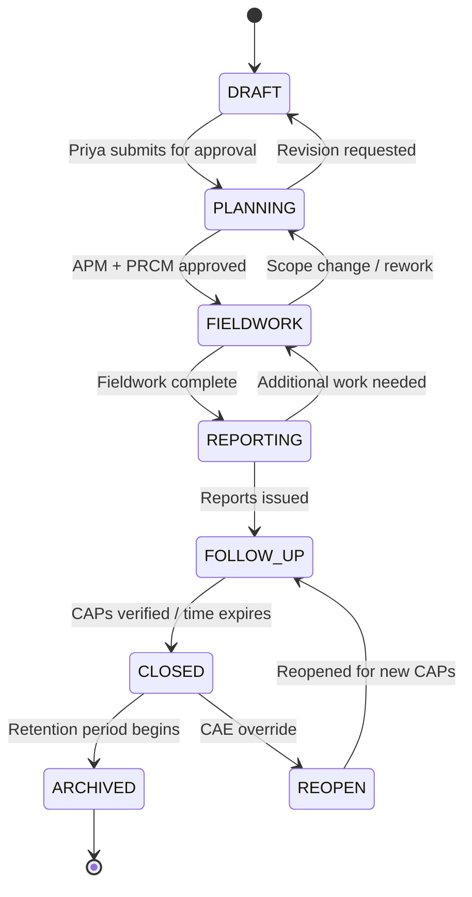
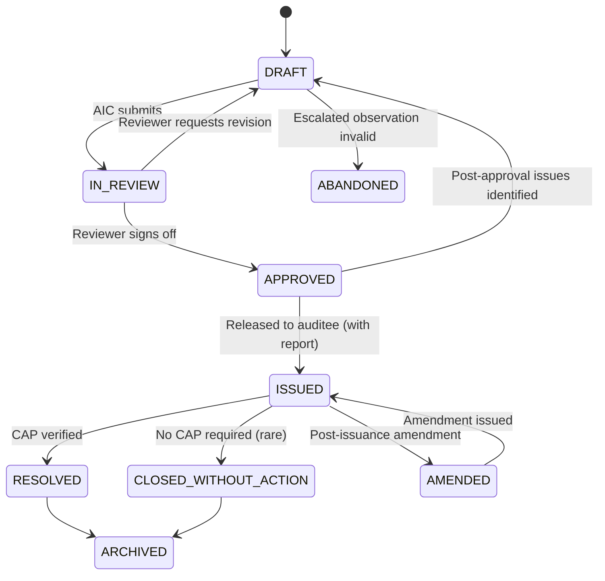
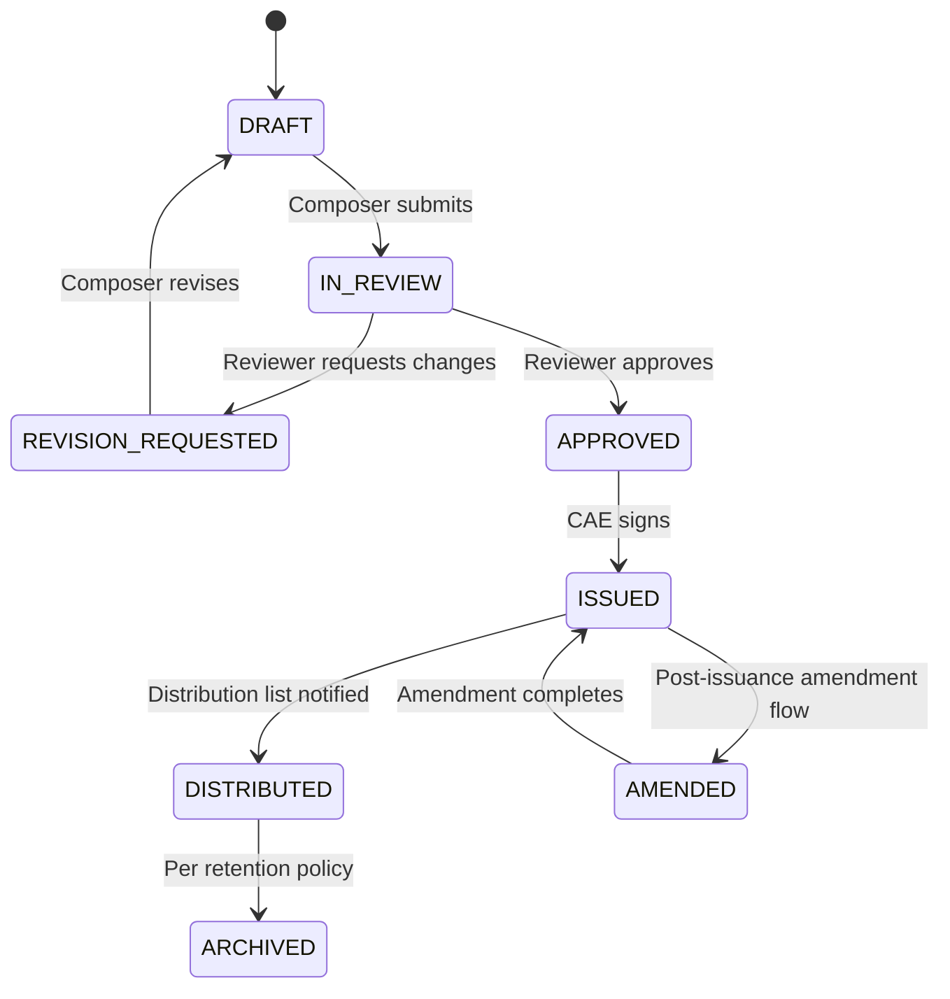
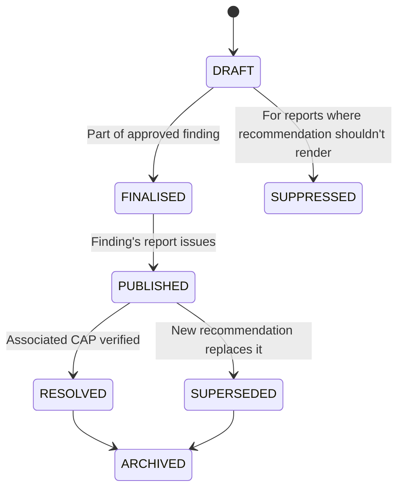
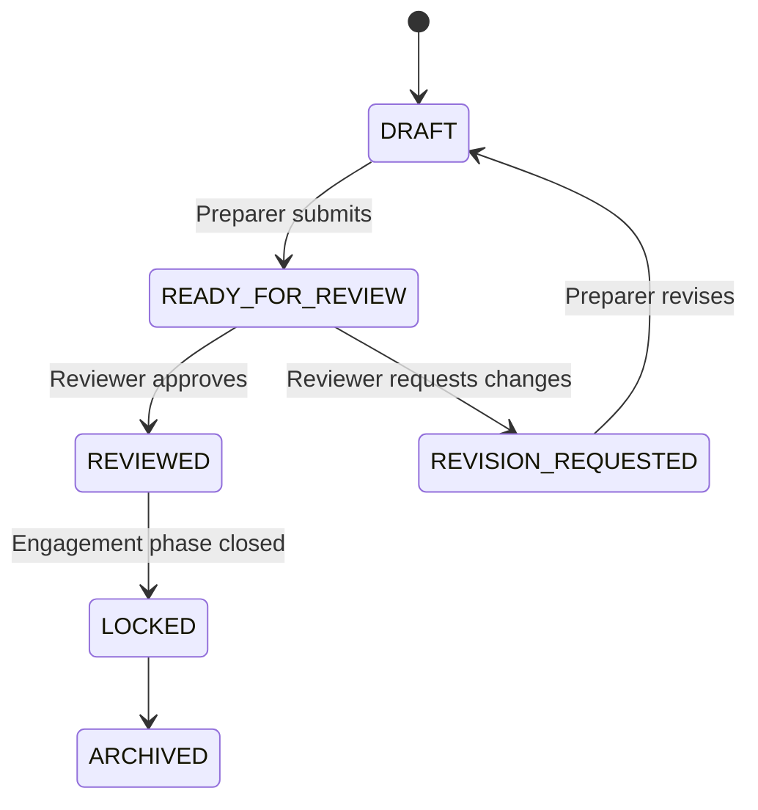
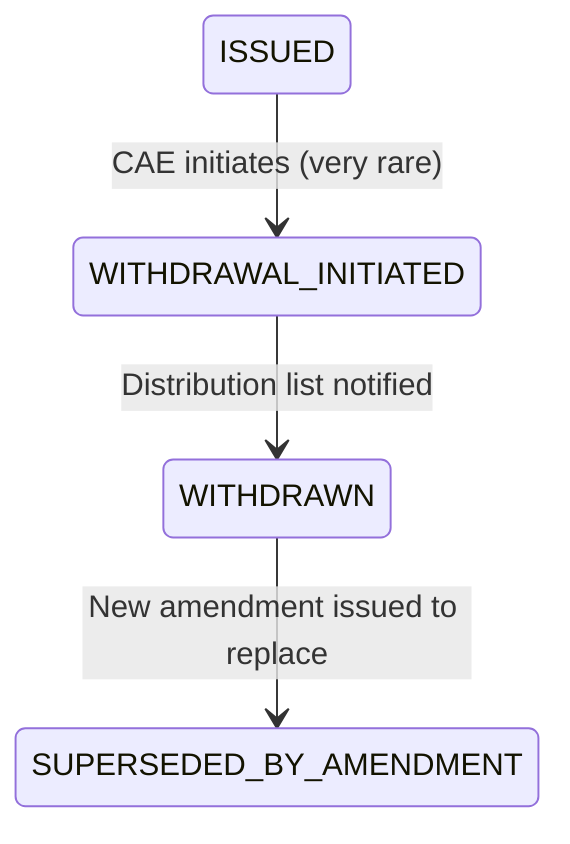

# Workflow State Machines

> The canonical state-machine definitions for the four lifecycle entities in AIMS v2: engagements, findings, reports, and corrective action plans. Each entity has a state model with pack-influenced transitions — the strictness resolver determines which transitions apply based on attached packs. This document defines the states, the transitions, the gating conditions, and the pack-specific variations. Pairs with [`approval-chain-rules.md`](approval-chain-rules.md), which details who can trigger each approval-bearing transition.

---

## 1. How workflows work in AIMS v2

Every workflow-bearing entity in AIMS v2 follows a per-pack declared state machine. The base state machine is defined in the entity's type; methodology packs declare variations (additional states, additional transitions, stricter gating conditions) via their `workflows` field (per [`data-model/standard-pack-schema.ts`](../../data-model/standard-pack-schema.ts)).

When an engagement attaches multiple methodology packs, the state machines combine via the strictness resolver:
- **Additional states** from an overlay pack are added
- **Transition gates** are tightened to the strictest of any attached pack
- **Approval chains** lengthen to the longest required (per [`approval-chain-rules.md`](approval-chain-rules.md))

The resulting state machine for a specific engagement is computed at engagement creation (per [`strictness-resolver-rules.md §2`](strictness-resolver-rules.md)) and stored alongside the engagement.

### 1.1 State machine declaration shape

Each pack's `workflows` field contains one or more workflow declarations:

```ts
interface WorkflowDeclaration {
  entity: 'engagement' | 'finding' | 'report' | 'cap' | 'recommendation';
  states: WorkflowState[];
  transitions: WorkflowTransition[];
  initialState: string;
  terminalStates: string[];
}

interface WorkflowState {
  code: string;
  displayName: string;
  description: string;
  // UI hints
  severity?: 'normal' | 'blocked' | 'locked';
  permittedRoles: Role[];
}

interface WorkflowTransition {
  from: string;
  to: string;
  trigger: TransitionTrigger;  // who + what invokes it
  guards: TransitionGuard[];    // conditions that must be met
  sideEffects: string[];        // side effects on transition (audit log, notifications, etc.)
}
```

State-machine diagrams in this document use Mermaid syntax; they render natively in GitHub, GitLab, and most modern markdown viewers.

---

## 2. Engagement workflow

Engagements are the largest-scope entity. Their workflow spans many months and orchestrates multiple sub-entities (work papers, findings, reports, CAPs).

### 2.1 Base engagement workflow



Base states, in order of lifecycle:

| State | Description | Typical duration |
|---|---|---|
| `DRAFT` | Engagement being set up; pack attachments not yet committed | Hours to days |
| `PLANNING` | APM, PRCM being authored and approved | 2-6 weeks |
| `FIELDWORK` | Work programs executing; work papers being authored | 4-12 weeks (engagement-specific) |
| `REPORTING` | Findings being finalised; reports being composed and reviewed | 2-6 weeks |
| `FOLLOW_UP` | CAPs being tracked; verifications performed | 3-12 months after report issuance |
| `CLOSED` | All CAPs resolved or follow-up period ended | Permanent until archived |
| `ARCHIVED` | Retention period active; minimal system interaction | 3-7 years per strictness resolver |
| `REOPEN` | CAE has reopened a closed engagement for exceptional reason | Temporary state |

### 2.2 Per-pack engagement workflow variations

**GAGAS:2024** adds a required transition gate: the transition from `PLANNING → FIELDWORK` requires APM approval via the engagement's full approval chain (per [`approval-chain-rules.md §2`](approval-chain-rules.md)), not just the AIC's sign-off. The transition from `REPORTING → FOLLOW_UP` requires the Yellow Book report to be signed by the CAE (per GAGAS §6.02).

**IIA GIAS:2024** adds: `PLANNING → FIELDWORK` transition requires a documented engagement charter (per IIA GIAS Domain 3 Principle 7); the `FOLLOW_UP → CLOSED` transition requires QAIP concurrent review evidence.

**PCAOB** adds a new state: `ENGAGEMENT_QUALITY_REVIEW` between `REPORTING` and issuance — the Engagement Quality Reviewer must sign off before reports issue (per AS 1220).

**SINGLE_AUDIT:2024** adds gate requirements at `REPORTING → FOLLOW_UP`: the Data Collection Form (or its equivalent) must be filed (or queued for filing) via the FAC submission process. AIMS doesn't perform the FAC submission itself (per [`docs/06 §7.4`](../../docs/06-design-decisions.md)); it requires the customer to confirm filing in a checklist.

**ISO 19011:2018** replaces some states with different names: the equivalent of `FIELDWORK` is `AUDIT_EXECUTION`; the equivalent of `REPORTING` includes pre-report `REVIEW_MEETING` state where the audit team meets with the auditee before releasing the audit report.

**SOC 2 (attestation)** adds `OPINION_FORMATION` state between REPORTING and final — the auditor must form and document the attestation opinion (per AT-C §205) before the report issues.

### 2.3 Multi-pack engagement — the resolver-combined workflow

When Oakfield FY27 attaches GAGAS + IIA + Single Audit + SOC 2, the combined workflow adds states and tightens gates. The resulting engagement workflow contains:

- All base states
- ENGAGEMENT_QUALITY_REVIEW from PCAOB (if attached — not in Oakfield's case, but would be for a PCAOB engagement)
- OPINION_FORMATION from SOC 2 — applies specifically to the SOC 2 attestation report, not the engagement as a whole
- REVIEW_MEETING from ISO — similarly report-specific

In practice, the per-pack additions often apply to specific sub-entities (the SOC 2 report, the ISO audit report) rather than the engagement as a whole. Oakfield FY27's resulting engagement-level state machine is essentially the base states with GAGAS's gates and Single Audit's reporting-phase requirements added.

### 2.4 Transition guards — what blocks state changes

Transitions from state `X → Y` are gated by:

**Phase prerequisites**:
- APM approved (for `PLANNING → FIELDWORK`)
- All work programs executed (for `FIELDWORK → REPORTING`)
- All findings in `ISSUED` state (for `REPORTING → FOLLOW_UP`)
- All CAPs in `VERIFIED` or `EXPIRED` state (for `FOLLOW_UP → CLOSED`)

**Pack-specific conditional prerequisites** (resolver-combined):
- EQR sign-off if PCAOB attached
- Yellow Book report signed if GAGAS attached
- Data Collection Form queued if Single Audit attached

**Approval chain completion**:
- For major transitions (PLANNING → FIELDWORK, REPORTING → FOLLOW_UP), the full approval chain (per [`approval-chain-rules.md`](approval-chain-rules.md)) must be satisfied

**Role-based trigger authorisation**:
- Only the AIC can initiate most transitions
- CAE can override most gates (with logging)
- Platform admin cannot modify engagement state (deliberately; Ravi operates meta-data only)

### 2.5 Transition side effects

Every transition produces:
- An entry in the `audit_event` hash chain (per [`docs/04 §8.6`](../../docs/04-architecture-tour.md))
- A notification to relevant parties (per [`../03-feature-inventory.md`](../03-feature-inventory.md) Module 16a)
- Updates to dashboards (engagement progress, phase status)
- Optional cascade effects: on `REPORTING → FOLLOW_UP`, open findings are flagged for CAP tracking; on `FOLLOW_UP → CLOSED`, finalise follow-up schedules; on `CLOSED → ARCHIVED`, initiate retention timer

### 2.6 Regression transitions

The workflow permits certain backwards transitions for legitimate rework:
- `FIELDWORK → PLANNING` — scope change requiring APM revision
- `REPORTING → FIELDWORK` — findings draft identifies evidence gap requiring more fieldwork
- `CLOSED → REOPEN` — CAE override (exceptional)

These transitions require:
- CAE approval
- Documented rationale (minimum 100 characters)
- Notifications to all stakeholders
- Audit log entry with elevated visibility

---

## 3. Finding workflow

Findings are the highest-volume workflow-bearing entity. A mid-size engagement produces 5-30 findings.

### 3.1 Base finding workflow



Base states:

| State | Description |
|---|---|
| `DRAFT` | Auditor is writing; not yet submitted |
| `IN_REVIEW` | AIC / CAE reviewing pre-issuance |
| `APPROVED` | Review complete; ready to include in report |
| `ISSUED` | Released to auditee; immutable for content changes (amendments only via AMENDED path) |
| `AMENDED` | Post-issuance amendment being drafted |
| `RESOLVED` | Associated CAP verified as complete |
| `CLOSED_WITHOUT_ACTION` | Edge case — finding issued but no remediation expected (e.g., opportunity for improvement without management commitment) |
| `ABANDONED` | Escalated observation determined to not rise to finding; no issuance |
| `ARCHIVED` | Retention period active |

### 3.2 Per-pack finding workflow variations

**GAGAS:2024** requires that the finding's approval chain include evidence of supervisory review per GAGAS §6.33. The `IN_REVIEW → APPROVED` transition cannot proceed without a documented review entry.

**IIA GIAS:2024** requires concurrent quality assurance review per Standard 15.1. For material findings, a QAIP reviewer (separate from the AIC) must sign off. This adds an optional intermediate state `IN_QA_REVIEW` between `IN_REVIEW` and `APPROVED`.

**PCAOB ICFR** has stricter gates: `APPROVED → ISSUED` requires EQR sign-off for deficiencies rated as Significant Deficiency or Material Weakness. Additionally, for ICFR findings, the `IN_REVIEW → APPROVED` transition requires separate review by the engagement partner and the EQR (per AS 1220).

**ISO 19011:2018** for nonconformities: the workflow reflects the ISO pattern where the auditor issues the nonconformity, the auditee prepares a Corrective Action Request response, and only after the response is evaluated does the finding become "closed." The AIMS CAP workflow handles this interaction.

**SINGLE_AUDIT:2024** requires classification of the finding's repeat-finding status and federal program relationship before the `APPROVED → ISSUED` transition. Missing Single Audit extension fields blocks the transition.

### 3.3 Draft state — no approval required

While a finding is in `DRAFT`, the auditor may edit content freely; the bitemporal data model captures each edit as a new row, but the audit log treats draft edits as low-priority (normal change records, not supervisory-review events).

### 3.4 IN_REVIEW — AIC / CAE review

The reviewer can:
- Approve — transition to `APPROVED`
- Request revision — transition back to `DRAFT` with comments; auditor revises, resubmits
- Reject — finding is ABANDONED (unusual; usually happens when evidence re-examination shows the finding doesn't hold)

Review comments are stored on the finding (per [`classification-mappings.md §9.5`](classification-mappings.md)) with resolution tracking.

### 3.5 Issuance — the big gate

The `APPROVED → ISSUED` transition has major side effects:
- Finding content locks (immutability enforced per [`docs/04 §3.2`](../../docs/04-architecture-tour.md))
- Finding becomes citable in public / distributed reports
- Management response window begins (per the engagement's `AUDITEE_RESPONSE_WINDOW_DAYS` per [`strictness-resolver-rules.md §3.24`](strictness-resolver-rules.md))
- CAP workflow initiates for the finding
- Notifications to auditee, CAE, board liaison (per engagement's distribution list)

Issuance is typically triggered as part of the containing report's issuance (reports contain the finding; issuing the report issues the findings). Standalone finding issuance (e.g., a finding issued separately from the main report) is supported but rare.

### 3.6 Amendment workflow

Post-issuance amendments require:
- CAE approval for the amendment initiation
- Documented reason (min 100 characters)
- A new bitemporal row appends with the amendment content
- The original issued content stays immutable (readable in the bitemporal history)
- If the amendment is material (changes classification, changes core element, changes recommendation), a formal amendment is issued to the original distribution list
- Distribution includes identifying the amendment vs. the original (the auditee receives something saying "this amends our finding 2026-001 issued 2028-02-26")

Amendment flow:

```mermaid
stateDiagram-v2
    ISSUED --> AMENDMENT_DRAFT : CAE initiates
    AMENDMENT_DRAFT --> AMENDMENT_REVIEW : Submitted
    AMENDMENT_REVIEW --> AMENDMENT_APPROVED : Reviewed
    AMENDMENT_APPROVED --> AMENDED : Distribution sent
    AMENDED --> ISSUED : (final state; original is archived immutably)
```


### 3.7 CAP-gated transitions

`ISSUED → RESOLVED` requires all associated CAPs for the finding to be in `VERIFIED` state. If a finding has multiple CAPs (split addressing), all must be verified.

`RESOLVED → ARCHIVED` requires the engagement to be in `FOLLOW_UP` → `CLOSED` → `ARCHIVED` lifecycle. Finding archival follows engagement archival.

---

## 4. Report workflow

Reports are the heaviest deliverable. The workflow is stringent because issuance is external-facing and legally significant.

### 4.1 Base report workflow



Base states:

| State | Description |
|---|---|
| `DRAFT` | Composer is assembling the report (selecting findings, drafting narrative) |
| `IN_REVIEW` | Reviewer(s) evaluating pre-approval |
| `REVISION_REQUESTED` | Reviewer has requested specific changes |
| `APPROVED` | Reviewer has approved; awaiting CAE signature |
| `ISSUED` | CAE has signed; content locked |
| `DISTRIBUTED` | Distribution to recipients completed |
| `AMENDED` | Post-issuance amendment in progress |
| `ARCHIVED` | Retention period active |

### 4.2 Per-pack report workflow variations

**GAGAS:2024** requires a 5-stage approval chain for reports per GAGAS §6.02 and the strictness resolver's `APPROVAL_CHAIN_LENGTH` dimension: Composer → AIC → CAE → Legal Review (if politically sensitive) → Issuance Authority. Between `IN_REVIEW` and `APPROVED`, there's an `IN_LEGAL_REVIEW` intermediate state for findings with potential PR or legal sensitivity.

**IIA GIAS:2024**'s Audit Committee Report flows through an additional state: `IN_COMMITTEE_REVIEW` where the Audit Committee Chair reviews before public distribution.

**PCAOB AS 3101** (financial audit reports) requires the engagement partner's signature on the final report; PCAOB AS 2201 (integrated audits combining FS + ICFR) further requires the EQR's sign-off on the ICFR opinion.

**SINGLE_AUDIT:2024** requires specific DCF form filing validation before `ISSUED → DISTRIBUTED`. The DCF is separately tracked from the main Yellow Book report issuance.

**ISO 19011:2018** adds a `REVIEW_MEETING_HELD` state — the audit report is presented to the auditee in a formal closing meeting before final issuance. Notes from the meeting can alter the report before formal distribution.

**SOC 2 (attestation)** adds an `OPINION_FORMATION_COMPLETE` gate — before `APPROVED → ISSUED`, the attesting auditor must document their opinion formation process per AT-C §205.

### 4.3 Report review workflow detail

Report reviews are more involved than finding reviews because reports:
- Aggregate multiple findings
- Have pack-specific section structure
- Render the same finding under different vocabularies (depending on `attestsTo`)
- Include a compliance-statement citing attached packs
- Have formal distribution implications

The `IN_REVIEW` state supports:
- Inline comments per section (Yellow Book has ~10 sections per GAGAS §6.02)
- Comment threads with resolution tracking
- Track-changes showing edits (per [`../03-feature-inventory.md`](../03-feature-inventory.md) Module 8 finding-adjacent features)
- Approval per reviewer (multi-reviewer workflow; a report may require 3 reviewers each signing off)

Per [`approval-chain-rules.md §4`](approval-chain-rules.md), the specific reviewer list for any report is determined by the engagement's attached packs plus the report's specific `attestsTo` pack.

### 4.4 Issuance — the immutability gate

`APPROVED → ISSUED` locks:
- Report content (cannot edit)
- All findings included in the report (the Finding workflow's `APPROVED → ISSUED` transitions simultaneously for every finding in the report)
- The `attestsTo` pack reference (the report will forever claim conformance with this specific pack version)
- Distribution list (cannot add recipients after issuance)

Issuance triggers:
- Hash-chain audit log entry with CAE signature
- Notifications to distribution list
- Webhook `report.issued` event firing (per Module 15)
- Historical record creation

Un-issue is not possible. If issuance was erroneous, the report is amended (per §4.5) rather than un-issued.

### 4.5 Amendment workflow for reports

Post-issuance report amendments follow the finding amendment pattern but with higher stakes:

- CAE must initiate; requires documented rationale
- Amendment is a new report version (not an overwrite); original version stays immutable
- Distribution list for the amendment matches the original (plus any recipients explicitly added)
- Amendment document clearly identifies itself as amending the original; references original version number + issuance date
- If the amendment materially changes the auditor's opinion (attestation-type reports), a formal opinion amendment is required per AT-C §205

---

## 5. CAP (Corrective Action Plan) workflow

CAPs are drafted by auditees (David) and verified by auditors (Priya).

### 5.1 Base CAP workflow

```mermaid
stateDiagram-v2
    [*] --> AWAITING_AUDITEE : Finding issued; response window starts
    AWAITING_AUDITEE --> PROPOSED : Auditee begins drafting
    AWAITING_AUDITEE --> RESPONSE_WINDOW_EXPIRED : Window passed with no response
    RESPONSE_WINDOW_EXPIRED --> BYPASSED : Finding issued with "management declined to respond" note
    PROPOSED --> IN_REVIEW : Auditee submits
    IN_REVIEW --> REVISION_REQUESTED : Auditor requests changes
    REVISION_REQUESTED --> PROPOSED : Auditee revises
    IN_REVIEW --> ACCEPTED : Auditor approves plan
    ACCEPTED --> IN_PROGRESS : CAP execution underway
    IN_PROGRESS --> EVIDENCE_SUBMITTED : Auditee uploads completion evidence
    EVIDENCE_SUBMITTED --> VERIFIED : Auditor verifies
    EVIDENCE_SUBMITTED --> MORE_EVIDENCE_REQUESTED : Auditor needs more
    MORE_EVIDENCE_REQUESTED --> IN_PROGRESS : Auditee continues
    VERIFIED --> ARCHIVED
    BYPASSED --> ARCHIVED

    IN_PROGRESS --> OVERDUE : Target completion passed
    OVERDUE --> IN_PROGRESS : Auditee makes progress
    OVERDUE --> ESCALATED : AIC escalates to CAE

    IN_PROGRESS --> ABANDONED : CAE decides remediation infeasible
```



Base states:

| State | Description |
|---|---|
| `AWAITING_AUDITEE` | Finding issued; auditee has the `AUDITEE_RESPONSE_WINDOW_DAYS` window (per resolver §3.24) to propose a CAP |
| `RESPONSE_WINDOW_EXPIRED` | Window elapsed with no CAP proposal submitted; auditor decides path forward |
| `BYPASSED` | Auditor issued the report with "management declined to respond" per GAGAS §6.54; CAP workflow closes without auditee action |
| `PROPOSED` | Auditee drafting |
| `IN_REVIEW` | Auditor reviewing the plan |
| `ACCEPTED` | Plan approved by auditor |
| `IN_PROGRESS` | Auditee executing remediation |
| `OVERDUE` | Target completion date passed without completion |
| `EVIDENCE_SUBMITTED` | Auditee uploaded completion evidence |
| `MORE_EVIDENCE_REQUESTED` | Auditor determined evidence insufficient |
| `VERIFIED` | Auditor confirmed remediation complete |
| `ESCALATED` | Overdue CAP escalated to CAE or engagement partner |
| `ABANDONED` | CAP determined infeasible; finding may remain open for alternative resolution |
| `ARCHIVED` | Retention period active |

### 5.1.1 The auditee stonewall pattern

A real operational pattern not captured by the original workflow: the auditee never submits a CAP at all. Management sometimes ignores CAP requests to delay the bad report — the auditor then must proceed regardless. Per GAGAS §6.54 and the `AUDITEE_RESPONSE_WINDOW_DAYS` dimension (resolver §3.24), the response window is typically 30 days. When that window expires without a CAP proposal:

1. The finding transitions from `AWAITING_AUDITEE` to `RESPONSE_WINDOW_EXPIRED`
2. AIMS notifies the AIC (Priya) and CAE (Marcus) automatically
3. Priya has two paths:
   - **Extend the window** — with documented rationale (auditee legitimately needs more time for a complex remediation); logs an event; up to one extension of up to 15 days per pack-defined limits
   - **Proceed to BYPASSED** — issues the report with a "management declined to respond" note per GAGAS §6.54, formally closing the CAP workflow for this finding. The finding itself remains `ISSUED` but carries a flag indicating no management response

4. In BYPASSED state, the finding's amendment workflow is limited: the finding can still be amended (per §3.6) but CAP remediation tracking is not applicable
5. The report narrative and the Audit Committee communication both note the absence of management response explicitly

This pattern is pack-aware:
- **GAGAS** permits this bypass explicitly per §6.54
- **IIA GIAS** similar pattern but requires documented Audit Committee notification
- **SINGLE_AUDIT** requires documented notification to the federal awarding agency if the finding involves questioned costs, per 2 CFR 200.515
- **PCAOB** generally cannot bypass; PCAOB ICFR deficiencies go through different remediation tracking per AS 2201

### 5.1.2 Bypass trigger — configurable per tenant

The default bypass path fires 5 business days after `RESPONSE_WINDOW_EXPIRED`. Tenants can configure:
- Auto-bypass after N days vs. manual AIC decision always
- Whether to auto-escalate to CAE before bypass (typical — CAE wants visibility)
- Notification template for the "management declined to respond" narrative

### 5.2 Auditee-side (David's) workflow touchpoints

- `PROPOSED` → `IN_REVIEW`: David authors plan content (what will be done, by whom, target date) and submits
- `ACCEPTED`: the finding's auditor has accepted; David now owns the CAP execution
- `IN_PROGRESS` → `EVIDENCE_SUBMITTED`: David uploads evidence; this may include multiple rounds of partial evidence submission
- `MORE_EVIDENCE_REQUESTED`: David sees a comment explaining what additional evidence is needed

### 5.3 Auditor-side (Priya's) workflow touchpoints

- `IN_REVIEW`: review the proposed plan; request revisions or accept
- `EVIDENCE_SUBMITTED` review: verify evidence against the original finding + CAP criteria; approve as `VERIFIED` or request more evidence
- `OVERDUE` escalation: flag and escalate to CAE if delay is unexplained

### 5.4 Per-pack CAP workflow variations

**GAGAS:2024** and IIA: similar; the workflow above is essentially GAGAS + IIA common ground.

**PCAOB ICFR** with SOX §404(b) attestation: CAPs for ICFR material weaknesses have regulatory deadlines — typically remediation must be attested in the next audit cycle. This surfaces as a date-constraint on the CAP's target completion.

**SINGLE_AUDIT:2024** adds: the CAP must include federal-program-specific remediation steps. CAP completion for Single Audit findings requires evidence addressing each questioned cost and each federal program affected.

**ISO 19011:2018** uses "Corrective Action Request" (CAR) terminology. The CAR workflow is structurally similar but uses different state names: `ISSUED` (the CAR) → `AUDITEE_CORRECTIVE_ACTION` → `VERIFIED` → `CLOSED`.

### 5.5 CAP deadlines and the strictness resolver

`AUDITEE_RESPONSE_WINDOW_DAYS` (per [`strictness-resolver-rules.md §3.24`](strictness-resolver-rules.md)) determines the initial response window. CAP target completion is auditee-proposed but subject to auditor acceptance; if the auditor deems the timeline too extended for the finding severity, they can reject the CAP and request a shorter timeline.

For `SINGLE_AUDIT:2024` overlay, 2 CFR 200.511 (and Single Audit Clearinghouse guidance) set expectations for CAP completion within specific windows depending on finding severity. These deadlines are encoded as pack-declared defaults that the CAP workflow highlights during the review stage.

### 5.6 Overdue CAP tracking

CAPs that pass their target completion date transition to `OVERDUE` automatically via a scheduled job (per [`../../devops/QUEUE-CONVENTIONS.md`](../../devops/QUEUE-CONVENTIONS.md)). The transition fires:
- Email reminder to David
- Notification to Priya (AIC)
- After 10 days OVERDUE without progress: automatic escalation to Marcus (CAE)
- After 20 days OVERDUE: automatic escalation to engagement partner

All escalation cadences are configurable per-tenant per `../03-feature-inventory.md` Module 16a.

---

## 6. Recommendation workflow

Recommendations have a simpler workflow since they're associated with findings and don't generally go through separate issuance gates.

### 6.1 Base recommendation workflow



States:

| State | Description |
|---|---|
| `DRAFT` | Being authored with the finding |
| `FINALISED` | Finding is approved; recommendation locked |
| `PUBLISHED` | Finding's report has issued; recommendation is public |
| `SUPPRESSED` | Recommendation is hidden from a specific report (per report's `recommendationPresentation`) |
| `RESOLVED` | Associated CAP verified |
| `SUPERSEDED` | Replaced by a newer recommendation |
| `ARCHIVED` | Retention period |

### 6.2 Per-pack recommendation workflow — presentation-mode driven

The key workflow variation is the `PRESENTATION_MODE` (per [`strictness-resolver-rules.md §3.14`](strictness-resolver-rules.md)) — which is actually a per-report decision, not per-recommendation. For any given recommendation, the same object might render:
- **Inline** in one report (IIA Audit Committee)
- **In a separate schedule** in another report (GAGAS Schedule of Findings and Questioned Costs)
- **Suppressed** in a third report (PCAOB ICFR — per AS 1305)

The recommendation object itself has one lifecycle; the rendering per report is determined at report-composition time based on the report's `recommendationPresentation` field.

### 6.3 Recommendation amendment

Amendments follow the same pattern as findings (per §3.6). Post-issuance changes create new bitemporal rows; original stays immutable; material amendments require formal distribution.

---

## 7. Work paper workflow

Work papers have a per-paper lifecycle within the broader engagement fieldwork phase.

### 7.1 Base work paper workflow



Work papers follow a lighter workflow than findings or reports because they're internal documentation, not externally-distributed artefacts. Supervisory review is the key gate.

### 7.2 Per-pack work paper workflow variations

**GAGAS:2024** — supervisor review evidence is required per §6.33. The `REVIEWED` state must include a supervisory sign-off with reviewer identity and review date.

**PCAOB** — engagement partner review + EQR review on material work papers; two separate sign-offs required for certain work paper types (control testing, materiality assessment, fraud risk assessment).

**IIA GIAS:2024** — AIC review with QAIP concurrent review; similar to PCAOB but less rigid.

### 7.3 Work paper locking

When the engagement transitions out of `FIELDWORK`, all work papers lock (`LOCKED` state). Edits after this require engagement-level regression back to `FIELDWORK` (per §2.6) with CAE approval.

---

## 8. Transition audit trail

Every transition in every workflow produces an audit trail entry. The entry includes:

- Entity type and ID (engagement, finding, report, CAP, recommendation, work paper)
- From state and to state
- Timestamp (`transactionFrom`)
- Acting user ID + role
- Trigger (user action, scheduled job, cascade from parent entity)
- Guards satisfied (or failed with block reason)
- Side effects executed (notifications fired, cascades triggered, audit events logged)
- Parent audit event hash (for the hash chain per [`../../docs/04-architecture-tour.md`](../../docs/04-architecture-tour.md))

Audit trail queries support:
- "Show me every state transition for this engagement over time"
- "Show me every state transition this user has performed in the last year"
- "Show me every OVERDUE CAP that escalated to CAE last quarter"
- "Show me every engagement that was reopened (regressed) in the last 6 months"

These queries support both internal audit / compliance use cases and external peer-review evidence production (per [`../../references/adr/0002-tenant-isolation-two-layer.md`](../../references/adr/0002-tenant-isolation-two-layer.md) defence-in-depth and the hash-chained audit log).

---

## 9. Scheduled job triggers

Several workflow transitions happen via scheduled jobs, not direct user actions:

- **CAP overdue detection** — runs daily; finds CAPs past target completion date and transitions to `OVERDUE`
- **Escalation** — runs daily; finds OVERDUE CAPs at the 10-day / 20-day thresholds and fires escalation transitions
- **Retention enforcement** — runs weekly; finds CLOSED engagements past retention age and transitions to ARCHIVED
- **Archival** — runs monthly; finds ARCHIVED entities past retention-period + archival-hold and schedules cryptographic erasure
- **CPE alerts** (not a state machine but a related workflow) — runs daily; finds auditors approaching CPE-cycle deadlines

These jobs run via EventBridge Scheduler dispatching to SQS per [`../../devops/QUEUE-CONVENTIONS.md`](../../devops/QUEUE-CONVENTIONS.md).

---

## 10. State machine validation

At engagement creation (or pack attach/detach), the resolver validates the combined state machine:

### 10.1 Reachability

Every state in the combined machine must be reachable from the initial state via some sequence of transitions. A pack contribution that adds an unreachable state is rejected with a validation error.

### 10.2 Terminal state reachability

At least one terminal state must be reachable from every non-terminal state via some path. No "dead-end" states.

### 10.3 Transition ambiguity

Two different transitions from the same state on the same trigger must have mutually-exclusive guards (or one must be explicitly superseded by pack-version). Ambiguous transitions are rejected.

### 10.4 Guard predicate consistency

All guard predicates referenced in the combined machine must be defined and evaluatable against the engagement context. Undefined predicates are caught at validation time.

---

## 11. Edge cases

### 11.1 Pack detached mid-workflow

When a pack is detached from an engagement mid-lifecycle, the engagement's combined state machine re-computes. If the current state is no longer in the combined machine, the engagement enters a "stuck" status requiring CAE resolution.

Example: an engagement in `ENGAGEMENT_QUALITY_REVIEW` state (PCAOB-specific) has PCAOB detached. The state no longer exists. CAE must manually move the engagement to a valid state (typically `APPROVED` or back to `REPORTING`) with documented rationale.

### 11.2 Pack version upgrade mid-workflow

If a pack upgrades its version mid-engagement, the workflow re-resolves. If the new version removes a state, or changes transitions, the engagement may need CAE intervention. Most pack version upgrades preserve workflow structurally; edge cases are logged.

### 11.3 Parallel finding reviews

A finding can have parallel review requirements (AIC + QA reviewer + EQR for PCAOB ICFR findings). The workflow models this as multiple concurrent review states that must all be satisfied before the finding transitions to `APPROVED`. The UI shows the reviewer panel with status per reviewer.

### 11.4 Engagement closed but finding not resolved

Rare but possible: an engagement closes (CLOSED state, all reports issued, CAP follow-up window elapsed) while a specific finding has not reached `RESOLVED` — typically because the auditee has not completed the CAP within the follow-up window.

Policy (per GAGAS and Single Audit): the finding carries forward to the next audit period as a "repeat finding." AIMS flags this automatically. The finding's workflow state remains `ISSUED` indefinitely; the engagement moves to CLOSED with the unresolved finding logged.

### 11.5 Withdrawal of issued report

PCAOB and similar: if an issued report contained material misstatement or is otherwise defective, the auditor may need to withdraw it. Withdrawal is a specific workflow state that AIMS models:



Withdrawal of an issued report is a major event with legal implications. AIMS logs it as a high-visibility audit event and requires CAE + legal counsel approval.

---

## 12. References

- [`rules/strictness-resolver-rules.md`](strictness-resolver-rules.md) — state-machine combination via resolver
- [`rules/approval-chain-rules.md`](approval-chain-rules.md) — who triggers transitions
- [`rules/classification-mappings.md`](classification-mappings.md) — classifications that must be set before certain transitions
- [`data-model/standard-pack-schema.ts`](../../data-model/standard-pack-schema.ts) — `workflows` field shape
- [`data-model/tenant-data-model.ts`](../../data-model/tenant-data-model.ts) — entity state fields
- [`docs/04-architecture-tour.md` §3.2](../../docs/04-architecture-tour.md) — event sourcing + hash chain for workflow state
- [`docs/06-design-decisions.md` §1.5](../../docs/06-design-decisions.md) — reports with `attestsTo` (workflow affects per-report rendering)
- [`../03-feature-inventory.md`](../03-feature-inventory.md) — Modules 4, 7, 8, 9, 10, 14 feature catalogue
- [`../04-mvp-scope.md`](../04-mvp-scope.md) — MVP 1.0 vs. 1.5 workflow feature inclusion
- GAGAS 2024 §6.02, §6.33, §6.40–6.45, §5.60, §6.54 — workflow-adjacent requirements
- IIA GIAS 2024 Domains 2, 3, 4, 5 — workflow requirements
- PCAOB AS 1220, AS 1105, AS 2201, AS 3101 — reporting workflow gates
- ISO 19011:2018 §6.4, §6.5, §6.6 — ISO workflow patterns

---

## 13. Domain review notes — Round 1 (April 2026)

This document went through external domain-expert review as part of the Phase 3 rule-files review cycle. **Verdict: Approved with one specific refinement** (auditee stonewall path added to CAP workflow).

### Round 1 — CAP workflow auditee stonewall

Reviewer correctly identified a missing operational scenario: what happens when David (the auditee) simply ignores the CAP request and never responds? Management sometimes delays responses to delay bad reports. The original CAP workflow only tracked target-completion deadlines (§5.1 OVERDUE state) but not the earlier response-window deadline.

Fix applied to §5.1: added `AWAITING_AUDITEE` + `RESPONSE_WINDOW_EXPIRED` + `BYPASSED` states to the CAP workflow. When the `AUDITEE_RESPONSE_WINDOW_DAYS` window elapses without a CAP proposal, the auditor can issue the report with a "management declined to respond" note per GAGAS §6.54. Added §5.1.1 (the auditee stonewall pattern) and §5.1.2 (bypass trigger configuration) explaining the new behaviour. Pack-aware logic: GAGAS permits bypass explicitly; IIA requires Audit Committee notification; Single Audit requires federal agency notification for questioned-cost findings; PCAOB generally cannot bypass.

See strictness-resolver-rules.md §9 for the overall Phase 3 review verdict.

---

*Last reviewed: 2026-04-21. Phase 3 deliverable; R1 review closed.*
