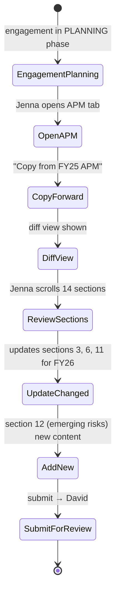
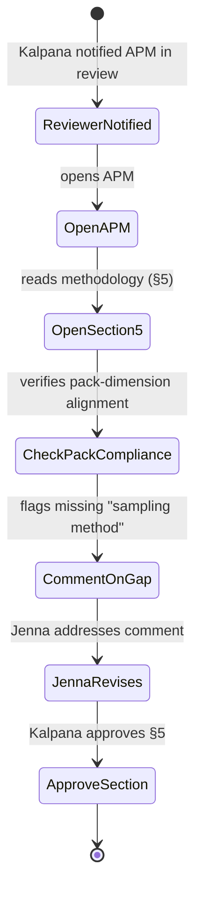
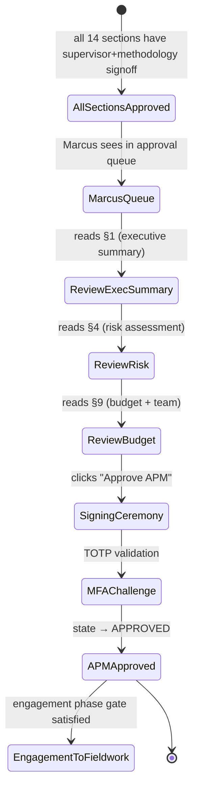

# UX — Audit Planning Memo (APM) Workflow

> The APM is a 14-section structured document required by GAGAS §7.05-7.10. It captures objectives, scope, methodology, risk assessment, team, budget, and key decisions for a specific engagement — before fieldwork starts. Unlike the annual plan (tenant-wide, Marcus's deliverable), the APM is per-engagement, primarily authored by Jenna with supervisor (David) and methodology (Kalpana) review. UX goal is to make the 14-section structure feel like guided authoring, not a 14-form data-entry slog.
>
> **Feature spec**: [`features/apm-workflow.md`](../features/apm-workflow.md)
> **Related UX**: [`engagement-management.md`](engagement-management.md) (APM is the planning deliverable inside an engagement), [`prcm-matrix.md`](prcm-matrix.md) (PRCM is a downstream planning artifact referenced from APM)
> **Primary personas**: Jenna (primary author), David (supervisor review), Kalpana (methodology QA), Marcus (final approver)

---

## 1. UX philosophy for this surface

- **Guided authoring, not 14 forms.** Sections are ordered, have suggested content, and show progressive prompts. Users don't fill blank templates — they respond to prompts that walk them through planning thinking.
- **Prior year is a starting point, not a cage.** 70% of an engagement's APM content is stable from year to year (scope, methodology, team). UX supports copy-forward with clear diff view so Jenna can see what changed vs. last year.
- **Sections are independently reviewable.** David might sign off on sections 1-6 while Jenna is still drafting 7-14. The state machine is section-level, not document-level.
- **Pessimistic section locking in MVP 1.0.** Per R1 feedback, collaborative section editing uses pessimistic locks ("Jenna is editing section 4 — 5 min timeout"). Yjs CRDT deferred to MVP 1.5.
- **Pack-driven section requirements.** Attached packs determine which sections are required, what depth is needed, what's optional. Pack change → APM validity re-checked.

---

## 2. Primary user journeys

### 2.1 Journey: Jenna authors APM from prior year



### 2.2 Journey: Kalpana reviews methodology section



### 2.3 Journey: Marcus gives final signoff



---

## 3. Screen — APM home

Invoked from: engagement dashboard → Planning → APM.

### 3.1 Layout

Two-pane: section navigator left, section editor right.

```
┌─ APM · FY26 Q1 Revenue Cycle Audit ────[DRAFT v0.2]──────[Actions ▼]──────┐
│                                                                              │
│ ┌─ Sections ─────────────────────┐ ┌─ 1. Executive summary ──────────────┐ │
│ │                                  │ │                                       │ │
│ │ ● 1. Executive summary    ✓    │ │ ⓘ This section summarizes the why,    │ │
│ │ ○ 2. Engagement overview  ✓    │ │   what, and how of the engagement —   │ │
│ │ ○ 3. Auditee & scope      ✓    │ │   written for an exec audience. Keep   │ │
│ │ ○ 4. Risk assessment      ⏳   │ │   under 300 words.                     │ │
│ │ ○ 5. Methodology          ⏳   │ │                                         │ │
│ │ ○ 6. Packs & standards    ✓    │ │ Rich text editor                       │ │
│ │ ○ 7. Objectives           ○    │ │ [ This engagement examines the     ]  │ │
│ │ ○ 8. Procedures           ○    │ │ [ effectiveness of revenue           ]  │ │
│ │ ○ 9. Budget & team        ✓    │ │ [ recognition and related controls   ]  │ │
│ │ ○ 10. Timeline            ✓    │ │ [ for the FY25 reporting period.     ]  │ │
│ │ ○ 11. Independence        ✓    │ │ [ Motivated by elevated risk from    ]  │ │
│ │ ○ 12. Fraud / emerging    ○    │ │ [ ASC 606 amendment 2025.            ]  │ │
│ │ ○ 13. Deliverables        ○    │ │                                         │ │
│ │ ○ 14. Approval            ○    │ │ 287 / 300 words                        │ │
│ │                                  │ │                                         │ │
│ │ 7 of 14 complete                 │ │ Signoffs                                │ │
│ │ 2 awaiting your work             │ │   Preparer (Jenna)  · 2026-04-18  ✓    │ │
│ │                                  │ │   Supervisor (David) · 2026-04-19 ✓    │ │
│ │ [ Copy from prior APM ]          │ │   Methodology (Kalpana) · pending      │ │
│ │                                  │ │                                         │ │
│ │                                  │ │ [ Save ]  [ Request review ]           │ │
│ └──────────────────────────────────┘ └─────────────────────────────────────────┘│
│                                                                              │
│  [ Preview PDF ]  [ Submit for CAE approval ]                                │
└──────────────────────────────────────────────────────────────────────────────┘
```

### 3.2 Section status indicators

| Indicator | Meaning |
|---|---|
| ○ (empty circle) | Not started |
| ⏳ (hourglass) | In progress (some content, below threshold) |
| ✓ (check) | Complete — preparer has signed off |
| ⚠ | Validation error (missing required subfields, pack requirement unmet) |
| 🔒 | Locked by another user (pessimistic lock, 5-min idle timeout) |

Each section shows its own signoff chain in the right pane (preparer / supervisor / methodology). Supervisor and methodology signoffs can be per-section.

### 3.3 Pack-driven section requirements

The right pane header of each section shows relevant pack requirements:

```
1. Executive summary  [Required by GAGAS-2024.1, max 300 words]
4. Risk assessment    [Required by GAGAS + COSO; depth: detailed]
9. Budget & team      [Required; headcount hours breakdown]
12. Fraud / emerging risks  [Required by GAGAS-2024.1 only]
```

Optional sections are labeled "Optional" and collapsed by default.

---

## 4. Section editing

Each section is its own TipTap instance with tailored tooling:

### 4.1 Common toolbar
- Bold / italic / underline
- Heading levels (H3, H4 within section)
- Bullet / numbered list
- Blockquote
- Link (auto-detects WP / finding refs)
- Tables (allowed in APM, unlike findings)
- Section-specific widgets (see below)

### 4.2 Section-specific widgets

**§3 Auditee & scope** — Structured auditee picker (contact card for each stakeholder with role, email), scope in/out matrix.

**§4 Risk assessment** — Embedded risk matrix: inherent, residual, per risk identified. Links to universe entity's risk factors.

**§6 Packs & standards** — Read-only from engagement.pack_attachments with resolver summary. Kalpana can add a narrative paragraph justifying pack strategy.

**§9 Budget & team** — Team roster widget with per-person hour allocations; capacity validation. Summary totals auto-calculated.

**§10 Timeline** — Gantt-style widget with phase markers (kickoff, fieldwork start, reporting, publish target dates).

**§11 Independence** — Structured declaration form; each team member required to sign electronically.

**§12 Fraud / emerging risks** — Prompts for "brainstorm required per GAGAS §7.35" with free-text + structured risk rows.

**§14 Approval** — Not authored. Populated automatically from signoff chain. Shows all signatures with timestamps.

### 4.3 Section locking

On section edit focus: server places a soft lock with 5-min idle timeout.
- Other users see "Jenna is editing (5:42 remaining)" banner; their editor is read-only.
- Auto-release on save, navigate away, or idle timeout.
- Explicit "Release lock" button on own active locks.

### 4.4 Collaborative presence (awareness without CRDT)

Each section shows who's viewing (avatars top-right). Read cursor awareness, no edit cursor merging. On save, other viewers see a toast "Section 4 updated by Jenna 10s ago. [Refresh]".

---

## 5. Copy-from-prior-APM flow

Invoked from: APM home → "Copy from prior APM" button (shown when no content exists).

### 5.1 Source picker

```
┌─ Copy from prior APM ─────────────────────────────────────────────────┐
│                                                                         │
│  Select source:                                                         │
│   (●) FY25 Q1 Revenue Cycle Audit (most recent same auditee)           │
│   ( ) FY24 Q1 Revenue Cycle Audit                                      │
│   ( ) FY25 AP Procurement Audit (different auditee, similar scope)    │
│   ( ) Browse all prior APMs                                            │
│                                                                         │
│  What will be copied:                                                   │
│   [x] Engagement overview (§2)                                         │
│   [x] Auditee info & scope (§3)                                        │
│   [x] Methodology (§5)                                                 │
│   [x] Packs & standards (§6)                                           │
│   [x] Independence (§11)                                               │
│   [ ] Risk assessment (§4)  — always re-do per fiscal year              │
│   [ ] Budget & team (§9)    — resource allocation differs              │
│   [ ] Timeline (§10)        — dates differ                              │
│   [ ] Fraud / emerging (§12) — year-specific                            │
│                                                                         │
│                                       [ Cancel ]  [ Copy sections → ] │
└─────────────────────────────────────────────────────────────────────────┘
```

### 5.2 Post-copy diff view

Copied sections show in the editor with a yellow "From FY25" banner. Each section has "Review and commit" or "Edit" to mark the section as reviewed. Not reviewing within 3 days shows a warning.

---

## 6. Review workflow

### 6.1 Section-level submit for review

From any section: "Request review" (dropdown: Supervisor / Methodology / Both). Routes to reviewer's queue. Reviewer sees the section in read-only mode with inline commenting enabled (same sentence-anchored comments as findings).

Section state: DRAFT → AWAITING_REVIEW → REVIEWED → (APPROVED per signoff).

### 6.2 Full-APM submit for CAE approval

When all 14 sections show green check (preparer + supervisor + methodology signed, where applicable), enables "Submit for CAE approval."

Marcus's approval view:
- Section navigator with full signoff trail
- Read-only editor for each section
- Actions at bottom: "Approve APM" (opens MFA challenge), "Request revisions" (returns to draft with consolidated feedback)

### 6.3 MFA challenge + approval ceremony

Similar to report signoff (see [report-generation.md §6.2](report-generation.md)):

```
┌─ Approve APM · FY26 Q1 Revenue Cycle Audit ────────────────────────────┐
│                                                                          │
│  You are approving the Audit Planning Memo for:                          │
│   • Engagement: FY26 Q1 Revenue Cycle Audit                              │
│   • Auditee: Lisa Chen (CFO) & team                                      │
│   • Planned hours: 400                                                   │
│   • Planned start: 2026-04-01                                            │
│                                                                          │
│  By approving, you attest that:                                          │
│   • Independence has been declared by all team members                   │
│   • Pack strategy is appropriate for the auditee and scope               │
│   • Resource allocation is consistent with the annual plan               │
│                                                                          │
│  MFA: [ TOTP _______ ]                                                   │
│  Attestation: [ type "I approve" _______ ]                               │
│                                                                          │
│                                          [ Cancel ]  [ Approve ]        │
└──────────────────────────────────────────────────────────────────────────┘
```

On approval:
- APM state → APPROVED
- Content hash appended to audit log
- Engagement phase gate (Planning → Fieldwork) cleared
- Team notified

---

## 7. Preview & export

- **Preview PDF**: rendered as a structured document — cover page, ToC, 14 sections with headers, signature page with all signoffs.
- **Export formats**: PDF primary; Word (.docx) for reference; JSON for archival.
- All exports include a content hash footer and the audit-log chain anchor.

---

## 8. APM versions and amendments

Post-approval APM edits:
- Require "Create amendment" action → locks current version, creates v1.1 draft
- Amendment justifies the change; goes through abbreviated approval (only affected sections require re-review)
- End-of-engagement reconciliation shows APM v1.0 vs. what was executed (scope creep, budget variance)

---

## 9. Loading, empty, error states

| State | Treatment |
|---|---|
| No APM exists | APM tab empty state: "No APM yet. Create one from scratch or copy from a prior engagement. [Create] [Copy forward]" |
| Pack change invalidates APM | Banner: "Pack GAGAS-2024.2 added; section 6 needs update. [Review]" |
| Section lock contention | "David is editing section 4. Your changes will be applied when David releases." Read-only mode enforced. |
| Save failure | Auto-save retry; inline indicator. |
| Signoff on section with unresolved comment | Warning: "2 unresolved comments in §5 — approve anyway? [Add note] [Cancel]" |

---

## 10. Responsive behavior

- **xl/lg**: Two-pane layout as drawn.
- **md**: Section navigator collapses to a top dropdown; editor full-width.
- **sm**: Read-only preview only. Editing deferred to desktop.

---

## 11. Accessibility

- Section navigator is `<nav><ol aria-label="APM sections">` with `aria-current="page"` on active.
- Signoff badges have descriptive labels.
- Approval ceremony dialog announces attestation requirements.
- Collaborative presence avatars have `aria-label="Jenna is viewing"`.

---

## 12. Keyboard shortcuts

| Shortcut | Action |
|---|---|
| `j` / `k` | Next / prev section |
| `⌘+S` | Save current section |
| `⌘+Enter` | Request review for current section |
| `?` | Show shortcut cheat sheet |

---

## 13. Microinteractions

- **Section marked complete**: circle fills to check with 300ms fill animation; `X of 14 complete` counter animates.
- **Lock acquired**: small lock icon fades in on section header.
- **APM approved**: ceremonial overlay with CAE signature graphic; APM state badge flips with 400ms color morph.

---

## 14. Analytics & observability

- `ux.apm.created { engagement_id, from_template_or_copy }`
- `ux.apm.section_saved { section_index, char_count, had_copy_forward }`
- `ux.apm.section_lock_acquired { section_index, lock_duration_seconds }`
- `ux.apm.section_lock_conflict { section_index, waiting_user_id }`
- `ux.apm.section_reviewed { section_index, reviewer_role, comment_count }`
- `ux.apm.submitted_for_cae { engagement_id, total_sections_complete }`
- `ux.apm.approved { engagement_id, total_cycle_days, had_amendments }`
- `ux.apm.copy_forward_used { source_apm_id, sections_copied }`

KPIs:
- **APM cycle time** (draft → approved; target: median ≤ 10 business days)
- **Copy-forward adoption** (target: ≥60% of APMs use copy-forward)
- **Review rework** (sections returned for revision > 0; target ≤ 30%)
- **Lock contention rate** (target <5% of edits hit a lock; high suggests CRDT is needed)

---

## 15. Open questions / deferred

- **Yjs CRDT for section concurrency**: deferred to MVP 1.5. MVP 1.0 uses pessimistic locks.
- **AI-drafted §12 brainstorm prompts**: deferred to v2.1.
- **Cross-APM analysis** (trends across engagements): deferred to MVP 1.5.
- **Mobile authoring**: deferred.

---

## 16. References

- Feature spec: [`features/apm-workflow.md`](../features/apm-workflow.md)
- Related UX: [`engagement-management.md`](engagement-management.md), [`prcm-matrix.md`](prcm-matrix.md)
- Data model: [`data-model/apm.md`](../data-model/apm.md)
- API: [`api-catalog.md §3.11`](../api-catalog.md) (`apm.*` tRPC namespace)

---

*Last reviewed: 2026-04-22. Phase 6 (UX) draft — pending external review.*
