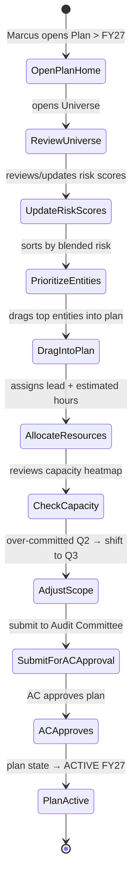
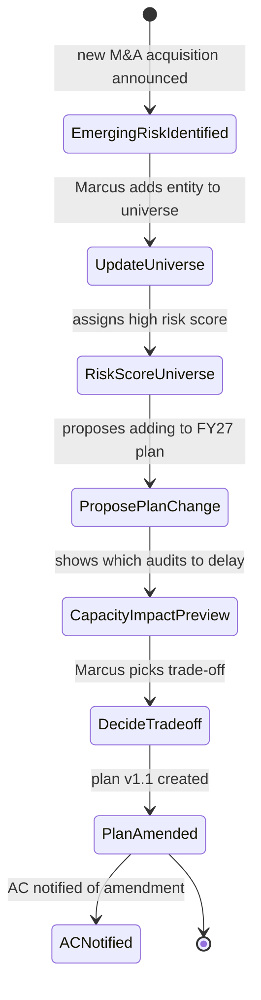
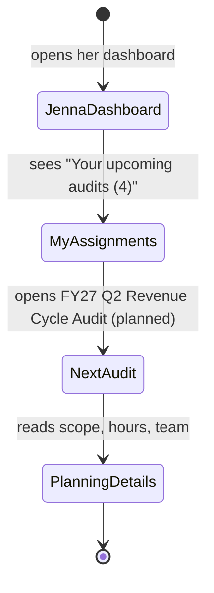

# UX — Audit Planning (Universe & Annual Plan)

> The annual plan is Marcus's top-level expression of audit strategy — what will we audit this year, with what resources, prioritized by what risk. It's built from the audit universe (the set of all auditable entities) and allocated against team capacity. UX must make the annual plan feel like a live document — adjustable as risk changes mid-year — rather than a one-time Excel export.
>
> **Feature spec**: [`features/audit-planning.md`](../features/audit-planning.md)
> **Related UX**: [`engagement-management.md`](engagement-management.md) (engagements are created from planned audits), [`apm-workflow.md`](apm-workflow.md) (APM is per-engagement; plan is tenant-wide)
> **Primary personas**: Marcus (CAE — owns plan), Kalpana (Methodology — risk methodology), Jenna (Senior — assigned from plan)

---

## 1. UX philosophy for this surface

- **Plan as a board deliverable AND a working document.** The annual plan is what Marcus presents to the Audit Committee in October; it's also what the team opens every Monday to see what's next. One surface serves both — the same data, different views (exec summary vs. work-week detail).
- **Risk is multi-dimensional; UI reduces it.** Universe entities have inherent risk, residual risk, emerging risk. Users don't want to see three scores — they want to see one prioritization. UI blends them with a transparent formula (configurable), then shows the breakdown on hover.
- **Capacity is binding, not advisory.** If Marcus tries to schedule 14,000 hours of audit work against 12,000 hours of capacity, the UI flags the over-commitment prominently. Blending capacity formula uses `Headcount × Standard Billable Hours` (per R1 feedback) with tenant-default hours (1,600/yr gov, 1,800/yr CPA) overridable per-person.
- **Plan lineage is preserved.** When Marcus shifts a planned audit from Q2 to Q3 in April because of emerging risk, that shift is logged with rationale. End-of-year reconciliation shows the plan as approved vs. plan as executed.
- **Emerging risk is first-class.** The plan isn't frozen in October. A "parking lot" of unplanned-but-watched entities sits alongside the plan; adding one to the active plan is a one-click action with rationale.

---

## 2. Primary user journeys

### 2.1 Journey: Marcus builds the annual plan



### 2.2 Journey: Mid-year risk-triggered plan change



### 2.3 Journey: Jenna sees her upcoming assignments



---

## 3. Screen — Plan home

Invoked from: top-nav → Planning → Annual Plan.

### 3.1 Layout

```
┌─ Annual Plan — FY27 (Oct 2026 - Sep 2027) ─────────────[ACTIVE v1.2]──────┐
│                                                                              │
│  Last amended: 2026-04-20 by Marcus Thompson                                │
│  [ Preview ][ Export board pack ][ Create v1.3 amendment ][ View history ] │
│                                                                              │
│  ┌─ Summary ────────────────────────────────────────────────────────────┐  │
│  │ Planned engagements: 34    Estimated hours: 12,400                    │  │
│  │ Capacity: 12,200 hrs    Utilization: 102% ⚠                            │  │
│  │ Risk coverage: High 85% · Medium 60% · Low 10%                         │  │
│  └────────────────────────────────────────────────────────────────────────┘  │
│                                                                              │
│  ┌─ Timeline view ─────────────────────────────────────────────────────┐   │
│  │                                                                        │   │
│  │             Oct   Nov   Dec   Jan   Feb   Mar   Apr   May   Jun        │   │
│  │             ──────────────────────────────────────────────────         │   │
│  │  Revenue    ▓▓▓▓▓▓                                                     │   │
│  │  AP         ▓▓▓▓▓▓                                                     │   │
│  │  Payroll           ▓▓▓▓▓▓                                              │   │
│  │  IT GC              ▓▓▓▓▓▓▓                                            │   │
│  │  Vendor             ▓▓▓▓▓                                              │   │
│  │  Fixed asset              ▓▓▓▓                                         │   │
│  │  Cash cycle                      ▓▓▓▓▓                                 │   │
│  │  SOC reliance                    ▓▓▓                                    │   │
│  │  Budget integrity                        ▓▓▓▓                          │   │
│  │  Cyber ops                               ▓▓▓▓▓▓                        │   │
│  │  ... (24 more rows)                                                    │   │
│  │                                                                         │   │
│  │              ▲                                                         │   │
│  │            Today                                                       │   │
│  └─────────────────────────────────────────────────────────────────────────┘│
│                                                                              │
│  ┌─ Capacity heatmap ───────────────────────────────────────────────────┐  │
│  │              Oct   Nov   Dec   Jan   Feb   Mar   Apr   May           │  │
│  │ Total load   92%   98%  105%  88%   91%   110% ⚠ 88%   80%          │  │
│  │ By lead:                                                              │  │
│  │  Jenna Patel 100% 105%⚠ 110%⚠ 90%   95%   100%   95%   85%          │  │
│  │  Tim Wong    88%   90%   100%  85%   85%   120%⚠ 85%   75%          │  │
│  │  ...                                                                   │  │
│  └────────────────────────────────────────────────────────────────────────┘│
│                                                                              │
│  ┌─ Parking lot (emerging, not planned) (7) ─────────────────────────────┐│
│  │ • Cloud expense governance   · Medium risk  · Added 2026-02-14         ││
│  │ • M&A integration — TargetCo · HIGH  · Added 2026-03-01   [Add to plan]││
│  │ • New GL system migration    · Medium risk  · Added 2026-03-20         ││
│  └────────────────────────────────────────────────────────────────────────┘│
└──────────────────────────────────────────────────────────────────────────────┘
```

### 3.2 View modes

Top-right toggle: [ Timeline | Table | Risk-sort | Lead-sort ]
- **Timeline**: Gantt-like as drawn above
- **Table**: flat list with all columns sortable (entity, risk, Q, hours, lead, status)
- **Risk-sort**: universe-style grouped by risk bucket
- **Lead-sort**: grouped by lead auditor

---

## 4. Screen — Audit universe

Invoked from: top-nav → Planning → Universe.

### 4.1 Layout

```
┌─ Audit Universe ──────────────────────────────────────────────────────────┐
│                                                                             │
│  187 entities  ·  42 in FY27 plan  ·  7 parking lot  ·  last reviewed 4/22│
│                                                                             │
│  ┌─ Filter ──────────────────────────────────────────────────────────────┐│
│  │ Domain: [All ▼]  Risk: [All ▼]  Coverage: [All ▼]  [+ New entity]    ││
│  └─────────────────────────────────────────────────────────────────────── ┘│
│                                                                             │
│  ┌── Grid (ag-Grid) ─────────────────────────────────────────────────────┐│
│  │ Entity                  │ Domain     │ Inherent │ Residual │ FY27   ││
│  │─────────────────────────────────────────────────────────────────────│ │
│  │ Revenue recognition     │ Financial  │ H (85)  │ M (55)   │ Q1     ││
│  │ AP procurement         │ Financial  │ H (80)  │ M (50)   │ Q1     ││
│  │ Payroll                │ Financial  │ H (75)  │ M (45)   │ Q2     ││
│  │ IT GCC — admin access  │ IT         │ H (90)  │ H (75)   │ Q2     ││
│  │ Vendor onboarding     │ Ops        │ M (65)  │ L (25)   │ Q2     ││
│  │ Fixed asset mgmt       │ Financial  │ M (60)  │ M (45)   │ Q3     ││
│  │ Cash cycle             │ Treasury   │ H (85)  │ M (50)   │ Q3     ││
│  │ SOC reliance           │ Vendor     │ M (70)  │ M (60)   │ Q3     ││
│  │ Budget integrity       │ Financial  │ M (65)  │ M (50)   │ Q4     ││
│  │ Cyber ops              │ IT         │ H (90)  │ H (70)   │ Q4     ││
│  │ Data privacy           │ Compliance │ H (85)  │ M (55)   │ —      ││
│  │ Board governance       │ Gov        │ M (55)  │ L (25)   │ —      ││
│  │ ... (175 more rows)                                                  ││
│  └──────────────────────────────────────────────────────────────────────┘ │
│                                                                             │
│  Selected: 0 entities   [Add to parking lot]  [Add to plan]  [Export]      │
└─────────────────────────────────────────────────────────────────────────────┘
```

### 4.2 Entity detail drawer

Clicking an entity opens a side drawer:

```
┌─ Revenue recognition ─────────────────────────────────────── [×]┐
│                                                                   │
│  Domain:  Financial                                              │
│  Owner:   CFO org (Lisa Chen)                                    │
│                                                                   │
│  Risk scores (last updated 2026-04-15)                           │
│    Inherent:  85 / 100 (High)                                    │
│    Residual:  55 / 100 (Medium)                                  │
│    Blended:   68 / 100 → rank #8 of 187                          │
│                                                                   │
│  Risk factors (editable by Kalpana)                              │
│    Dollar magnitude:     $1.2B annual revenue ........ 25        │
│    Complexity:           Multi-element contracts ..... 20         │
│    Prior findings:       2 findings in FY25 .......... 15         │
│    Emerging threats:     ASC 606 amendment 2025 ..... 25         │
│                                                                   │
│  Coverage history                                                 │
│    FY25: audited (3 findings, 2 Significant)                     │
│    FY24: audited (1 finding, Minor)                              │
│    FY23: risk-assessed only                                      │
│                                                                   │
│  Related engagements                                              │
│    FY25 Revenue Cycle Audit [open]                                │
│    FY27 Revenue Cycle Audit (planned) [view]                      │
│                                                                   │
│  Notes                                                            │
│  [ New SEC comment letter Feb 2026 on revenue recognition.  ]    │
│                                                                   │
│  [ Edit ]  [ Update risk ]  [ Add to plan ]  [ Add to parking ]  │
└───────────────────────────────────────────────────────────────────┘
```

### 4.3 Risk scoring interactions

- **Update risk** action opens risk methodology form with editable weighted-factor inputs; blended score recomputed live.
- Risk factors and weights are defined by Kalpana at tenant level; entity-level risk scoring uses those weights.
- Any risk score change is logged with rationale (required, 50+ chars) and preserved in the entity's risk history timeline.

---

## 5. Screen — Plan authoring

Invoked from: Plan home → Create new plan (for next fiscal year) OR Create amendment (mid-year).

### 5.1 Layout

Drag-drop tableau: universe (source) → plan (target) across time columns.

```
┌─ Plan authoring — FY27 Annual Plan ─────────────────[DRAFT v0.3]─ [Save]──┐
│                                                                              │
│  ┌─ Left: Universe (filterable) ──────────┐ ┌─ Right: Plan tableau ──────┐ │
│  │ Search [  🔍 _________________ ]        │ │                             │ │
│  │                                          │ │   Q1    Q2    Q3    Q4     │ │
│  │ Rank │ Entity              │ Risk        │ │  ─────────────────────     │ │
│  │  1   │ Revenue recognition │ H (85)      │ │ Revenue(400h) Payroll(480) │ │
│  │  2   │ Cyber ops           │ H (90)      │ │ AP (480h)   IT GC (520h)   │ │
│  │  3   │ IT GC admin access  │ H (90)      │ │                             │ │
│  │  4   │ Cash cycle         │ H (85)      │ │     Payroll   Cash cycle    │ │
│  │  5   │ Data privacy        │ H (85)      │ │     ^         ^             │ │
│  │  6   │ Payroll             │ H (75)      │ │     |         |             │ │
│  │  7   │ AP procurement     │ H (80)      │ │     drag       drag         │ │
│  │  8   │ ... (180 more)                    │ │                             │ │
│  │                                          │ │                             │ │
│  └──────────────────────────────────────────┘ └─────────────────────────────┘│
│                                                                              │
│  ┌─ Metrics ──────────────────────────────────────────────────────────────┐│
│  │ 34 engagements    12,400 hrs    Capacity: 12,200    Util: 102% ⚠       ││
│  │ Risk coverage:  H: 85% · M: 60% · L: 10%                                ││
│  └────────────────────────────────────────────────────────────────────────┘│
│                                                                              │
│  [Submit for AC approval]                                                    │
└──────────────────────────────────────────────────────────────────────────────┘
```

### 5.2 Drag-drop mechanics

- **Drag entity → quarter column**: opens a quick-add dialog for engagement name, estimated hours, lead, scope note.
- **Drag entity → plan**: same, but between quarters updates timing.
- **Remove from plan**: right-click → Remove (returns to universe).
- **Hours cell**: click to edit; live updates capacity metrics.
- **Capacity alert**: whenever util > 100% for any quarter, cell turns red and the summary metric flashes.

### 5.3 Quick-add dialog

```
┌─ Add to plan — Revenue recognition ───────────────────────────────────┐
│                                                                         │
│  Engagement name:  [ FY27 Q1 Revenue Cycle Audit ______________ ]     │
│  Quarter:          [ Q1 ▼ ]   Target weeks:  [ Weeks 2-7 ▼ ]          │
│  Estimated hours:  [ 400 ]                                             │
│  Lead auditor:     [ Jenna Patel ▼ ]                                   │
│  Secondary team:   [ + Add ]                                           │
│  Scope note:       [ ASC 606 focus; complex deferred revenue ]        │
│                                                                         │
│  Packs (default, adjustable per engagement later):                     │
│   [x] GAGAS-2024.1   [x] COSO-2013                                     │
│                                                                         │
│                                            [ Cancel ]  [ Add to plan ]│
└─────────────────────────────────────────────────────────────────────────┘
```

---

## 6. Plan approval flow

- Plan state: DRAFT → SUBMITTED_FOR_AC → APPROVED → ACTIVE → (AMENDED → APPROVED_AMENDMENT → ACTIVE)
- Submit opens a form Marcus fills out: executive summary, risk-based rationale, capacity narrative, AC meeting date.
- On approval (recorded by Marcus with attestation + date of AC meeting), plan becomes immutable except via amendments.
- Amendments create a new version (v1.1, v1.2); diff against previous version available.

---

## 7. Plan v.s. actual view

Invoked from: Plan home → History → Plan v.s. Actual.

```
┌─ Plan v.s. actual — FY26 (closed) ───────────────────────────────────────┐
│                                                                            │
│  34 planned engagements                                                    │
│   • 32 completed                                                           │
│   •  1 deferred (Cyber ops → FY27)                                         │
│   •  1 cancelled (Budget integrity — de-scoped)                            │
│                                                                            │
│  Planned hours: 12,800   Actual: 13,420   Variance: +4.8%                 │
│                                                                            │
│  Added post-plan (2 amendments):                                           │
│   • M&A integration TargetCo  · Added 2026-03-15  · 620 hrs               │
│   • Data privacy audit (SEC)  · Added 2026-05-01  · 480 hrs               │
│                                                                            │
│  [Export as PDF]  [View detailed reconciliation]                           │
└────────────────────────────────────────────────────────────────────────────┘
```

---

## 8. Loading, empty, error states

| State | Treatment |
|---|---|
| First-time tenant, empty universe | Empty: "The audit universe is the set of all auditable entities. Start by importing from a spreadsheet or adding entities manually. [Import] [+ New entity]" |
| No plan for fiscal year | Plan home: "No plan for FY27 yet. Create one from the universe. [Create plan]" |
| Over-capacity warning | Non-blocking; persistent amber banner until resolved. "Q2 is over capacity by 320 hours. [Resolve]" opens a suggestion dialog. |
| Plan submission with gaps | Validation: "Plan has 2 engagements without assigned leads. [View]". Submit button disabled until resolved. |
| Concurrent plan editing (Marcus + Kalpana) | Soft lock per plan; "Kalpana is editing. You'll be notified when she's done." Universe edits concurrent-safe. |
| Risk score update triggers plan re-rank | Banner: "12 entities changed risk tier. [Review impact on plan]" — doesn't auto-adjust plan; Marcus reviews. |

---

## 9. Responsive behavior

- **xl/lg**: Full layouts as drawn.
- **md**: Timeline and capacity heatmap become horizontally-scrollable. Universe grid simplifies columns.
- **sm**: Read-only view of plan (timeline collapsed into vertical list). Editing deferred.

---

## 10. Accessibility

- Timeline is also available as a `<table>` with semantic rows/cols for screen readers.
- Risk scores always include text labels ("High, 85 of 100").
- Drag-drop has keyboard-alternative: "Add to plan" button on each universe row opens the quick-add dialog.
- Capacity heatmap cells have `aria-label` summarizing cell value and status.
- Risk factor editing uses proper `<fieldset>` and `<label>` associations.

---

## 11. Keyboard shortcuts

Plan home:

| Shortcut | Action |
|---|---|
| `/` | Focus filter |
| `1-4` | Switch view mode |
| `e` | Toggle edit mode (if permitted) |
| `j` / `k` | Next / prev engagement in timeline |
| `Enter` | Open engagement |

Universe grid:

| Shortcut | Action |
|---|---|
| `n` | New entity |
| `r` | Update risk on selected |
| `Shift+A` | Add selected to plan |
| `Shift+P` | Add selected to parking lot |

---

## 12. Microinteractions

- **Entity dragged to plan**: target cell highlights; on drop, brief scale-bounce of the new engagement card; capacity metrics animate to new values.
- **Capacity over 100%**: quarterly cell transitions from green → amber → red with sustained pulse while over-capacity.
- **Plan approved**: confetti-free ceremonial overlay (large checkmark + "Plan FY27 approved"); plan state badge flips from "SUBMITTED" to "APPROVED" with 400ms animation.

---

## 13. Analytics & observability

- `ux.plan.viewed { fiscal_year, view_mode }`
- `ux.universe.entity_created { domain, risk_category }`
- `ux.universe.risk_updated { entity_id, from_tier, to_tier, factor_changes }`
- `ux.plan.engagement_added_to_plan { entity_id, fiscal_year, quarter, hours }`
- `ux.plan.capacity_warning_shown { fiscal_year, quarter, over_percent }`
- `ux.plan.submitted_for_ac { fiscal_year, version }`
- `ux.plan.approved { fiscal_year, version, ac_meeting_date }`
- `ux.plan.amendment_created { fiscal_year, from_version, to_version, reason }`
- `ux.plan.actual_vs_plan_viewed { fiscal_year }`

KPIs:
- **Annual plan approval lead time** (Draft → ACTIVE: target 21 days)
- **Amendment frequency** (target ≤3 amendments/year — excessive suggests planning issues)
- **Plan adherence** (% planned engagements completed in planned quarter: target ≥85%)
- **Capacity accuracy** (planned vs actual hours within ±10%: target 75% of engagements)
- **Risk coverage** (% of H-risk universe entities audited within 3 years: target 100%)

---

## 14. Open questions / deferred

- **ML-assisted risk scoring**: deferred to v2.1.
- **Multi-year plan view (3-year rolling)**: deferred to MVP 1.5.
- **Cross-tenant risk benchmarking** (anonymized): deferred to v2.2+.
- **Resource plan beyond engagements** (QA hours, training, special projects): MVP 1.0 plans engagements only; ancillary time deferred.
- **Scenario planning** ("what if X happens?"): deferred to v2.1.

---

## 15. References

- Feature spec: [`features/audit-planning.md`](../features/audit-planning.md)
- Related UX: [`engagement-management.md`](engagement-management.md), [`apm-workflow.md`](apm-workflow.md)
- Data model: [`data-model/universe.md`](../data-model/universe.md), [`data-model/plan.md`](../data-model/plan.md)
- API: [`api-catalog.md §3.3`](../api-catalog.md) (`plan.*`, `universe.*` tRPC namespaces)

---

*Last reviewed: 2026-04-22. Phase 6 (UX) draft — pending external review.*
