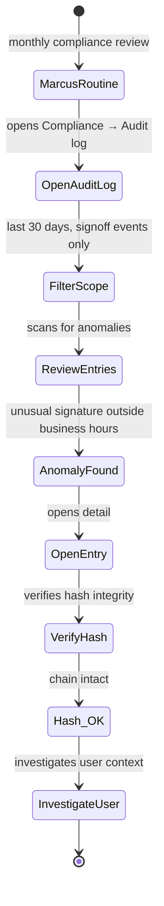
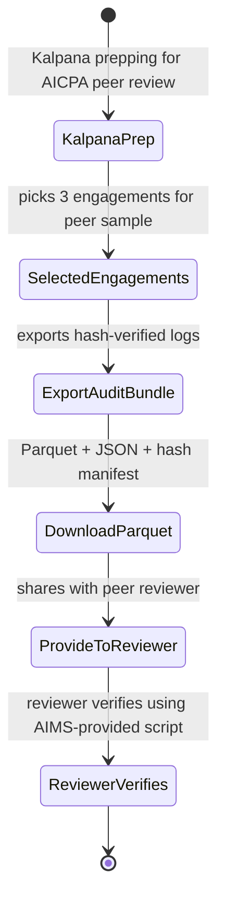

# UX — Audit Trail & Compliance

> The audit log is the cryptographically-verifiable record of what happened: who did what, when, to which resource, with what outcome. Hash-chained (SHA-256). Distinct from the "activity feed" in [notifications-and-activity.md](notifications-and-activity.md), which is for human orientation. Audit log is for compliance, legal discovery, and peer review. UX goal: make compliance surfaces legible to non-technical users (Marcus, Sofia, external peer reviewer) without compromising verifiability.
>
> **Feature spec**: [`features/audit-trail-and-compliance.md`](../features/audit-trail-and-compliance.md)
> **Related UX**: [`notifications-and-activity.md`](notifications-and-activity.md), [`qa-independence-cpe.md`](qa-independence-cpe.md) (peer review uses audit-log exports)
> **Primary personas**: Marcus (reviews periodically), Sofia (tenant admin — compliance), Kalpana (peer review prep), Ravi (platform-level)

---

## 1. UX philosophy

- **Human-legible by default.** Audit log entries read as English sentences first, with the structured data beneath. "Marcus signed report R-2026-0012 on April 22, 2026 at 10:47 AM EDT using MFA."
- **Hashes are visible but not scary.** Cryptographic provenance (hash, previous hash, signature) is always accessible via "Verify" action — but hidden from casual view.
- **Scoping is mandatory.** Audit log is huge. UX forces users to scope by date range, resource type, or user before returning results.
- **Export is first-class.** The compliance use case is export + hash verify in an external tool. UX makes that export path clean and documented.
- **Immutability is a feature — users must feel it.** Entries cannot be deleted or edited. UX reinforces this through language ("permanent record").

---

## 2. Primary user journeys

### 2.1 Journey: Marcus periodic review



### 2.2 Journey: Peer review prep



### 2.3 Journey: Sofia investigates potential breach

```mermaid
stateDiagram-v2
    [*] --> IncidentReport: Sofia notified of suspicious login
    IncidentReport --> OpenLog: opens audit log scoped to user
    OpenLog --> ChronologyView: Sofia sees all actions chronologically
    ChronologyView --> NormalActivity: actions look normal
    NormalActivity --> CheckSession: session data looks normal
    CheckSession --> FalseAlarm: no incident; archive investigation note
    FalseAlarm --> [*]
```

---

## 3. Screen — Audit log viewer

Invoked from: Admin → Compliance → Audit log, OR from individual resource detail → "View audit log for this resource."

### 3.1 Layout

```
┌─ Audit log ─────────────────────────────────────────────────────────────┐
│                                                                            │
│  Scope this search (required for performance):                            │
│  ┌────────────────────────────────────────────────────────────────────┐  │
│  │ Date:   [ Last 30 days ▼ ]    From [ 2026-03-22 ] to [ 2026-04-22 ]│  │
│  │ User:   [ All ▼ ]                                                   │  │
│  │ Action: [ All ▼ ]  or specific: [signoff · delete · export · ...]  │  │
│  │ Resource:  [ All ▼ ]  or specific resource ID                       │  │
│  │ [ Apply ]                                                            │  │
│  └──────────────────────────────────────────────────────────────────────┘  │
│                                                                            │
│  1,847 events match                              [Download Parquet+hashes]│
│                                                                            │
│  ┌─ 2026-04-22 ──────────────────────────────────────────────────────┐  │
│  │                                                                       │  │
│  │ 10:47 AM  Marcus Thompson signed report R-2026-0012                   │  │
│  │           Finding fingerprint: F-2026-0042 · F-2026-0038 · ...        │  │
│  │           MFA: TOTP · IP 74.92.0.48 (New York, NY)                    │  │
│  │           Hash: sha256:a4c2f1bc9a...  [Verify] [Detail]               │  │
│  │                                                                       │  │
│  │ 10:45 AM  Marcus Thompson opened report R-2026-0012                   │  │
│  │           IP 74.92.0.48                                                │  │
│  │                                                                       │  │
│  │ 10:44 AM  Jenna Patel submitted report R-2026-0012 for signoff        │  │
│  │           Hash: sha256:58e3f6...  [Verify] [Detail]                   │  │
│  │                                                                       │  │
│  │ ... (more entries today)                                              │  │
│  └───────────────────────────────────────────────────────────────────────┘│
│                                                                            │
│  ┌─ 2026-04-21 ──────────────────────────────────────────────────────┐  │
│  │ ...                                                                   │  │
│  └───────────────────────────────────────────────────────────────────────┘│
└────────────────────────────────────────────────────────────────────────────┘
```

### 3.2 Entry detail (expanded)

Clicking an entry:

```
┌─ Event detail ────────────────────────────────────────── [×] ┐
│                                                                 │
│  Event ID:        evt_4af28c9b...                              │
│  Action:          report.signoff                               │
│  Actor:           user_marcus_thompson (Marcus Thompson, CAE)  │
│  Resource:        report R-2026-0012 (Engagement FY26 Q1 Rev)  │
│  Timestamp:       2026-04-22 10:47:23.442 EDT                  │
│                                                                 │
│  Context                                                        │
│   IP:              74.92.0.48                                   │
│   User agent:      Chrome 128.0.0 / macOS 14                   │
│   Session ID:      ses_92f... (MFA within 2 min)               │
│   Geo:             New York, NY                                 │
│                                                                 │
│  Outcome:          SUCCESS                                      │
│  Business data:    fingerprints of report content hash          │
│                                                                 │
│  ┌─ Cryptographic provenance ─────────────────────────────┐    │
│  │ Content hash:   sha256:a4c2f1bc9a7c6e0d1f2...            │    │
│  │ Chain prev:     sha256:58e3f6ac23e...                     │    │
│  │ Signature:      ecdsa:MEUCIQD...  (AIMS platform sig)     │    │
│  │                                                             │    │
│  │ [ Verify this entry ]  [ Verify chain around it ]         │    │
│  └─────────────────────────────────────────────────────────────┘    │
│                                                                 │
│  Related entries (around this event)  [Show]                    │
└─────────────────────────────────────────────────────────────────┘
```

### 3.3 Verify action

Clicking `Verify`:

```
┌─ Verification ────────────────────────────────────────────────┐
│                                                                  │
│  Verifying event evt_4af28c9b...                                │
│                                                                  │
│  ✓ Content hash is correct                                      │
│  ✓ Chain position is consistent (prev hash matches)             │
│  ✓ Platform signature validates against public key              │
│  ✓ Entry cannot have been modified                              │
│                                                                  │
│  Verification passed.                                           │
│                                                                  │
│  [ Download verification report ]                               │
└──────────────────────────────────────────────────────────────────┘
```

Verification is cryptographic, not advisory. If the hash chain were ever broken (would require platform compromise), UX shows a red banner and escalates to AIMS SRE.

---

## 4. Resource-scoped audit log

Every resource (finding, WP, CAP, report, APM) has an "Audit log" link in its detail page. Clicking opens the viewer pre-filtered to that resource:

```
"Audit log — F-2026-0042 · all events (73)"
```

Common use: "who changed this finding's classification?" one click from the finding header.

---

## 5. Export & peer review bundle

### 5.1 Export dialog

Invoked from: audit log viewer → "Download Parquet+hashes."

```
┌─ Export audit log ─────────────────────────────────────────────────┐
│                                                                      │
│  Scope (inherited from current filter):                             │
│   Date: 2026-03-22 → 2026-04-22                                     │
│   Users: all                                                        │
│   Actions: all                                                      │
│   Resources: all                                                    │
│                                                                      │
│  1,847 events · approximate bundle size 4.2 MB                      │
│                                                                      │
│  Format:                                                             │
│   [x] Parquet file (analytical)                                     │
│   [x] JSON Lines (.jsonl)                                           │
│   [x] Hash manifest file (for verification)                          │
│   [x] Verification script (Python)                                   │
│   [ ] PDF (human-readable summary)                                  │
│                                                                      │
│  Encryption: Your public key (upload PEM) / AIMS-provided key       │
│                                                                      │
│                                       [ Cancel ]  [ Generate ]    │
└──────────────────────────────────────────────────────────────────────┘
```

Export generates asynchronously; Sofia notified when ready (email + in-app).

### 5.2 Peer review prep bundle

One-click path for peer review:
- Select engagements
- AIMS generates: audit log export, APM PDF, report PDFs, WP PDFs, QA evidence
- All in one encrypted bundle with verification script

```
┌─ Peer review bundle ─────────────────────────────────────────────┐
│                                                                    │
│  Engagements in bundle (3):                                       │
│   • FY26 Q1 Revenue Cycle Audit                                   │
│   • FY26 Payroll Audit                                            │
│   • FY26 IT GCC Audit                                             │
│                                                                    │
│  Inclusions:                                                       │
│   [x] Audit logs (scoped)                                         │
│   [x] APM PDFs                                                    │
│   [x] Report PDFs                                                 │
│   [x] Work paper PDFs (select)                                    │
│   [x] QA evidence                                                 │
│                                                                    │
│  Approximate size: 214 MB                                          │
│                                                                    │
│  Reviewer:  [ AICPA Peer Review — Jane Smith ]                   │
│  Access:    Read-only, expires in 30 days                         │
│                                                                    │
│                               [ Cancel ]  [ Generate bundle ]    │
└────────────────────────────────────────────────────────────────────┘
```

---

## 6. Compliance dashboard

Invoked from: Admin → Compliance.

### 6.1 Layout

Single-screen overview of compliance state:

```
┌─ Compliance dashboard ───────────────────────────────────────────────┐
│                                                                         │
│  ┌─ Standing program status ────────────────────────────────────────┐│
│  │ GAGAS peer review          Due 2027-Q3         47 months from now ││
│  │ SOC 2 Type II               Active to 2027-01      9 months to go ││
│  │ ISO 27001                    Active to 2026-10        5 months ago ││
│  │ CPE compliance (team)         94% on track                         ││
│  │ Independence (YTD)             100% declared                        ││
│  └─────────────────────────────────────────────────────────────────────┘│
│                                                                         │
│  ┌─ Audit log health ─────────────────────────────────────────────┐  │
│  │ Hash chain:          ✓ Verified end-to-end (last check 4h ago) ││
│  │ Entries (30d):       12,043                                     ││
│  │ Storage used:         142 MB (archived to S3 at 90 days)       ││
│  │ Retention:           7 years per tenant policy                  ││
│  └─────────────────────────────────────────────────────────────────┘│
│                                                                         │
│  ┌─ Recent compliance events ─────────────────────────────────────┐  │
│  │ Apr 18  Peer review prep generated (3 engagements)                ││
│  │ Apr 15  SOC 2 auditor viewed support-mode logs for Tenant X       ││
│  │ Apr 10  Data export completed for Sofia Rodriguez                  ││
│  │ ... (more)                                                         ││
│  └─────────────────────────────────────────────────────────────────────┘│
│                                                                         │
│  [ View full audit log ]  [ Generate peer review bundle ]              │
└─────────────────────────────────────────────────────────────────────────┘
```

---

## 7. Retention & archival visibility

Per feature spec, audit log retention is tenant-configurable (default 7 years). Archived entries (older than 90 days) are stored in S3 Glacier with same hash chain.

UX:
- Viewer indicates when an entry is from archive ("Archived — fetch takes 3-5 minutes")
- On click, UI shows loading with ETA
- Fetching preserves hash chain verification

---

## 8. Loading, empty, error states

| State | Treatment |
|---|---|
| No scope applied | "Please apply a scope to search the audit log." Large filter controls, no results listed. |
| No matches | "No events match your scope. Try expanding the date range or removing filters." |
| Scope too broad (>100k results) | "Your scope returns too many results (est. 450,000 events). Please narrow by date or user." |
| Verification fails (hypothetical) | Red banner: "Verification failed for this entry. AIMS SRE has been automatically notified. [Details]" |
| Archive fetch timeout | "Archive fetch is taking longer than expected. We'll email you when it's ready." |

---

## 9. Responsive behavior

Audit log viewer is desktop-first. Mobile shows read-only list, no verify/export actions.

---

## 10. Accessibility

- Entry list is a proper `<ol>` with semantic timestamp elements
- Verify action announces result via `aria-live` (e.g., "Verification passed")
- Hashes in detail view have copy-to-clipboard buttons with `aria-label`
- Filter controls are all labeled form elements

---

## 11. Keyboard shortcuts

Audit log viewer:

| Shortcut | Action |
|---|---|
| `/` | Focus filter |
| `j` / `k` | Next / prev entry |
| `v` | Verify focused entry |
| `d` | Open detail drawer |
| `e` | Export (with current scope) |

---

## 12. Microinteractions

- **Verify success**: checkmark fades in with 300ms scale animation, green color
- **Filter applied**: results refresh with 200ms fade; count animates to new value
- **Export generation progress**: inline progress bar updating in real-time; when complete, desktop notification

---

## 13. Analytics & observability

- `ux.audit_log.opened { scope_filters }`
- `ux.audit_log.entry_viewed { event_type }`
- `ux.audit_log.verify_clicked { result }`
- `ux.audit_log.exported { format, entry_count, encryption }`
- `ux.audit_log.peer_review_bundle_generated { engagement_count, size_mb }`
- `ux.audit_log.archive_fetched { age_days }`

KPIs:
- **Verification success rate** (target: 100%)
- **Peer review prep time** (click to bundle ready; target p90 ≤ 15 min for 3-engagement bundle)
- **Monthly compliance dashboard views by Marcus** (target ≥1, indicates active oversight)

---

## 14. Open questions / deferred

- **Blockchain anchoring of hash chain (optional)**: deferred to v2.2+
- **SIEM integration (audit-log-as-stream to Splunk etc.)**: MVP 1.5
- **Anomaly detection** (ML flags unusual patterns): deferred to v2.1
- **Multi-tenant cross-reference for AIMS SRE investigations**: behind break-glass, UX deferred

---

## 15. References

- Feature spec: [`features/audit-trail-and-compliance.md`](../features/audit-trail-and-compliance.md)
- Related UX: [`notifications-and-activity.md`](notifications-and-activity.md), [`qa-independence-cpe.md`](qa-independence-cpe.md)
- ADRs: `references/adr/0008-audit-log-hash-chain.md`
- API: [`api-catalog.md §3.17`](../api-catalog.md) (`auditLog.*`)

---

*Last reviewed: 2026-04-22. Phase 6 (UX) draft — pending external review.*
