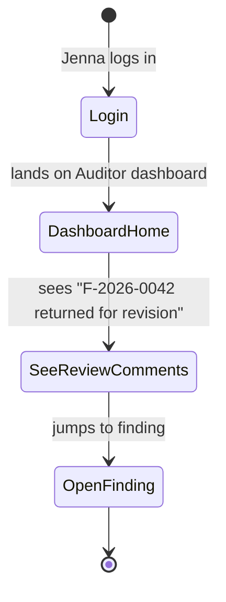
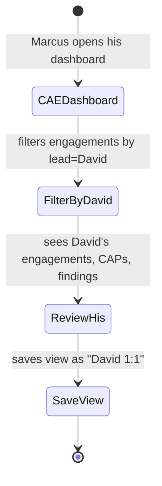
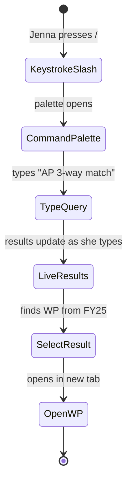

# UX — Dashboards & Search

> Dashboards are where most users start their day; search is where they go when they know what they want but not where it lives. AIMS ships 7 canned dashboards (Marcus's CAE view, David's supervisor view, Jenna's auditor view, Lisa's auditee view, Kalpana's QA view, Sofia's admin view, Ravi's platform view) plus tenant-wide search that spans findings, engagements, WPs, CAPs, PBC items, users.
>
> **Feature spec**: [`features/dashboards-and-search.md`](../features/dashboards-and-search.md)
> **Related UX**: [`notifications-and-activity.md`](notifications-and-activity.md) (dashboard surfaces embed activity + notifications)
> **Primary personas**: All users — each role has a tailored dashboard

---

## 1. UX philosophy

- **Role-specific first screens.** On login, each user lands on the dashboard designed for their role. Customization is secondary.
- **Actionable > informational.** Every widget either shows something the user must act on (overdue CAP, review queue) or gives them orientation (progress against plan). Decorative metrics minimized.
- **Consistent spatial anchors.** Same positions on all dashboards for similar concerns: top-left = what needs my action; right = progress/trend; bottom = team/peer view.
- **Search is universal and fast.** `/` opens command-palette-style global search from anywhere. Results in <500ms. Typed scoping (e.g., `F-` prefix finds findings).
- **Saved views are first-class.** Common filters become bookmarkable URLs; list screens remember last filter per user.

---

## 2. Primary user journeys

### 2.1 Journey: Jenna's morning check-in



### 2.2 Journey: Marcus prepping for 1:1 with David



### 2.3 Journey: Jenna searches for prior-year work



---

## 3. Screens — Role dashboards

### 3.1 Auditor dashboard (Jenna)

```
┌─ Welcome back, Jenna ──────────────────────────────────── 2026-04-22 9:15 ┐
│                                                                              │
│ ┌─ Action required (5) ──────────────────────────────┐ ┌─ This week ───┐  │
│ │                                                      │ │                │  │
│ │ 🔴 F-2026-0042 returned for revision by David       │ │ M  T  W  T  F  │  │
│ │    [Open]                                            │ │    █  █  ██ ██ │  │
│ │                                                      │ │ (hours logged) │  │
│ │ 🟡 PBC overdue: Revenue policy (Lisa, 2d)           │ │                 │  │
│ │    [Open PBC]                                        │ │ 18.5 / 40 h   │  │
│ │                                                      │ │ this week      │  │
│ │ 🟡 WP-0093 awaiting your review                      │ │                 │  │
│ │    [Open WP]                                         │ │ [Log time]    │  │
│ │                                                      │ │                 │  │
│ │ 🟡 CAP-042-01 update requested by David              │ └────────────────┘ │
│ │    [Open CAP]                                        │                    │
│ │                                                      │ ┌─ My CPE ──────┐ │
│ │ ⓘ Your independence declaration for Payroll           │ │                │ │
│ │    audit is due                                      │ │ 42 / 80 hrs   │ │
│ │    [Declare]                                         │ │ biennium ends  │ │
│ └──────────────────────────────────────────────────────┘ │ 2027-09-30    │ │
│                                                         │                 │ │
│ ┌─ Engagements assigned to me (4) ───────────────────┐ │ [Log CPE]      │ │
│ │                                                      │ │                │ │
│ │ • FY26 Q1 Revenue Cycle  · Fieldwork · 65%          │ └────────────────┘ │
│ │ • FY26 Q1 AP Procurement · Planning · APM draft     │                    │
│ │ • FY26 Payroll           · Scheduled · May 1        │ ┌─ Recent ─────┐ │
│ │ • FY26 Vendor Onboarding · Scheduled · June 15      │ │                │ │
│ │                                                      │ │ Live activity  │ │
│ └──────────────────────────────────────────────────────┘ │ (last 10       │ │
│                                                         │  items)         │ │
│                                                         │                 │ │
│                                                         └────────────────┘ │
└──────────────────────────────────────────────────────────────────────────────┘
```

### 3.2 Supervisor dashboard (David)

Emphasis on review queue, team CAPs, engagement timeline:

```
┌─ Supervisor dashboard — David ────────────────────────────────────────────┐
│                                                                              │
│ ┌─ Review queue (8) ──────────────────────────┐ ┌─ Team CAPs ──────────┐  │
│ │ 🔴 F-2026-0042 (Jenna) revision-ready       │ │ 12 open              │  │
│ │ 🟡 WP-0093 (Jenna) signoff                  │ │  4 overdue           │  │
│ │ 🟡 APM §4 (Jenna) review                    │ │  [View all]          │  │
│ │ ... (5 more)                                 │ └──────────────────────┘  │
│ └──────────────────────────────────────────────┘                            │
│                                                                              │
│ ┌─ My engagements (6) ───────────────────────────────────────────────┐   │
│ │ Engagement              Phase       Progress   Next milestone        │   │
│ │ FY26 Q1 Revenue Cycle   Fieldwork   65%        Findings draft        │   │
│ │ FY26 Q1 AP              Planning    APM 40%    APM submission        │   │
│ │ FY26 Payroll            Scheduled   0%         Kickoff May 1         │   │
│ │ ... (3 more)                                                          │   │
│ └───────────────────────────────────────────────────────────────────────┘  │
│                                                                              │
│ ┌─ Team utilization ──────────────────────────────────────────────────┐  │
│ │ [ Bar chart: Jenna 85%, Tim 92%, Alex 78%, ... ]                      │  │
│ └───────────────────────────────────────────────────────────────────────┘  │
└──────────────────────────────────────────────────────────────────────────────┘
```

### 3.3 CAE dashboard (Marcus)

Strategic view:

```
┌─ CAE dashboard — Marcus ──────────────────────────────────────────────────┐
│                                                                              │
│ ┌─ Annual plan execution ─────────────────────┐ ┌─ Open CAPs by tier ──┐  │
│ │ FY26                                          │ │ HIGH:  12 (3 overdue)│  │
│ │ [▓▓▓▓▓▓▓▓░░░░] 18 of 34 complete · 53%       │ │ MED:   47 (12 over)  │  │
│ │ On plan · behind schedule on 2 engagements    │ │ LOW:   27 (5 over)   │  │
│ └───────────────────────────────────────────────┘ └──────────────────────┘  │
│                                                                              │
│ ┌─ Findings pipeline ─────────────────────────────────────────────────┐  │
│ │ Draft: 8   In Review: 12  Awaiting Resp: 23  Responded: 41  Published│  │
│ │ 137                                                                     │  │
│ │ Materiality: 0 Material · 5 Significant · 32 Minor (this cycle)        │  │
│ └───────────────────────────────────────────────────────────────────────┘  │
│                                                                              │
│ ┌─ Team ─────────────────┐ ┌─ My approvals queue (4) ───────────────┐   │
│ │ CPE compliance 94%      │ │ APM FY26 Payroll (signoff)              │   │
│ │ Utilization 87%         │ │ Report FY25 IT GCC (signoff)            │   │
│ │ Peer review due 2027-Q3 │ │ Classification change F-2026-0056       │   │
│ └─────────────────────────┘ │ Pack annotation (override)              │   │
│                             └──────────────────────────────────────────┘   │
│                                                                              │
│ ┌─ Risk profile ──────────────────────────────────────────────────────┐  │
│ │ Universe heatmap · risks by residual rating                          │  │
│ └───────────────────────────────────────────────────────────────────────┘  │
└──────────────────────────────────────────────────────────────────────────────┘
```

### 3.4 Auditee dashboard (Lisa)

Narrow — her audit items, her CAPs:

```
┌─ Your audit — FY26 Q1 Revenue Cycle Audit ────────────────────────────────┐
│                                                                              │
│  Audit contacts: Jenna Patel (Senior), David Chen (Supervisor)             │
│                                                                              │
│  ┌─ PBC — items to provide (4 overdue, 9 due this week) ─────────────────┐│
│  │ [List of items with status and due dates]                              ││
│  │                                                    [Open PBC inbox →]  ││
│  └─────────────────────────────────────────────────────────────────────────┘│
│                                                                              │
│  ┌─ Findings — awaiting your response (3) ───────────────────────────────┐│
│  │ F-2026-0042 · Weak SoD in AP    · Significant · Due 2026-04-15 [Open] ││
│  │ F-2026-0038 · Missing IT GC     · Material    · Due 2026-04-15 [Open] ││
│  │ F-2026-0031 · Incomplete vendor · Minor       · Due 2026-04-15 [Open] ││
│  └─────────────────────────────────────────────────────────────────────────┘│
│                                                                              │
│  ┌─ CAPs — yours (6 active) ─────────────────────────────────────────────┐│
│  │ [List of CAPs with milestone status]                                   ││
│  │                                                    [View all →]        ││
│  └─────────────────────────────────────────────────────────────────────────┘│
│                                                                              │
│  [Message audit team]                                                        │
└──────────────────────────────────────────────────────────────────────────────┘
```

### 3.5 Other dashboards

- **QA dashboard (Kalpana)**: QA review queue, pack compliance metrics, annotation queue
- **Admin dashboard (Sofia)**: user activity, seat usage, SSO health, setup checklist
- **Platform admin dashboard (Ravi)**: tenant list, incident console, SQS health, scheduled pack releases — covered in [platform-admin-and-board-reporting.md](platform-admin-and-board-reporting.md)

---

## 4. Dashboard customization

Phase 1 (MVP 1.0): **fixed layouts per role** with widget-level show/hide only.

Phase 2 (MVP 1.5+): drag-drop widget placement, custom dashboards.

For now, customization limited to:
- Show/hide individual widgets (eye icon on each)
- "Reset to default" action
- Widget-level filter preferences (e.g., "Action required" limited to CRITICAL only)

---

## 5. Screen — Universal search

Invoked from: `/` key anywhere, OR search box in top nav.

### 5.1 Layout

```
┌─ Search ──────────────────────────────────────────────── [Esc] ─┐
│  [ 🔍 AP 3-way match _____________________________________ ]     │
│                                                                   │
│  Filter: [ All ▼ ]                                                │
│                                                                   │
│  ┌─ Findings (4) ───────────────────────────────────────────┐   │
│  │ F-2026-0042  Weak SoD in AP approval      FY26 Q1 Revenue │   │
│  │ F-2025-0033  AP 3-way match failures      FY25 Q2          │   │
│  │ F-2024-0018  Weak AP controls             FY24             │   │
│  │ ... (1 more)                                                │   │
│  └─────────────────────────────────────────────────────────────┘   │
│                                                                   │
│  ┌─ Work papers (7) ────────────────────────────────────────┐   │
│  │ WP-0089  AP 3-way match testing      FY26 Q1 Revenue     │   │
│  │ WP-0085  AP vendor master            FY26 Q1 Revenue     │   │
│  │ ... (5 more)                                                │   │
│  └─────────────────────────────────────────────────────────────┘   │
│                                                                   │
│  ┌─ CAPs (2) ────────────────────────────────────────────────┐  │
│  │ CAP-042-01  Update AP config (IN PROGRESS)                 │  │
│  │ ... (1 more)                                                │  │
│  └─────────────────────────────────────────────────────────────┘   │
│                                                                   │
│  ┌─ People (1) ──────────────────────────────────────────────┐  │
│  │ Lisa Chen — CFO, NorthStar (auditee)                        │  │
│  └─────────────────────────────────────────────────────────────┘   │
│                                                                   │
│  ↑↓ navigate   ↵ open   ⌘+↵ open new tab                         │
└───────────────────────────────────────────────────────────────────┘
```

### 5.2 Search syntax

- Prefix match: `F-` finds findings, `WP-` work papers, `CAP-` CAPs
- Tag search: `status:overdue owner:lisa` structured filters
- Phrase search: quoted `"rev recognition"` exact phrase
- Fiscal year: `fy:2025`
- Role scope: `@lisa` for resources owned by Lisa

### 5.3 Results

- Typed grouped (findings, WPs, CAPs, engagements, people, etc.)
- Best-match first within each group
- Keyboard-first navigation
- Full-text search backed by Postgres trigram + dedicated search index (per feature spec)

---

## 6. Screen — Filtered list views (saved views)

Any list screen (findings, engagements, CAPs, WPs) has a filter bar. Filter combinations can be saved:

### 6.1 Save filter

```
┌─ Save this view ─────────────────────────┐
│  View name: [ David 1:1 preparation ]    │
│  Scope:  [ Just me ▼ ] (or share)        │
│                                            │
│                      [ Save ]  [ Cancel ] │
└────────────────────────────────────────────┘
```

Saved views show in the left rail of each list screen; clickable to apply filter.

### 6.2 Shared views

Tenant admin can publish tenant-wide views ("All HIGH findings FY26") that appear for everyone.

---

## 7. Dashboard widget library (reference)

MVP 1.0 widgets (not exhaustive):
- `action-required-list` (priority-sorted queue)
- `engagement-summary-cards` (my engagements)
- `team-utilization-chart` (bar)
- `plan-progress-gauge` (linear)
- `findings-pipeline-funnel` (kanban-ish)
- `cap-aging-heatmap` (matrix)
- `cpe-progress-ring` (radial)
- `recent-activity-feed` (timeline)
- `notifications-summary` (count by priority)
- `risk-heatmap` (2D grid)
- `approvals-queue` (list)
- `time-this-week-bar` (mini)

All widgets use shared primitives (skeletons, empty states, error states).

---

## 8. Loading, empty, error states

| State | Treatment |
|---|---|
| Dashboard first render | Skeleton widgets (shimmer); data loads in parallel; individual widgets appear as ready |
| Widget data fetch fails | "Unable to load [widget name]. [Retry]" — other widgets unaffected |
| Empty dashboard (truly new user) | Gentle onboarding: "Your dashboard will fill as you start audit work. [Create engagement] or [Learn about AIMS]" |
| Search with no results | "No matches for 'xyz'. Try fewer words, or [browse by type]" |
| Search timeout (rare) | Partial results shown with banner "Some results may be missing. [Retry]" |

---

## 9. Responsive behavior

Dashboards use a responsive 12-column grid:
- **xl/lg**: 2- or 3-col layouts
- **md**: 2-col with widget stacking where needed
- **sm**: single column; priority widgets (action-required) at top; decorative widgets collapsed

Search palette is mobile-optimized with full-screen overlay.

---

## 10. Accessibility

- Each widget is a semantic `<section>` with `<h2>` heading
- Skeleton loaders have `aria-busy="true"` until resolved
- Search palette traps focus; Esc closes; arrow keys navigate results
- Heatmaps and charts have fallback `<table>` representations for screen readers
- Progress rings have `role="progressbar"` with `aria-valuenow`

---

## 11. Keyboard shortcuts

Global:

| Shortcut | Action |
|---|---|
| `/` | Open search palette |
| `g h` | Go home (role dashboard) |
| `g e` | Go to engagements |
| `g f` | Go to findings |
| `g c` | Go to CAPs |
| `g d` | Go to dashboards |
| `?` | Show all shortcuts |

Within list:

| Shortcut | Action |
|---|---|
| `f` | Focus filter bar |
| `s` | Save current view |
| `r` | Reset filters |

---

## 12. Microinteractions

- **Dashboard widget refresh**: ghost shimmer for 400ms; smooth content transition
- **Search result hover**: subtle highlight + cursor indicator
- **Search result keyboard navigation**: visible focus ring follows arrow keys
- **Widget collapse/expand**: 200ms height animation

---

## 13. Analytics & observability

- `ux.dashboard.loaded { role, widget_count, p95_load_ms }`
- `ux.dashboard.widget_interacted { widget_id, action }`
- `ux.dashboard.widget_hidden { widget_id }`
- `ux.dashboard.saved_view_created { scope }`
- `ux.search.opened { from_shortcut, from_ui }`
- `ux.search.query_submitted { query_length, typed_scope }`
- `ux.search.result_clicked { result_type, rank }`
- `ux.search.zero_results { query_hash }`

KPIs:
- **Dashboard-to-action rate** (% of dashboard loads resulting in clicking an action; target ≥60%)
- **Search-to-result** (query → click a result; target ≥70%)
- **Search latency** (p95 < 500ms)
- **Zero-result rate** (target <15% — higher means search recall problem)

---

## 14. Open questions / deferred

- **Customizable dashboards (drag-drop widget placement)**: MVP 1.5
- **Multi-tenant search** (admin in multiple tenants searches across): MVP 1.5
- **AI-powered query expansion** ("AP 3-way" → also finds "invoice matching"): v2.1
- **Natural language queries** ("show me all overdue CAPs on FY26 revenue audits"): v2.1
- **Dashboard as screenshots** (export PDF of CAE dashboard for AC meeting): MVP 1.5

---

## 15. References

- Feature spec: [`features/dashboards-and-search.md`](../features/dashboards-and-search.md)
- Related UX: [`notifications-and-activity.md`](notifications-and-activity.md)
- API: [`api-catalog.md §3.16`](../api-catalog.md) (`search.*`, `dashboard.*`)

---

*Last reviewed: 2026-04-22. Phase 6 (UX) draft — pending external review.*
