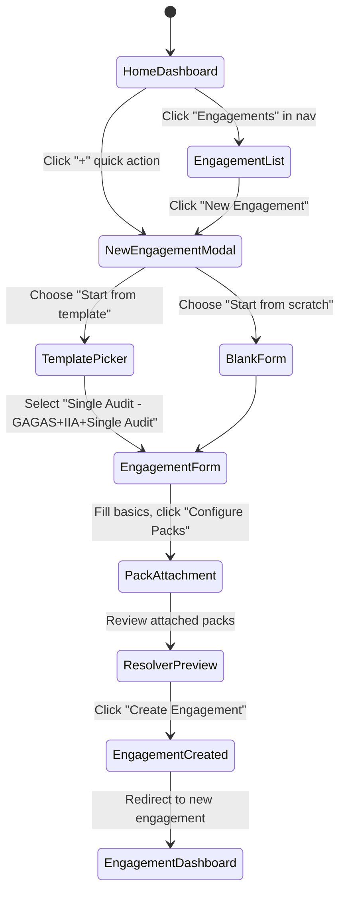

# UX Flow — Engagement Management

> Interaction specs for the central engagement hub. User journeys, screen-by-screen behaviour, form patterns, loading/empty/error states, keyboard shortcuts. Pairs with [`features/engagement-management.md`](../features/engagement-management.md); this doc covers the "how it feels" layer, that doc covers "what it does."

**Primary users**: Priya (AIC), Marcus (CAE), Anjali (Staff), Elena (Audit Partner)
**Feature spec**: [`features/engagement-management.md`](../features/engagement-management.md)

---

## 1. UX philosophy

The engagement hub is the primary navigation unit — where most users start their day and where everything else (findings, work papers, reports, CAPs) hangs off. Three design principles:

1. **Information density over minimalism.** Auditors manage 10+ active engagements simultaneously; sparse dashboards hide the context they need. Show dashboards at data-dense; use whitespace to organise, not to breathe.
2. **Keyboard-first for frequent actions.** AICs live in the tool for hours per day; every common action has a keyboard shortcut. Power users shouldn't need to mouse.
3. **Progressive disclosure of complexity.** Multi-pack attachment is AIMS's core differentiator but it's also new cognitive territory for auditors. The attachment UI introduces the three-tier taxonomy gradually — sensible defaults first, advanced options expandable.

---

## 2. Primary user journeys

### 2.1 Priya creates a new Single Audit engagement



**Steps**:
1. Click "+ New Engagement" from anywhere (nav button, home quick action, engagement list)
2. Choose creation path: template / clone / from-scratch
3. Fill metadata: name, client code (optional), type, auditee entity, fiscal period
4. Configure pack attachments (see §3.2 for detail)
5. Review resolver preview (see computed rules before commit)
6. Click Create → lands on engagement dashboard

**Expected duration**: 2-5 minutes for experienced AIC with template; 10-15 minutes for custom configuration.

### 2.2 Marcus reviews portfolio for morning standup

```
Home dashboard → Portfolio view → Drill into flagged engagements → Review approvals → Return to portfolio
```

**Expected duration**: 5-10 minutes.

### 2.3 Anjali checks her daily queue

```
Home dashboard → See assigned engagements + action items → Click into specific engagement → Start work paper
```

**Expected duration**: 30 seconds to land on work.

---

## 3. Screen-by-screen specs

### 3.1 Home dashboard (per-user, role-appropriate)

**Priya's view (AIC)**:
```
┌─────────────────────────────────────────────────────────────────┐
│  AIMS  [Engagements] [Findings] [Reports] [Reviews]    [🔔3] [Priya ▼]│
├─────────────────────────────────────────────────────────────────┤
│                                                                 │
│  Good morning, Priya                                            │
│                                                                 │
│  Your engagements (4 active)                                    │
│  ┌──────────────────────────────────────────────────────────┐  │
│  │ Oakfield FY27 Single Audit          [Fieldwork 60% ▓▓▓░░] │  │
│  │ 125h / 200h budget │ 5 findings │ 2 pending review       │  │
│  └──────────────────────────────────────────────────────────┘  │
│  ┌──────────────────────────────────────────────────────────┐  │
│  │ Springfield Performance Audit        [Planning 90% ▓▓▓▓░] │  │
│  │ 45h / 80h budget │ APM pending CAE approval              │  │
│  └──────────────────────────────────────────────────────────┘  │
│  [View all engagements →]                                       │
│                                                                 │
│  Pending actions (6)                                            │
│  • Review finding 2026-003 (Oakfield)                           │
│  • Approve Anjali's time entries (Oakfield)                     │
│  • Respond to Marcus's comment on APM (Springfield)             │
│  [View inbox →]                                                 │
│                                                                 │
│  Upcoming deadlines                                             │
│  • Oakfield fieldwork ends Dec 15 (21 days)                     │
│  • Your GAGAS CPE cycle ends Dec 31 (37 days) [42/80 hrs]       │
│                                                                 │
└─────────────────────────────────────────────────────────────────┘
```

**Layout**:
- 3-column grid on desktop ≥1280px
- 2-column on tablet 768-1280px
- Single-column stack on mobile
- Max 4 cards per row at widest
- Sticky top nav; sticky breadcrumbs below

**Behaviour**:
- Engagement cards are full-width-clickable (navigate to engagement dashboard)
- Progress bars use semantic colors (green <90%, yellow 90-100%, red >100%)
- Pending action items link directly to the specific entity
- Upcoming deadlines show countdown; highlighted red if <7 days

**Keyboard shortcuts**:
- `g` then `e` → go to Engagements
- `g` then `h` → go to Home
- `/` → focus global search
- `n` then `e` → new engagement
- `?` → show all shortcuts

### 3.2 New engagement form

Multi-step modal to avoid overwhelming users with a flat form:

**Step 1 — Basics**:
- Engagement name (required, max 200 chars)
- Client engagement code (optional, max 64 chars, tooltip: "Your firm's external reference code — e.g., SA-2027-001")
- Engagement type (dropdown: Single Audit / SOC 2 Examination / Performance Audit / Financial Audit / Attestation / Other)
- Auditee entity (autocomplete from audit universe; can create new inline)
- Fiscal period (date range picker; default based on engagement type)
- [Next →]

**Step 2 — Pack attachment** (see [`pack-attachment.md`](pack-attachment.md) for full detail):
- Primary methodology selector (required, exactly one)
- Additional methodologies (optional, 0-many)
- Control frameworks (optional, 0-many)
- Regulatory overlays (optional, 0-many)
- Inline resolver preview panel on the right showing computed rules as user selects packs
- [← Back] [Next →]

**Step 3 — Team** (optional; can do later):
- AIC assignment (self by default; editable)
- Add team members (autocomplete)
- Per-member budget allocation
- Skip if not ready
- [← Back] [Next →]

**Step 4 — Review**:
- Summary of all selections
- Resolver output preview (top 5 dimensions; link to full view)
- [← Back] [Create Engagement]

**Validation behaviour**:
- Client-side validation on blur + submit
- Server-side validation on submit
- Errors shown inline per field + summary at top of modal
- Cannot proceed to next step with unresolved validation errors
- Submit button disabled until all required fields valid
- Error summary links to specific field (scroll + focus)

**Loading state**:
- Submit fires: submit button shows spinner; form disabled; "Creating engagement..."
- Resolver preview loading: skeleton placeholder
- After create success: brief success toast + redirect to engagement dashboard

**Error state**:
- Form-level errors in a banner above form
- Field-level errors inline
- Specific error for override-required: full-screen takeover with explanation + next step

### 3.3 Engagement dashboard

The per-engagement home:

```
┌─────────────────────────────────────────────────────────────────┐
│  ← Engagements / Oakfield FY27 Single Audit                     │
│                                                                 │
│  ┌─ Status banner ──────────────────────────────────────────┐  │
│  │  🟢 Fieldwork phase │ Started Oct 15 │ Expected close Feb │  │
│  └──────────────────────────────────────────────────────────┘  │
│                                                                 │
│  [Overview] [APM] [PRCM] [Work Papers] [Findings] [Reports]    │
│  [CAPs] [Team] [Activity] [Settings]                           │
│                                                                 │
│  ┌── Progress ─────────────┐  ┌── Budget ─────────────────┐   │
│  │ Planning     ✓ Complete │  │ Hours: 125 / 200          │   │
│  │ Fieldwork    ▓▓▓░ 60%   │  │ ▓▓▓▓▓▓░░░░ 62%            │   │
│  │ Reporting    ⧖           │  │ Per-member breakdown ⟩    │   │
│  │ Follow-up    ⧖           │  │                          │   │
│  └─────────────────────────┘  └──────────────────────────────┘ │
│                                                                 │
│  ┌── Packs ────────────────┐  ┌── Key stats ─────────────┐    │
│  │ 📐 GAGAS:2024 (primary) │  │ Findings   5             │    │
│  │ 📐 IIA_GIAS:2024        │  │   Draft    2             │    │
│  │ ⚖️ SINGLE_AUDIT:2024    │  │   Review   2             │    │
│  │ 🔍 SOC2:2017            │  │   Approved 1             │    │
│  │ [Applied rules →]       │  │ Observations 3           │    │
│  └─────────────────────────┘  │ Open PBC items  47/155   │    │
│                               └──────────────────────────────┘ │
│                                                                 │
│  ┌── Recent activity ────────────────────────────────────────┐ │
│  │ 2 hr ago: Priya Sharma created finding 2026-005           │ │
│  │ 4 hr ago: Anjali Das submitted WP-047 for review          │ │
│  │ 6 hr ago: Marcus Chen approved APM revision               │ │
│  │ [View full activity →]                                    │ │
│  └───────────────────────────────────────────────────────────┘ │
│                                                                 │
│  ┌── Comments ────────────────────────────────────────────────┐ │
│  │ [Add comment...]                                          │ │
│  │                                                           │ │
│  │ Marcus Chen  2 days ago                                   │ │
│  │ Priya — can you loop in legal on finding 2026-001?        │ │
│  │ The NSF exposure might need additional review.            │ │
│  │ [Reply] [Resolve]                                         │ │
│  └───────────────────────────────────────────────────────────┘ │
└─────────────────────────────────────────────────────────────────┘
```

**Behaviour**:
- Tabs persist across session (back button works as expected)
- "Applied rules" link opens resolver-output drawer per `pack-attachment.md`
- Activity feed updates in real-time via tRPC subscription (or polling fallback)
- Comments thread with @mention autocomplete
- All stats are clickable → filtered list views

**Loading states**:
- Initial page load: skeleton placeholders for each card
- Tab switch: content area shows spinner; rest of page stable
- Activity feed: infinite scroll; bottom loader on fetch-more

**Empty states**:
- No findings yet: "No findings on this engagement yet. Create one from fieldwork, or escalate an observation."
- No activity: "Activity will appear here as work happens."

### 3.4 Engagement list (portfolio view)

For Priya (AIC): defaults to "engagements assigned to me"
For Marcus (CAE): defaults to "all active engagements in tenant"

```
┌─ Engagements ─────────────────────────────────────────────────┐
│                                                               │
│  [Filters: Active ▾] [AIC: All ▾] [Type: All ▾] [Search...]  │
│  [+ New Engagement]                                           │
│                                                               │
│  ▢  Name                          Phase       Budget  Status │
│  ▢  Oakfield FY27 SA              Fieldwork   62%     🟢      │
│  ▢  Springfield Perf Audit        Planning    32%     🟡      │
│  ▢  Coastal SOC 2 Attestation     Reporting   88%     🟢      │
│  ▢  Metro Schools Financial       Fieldwork   110%    🔴      │
│  ▢  Westside Single Audit         Follow-up   98%     🟢      │
│                                                               │
│  Page 1 of 3 • 47 engagements total • [1] [2] [3] >           │
└───────────────────────────────────────────────────────────────┘
```

**Behaviour**:
- Column header sort (click to toggle asc/desc)
- Multi-select via checkboxes → bulk actions (archive, tag, export)
- Row click → engagement dashboard
- Filters combine (AND)
- Saved filter sets (MVP 1.5)

**Bulk operations**:
- Per `features/dashboards-and-search.md §8.1` (R1 fix): no undo; strong confirmation modal

---

## 4. Key form patterns

### 4.1 Pack attachment picker

Multi-tier selector with inline resolver preview (see [`pack-attachment.md`](pack-attachment.md)).

### 4.2 Team assignment

```
┌─ Team ──────────────────────────────────────────────────────┐
│                                                             │
│  Auditor-in-Charge                                          │
│  Priya Sharma ▢ (you) [Change]                              │
│                                                             │
│  Team members                                               │
│  + Add team member                                          │
│                                                             │
│  Anjali Das                                                 │
│    Role: Staff Auditor ▾                                    │
│    Budget: 200 hours                                        │
│    CPE status: 🟡 Yellow (4h ethics short; catchable)       │
│    [Remove]                                                 │
│                                                             │
│  Jin Kim                                                    │
│    Role: Senior Manager ▾                                   │
│    Budget: 80 hours                                         │
│    CPE status: 🟢 Green                                     │
│    [Remove]                                                 │
└─────────────────────────────────────────────────────────────┘
```

**Behaviour**:
- Adding member: autocomplete search against staff directory
- CPE check runs automatically on selection
- Yellow status: inline "Assign with condition" button; required condition field
- Red status: confirmation modal with CAE override requirement

### 4.3 Phase transition controls

Phase gate status visible at top of engagement dashboard:

```
┌─ Ready for Fieldwork? ─────────────────────────────────────┐
│                                                            │
│  ✓ APM approved                                            │
│  ✓ PRCM approved                                           │
│  ⚠️ Independence declarations (1 of 3 missing)             │
│     → Anjali hasn't submitted yet                          │
│  ✓ Budget confirmed                                        │
│                                                            │
│  [Transition to Fieldwork] (disabled — 1 gate not met)     │
└────────────────────────────────────────────────────────────┘
```

**Behaviour**:
- All gate checks visible; passing shown with ✓; failing with ⚠️
- Click on a failing gate → navigates to resolution UI
- Transition button enabled only when all gates pass (or CAE override applied)
- Override: CAE-only; requires documented rationale

---

## 5. Loading, empty, error states

### 5.1 Loading patterns

- **Initial page load**: skeleton placeholder matching final layout (reduces CLS)
- **Data fetch within page**: inline spinner in affected region; rest of page interactive
- **Heavy operation (resolver run, bulk update)**: toast notification "Processing..." + progress bar
- **Long-running**: background job pattern — return immediately with job ID; user continues work; notification on completion

### 5.2 Empty states

Every list / dashboard has a purposeful empty state:
- Illustration (simple line art; on-brand)
- Primary message ("No engagements yet")
- Secondary guidance ("Create your first engagement to get started.")
- CTA button

### 5.3 Error states

- **Form validation**: inline per field + summary banner
- **Network error**: toast with "Retry" action; frontend handles offline gracefully
- **Server error**: banner with request ID (for support); fallback navigation
- **Permission denied**: clear message with who to contact
- **Concurrent modification**: friendly conflict UI showing diff + resolution options

---

## 6. Responsive design

**Breakpoints** (Tailwind-aligned):
- `sm` 640px — mobile landscape
- `md` 768px — tablet
- `lg` 1024px — small desktop
- `xl` 1280px — standard desktop (primary target)
- `2xl` 1536px — large display

**Mobile strategy**: responsive web (not native app per Phase 1 R1 decision). Key mobile-friendly patterns:
- Bottom nav on mobile (replaces top tabs where space tight)
- Touch-friendly tap targets (44×44 minimum)
- Read-mostly on mobile; complex editing (work paper data grids, APM rich text) is best on tablet/desktop
- Auditee portal (David) is mobile-optimised — auditees often respond from phones

---

## 7. Accessibility

WCAG 2.1 AA baseline:
- Color contrast 4.5:1 minimum for text
- Focus indicators visible on all interactive elements
- ARIA landmarks: `<nav>`, `<main>`, `<aside>`, `<footer>`
- Form labels always visible + programmatically associated
- Error announcements via `role="alert"`
- Skip-to-content link at page top
- Keyboard-only operable (tested with no mouse)
- Screen reader tested (VoiceOver + NVDA)

---

## 8. Keyboard shortcuts

Engagement-context shortcuts (when viewing an engagement):
- `c` → comment on engagement
- `t` → jump to tasks/inbox
- `w` → jump to work papers
- `f` → jump to findings
- `r` → jump to reports
- `e` → edit engagement metadata

Global shortcuts:
- `/` → global search
- `?` → show help overlay
- `g h` → home
- `g e` → engagements
- `g i` → inbox
- `n e` → new engagement
- `n f` → new finding
- `Esc` → close modals / drawers

Modal shortcuts:
- `Enter` → confirm primary action (if safe)
- `Esc` → cancel
- `Tab` / `Shift+Tab` → navigate fields
- `Cmd+Enter` → submit form

---

## 9. Mobile / tablet-specific considerations

**Tablet (iPad landscape)**:
- Primary useful form factor for fieldwork
- Split-screen: engagement tree in sidebar, work area on right
- Touch-optimised data grids (larger tap targets, swipe actions)
- Offline mode for work paper authoring (syncs on reconnect)

**Mobile phone**:
- Read-mostly: dashboard, approval inbox, quick comments
- Not for: work paper data-grid editing, APM rich text
- Auditee portal: fully optimised for mobile use (most auditees reply from phone)

---

## 10. Microinteractions and feedback

- Save indicator: subtle checkmark + "Saved at HH:MM" after auto-save
- Optimistic updates: UI responds immediately; reverts on server error
- Loading feedback: if action takes >200ms, show spinner; >2s, show progress
- Success feedback: toast with undo action where applicable (but not for bulk ops per R1 fix)
- Destructive action confirmation: modal with typed confirmation for irreversible actions

---

## 11. References

- Feature spec: [`features/engagement-management.md`](../features/engagement-management.md)
- Related UX: [`pack-attachment.md`](pack-attachment.md), [`finding-authoring.md`](finding-authoring.md)
- Design system: `frontend/DESIGN-SYSTEM.md` (when built)
- Accessibility: `frontend/ACCESSIBILITY.md`

---

*Last reviewed: 2026-04-22. Phase 6 deliverable.*
