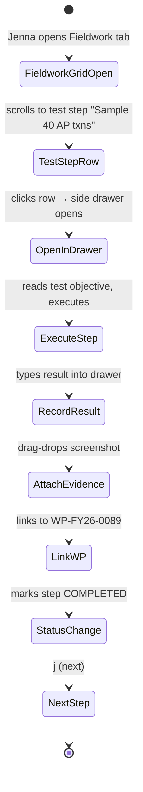
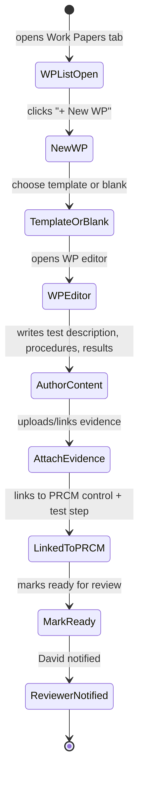

# UX — Fieldwork & Work Papers

> Fieldwork is where the audit actually happens: walkthroughs, test steps, evidence gathering, observations. Work papers are the durable artifacts of that work — one per test or procedure, with signoff/review lineage, cross-references to findings, and ALE-encrypted evidence attachments. The UX must support both the iterative "I'm in a conference room taking notes" mode and the structured "I'm preparing this for supervisor review" mode from the same interface.
>
> **Feature spec**: [`features/fieldwork-and-workpapers.md`](../features/fieldwork-and-workpapers.md)
> **Related UX**: [`finding-authoring.md`](finding-authoring.md) (observations escalate to findings), [`pbc-management.md`](pbc-management.md) (evidence attaches from PBC), [`prcm-matrix.md`](prcm-matrix.md) (test steps are planned from PRCM)
> **Primary personas**: Jenna (primary author), David (supervisor reviewer), Kalpana (QA reviewer, spot-check)

---

## 1. UX philosophy for this surface

- **Data grid by default, form on demand.** The fieldwork surface is first a grid — dozens of test steps, observations, WP references visible at once. Detail editing happens in a side panel or modal. Jenna can navigate 80 test steps in an afternoon without opening a form for each.
- **Two modes, one workspace.** "Execution mode" is WIP — fast entry, tentative statuses, messy notes. "Review mode" is polished — structured, with signoffs, rendered for supervisor eyes. The same screen supports both; a single toggle flips affordances.
- **Evidence lives in work papers, not in findings.** A finding cites a WP; a WP holds the actual evidence (PDFs, spreadsheets, screenshots). The separation matters because evidence is encrypted at rest with tenant DEKs (ALE), and the citation model means the same evidence can be cited by multiple findings without duplication.
- **Work papers have signoff ceremony.** Preparer → reviewer → (optional) 2nd reviewer. Each signoff is an explicit action with timestamp and attestation. Cannot be retroactively undone — unsign means creating a new version.
- **Cross-ref is cheap.** Linking a test step to a WP, a WP to a finding, an observation to a WP — all should be single clicks from the context of the work being done.

---

## 2. Primary user journeys

### 2.1 Journey: Jenna executes a test step



### 2.2 Journey: Jenna authors a work paper



### 2.3 Journey: David signs off on a WP

```mermaid
stateDiagram-v2
    [*] --> ReviewerQueue: David opens review queue
    ReviewerQueue --> WPOpened: opens WP in reviewer mode
    WPOpened --> ReadEvidence: inspects attachments
    ReadEvidence --> LeaveReviewNote: annotates WP with notes
    LeaveReviewNote --> SignoffOrBounce: accept or return
    SignoffOrBounce --> Signed: signs off with timestamp
    Signed --> ImmutableVersion: WP version snapshotted; subsequent edits create new version
    ImmutableVersion --> [*]
```



---

## 3. Screen — Fieldwork grid

Invoked from: engagement dashboard → Fieldwork tab.

### 3.1 Layout

```
┌─ Fieldwork · FY26 Q1 Revenue Cycle Audit ─────────────[Execution mode ▼]──┐
│                                                                             │
│ ┌─ Filter bar ─────────────────────────────────────────────────────────┐   │
│ │ Phase: [All ▼]  Status: [All ▼]  Owner: [All ▼]  Risk: [High ▼]       │   │
│ │ Search: [ 🔍 ___________________________ ]         [+ New step]       │   │
│ └────────────────────────────────────────────────────────────────────────┘   │
│                                                                             │
│ ┌── Data grid (ag-Grid Community) ────────────────────────────────────┐    │
│ │ # │ Step title              │ Owner  │ Risk  │ Status     │ WP       │    │
│ │─────────────────────────────────────────────────────────────────────│    │
│ │ 1 │ AP vendor master review │ Jenna  │ Med   │ COMPLETED ✓│ WP-0085 │    │
│ │ 2 │ AP 3-way match sample   │ Jenna  │ High  │ IN PROG ●  │ WP-0089 │    │
│ │ 3 │ AP policy walkthrough   │ Jenna  │ Med   │ COMPLETED ✓│ WP-0087 │    │
│ │ 4 │ SoD review AP approvers │ Jenna  │ High  │ IN REVIEW ⏳│ WP-0091 │    │
│ │ 5 │ AP cutoff test          │ Tim    │ Low   │ NOT STARTD │ —        │    │
│ │ 6 │ Vendor onboarding test  │ Tim    │ Med   │ IN PROG ●  │ WP-0093 │    │
│ │ ... (54 more steps)                                                  │    │
│ └──────────────────────────────────────────────────────────────────────┘    │
│                                                                             │
│ Selected: 0    Export: [CSV] [Excel]    60 steps · 12 completed · 3 in review│
└─────────────────────────────────────────────────────────────────────────────┘
```

### 3.2 ag-Grid interactions

| Feature | Behavior |
|---|---|
| Column resize / reorder | Native ag-Grid handles. Saved per user per engagement. |
| Column show/hide | Cog icon top-right of grid. Default shows 5 cols; additional (created date, last updated, pack dimensions, budget hours, actual hours) available. |
| Multi-sort | Shift-click column headers. |
| Multi-select | Shift-click or drag. Enables bulk actions: assign owner, change status, export selection. |
| Inline cell edit (for simple fields) | Status, owner, risk cells editable inline with dropdowns — avoids opening drawer for bulk status flips. |
| Row click | Opens side drawer with full test step detail (§3.3). |
| Keyboard nav | Arrow keys move cell focus; Enter opens drawer; Esc closes. |
| Context menu (right-click) | Quick actions: escalate to finding, duplicate step, link WP, delete. |

### 3.3 Test step side drawer

Slides from right, 40% width:

```
┌─ Test step 2 · AP 3-way match sample ──────────────────────────────── [X] ┐
│                                                                            │
│  Status:    [IN PROGRESS ▼]          Owner:  [Jenna Patel ▼]              │
│  Risk:      [High ▼]                 Due:    [2026-04-25]                 │
│                                                                            │
│  Linked to                                                                │
│   • PRCM control: C-AP-003 (3-way match required)                         │
│   • Work paper:   WP-0089 [open]                                          │
│   • Pack dim:     sampling.minimum_sample_size = 40                       │
│                                                                            │
│  Procedure                                                                 │
│  [ Select 40 AP transactions from Q4 2025 using attribute sampling.    ]  │
│  [ For each, verify: (1) PO exists, (2) receiving doc matches PO,      ]  │
│  [ (3) invoice matches PO + receiving, (4) 2nd approver for >$1k.      ]  │
│                                                                            │
│  Results & observations                                                    │
│  [ Tested 40 txns. Found 7 without 2nd approver (>$1k). See WP §3.2.   ]  │
│                                                                            │
│  Evidence (2)                                                             │
│   📎 ap-sample-selection.xlsx  (12 KB)              [View] [Unlink]      │
│   📎 ap-exception-schedule.pdf  (340 KB)            [View] [Unlink]      │
│   [ + Attach evidence ]                                                   │
│                                                                            │
│  Observations (1)                                                         │
│   OBS-2026-0042 · SoD weakness in AP approval        [Escalate to finding]│
│                                                                            │
│  Time: [ 4.5 h ]  budget [ 6 h ]                    [Log time]            │
│                                                                            │
│                                         [ Save ]  [ Mark completed → ]    │
└────────────────────────────────────────────────────────────────────────────┘
```

### 3.4 Execution / Review mode toggle

Top-right of grid. Toggles:
- **Execution mode**: cells show WIP status with soft colors; "Completed" requires only status change. Editable everywhere.
- **Review mode**: cells show signoff status (preparer signed / reviewer signed / final signed); test steps with missing signoffs flagged red; editing blocked on signed rows. Supervisor surface.

---

## 4. Screen — Work paper list

Invoked from: engagement dashboard → Work Papers tab.

### 4.1 Layout

```
┌─ Work Papers · FY26 Q1 Revenue Cycle Audit ───────────────────────────────┐
│                                                                            │
│ ┌─ Filter ────────────────────────────────────────────────────────────┐   │
│ │ Area: [All ▼]  Status: [All ▼]  Preparer: [All ▼]  [+ New WP]       │   │
│ └──────────────────────────────────────────────────────────────────────┘   │
│                                                                            │
│  ┌── WP-0085 ──────────────────────────────────────────────────────┐      │
│  │ AP vendor master review                           [SIGNED ✓]     │      │
│  │ Preparer: Jenna  ·  Reviewer: David  ·  2026-04-18               │      │
│  │ Links: 2 findings, 1 observation, 3 evidence files              │      │
│  │ Pack compliance: ✓ GAGAS-2024.1 §6.02                           │      │
│  └──────────────────────────────────────────────────────────────────┘      │
│                                                                            │
│  ┌── WP-0089 ──────────────────────────────────────────────────────┐      │
│  │ AP 3-way match sample testing                     [IN REVIEW ⏳]  │      │
│  │ Preparer: Jenna  ·  Reviewer: David (pending)                    │      │
│  │ Linked findings: F-2026-0042                                     │      │
│  └──────────────────────────────────────────────────────────────────┘      │
│                                                                            │
│  ┌── WP-0091 ──────────────────────────────────────────────────────┐      │
│  │ SoD review AP approvers                           [DRAFT ●]      │      │
│  │ Preparer: Jenna  ·  Reviewer: —                                  │      │
│  └──────────────────────────────────────────────────────────────────┘      │
│                                                                            │
│  ... (12 more WPs grouped by area)                                         │
│                                                                            │
│  16 WPs · 8 signed · 4 in review · 4 draft                                │
└────────────────────────────────────────────────────────────────────────────┘
```

---

## 5. Screen — WP editor

Invoked from: new WP, or clicking an existing WP.

### 5.1 Layout (authoring mode)

```
┌─ WP-0089 · AP 3-way match sample testing ──────────[DRAFT v0.3]─[Actions▼]─┐
│                                                                              │
│  Area: [ AP / Procurement ▼ ]   Type: [ Test of controls ▼ ]                │
│  Preparer: Jenna Patel          Reviewer: David Chen (pending)              │
│                                                                              │
│  Linked to                                                                   │
│   • PRCM control: C-AP-003                                                  │
│   • Test steps: #2 (fieldwork)                                              │
│   • Findings: F-2026-0042                                                   │
│                                                                              │
│  ┌─ Objective ─────────────────────────────────────────────────────────┐   │
│  │ Test the operating effectiveness of the 3-way match control for      │   │
│  │ AP transactions >$1k during Q4 2025.                                 │   │
│  └──────────────────────────────────────────────────────────────────────┘   │
│                                                                              │
│  ┌─ Source data ──────────────────────────────────────────────────────┐    │
│  │ • Population: 3,421 AP transactions > $1,000 (Q4 2025)              │    │
│  │ • Sample: 40 (attribute sampling per GAGAS-2024.1 §7.34)            │    │
│  │ • Selected via stratified random (seeded RNG, seed in §4)           │    │
│  └──────────────────────────────────────────────────────────────────────┘    │
│                                                                              │
│  ┌─ Procedures performed ─────────────────────────────────────────────┐    │
│  │ For each transaction in sample:                                      │    │
│  │  1. Retrieved PO from ERP                                            │    │
│  │  2. Retrieved receiving documents                                   │    │
│  │  3. Retrieved invoice                                                │    │
│  │  ...                                                                  │    │
│  │  (full procedures narrative)                                         │    │
│  └──────────────────────────────────────────────────────────────────────┘    │
│                                                                              │
│  ┌─ Results ──────────────────────────────────────────────────────────┐    │
│  │ 33 of 40 transactions passed all four 3-way match attributes (82.5%) │   │
│  │ 7 transactions exhibited exception: missing 2nd approver for >$1k.  │    │
│  │ (Exception rate: 17.5%. See §3.2 for detailed exception schedule.)  │    │
│  └──────────────────────────────────────────────────────────────────────┘    │
│                                                                              │
│  ┌─ Conclusion ───────────────────────────────────────────────────────┐    │
│  │ The 3-way match control, as designed, did not operate effectively   │    │
│  │ during the period. Control failure at 17.5% rate exceeds tolerable  │    │
│  │ deviation rate of 5%. Basis for finding F-2026-0042.                │    │
│  └──────────────────────────────────────────────────────────────────────┘    │
│                                                                              │
│  Evidence (3)                                                                │
│   📎 ap-sample-selection.xlsx  (12 KB)   [Preview] [Download]               │
│   📎 ap-3way-match-results.xlsx (48 KB)   [Preview] [Download]              │
│   📎 ap-exception-schedule.pdf (340 KB)   [Preview] [Download]              │
│   [ + Attach evidence ] [ Link from PBC ]                                   │
│                                                                              │
│  Preparer signoff                                                           │
│   [ Not yet signed ]                                [ Sign as preparer ]    │
│                                                                              │
│  Reviewer signoff                                                           │
│   [ Awaiting preparer signoff ]                                             │
│                                                                              │
│  [ Save ]  [ Submit for review ]                                            │
└──────────────────────────────────────────────────────────────────────────────┘
```

### 5.2 WP editor interactions

| Element | Behavior |
|---|---|
| Section rich text | TipTap editor per section. Toolbar includes tables (WPs can have tables), code blocks for query text, images inline. Autosave every 10s. |
| Evidence attachment | Drag-drop or "+ Attach evidence" / "Link from PBC." Uploaded files are ALE-encrypted with tenant DEK. Preview available for PDF, image, Excel, Word, CSV. |
| Link from PBC | Picker over Evidence records the auditee has uploaded through PBC flow. Links without copying. |
| Signoff buttons | Each role (preparer / reviewer / optional 2nd reviewer) has own signoff. Can't self-review: David's signoff unavailable if Jenna prepared; another Senior+ required. |

### 5.3 Signoff modal

```
┌─ Sign as preparer ──────────────────────────────────────────────────────┐
│                                                                           │
│  By signing, you attest:                                                  │
│   • You have performed the procedures documented in this WP              │
│   • Evidence attached supports the results                               │
│   • Results and conclusion are accurate                                  │
│                                                                           │
│  This signature will be logged with your identity, timestamp, and a      │
│  hash of the current WP content. Subsequent edits will invalidate the    │
│  signature and create a new version.                                      │
│                                                                           │
│  MFA challenge                                                            │
│  [ 6-digit TOTP: _______ ]                                               │
│                                                                           │
│                                            [ Cancel ]  [ Sign → ]        │
└───────────────────────────────────────────────────────────────────────────┘
```

On sign:
- Hash of current content captured
- Signature record appended
- WP state: DRAFT → AWAITING_REVIEW (after preparer), → SIGNED (after reviewer)
- Further edits require explicit "Un-sign and edit" action (removes signature, creates new version)

### 5.4 Reviewer mode

When reviewer opens WP in AWAITING_REVIEW state:
- Inline commenting enabled (sentence anchors, like finding review)
- "Edit" disabled; reviewer can only comment
- Actions: "Request changes" (returns to DRAFT with consolidated comments) or "Sign as reviewer" (advances to SIGNED)

---

## 6. Evidence viewer

When user clicks "Preview" on an attachment:

- **PDF**: inline viewer with zoom, rotate, page nav, highlight-to-comment
- **Image**: lightbox with zoom & rotate
- **Excel/CSV**: rendered as HTML table with up to 10k rows; link to "Download for full data" if larger
- **Word**: rendered to HTML via server-side Mammoth.js
- **Unsupported**: "Preview unavailable. [Download]."

All evidence decryption happens server-side; browser receives decrypted stream under short-lived presigned URL (TTL 5 min).

---

## 7. Observations

Observations are the lightweight cousin of findings — notes made during fieldwork that might become findings.

From within a test step drawer, "Add observation" creates an `Observation` with:
- Summary (one line)
- Details (rich text)
- Severity guess (info / concern / likely-finding)
- Linked test step, linked WP
- State: OPEN / ESCALATED / DISMISSED

Observations tab on engagement dashboard shows the full list; "Escalate" action on OPEN observations opens the finding creation modal (§3.1 of finding-authoring.md) pre-populated from the observation.

---

## 8. Loading, empty, error states

| State | Treatment |
|---|---|
| First time engagement, no test steps | Empty fieldwork grid: "No test steps yet. Test steps are planned from the PRCM matrix. [Open PRCM to plan steps]" with CTA. |
| No WPs exist | "No work papers yet. Work papers document what you did and what you found. [+ New WP]" |
| Evidence upload fails | File row shows error; retry inline. Partial-upload resumed on retry. |
| WP signed but reviewer tries to edit | Banner: "This WP is signed. To edit, first un-sign (creates new version). [Un-sign & edit]" |
| Concurrent edit (rare with pessimistic WP locking per feature spec) | Soft lock: other users see read-only with "Jenna is editing. You can edit in 5 min." |
| Evidence decryption failure | "Evidence unavailable. The tenant encryption key may be rotating. [Retry]" |

---

## 9. Responsive behavior

Fieldwork and WPs are desktop-first. Mobile considerations:
- **xl/lg**: full grid + drawer, editor 2-column.
- **md (tablet)**: grid works; drawer takes 60% width; WP editor single-column with accordion sections.
- **sm (mobile)**: read-only view only. Cannot author WPs on phone. Test step status inline-edit available from a simplified list view.

---

## 10. Accessibility

- ag-Grid configured with `rowAriaLabel` and ARIA grid semantics for screen readers.
- Status icons have text labels.
- Drawer traps focus; Esc closes; `Tab` cycles through drawer controls.
- WP signoff modal announces attestation text via screen reader.
- Evidence viewers have `<figure>` with `<figcaption>` for each attachment.
- Sentence-anchored review comments use `aria-describedby` linking the comment thread to the anchored text.

---

## 11. Keyboard shortcuts

Fieldwork grid:

| Shortcut | Action |
|---|---|
| `/` | Focus filter |
| `n` | New test step |
| `Enter` (on row) | Open drawer |
| `j` / `k` | Next / prev row |
| `Esc` | Close drawer |
| `c` | Mark selected COMPLETED |
| `e` | Escalate focused observation → finding |

WP editor:

| Shortcut | Action |
|---|---|
| `⌘+S` | Save |
| `⌘+Enter` | Submit for review |
| `⌘+Shift+S` | Sign (preparer or reviewer depending on role) |
| `a` | Attach evidence |

---

## 12. Microinteractions

- **Test step status change**: row's status cell morphs color (grey → amber → green) over 200ms; the `12 completed · 3 in review` counter animates.
- **Evidence attached**: file row slides in from bottom of list, with a progress bar for upload. On success, small checkmark pulses.
- **Signoff applied**: full-screen signature animation (green checkmark with a faux-pen trace), ~800ms; then settle to "SIGNED" state.
- **Observation escalated**: observation row animates out of observations list, new finding card materializes in findings tab with a brief spotlight.

---

## 13. Analytics & observability

- `ux.fieldwork.grid.opened { engagement_id }`
- `ux.fieldwork.teststep.completed { step_id, time_spent_seconds, evidence_count }`
- `ux.fieldwork.observation.created { from_test_step, severity }`
- `ux.fieldwork.observation.escalated { observation_id, finding_id }`
- `ux.workpaper.created { wp_id, from_template }`
- `ux.workpaper.evidence_attached { wp_id, evidence_kind, size_bytes }`
- `ux.workpaper.signoff { wp_id, role, time_since_submitted_hours }`
- `ux.workpaper.unsign { wp_id, role, reason_length }`

KPIs:
- **Test step cycle time** (mean time-in-IN_PROGRESS; target: median ≤ 2 business days)
- **WP review latency** (submit to reviewer sign; target p90 ≤ 3 business days)
- **Un-sign frequency** (should be low; high values indicate review process confusion)
- **Evidence attach rate** (fraction of completed WPs with ≥1 attached piece of evidence; target ≥95%)

---

## 14. Open questions / deferred

- **Collaborative WP editing** (two preparers simultaneously): MVP 1.0 is pessimistic single-editor with soft lock; Yjs deferred to MVP 1.5.
- **Inline evidence annotation** (highlight + comment on PDFs): MVP 1.0 supports page-level comments; intra-page annotation deferred to MVP 1.5.
- **WP templating across engagements**: simple copy-from-prior-year supported MVP 1.0; cross-tenant template library deferred.
- **Mobile authoring**: deferred to v2.1.
- **Dictation / speech-to-text for test step notes**: deferred to v2.2+.

---

## 15. References

- Feature spec: [`features/fieldwork-and-workpapers.md`](../features/fieldwork-and-workpapers.md)
- Related UX: [`finding-authoring.md`](finding-authoring.md), [`pbc-management.md`](pbc-management.md), [`prcm-matrix.md`](prcm-matrix.md)
- Data model: [`data-model/workpaper.md`](../data-model/workpaper.md), [`data-model/evidence.md`](../data-model/evidence.md)
- API: [`api-catalog.md §3.9`](../api-catalog.md) (`fieldwork.*`, `workpaper.*` tRPC namespaces)

---

*Last reviewed: 2026-04-22. Phase 6 (UX) draft — pending external review.*
