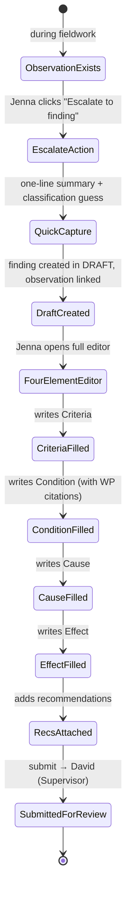
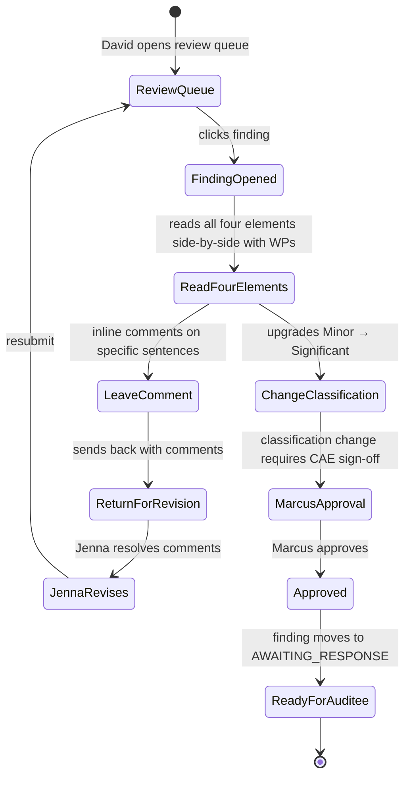
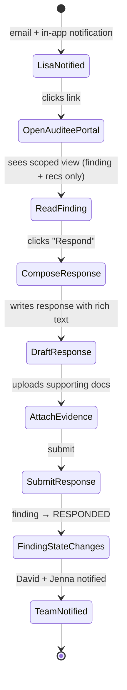

# UX — Finding Authoring

> Finding authoring is where audit work becomes visible to the auditee and, eventually, the Audit Committee. It's high-stakes: a finding is a formal statement that a control failed or a risk materialized, and the words used shape litigation, remediation, and careers. The UX must make it fast to capture a finding when the evidence is still fresh, structured enough to enforce GAGAS §6.39 four-element discipline, and flexible enough to handle the iteration that always happens between draft and published report.
>
> **Feature spec**: [`features/finding-management.md`](../features/finding-management.md)
> **Related UX**: [`fieldwork-and-workpapers.md`](fieldwork-and-workpapers.md) (findings escalate from observations), [`recommendations-and-caps.md`](recommendations-and-caps.md) (recommendations attach to findings), [`report-generation.md`](report-generation.md) (findings roll into reports)
> **Primary personas**: Jenna (Senior Auditor — drafts findings), David (Supervisor — reviews), Lisa (Auditee — responds), Marcus (CAE — approves classification)

---

## 1. UX philosophy for this surface

- **Capture fast, structure later.** Jenna often identifies a finding during fieldwork, in a conference room, with two minutes between meetings. The initial capture is a lightweight escalate-from-observation with a one-line summary. Structure (four elements, classification, root cause) can be added over the following days.
- **Four-element discipline is a first-class constraint.** GAGAS §6.39 requires Criteria / Condition / Cause / Effect. Every finding must have all four populated before it can move out of `DRAFT` state. The editor surfaces this as a progress indicator, not as a blocking validation at the last step — so users know throughout authoring how much more they have to write.
- **Bitemporal is invisible until it matters.** The feature spec requires bitemporal findings (validFrom/validTo + transactionFrom/transactionTo) — but most users should never see the database-layer temporality. They see a timeline: "drafted → reviewed → acknowledged → responded → reported." The bitemporal plumbing shows up only when someone asks "what did this finding say on 2026-03-01?"
- **Management response is a first-class sub-document.** Lisa (auditee) responds from her own inbox, not the audit team's workspace. Her UI is a focused response form — not the full finding editor. She sees the finding statement, the recommendations, and a response composer. Nothing else.
- **Classification is reversible but logged.** Changing a finding from `SIGNIFICANT` to `MATERIAL` is a normal workflow step, but it's also the kind of thing that matters in a subpoena. Every classification change is logged to the audit trail with rationale and approver.

---

## 2. Primary user journeys

### 2.1 Journey: Jenna escalates an observation to a finding



### 2.2 Journey: David reviews and approves finding classification



### 2.3 Journey: Lisa (auditee) receives and responds



---

## 3. Screen — Quick capture modal

Invoked from: Observation detail → `Escalate to finding` button, or fieldwork grid row context menu, or keyboard `⌘+Shift+F` globally during an engagement.

### 3.1 Layout

```
┌─ Escalate to finding ────────────────────────────────────────────────────────┐
│                                                                               │
│  From observation:  OBS-2026-0042 — Segregation of duties in AP workflow      │
│  Source work papers: WP-FY26-0089, WP-FY26-0091 (auto-linked)                 │
│                                                                               │
│  Title (required, 120 chars)                                                  │
│  [ Weak segregation of duties in Accounts Payable approval process _______ ] │
│                                                                               │
│  Classification (preliminary — subject to supervisor review)                  │
│  ( ) Minor    (●) Significant    ( ) Material    ( ) Critical                │
│                                                                               │
│  Related packs (auto-populated from engagement)                               │
│  [ GAGAS-2024.1 ] [ COSO-2013 ]                                              │
│                                                                               │
│  One-line summary (helps reviewers prioritize — not the full finding)         │
│  [ AP clerks can approve their own invoices up to $5k without 2nd review __ ] │
│                                                                               │
│             [ Cancel ]  [ Create draft & open editor ]  [ Create & continue ]│
└───────────────────────────────────────────────────────────────────────────────┘
```

### 3.2 Interactions

| Element | Behavior |
|---|---|
| Title | Required. Auto-focus on open. Validation: 10-120 chars. Duplicate-detection tooltip if a similar title exists in same engagement. |
| Classification | Radio, single select. Default "Significant" (most common per historical data). Tooltip per option shows the definition from the attached methodology pack. |
| Related packs | Read-only display from engagement's pack attachment. Reflects any annotations that affect finding fields. |
| One-line summary | Optional. 50-250 chars. Used in reviewer's queue, notification previews. |
| "Create draft & open editor" | Primary — most common path. Creates `Finding` with state=DRAFT, redirects to editor. |
| "Create & continue" | Creates and returns to the fieldwork grid so Jenna can escalate another observation. Useful during walkthrough synthesis. |

Sub-second target for create. If the user hits "Create & continue" rapidly, toast stacks show "Finding F-2026-0042 created. Finding F-2026-0043 created." with the last one holding focus.

---

## 4. Screen — Finding editor (four-element)

The workhorse screen. Two-pane layout: editor on the left, context pane on the right.

### 4.1 Layout

```
┌─ F-2026-0042 · Weak SoD in AP approval ───────────────  [DRAFT]  [Actions ▼]┐
│                                                                               │
│ ┌─ Editor ────────────────────────────────────┐ ┌─ Context ─────────────────┐│
│ │                                              │ │                           ││
│ │ Classification:  ▼ Significant               │ │ Related work papers (2)   ││
│ │ Engagement: FY26 Q1 Revenue Cycle            │ │  • WP-FY26-0089 [Open]   ││
│ │ Engagement phase: Fieldwork                  │ │  • WP-FY26-0091 [Open]   ││
│ │                                              │ │                           ││
│ │ Four elements  [▓▓▓▓░░░░]  2 of 4 complete   │ │ Source observation        ││
│ │                                              │ │  • OBS-2026-0042          ││
│ │ ┌─ Criteria ─────────────────────────── ✓ ──┐│ │                           ││
│ │ │ Per AIMS's documented AP policy (§4.2)     ││ │ Related findings (1)     ││
│ │ │ and COSO-2013 principle 10, transactions   ││ │  • F-2026-0031            ││
│ │ │ above $1,000 require a second approver.    ││ │    (same engagement)     ││
│ │ │                                             ││ │                           ││
│ │ │ [Add WP citation]                          ││ │ Pack requirements         ││
│ │ └─────────────────────────────────────────────┘│ │  Documentation: required ││
│ │                                              │ │  Four-element: required   ││
│ │ ┌─ Condition ──────────────────────────── ✓ ┐│ │  Classification approval:││
│ │ │ Testing of 40 AP transactions during      ││ │    CAE for Material+      ││
│ │ │ Q4 2025 identified 7 (17.5%) processed    ││ │                           ││
│ │ │ by a single clerk with no second review.  ││ │ Timeline                  ││
│ │ │ [WP-FY26-0089 §3.2]                       ││ │  2026-03-14 Drafted       ││
│ │ └─────────────────────────────────────────────┘│ │  (in progress)           ││
│ │                                              │ │                           ││
│ │ ┌─ Cause ────────────────────────────────── ○┐│ │                           ││
│ │ │ [ Write cause — why did the condition     ]││ │                           ││
│ │ │ [ occur? Root cause, not symptom. ]       ││ │                           ││
│ │ │                                             ││ │                           ││
│ │ │ ⓘ Tip: Ask "why" 3-5 times. Avoid         ││ │                           ││
│ │ │   "because the policy wasn't followed" —   ││ │                           ││
│ │ │   that's not a root cause.                ││ │                           ││
│ │ └─────────────────────────────────────────────┘│ │                           ││
│ │                                              │ │                           ││
│ │ ┌─ Effect ────────────────────────────────── ○┐│ │                           ││
│ │ │ [ Empty — what's the impact of the       ]││ │                           ││
│ │ │ [ condition? Quantify where possible. ]  ││ │                           ││
│ │ └─────────────────────────────────────────────┘│ │                           ││
│ │                                              │ │                           ││
│ │ Recommendations (0)     [+ Add recommendation]│ │                           ││
│ │                                              │ │                           ││
│ │ [ Save draft ]  [ Submit for review → David ]│ │                           ││
│ └──────────────────────────────────────────────┘ └───────────────────────────┘│
└───────────────────────────────────────────────────────────────────────────────┘
```

### 4.2 The four-element progress indicator

A horizontal progress bar at the top of the editor: `[▓▓▓▓░░░░]  2 of 4 complete`. Each element (Criteria / Condition / Cause / Effect) is a quarter-bar. Ticks green when that element's textarea has at least 50 characters AND at least one work paper citation (if the attached packs require citations).

Hovering shows which elements remain: "Cause and Effect are still empty."

Submit-for-review is disabled until 4 of 4 complete. Tooltip on hover: "Complete Cause and Effect before submitting."

### 4.3 Rich text editor (per element)

TipTap v2 based. Each element is its own TipTap instance. Toolbar is minimal:

- **B** / *I* / <u>U</u>
- Heading levels H3, H4 (H1/H2 reserved for finding title + element labels)
- Bullet / numbered list
- Blockquote (for citing policy text)
- Link (auto-detects WP references like `WP-FY26-0089` and linkifies them)
- **Cite WP** button — opens a work paper picker (see §4.4)

No tables in finding elements — tables are for work papers and reports, not for findings. No images (findings are textual statements; evidence lives in work papers, which are cited).

Autosave every 10s of idle; visible indicator in the element header ("Saved 4s ago").

### 4.4 Work paper citation picker

Click "Cite WP" or type `@WP` in a textarea. Inline popover:

```
┌─ Cite a work paper ─────────────────────────────────┐
│ 🔍 [ search by title or WP number ________________ ]│
│                                                      │
│  Recent in this engagement                           │
│   • WP-FY26-0089  AP walkthrough                     │
│   • WP-FY26-0091  AP test of controls                │
│   • WP-FY26-0085  AP policy review                   │
│                                                      │
│  Recent for this auditee                             │
│   • WP-FY25-Q3-0112  Prior-year AP assessment        │
│                                                      │
│  [ Paste specific section: §___ ]                    │
└──────────────────────────────────────────────────────┘
```

Selecting a WP inserts a citation chip: `[WP-FY26-0089]`. Adding a section reference becomes `[WP-FY26-0089 §3.2]`. Chips are hoverable — hover shows a 200x120px thumbnail of the cited WP page.

### 4.5 Context pane (right)

Shows:

- **Related work papers** — every WP cited in any element. De-duplicated across elements. Click opens in new tab.
- **Source observation** — link back to the escalation source. Helps Jenna re-check original evidence.
- **Related findings** — other findings in this engagement or prior-year engagements on same auditee. Heuristic match on keywords and pack dimensions.
- **Pack requirements** — the effective requirements from pack resolver relevant to findings (documentation depth, four-element enforcement, classification approval thresholds, management response timeline).
- **Timeline** — vertical state machine: Drafted → In Review → Approved → Awaiting Response → Responded → Published. Current state bolded.

Context pane is collapsible (chevron at top-right) for more editor width.

---

## 5. Review & comments

Findings in state `IN_REVIEW` open in a review-mode editor: mostly identical to the author view, with comment-authoring enabled.

### 5.1 Inline commenting

Hover over any sentence → small comment bubble appears in left margin → click adds a comment thread anchored to that text. Comment threads look like:

```
┌─ David Chen · 2026-03-15 09:12 ─────────────────────┐
│ "processed by a single clerk" — is this always the   │
│ same clerk, or different clerks each time? Matters   │
│ for the Cause.                                       │
│                                                      │
│  ↳ Jenna Patel · 09:34                               │
│     Good catch — it's 5 different clerks, same role. │
│     Updating Cause element.                          │
│                                                      │
│  [ Resolve ]  [ Reply ]                              │
└──────────────────────────────────────────────────────┘
```

Comment threads have three states: `OPEN` / `RESOLVED` / `BLOCKING`. A BLOCKING comment prevents the finding from being resubmitted until resolved.

Sentence-anchored comments move with the text if the surrounding paragraph is edited (CRDT-style anchor). If the target sentence is deleted, the comment detaches and moves to an "orphaned comments" drawer at top of the editor — reviewer must explicitly resolve or re-anchor.

### 5.2 Classification change workflow

From the editor action menu `Actions ▼`:
- "Change classification" → opens a small modal requiring:
  - New classification (radio)
  - Rationale (textarea, min 50 chars)
  - Checkbox: `☐ I understand this change will be logged and may require CAE approval`

If the new classification is `MATERIAL` or `CRITICAL`, submission routes to Marcus (CAE) approval before taking effect. Until approved, the classification shows a pending badge: "Pending: Significant → Material [Awaiting CAE]".

### 5.3 Return for revision / Approve

Review actions (at bottom of review view):
- **Return for revision** — opens a textarea for summary feedback. Finding goes back to `DRAFT`; author notified.
- **Approve** — advances to `AWAITING_RESPONSE`. Triggers notification to Lisa.

All comments must be RESOLVED or the reviewer is prompted: "3 unresolved comments — approve anyway? [Add overriding note]".

---

## 6. Screen — Auditee response view

Lisa's UI is deliberately narrow. She logs in (magic link or SSO), lands on her findings inbox.

### 6.1 Auditee inbox

```
┌─ Your findings — Action required ────────────────────────────────────────────┐
│                                                                               │
│  Engagement: FY26 Q1 Revenue Cycle Audit                                      │
│  Response due: 2026-04-15 (in 28 days)                                        │
│                                                                               │
│  ┌─ 3 findings awaiting your response ────────────────────────────────────┐  │
│  │ F-2026-0042  Weak SoD in AP approval           [Significant]   [Respond]│  │
│  │              Recommendations: 2                   Due: 2026-04-15        │  │
│  │                                                                           │  │
│  │ F-2026-0038  Missing IT general controls       [Material]       [Respond]│  │
│  │              Recommendations: 4                   Due: 2026-04-15        │  │
│  │                                                                           │  │
│  │ F-2026-0031  Incomplete vendor onboarding      [Minor]          [Respond]│  │
│  │              Recommendations: 1                   Due: 2026-04-15        │  │
│  └───────────────────────────────────────────────────────────────────────────┘│
│                                                                               │
│  Already responded (2)  [Show]                                                │
└───────────────────────────────────────────────────────────────────────────────┘
```

### 6.2 Auditee response composer

Finding detail (Lisa's view) shows ONLY:
- Title + classification
- Four elements (read-only)
- Attached recommendations (read-only, with ability to accept/partially-accept/reject each)
- Her response composer

No work papers (may contain audit team's internal notes), no comments (internal), no timeline (internal).

```
┌─ F-2026-0042 · Weak SoD in AP approval ──────────────  Classification: Significant
│
│  Criteria
│    Per AIMS's documented AP policy (§4.2) and COSO-2013 principle 10,
│    transactions above $1,000 require a second approver.
│
│  Condition
│    Testing of 40 AP transactions during Q4 2025 identified 7 (17.5%)
│    processed by a single clerk with no second review.
│
│  Cause
│    AP system was configured in 2018 to only enforce 2-approver rule above
│    $10k, not $1k; configuration was never updated after 2022 policy change.
│
│  Effect
│    Increased risk of unauthorized or fraudulent disbursement. Control
│    failure present on an estimated $840k of transactions in FY25.
│
│  ─────────────────────────────────────────────────────────────────────────────
│
│  Recommendations & your response
│
│  REC-042-01: Update AP system config to enforce 2-approver rule above $1k
│              within 30 days.
│   (●) Accept   ( ) Partially accept   ( ) Reject
│   Target date: [ 2026-05-15 ]
│   Owner:       [ Lisa Chen ]
│
│  REC-042-02: Implement quarterly review of AP approval configuration.
│   ( ) Accept   (●) Partially accept   ( ) Reject
│   Comment: We'll implement semi-annual review (not quarterly) to match our
│            existing IT review calendar.
│   Target date: [ 2026-06-30 ]
│   Owner:       [ Maria Rodriguez (IT Controls) ]
│
│  ─────────────────────────────────────────────────────────────────────────────
│
│  Management response
│    Rich text editor
│    [ We concur with the finding. The 2022 policy change was communicated     ]
│    [ but the system configuration update was missed during the transition.   ]
│    [ We have already initiated the configuration change and it will be       ]
│    [ deployed by 2026-05-15. See attached implementation plan.               ]
│
│  Attachments (optional)
│    📎 AP-config-remediation-plan.pdf   [Remove]
│    [ + Attach file ]
│
│                                                  [ Save draft ]  [ Submit ]
└──────────────────────────────────────────────────────────────────────────────┘
```

### 6.3 Interactions (auditee)

| Element | Behavior |
|---|---|
| Accept / Partially / Reject | Radio per recommendation. Partially/Reject require a comment (min 50 chars). |
| Target date | Date picker. Defaults to recommendation's due date (if set) or 90 days out. Dates >180 days flag a yellow warning. |
| Owner | Person picker — Lisa can assign to anyone in her org (via integration) or free-text if not in system. |
| Management response | Required, min 100 chars. Rich text (same TipTap toolbar as authoring, minus WP citation). |
| Attachments | Standard S3 upload. Encrypted with tenant DEK per ALE. |
| Save draft | Auto-saves every 15s also. Draft visible on her inbox. |
| Submit | Confirmation modal: "Submit response to AIMS audit team? You will not be able to edit after submit." One-time submit per response; subsequent changes require audit team to re-open the response. |

---

## 7. States

Finding state machine (aligned with `finding-management.md §3`):

```
DRAFT → IN_REVIEW → AWAITING_CAE (if classification ≥ MATERIAL) → APPROVED → AWAITING_RESPONSE → RESPONDED → PUBLISHED → [CLOSED]
                                                                                        ↓
                                                                                   DISPUTED → ESCALATED
```

Visual treatment of states in the title bar:

- `DRAFT` — grey badge
- `IN_REVIEW` — blue badge, "under review by {reviewer}"
- `AWAITING_CAE` — amber badge, "awaiting CAE approval for classification"
- `APPROVED` — green badge
- `AWAITING_RESPONSE` — blue badge, "response due {date}" (red if overdue)
- `RESPONDED` — purple badge, "response received {date}"
- `PUBLISHED` — locked-green badge, with lock icon
- `CLOSED` — grey badge, with archive icon
- `DISPUTED` — red badge

Transitions between states use 400ms color morph animation. The state badge is also a hover target explaining what the state means and what happens next.

---

## 8. Empty, loading, error states

| State | Treatment |
|---|---|
| No findings in engagement | Empty state on engagement Findings tab: "No findings yet. Findings are statements of control failures or risk realized. You can author one here or escalate from an observation in Fieldwork." CTA: "+ New finding" (primary), "Go to Fieldwork" (secondary). |
| Editor loading | Skeleton of four element boxes with shimmer lines. Context pane shows spinner. Target: visible in < 300ms. |
| Save failed (network) | Banner at top: "Unable to save. Your changes are preserved locally. [Retry now]". Typing continues; autosave retries every 30s until success. If user navigates away with unsaved pending, confirmation modal. |
| Citation picker can't load WP list | Picker shows error row: "Unable to load work papers. [Retry]". User can still paste raw citation text. |
| Concurrent edit collision | The feature spec specifies per-element optimistic locking. If Jenna submits and her version is stale, editor shows: "David edited this while you were working. [Merge view] [Overwrite] [Discard yours]". Merge view is a side-by-side diff with check-boxes per paragraph. |
| Auditee magic link expired | Lisa's link expired: "This link is no longer valid. Request a new one? [Send new link]". Server sends a new link after identity re-challenge. |

---

## 9. Responsive behavior

- **xl (1280+)**: Two-pane layout as drawn. Context pane ~340px, editor flexes.
- **lg (1024-1279)**: Context pane narrows to 280px. Four-element progress bar shrinks labels.
- **md (768-1023)**: Context pane becomes a collapsed drawer triggered by a "Context" tab. Editor full-width.
- **sm (<768)**: Editor only, single column. Elements stack. Authoring on mobile is supported but discouraged — warning banner at top: "Editing findings is best on a larger screen."

Auditee view is designed mobile-first — Lisa may respond from her phone. Response composer is single-column, recommendations stack, textarea expands to content height with mobile keyboard accommodation.

---

## 10. Accessibility

- Four-element progress bar is exposed as `<progress aria-valuemin=0 aria-valuemax=4 aria-valuenow={n} aria-label="Four-element completion">`.
- Each element's textarea has `aria-required=true` and an `aria-describedby` pointing at the element description ("Criteria — the policy, law, or benchmark that was not met").
- Inline comments are `<aside role="complementary" aria-label="Review comment from David Chen">`.
- State badge changes fire an `aria-live="polite"` announcement: "Finding state changed to Approved."
- Classification change modal traps focus, announces rationale requirement.
- WP citation chips have `aria-label="Citation to work paper WP-FY26-0089, section 3.2, opens in new tab"`.
- Auditee radio groups are proper `<fieldset><legend>`, legend = recommendation text.

---

## 11. Keyboard shortcuts

Within finding editor:

| Shortcut | Action |
|---|---|
| `⌘+S` / `Ctrl+S` | Force save (in addition to autosave) |
| `⌘+Enter` / `Ctrl+Enter` | Submit for review (if 4/4 complete) |
| `1` / `2` / `3` / `4` | Jump to Criteria / Condition / Cause / Effect |
| `⌘+K` / `Ctrl+K` | Open link dialog in active textarea |
| `@` (in textarea) | Open WP citation picker inline |
| `c` | Open comment on selected text (if reviewing) |
| `r` (in review) | Return for revision |
| `a` (in review) | Approve |

Within auditee view:

| Shortcut | Action |
|---|---|
| `⌘+Enter` | Submit response (disabled until required fields complete) |
| `⌘+D` | Save draft |
| `n` / `p` | Next / previous recommendation |

---

## 12. Microinteractions

- **Element reaches 50-char threshold + has a WP cite**: check icon on element header fades from grey to green, progress bar segment fills.
- **All 4 elements complete**: subtle confetti-free celebration — progress bar pulses green once, submit button transitions from disabled grey to primary blue with a 200ms color lift.
- **Classification upgraded to Material**: title bar background transitions to a subtle amber tint for 500ms; badge updates with a small flip animation.
- **Comment resolved**: comment collapses with 300ms height animation; "1 unresolved" counter decrements with a 200ms scale-pulse.
- **Response submitted**: confirmation screen with a large checkmark, "Response submitted. Audit team has been notified." Auto-redirects to auditee inbox after 3s.

All animations respect `prefers-reduced-motion`.

---

## 13. Analytics & observability

Events emitted from this surface:

- `ux.finding.escalation.opened { observation_id, engagement_id }`
- `ux.finding.created { finding_id, classification, from_source }`
- `ux.finding.element.saved { finding_id, element, char_count, cites_count }`
- `ux.finding.submitted_for_review { finding_id, time_in_draft_hours }`
- `ux.finding.comment.added { finding_id, is_blocking, author_role }`
- `ux.finding.classification_changed { finding_id, from, to, routed_to_cae }`
- `ux.finding.auditee.opened { finding_id, auditee_id, via_magic_link }`
- `ux.finding.auditee.response_drafted { finding_id, draft_length_chars }`
- `ux.finding.auditee.response_submitted { finding_id, response_time_days, accept_count, partial_count, reject_count }`

KPIs:
- **Draft-to-submit time** (target: median < 3 business days from escalation)
- **Auditee response time** (target: p90 < 14 days from AWAITING_RESPONSE transition)
- **Rework rate** (findings returned for revision > 0 times; target ≤ 30%)
- **Four-element completion check-gate effectiveness** (fraction of findings that reach submit with all 4 elements ≥ 50 chars + cites; target 100%)

---

## 14. Open questions / deferred

- **AI-assisted drafting** (suggest cause elements from condition text): deferred to v2.1.
- **Multi-auditee response** (finding scopes to two separate business units, each responding independently): deferred to MVP 1.5.
- **Response re-opening** (audit team requests re-response): scoped for MVP 1.0 — supervisor can re-open, which reverts state to AWAITING_RESPONSE and preserves prior response as a version.
- **Lateral linking (related findings)**: the context pane's "related findings" surface uses simple keyword match for MVP; ML-assisted linking deferred to v2.1.

---

## 15. References

- Feature spec: [`features/finding-management.md`](../features/finding-management.md)
- Related UX: [`fieldwork-and-workpapers.md`](fieldwork-and-workpapers.md), [`recommendations-and-caps.md`](recommendations-and-caps.md), [`report-generation.md`](report-generation.md)
- Data model: [`data-model/finding.md`](../data-model/finding.md) (bitemporal model)
- API: [`api-catalog.md §3.6`](../api-catalog.md) (`finding.*` tRPC namespace)
- Personas: [`02-personas.md §4-5`](../02-personas.md) (Jenna, David, Lisa)

---

*Last reviewed: 2026-04-22. Phase 6 (UX) draft — pending external review.*
