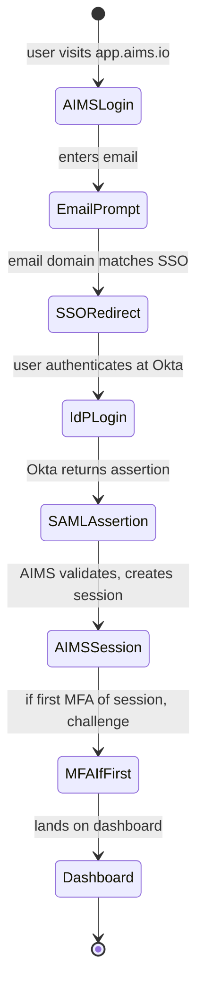
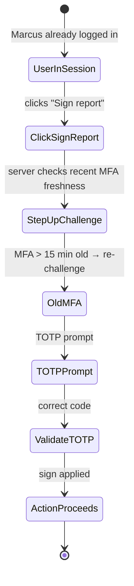
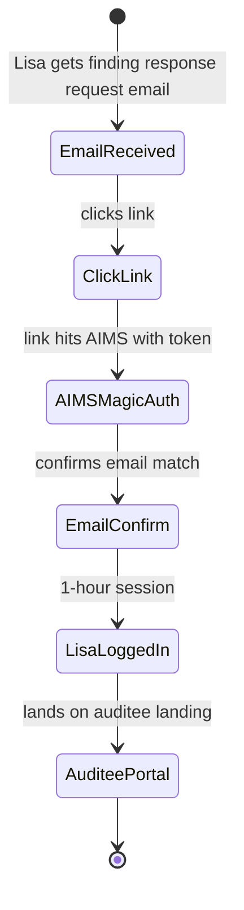

# UX — Identity, Authentication & SSO (End-User Surfaces)

> The admin-facing SSO configuration is covered in [`tenant-onboarding-and-admin.md §6`](tenant-onboarding-and-admin.md). This file covers the end-user authentication experience: sign-in, MFA enrollment, step-up challenges, password recovery, session management, and the Lisa-facing magic link experience. The goal is auth UX that stays invisible when things are normal and becomes legible when things are unusual — never confusing or frustrating.
>
> **Feature spec**: [`features/identity-auth-sso.md`](../features/identity-auth-sso.md)
> **Related UX**: [`tenant-onboarding-and-admin.md`](tenant-onboarding-and-admin.md) (admin SSO config), [`pbc-management.md`](pbc-management.md) (auditee magic link)
> **Primary personas**: All users — but emphasis on Lisa (auditee, low-technical) and admin edge cases

---

## 1. UX philosophy

- **Happy path is invisible.** SSO redirect + MFA is a 3-second flow. No extra confirmations, no "you are logging in" interstitials.
- **Step-up is contextual, not prophylactic.** Step-up MFA triggers ONLY on destructive/high-stakes actions (per R1 refinement: sign report, revoke SSO cert, export all data). Not on every sensitive view.
- **Magic links for non-internal users.** Lisa (auditee) never creates a password. She receives an email link, clicks, confirms, she's in. Session is bounded (1 hour default per engagement).
- **Session revocation is fast, visible, honest.** When Sofia revokes a session, the user is kicked within 15 seconds (ADR-0005 blocklist). UI tells them why.
- **Error messages are recoverable.** Never say "authentication failed"; say what went wrong and what to do next.

---

## 2. Primary user journeys

### 2.1 Journey: SSO sign-in (happy path)



### 2.2 Journey: Step-up MFA on destructive action



### 2.3 Journey: Lisa opens a magic link



---

## 3. Screen — Sign in

### 3.1 Layout

```
┌─ Sign in to AIMS ──────────────────────────────────────────────────────┐
│                                                                          │
│         [ AIMS logo ]                                                   │
│                                                                          │
│     Email address                                                       │
│     [ your.email@company.com _____________________ ]                    │
│                                                                          │
│                                                  [ Continue → ]         │
│                                                                          │
│  ────────────── or ──────────────                                       │
│                                                                          │
│  [ Sign in with Microsoft ]                                             │
│  [ Sign in with Google ]                                                │
│                                                                          │
│  Trouble signing in?                                                     │
│   [ Email me a magic link ]  [ I'm an auditee (not an AIMS user) ]     │
└──────────────────────────────────────────────────────────────────────────┘
```

### 3.2 Email-based routing

After entering email:
- **Domain matches tenant SSO**: redirects to IdP (no intermediate screen)
- **Domain matches tenant, no SSO**: shows password field (if password auth enabled) OR offers magic link
- **Unknown domain**: "We couldn't find an account. [Contact admin]" OR "Are you an auditee? [Get access]"

### 3.3 Password-based path (non-SSO tenants / bypass users)

Standard password field + "Forgot password?" link. Rate-limited (per feature spec). After 5 failed attempts, CAPTCHA; after 10, temporary lockout with email notification.

---

## 4. Screen — MFA enrollment (first-time)

Invoked on first login after tenant admin requires MFA.

### 4.1 Layout

```
┌─ Set up multi-factor authentication ──────────────────────────────────┐
│                                                                         │
│  Your tenant admin requires MFA. Please enroll before continuing.       │
│                                                                         │
│  Method:                                                                 │
│   (●) Authenticator app (TOTP) — recommended                           │
│   ( ) SMS — available, less secure                                      │
│   ( ) Hardware key (WebAuthn) — if you have one                        │
│                                                                         │
│  ┌─ Authenticator app ────────────────────────────────────────────┐   │
│  │                                                                   │   │
│  │   Scan this QR code in your app:                                  │   │
│  │                                                                   │   │
│  │         [ QR code ]                                               │   │
│  │                                                                   │   │
│  │   Or enter this key manually: JBSWY3DPEHPK3PXP                    │   │
│  │                                                                   │   │
│  │   Then enter the 6-digit code shown in your app:                  │   │
│  │   [ ______ ]                                                      │   │
│  │                                                                   │   │
│  │                                          [ Verify & continue ]    │   │
│  └───────────────────────────────────────────────────────────────────┘   │
│                                                                         │
└─────────────────────────────────────────────────────────────────────────┘
```

### 4.2 Backup codes

After verification, user receives 10 single-use backup codes. Download/print dialog:

```
┌─ Save your backup codes ──────────────────────────────────────────────┐
│                                                                         │
│  These codes let you sign in if you lose access to your authenticator. │
│  Each code works once.                                                 │
│                                                                         │
│    4ae8-92c1     86b3-f7a2     a3d9-2e4f     ...                      │
│                                                                         │
│  [ Download as file ]  [ Print ]                                       │
│                                                                         │
│  [ ] I've saved these codes somewhere safe                             │
│                                                                         │
│                                        [ Continue to AIMS → ]         │
└─────────────────────────────────────────────────────────────────────────┘
```

Continue button disabled until checkbox ticked. Codes never shown again; rotation requires issuing new set.

---

## 5. MFA challenge (step-up)

### 5.1 Layout

```
┌─ Confirm your identity ───────────────────────────────────────────────┐
│                                                                         │
│  This is a sensitive action. Please enter your authenticator code.     │
│                                                                         │
│  [ 6-digit code ______ ]                                              │
│                                                                         │
│  [ Use a backup code instead ]                                         │
│                                                                         │
│                                     [ Cancel ]  [ Confirm → ]         │
└─────────────────────────────────────────────────────────────────────────┘
```

Subtle — not alarming, no giant warning. Just a focused re-challenge.

### 5.2 Step-up triggers (per R1 refinement)

- Sign report (CAE)
- Approve high-risk finding classification change
- Revoke SSO certificate
- Export all tenant data
- Break-glass access (for Ravi)
- Publish pack (Ravi)

NOT triggered on:
- View finding
- Edit WP
- Upload evidence
- Author recommendation
- Delete draft record (non-destructive because recoverable)

Freshness: step-up valid for 15 minutes after successful MFA.

---

## 6. Magic link experience (Lisa)

### 6.1 Email

Subject: "Your audit team needs your response — FY26 Q1 Revenue Cycle Audit"

Body:
```
Hi Lisa,

Your audit team has shared 3 findings for your review. Please review
and respond by 2026-04-15 (14 days from now).

[ Open audit portal → ]  (expires in 3 days)

Questions? Reply to this email — goes directly to Jenna Patel (Senior Auditor).

— AIMS on behalf of NorthStar Internal Audit
```

### 6.2 Landing on link click

Two scenarios:

**Existing session (previously accessed)**: direct to auditee portal.

**New or expired session**: identity re-confirm:

```
┌─ Confirm your identity ──────────────────────────────────────────────┐
│                                                                        │
│  Welcome — you've received an audit request.                           │
│                                                                        │
│  Please confirm this is your email: lisa.chen@northstar.com           │
│                                                                        │
│  We'll send a one-time code to verify.                                │
│                                                                        │
│                                             [ Send code → ]           │
└────────────────────────────────────────────────────────────────────────┘
```

After code entry (6-digit, emailed):
- Session created (1-hour default, configurable by tenant)
- Lands on auditee portal
- No password ever created

### 6.3 Session expired

```
┌─ Session expired ────────────────────────────────────────────────────┐
│                                                                        │
│  Your audit portal session has expired. Request a new link?           │
│                                                                        │
│  [ Your email ____________ ]                                           │
│                                                                        │
│                                      [ Send new link → ]              │
└────────────────────────────────────────────────────────────────────────┘
```

---

## 7. Session management

Users can view and revoke their own active sessions. Invoked from: Profile → Security → Sessions.

### 7.1 Layout

```
┌─ Your active sessions (3) ───────────────────────────────────────────┐
│                                                                        │
│  ● This session                                                        │
│     Chrome on macOS · New York, NY · Signed in 2h ago                 │
│                                                                        │
│  iPhone (Safari)                                                       │
│     iOS 18 · New York, NY · Signed in 4d ago    [ Revoke ]            │
│                                                                        │
│  Chrome on Windows                                                     │
│     Denver, CO · Signed in 12d ago   [ Revoke ]  ⚠ Unusual location   │
│                                                                        │
│  [ Revoke all other sessions ]                                         │
└────────────────────────────────────────────────────────────────────────┘
```

Revoke uses blocklist per ADR-0005; kicks within ~15 seconds.

---

## 8. Password reset (password-auth users only)

Standard flow:
1. Email entered → code emailed
2. Code + new password + confirm
3. Zxcvbn password strength meter
4. All existing sessions revoked on successful reset
5. User signed in with new password (fresh MFA required)

---

## 9. Error states (catalog)

| Error | UX treatment |
|---|---|
| SSO assertion invalid (expired, wrong recipient) | "Sign-in through your IdP didn't succeed. Details: [error]. Try again or [contact admin]." |
| MFA code incorrect | Inline error "Code didn't match. Try the next one." After 3 wrong: "Still not right? [Use a backup code] or [contact admin]." |
| Account locked (brute force) | "For security, your account is locked for 15 minutes. You'll receive an email when unlocked, or [contact admin] to unlock now." |
| SSO enforcement, user not in IdP | "Your tenant requires SSO, but we couldn't find your account in the IdP. [Contact admin]." |
| Session revoked during action | Toast: "Your session has been revoked by admin. [Sign in again]." Mid-action state saved locally with 24-hour recovery window. |
| Magic link expired | Clean restart with "Send new link." |
| Rate limit hit (too many code requests) | "Please wait 5 minutes before requesting another code." |

---

## 10. Responsive behavior

All auth surfaces are fully mobile-responsive — sign-in must work on any device. MFA enrollment QR code scaled to mobile viewport with a "Can't scan? Tap here for manual entry."

---

## 11. Accessibility

- All form fields have `<label>` and `aria-describedby` for helper text.
- MFA code inputs use `<input type="text" inputmode="numeric" autocomplete="one-time-code">` for iOS/Android autofill of SMS codes.
- Error messages are `role="alert"` for immediate screen reader announcement.
- Session list has descriptive labels for screen readers: "iPhone Safari, signed in 4 days ago from New York, revoke this session."
- Focus management: after MFA enrollment, focus returns to dashboard primary CTA.
- WCAG 2.1 AA color contrast enforced on all auth screens.

---

## 12. Keyboard shortcuts

Minimal (auth screens are linear):

| Shortcut | Action |
|---|---|
| `Enter` | Submit current form |
| `Esc` | Cancel / go back |

---

## 13. Microinteractions

- **SSO redirect**: brief "Redirecting to Okta..." text (only if redirect takes >500ms).
- **MFA code entry**: as each digit typed, subtle focus progression to next input slot (classic OTP pattern). On 6th digit, auto-submit.
- **Success**: soft green checkmark for 300ms before redirecting to destination.
- **Error**: shake animation on input (respects `prefers-reduced-motion`) + color change.

---

## 14. Analytics & observability

- `ux.auth.login_started { method, tenant_sso }`
- `ux.auth.login_succeeded { method, mfa_method, time_to_login_ms }`
- `ux.auth.login_failed { method, failure_reason }`
- `ux.auth.mfa_enrolled { method }`
- `ux.auth.step_up_challenged { action, time_since_last_mfa_seconds }`
- `ux.auth.step_up_succeeded { action }`
- `ux.auth.magic_link_sent { tenant_id, auditee_id }`
- `ux.auth.magic_link_used { tenant_id, auditee_id, time_to_click_minutes }`
- `ux.auth.session_revoked_self { session_count }`
- `ux.auth.session_revoked_blocklist { user_id, by_admin_id }`

KPIs:
- **Auth conversion** (login started → login succeeded; target ≥95%)
- **Step-up friction** (ratio of step-up challenges passed / challenged; target ≥90%)
- **Magic link click-through** (links sent → clicked; target ≥75%)
- **MFA enrollment time** (target median <3 min)
- **Revoked session actualization time** (target p90 ≤ 20 seconds from revoke click to session kick)

---

## 15. Open questions / deferred

- **Passkey support (WebAuthn primary)**: MVP 1.5.
- **Risk-based authentication** (skip MFA in "trusted" scenarios): deferred to v2.1.
- **Device binding for auditees** (same device without re-challenge): deferred.
- **Social login (Google/Microsoft)**: MVP 1.0 supports via tenant SSO; personal social logins deferred.

---

## 16. References

- Feature spec: [`features/identity-auth-sso.md`](../features/identity-auth-sso.md)
- Related UX: [`tenant-onboarding-and-admin.md`](tenant-onboarding-and-admin.md), [`pbc-management.md`](pbc-management.md)
- ADRs: [`references/adr/0005-session-revocation-hybrid.md`](../references/adr/0005-session-revocation-hybrid.md)
- API: [`api-catalog.md §3.2`](../api-catalog.md) (`auth.*`, `session.*`)

---

*Last reviewed: 2026-04-22. Phase 6 (UX) draft — pending external review.*
