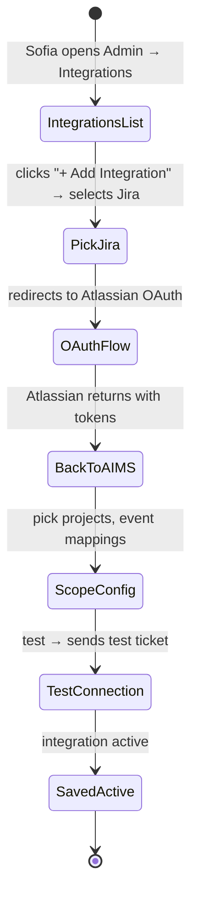
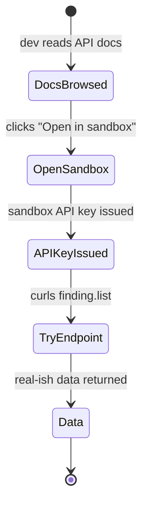
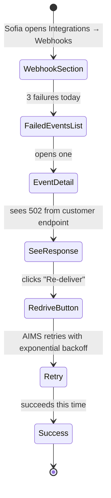

# UX — Integrations & API

> The integrations and API UX surfaces are for admins and developers — not day-to-day audit work. Tenant admins (Sofia) connect AIMS to their SSO, ticketing, HRIS, and GL systems; they manage webhooks and API keys. Developers (their in-house or the customer's vendor) read API docs and use sandbox credentials. UX goal: hide complexity for admins (guided connectors), expose power for developers (thorough docs, good sandbox).
>
> **Feature spec**: [`features/integrations-and-api.md`](../features/integrations-and-api.md)
> **Related UX**: [`tenant-onboarding-and-admin.md`](tenant-onboarding-and-admin.md) (integration list appears in admin)
> **Primary personas**: Sofia (tenant admin configures), partner developer (reads docs, tests sandbox), Marcus (approves integrations due to compliance impact)

---

## 1. UX philosophy

- **Guided connectors, not raw config.** For known third-party systems (Okta, Jira, Workday, NetSuite), AIMS provides a wizard: "Connect to Jira" → OAuth → select project → done. No raw JSON blobs.
- **Webhooks are observable.** Sofia must be able to see: which events fired, whether delivery succeeded, what the response was, and how to replay failures.
- **API keys are scoped, rotatable, loggable.** Every key has a scope (read-only, read-write, admin-ops), expiration, and a "last used" timestamp.
- **Sandbox is real.** Developers need to hit real endpoints with real-ish data — not docs. AIMS provides a sandbox tenant per customer with seeded data, separate API keys, and a "sandbox mode" UI indicator.
- **Deprecation is boring, not surprising.** API deprecation is scheduled months ahead, surfaced in headers + dashboards, never via "we pulled the rug."

---

## 2. Primary user journeys

### 2.1 Journey: Sofia connects AIMS to Jira



### 2.2 Journey: Developer tests API in sandbox



### 2.3 Journey: Sofia investigates failed webhook



---

## 3. Screen — Integrations list

Invoked from: Admin → Integrations.

### 3.1 Layout

```
┌─ Integrations ────────────────────────────────────────────[+ Add Integration]┐
│                                                                                 │
│  Active (4)                                                                     │
│                                                                                 │
│  ┌─ Okta (SSO) ────────────────────────────── [ACTIVE] ─────────────────────┐│
│  │ Last sync: 12 min ago · Login success 2h ago            [Configure][Logs]││
│  └───────────────────────────────────────────────────────────────────────────┘│
│                                                                                 │
│  ┌─ Jira Cloud (Issue tracking) ─────────────── [ACTIVE] ────────────────────┐│
│  │ Project NS-AUDIT · Last event 4h ago                    [Configure][Logs]││
│  └───────────────────────────────────────────────────────────────────────────┘│
│                                                                                 │
│  ┌─ Slack (Notifications) ─────────────────── [ACTIVE] ────────────────────── │
│  │ Channel #audit-ops · 127 messages this month           [Configure][Logs]││
│  └───────────────────────────────────────────────────────────────────────────┘│
│                                                                                 │
│  ┌─ Workday (HRIS, personnel sync) ────────── [DEGRADED ⚠] ──────────────── │
│  │ Last sync 2d ago (expected hourly) · 4 failed webhooks  [Configure][Logs]││
│  └───────────────────────────────────────────────────────────────────────────┘│
│                                                                                 │
│  Available                                                                      │
│  NetSuite · QuickBooks · ServiceNow · BambooHR · Microsoft Teams · Linear      │
│  [Browse marketplace]                                                           │
└─────────────────────────────────────────────────────────────────────────────────┘
```

### 3.2 Status indicators

- **ACTIVE** — connected, events flowing, last activity within expected window
- **DEGRADED** — connected but recent failures or stale sync
- **PAUSED** — manually paused by admin
- **ERROR** — connection broken (expired token, IdP change)

---

## 4. Screen — Connector setup (Jira example)

Multi-step wizard:

### 4.1 Step 1: OAuth

Explainer + "Continue to Jira" button → redirects to Atlassian OAuth → returns.

### 4.2 Step 2: Scope

```
┌─ Jira connection — choose scope ────────────────────────────────────────┐
│                                                                           │
│  AIMS can read and write to these Jira projects:                         │
│                                                                           │
│   [x] NS-AUDIT (Audit Operations)                                        │
│   [ ] NS-ENG (Engineering)                                               │
│   [ ] NS-SEC (Security)                                                  │
│                                                                           │
│  Event mapping                                                            │
│   AIMS finding submitted    → create Jira issue in [NS-AUDIT ▼]          │
│   CAP overdue               → comment on Jira issue + raise priority     │
│   Recommendation response   → update Jira issue status                   │
│                                                                           │
│  Issue type: [ Task ▼ ]                                                   │
│                                                                           │
│                                          [ Back ]  [ Test ]  [ Save ]   │
└───────────────────────────────────────────────────────────────────────────┘
```

### 4.3 Step 3: Test

"Send test event" → triggers a sample event → shows response in-line ("Created NS-AUDIT-42. [View in Jira]"). On success, Save enables.

---

## 5. Screen — Webhooks

Invoked from: Admin → Integrations → Webhooks.

### 5.1 Layout

```
┌─ Webhooks ──────────────────────────────────────── [+ Add webhook]────────┐
│                                                                              │
│  3 endpoints · 4 events today · 1 failure today                             │
│                                                                              │
│  ┌─ https://internal.ns.com/hooks/aims ──────── [ACTIVE] ────────────────┐│
│  │ Events: finding.published · cap.overdue · report.published             ││
│  │ Last 24h: 47 delivered · 1 failed (502 from target)                    ││
│  │ HMAC-SHA256 signature with timestamp per Stripe spec                  ││
│  │                                                 [Edit][Logs][Rotate]  ││
│  └────────────────────────────────────────────────────────────────────────┘│
│                                                                              │
│  ┌─ https://zapier.com/hooks/aims/xyz ────────── [ACTIVE] ────────────────┐│
│  │ Events: all                                                             ││
│  │ Last 24h: 128 delivered · 0 failed                                     ││
│  │                                                 [Edit][Logs][Rotate]  ││
│  └────────────────────────────────────────────────────────────────────────┘│
└──────────────────────────────────────────────────────────────────────────────┘
```

### 5.2 Webhook logs

```
┌─ Webhook logs — https://internal.ns.com/hooks/aims ─────── [Filter: Failed ▼]┐
│                                                                                 │
│  Apr 22 14:22    finding.published        ❌ HTTP 502                            │
│   Event: F-2026-0042                                                           │
│   Attempts: 1 of 5 (next retry in 2 min)                                       │
│   Response body: "Bad Gateway"                                                  │
│   [ View request payload ] [ Re-deliver now ]                                   │
│                                                                                 │
│  Apr 22 14:05    cap.overdue             ✓ HTTP 200  12ms                      │
│  Apr 22 13:55    finding.responded       ✓ HTTP 200  45ms                      │
│  Apr 22 13:22    report.published        ✓ HTTP 200  220ms                     │
│  ... (more)                                                                     │
└─────────────────────────────────────────────────────────────────────────────────┘
```

### 5.3 Re-delivery

Clicking "Re-deliver now" sends the exact same signed payload again. Useful when target was briefly down.

---

## 6. Screen — API keys

Invoked from: Admin → Integrations → API keys.

### 6.1 Layout

```
┌─ API keys ─────────────────────────────────────────── [+ New key]────────┐
│                                                                              │
│  ┌─ Production keys (2) ─────────────────────────────────────────────────┐││
│  │ Name             │ Scope        │ Created   │ Last used │ Expires     │││
│  │ Jira integration │ read-write   │ 2026-01-15│ 4h ago    │ 2027-01-15  │││
│  │                                                     [Rotate][Revoke] │││
│  │ Analytics export │ read-only    │ 2026-02-01│ 2d ago    │ No expiry   │││
│  │                                                     [Rotate][Revoke] │││
│  └─────────────────────────────────────────────────────────────────────────┘│
│                                                                              │
│  ┌─ Sandbox keys (1) ────────────────────────────────────────────────────┐││
│  │ Dev team testing │ admin-ops   │ 2026-03-10│ 20m ago   │ No expiry   │││
│  │                                                     [Rotate][Revoke] │││
│  └─────────────────────────────────────────────────────────────────────────┘│
└──────────────────────────────────────────────────────────────────────────────┘
```

### 6.2 New key dialog

```
┌─ New API key ─────────────────────────────────────────────────────────┐
│                                                                         │
│  Name:   [ Data warehouse sync ]                                       │
│  Environment:  (●) Production   ( ) Sandbox                           │
│  Scope:                                                                 │
│   (●) Read-only (all resources)                                        │
│   ( ) Read-write (excludes admin ops)                                  │
│   ( ) Admin-ops (full access)  ⚠ requires CAE approval                │
│  Expires:  ( ) No expiry  (●) [ 2027-04-22 ]                          │
│                                                                         │
│  ⓘ Key will be shown once on creation. Store it safely.                 │
│                                                                         │
│                                        [ Cancel ]  [ Create key ]    │
└─────────────────────────────────────────────────────────────────────────┘
```

### 6.3 Key displayed once

On creation:

```
┌─ Key created ────────────────────────────────────────────────────────┐
│                                                                        │
│  Save this key now — it cannot be retrieved again.                    │
│                                                                        │
│  aims_prod_sk_A8f…X2p9   [ Copy ]                                     │
│                                                                        │
│  [ ] I've saved this key                                               │
│                                                                        │
│                                                    [ Done ]           │
└────────────────────────────────────────────────────────────────────────┘
```

Done button disabled until checkbox ticked.

---

## 7. Developer portal (docs)

Auto-generated from OpenAPI spec + tRPC type defs; served at `/dev` subdomain.

### 7.1 Layout

```
┌─ AIMS Developer Docs ──────────────────────────────────────── [Search] ─┐
│                                                                            │
│  ┌─ Sidebar ────────┐ ┌─ Main ──────────────────────────────────────┐  │
│  │                   │ │                                              │  │
│  │ Getting started  │ │ # findings.list                              │  │
│  │  Quickstart       │ │                                              │  │
│  │  Authentication   │ │ List findings for an engagement.             │  │
│  │  Sandbox          │ │                                              │  │
│  │                   │ │ ## Parameters                                │  │
│  │ Core resources    │ │ engagementId · string (required)             │  │
│  │  Engagements      │ │ status · enum (optional)                     │  │
│  │  Findings         │ │ pageSize · number (default 20, max 100)     │  │
│  │  Recommendations  │ │                                              │  │
│  │  CAPs             │ │ ## Try it                                    │  │
│  │  Work papers      │ │                                              │  │
│  │  PBC              │ │ [ curl / JS / Python ]                       │  │
│  │                   │ │                                              │  │
│  │ Reference         │ │ curl https://api.aims.io/v1/findings.list \  │
│  │  Webhooks         │ │   -H "Authorization: Bearer aims_sbx_sk_…" \ │
│  │  Error codes      │ │   -G                                          │  │
│  │  Rate limits      │ │   -d "engagementId=eng_123"                  │  │
│  │  Deprecation      │ │                                              │  │
│  │                   │ │ [ Run in sandbox ]                           │  │
│  │ API changelog     │ │                                              │  │
│  │                   │ │ ## Response                                  │  │
│  │                   │ │ ```json                                       │  │
│  │                   │ │ { "findings": [ ... ], "nextCursor": null }  │  │
│  │                   │ │ ```                                           │  │
│  └───────────────────┘ └──────────────────────────────────────────────┘  │
└────────────────────────────────────────────────────────────────────────────┘
```

### 7.2 Run in sandbox

Inline code runner: "Run in sandbox" uses the developer's sandbox key to hit the live sandbox endpoint and display response. Useful for teaching + debugging.

---

## 8. API deprecation surfaces

Per feature spec, AIMS uses hybrid versioning: URL major (`/v1/`) + dated minor (`Api-Version: 2026-04-22`).

### 8.1 Deprecation dashboard

Admin → Integrations → API health:

```
┌─ API health ──────────────────────────────────────────────────────────┐
│                                                                         │
│  Your integrations are using these versions:                           │
│   • v1 / 2026-04-22 (latest)     — 14,200 calls past 30d              │
│   • v1 / 2026-01-15              — 892 calls past 30d                  │
│   • v1 / 2025-10-15  [DEPRECATED] —  42 calls past 30d                 │
│                                                                         │
│  ⚠ v1/2025-10-15 is deprecated — support ends 2026-10-15              │
│    [View migration guide]                                              │
│                                                                         │
│  Deprecation headers are being sent in responses to this version.      │
└─────────────────────────────────────────────────────────────────────────┘
```

### 8.2 Changelog

Developer portal has a changelog surface with version-dated entries; breaking changes marked, examples provided for migration.

---

## 9. Loading, empty, error states

| State | Treatment |
|---|---|
| No integrations configured | "Connect AIMS to your stack. Start with your SSO provider. [Browse]" |
| Connection test fails | Error detail + Remediation hints: "Token scope 'write:projects' is required but missing. Re-authorize with correct scope." |
| Webhook delivery fails | In-line error on log; retry queued automatically (5 attempts exponential); manual re-deliver available |
| API rate limit hit on developer's side | 429 response; Developer portal shows "you've hit the rate limit; consider caching or upgrading plan" |
| Key rotated but old still in use | Warning banner; old key still valid for 7 days with deprecation header; then revoked |

---

## 10. Responsive behavior

Admin/integration surfaces are desktop-first. Mobile shows read-only status; no configuration on phone.

Developer docs are fully responsive (technical writing).

---

## 11. Accessibility

- OAuth redirect flows have screen-reader-friendly "Redirecting to Atlassian…" text
- Webhook logs have proper table semantics
- API key display uses `<code>` with `aria-label` explaining copy behavior
- Code runner in docs has keyboard shortcuts (Ctrl+Enter to run)

---

## 12. Keyboard shortcuts

Integrations list:

| Shortcut | Action |
|---|---|
| `/` | Focus search |
| `n` | New integration |
| `k` | New API key |

Developer docs:

| Shortcut | Action |
|---|---|
| `/` | Focus search |
| `⌘+K` | Jump to endpoint by name |
| `Ctrl+Enter` (in code runner) | Run sandbox request |

---

## 13. Microinteractions

- **Integration connection test succeeds**: progress bar fills to 100% with green check fade-in
- **Webhook event delivery**: log entry appears at top of logs live (WebSocket-driven)
- **API key created**: card animates in with a subtle scale effect
- **Deprecation warning banner**: pulses gently when first shown to user, then static

---

## 14. Analytics & observability

- `ux.integ.connector_started { connector_type }`
- `ux.integ.connector_completed { connector_type, time_to_setup_seconds }`
- `ux.integ.webhook_added { event_count }`
- `ux.integ.webhook_failure_shown { endpoint_id, failure_reason }`
- `ux.integ.webhook_redelivered { endpoint_id, original_failure }`
- `ux.integ.api_key_created { scope, expiry_set }`
- `ux.integ.api_key_rotated { key_id, time_since_created_days }`
- `ux.dev.docs_opened { page_path }`
- `ux.dev.sandbox_request_sent { endpoint, success }`

KPIs:
- **Integration time-to-first-event** (connect → first successful event; target median ≤ 15 min)
- **Webhook delivery success rate** (target ≥99.5% after retries)
- **API key rotation adherence** (% of long-lived keys rotated within 1yr; target ≥80%)
- **Sandbox-to-production conversion** (developer uses sandbox → later uses prod; target ≥60%)

---

## 15. Open questions / deferred

- **CDC (change data capture) via Debezium**: deferred. Per R1 refinement, MVP 1.0 offers flat-file S3 dumps (Parquet/CSV) instead.
- **OpenAPI generator export** (customer gets SDKs auto-generated): MVP 1.5
- **Webhook payload transformations** (pre-delivery mapping): deferred
- **Customer-authored connectors (marketplace)**: deferred to v2.2+
- **SCIM protocol for auto user provisioning**: MVP 1.5

---

## 16. References

- Feature spec: [`features/integrations-and-api.md`](../features/integrations-and-api.md)
- API: [`api-catalog.md`](../api-catalog.md)
- Related UX: [`tenant-onboarding-and-admin.md`](tenant-onboarding-and-admin.md)

---

*Last reviewed: 2026-04-22. Phase 6 (UX) draft — pending external review.*
