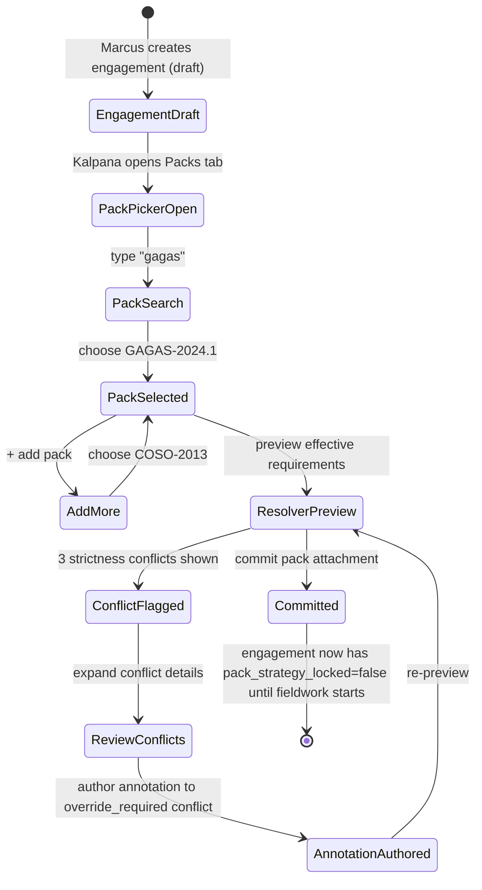
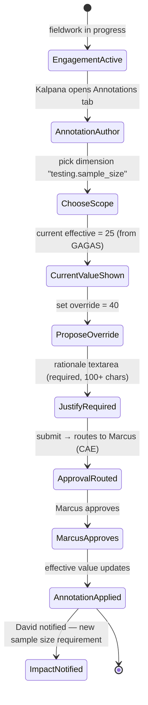
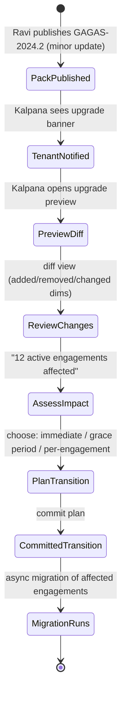

# UX — Pack Attachment & Annotation

> The single most distinctive UX surface in AIMS v2. Pack attachment is where Kalpana (Methodology Lead) decides what standards an engagement must comply with; annotation is where she overrides or tightens specific requirements for this particular audit. If this UX is confusing, the whole multi-standard value proposition collapses — users will default to a single-pack "just pick GAGAS" behavior and AIMS becomes a commodity tool.
>
> **Feature spec**: [`features/pack-attachment-and-annotation.md`](../features/pack-attachment-and-annotation.md)
> **Related UX**: [`engagement-management.md §4.2`](engagement-management.md) (pack picker is invoked from engagement creation and from engagement dashboard → Packs tab)
> **Primary persona**: Kalpana Rao (Methodology Lead) — authors annotation sets, reviews resolver output; Marcus (CAE) — approves pack strategy; David (Supervisor) — consumes resolver output passively during execution.

---

## 1. UX philosophy for this surface

Three design tensions dominate pack attachment:

1. **Expert vs. operator.** Kalpana is a methodology expert; she wants to see the raw dimension matrix, strictness direction, and override history. David and Jenna are operators; they want a single answer to "what do I have to do for this engagement?" — not a matrix. The UI must serve both without forcing operators through expert detail, and without dumbing down the expert view.
2. **Commitment asymmetry.** Attaching a pack to a draft engagement is cheap — a dropdown. Attaching a pack after fieldwork starts carries workflow and compliance consequences (existing work papers may need re-classification, some requirements may retroactively apply). The UI must make the cost visible without blocking legitimate mid-engagement pack changes.
3. **Resolver opacity is the failure mode.** If users can't predict what the resolver will do with their pack selection, they lose trust in AIMS's multi-standard story. Every resolver output must be explainable — every field must answer "why this value?" by pointing back to the specific pack and annotation that produced it.

Design principles that fall out:

- **Show the final answer first, details on demand.** Default view is the resolver output ("your effective requirements are X, Y, Z"). Pack composition, annotation diffs, and dimension-by-dimension strictness are one click away.
- **Provenance on every effective value.** Each resolved value has a hover card: "Value = 80 hours. Source: CPE strictness direction = max. Contributing packs: GAGAS-2024 (80), IIA-2024 (40). Winner: GAGAS-2024."
- **Annotations are reviewable diffs, not free-form edits.** Authoring an annotation feels like opening a PR against a pack — you see exactly what you're changing, and every change requires a rationale.
- **Version transitions are planned, not sprung.** When a new pack version is published, tenants opt in; the UI shows a diff-oriented preview before commit.

---

## 2. Primary user journeys

### 2.1 Journey: Kalpana attaches packs to a new engagement



### 2.2 Journey: Kalpana authors an annotation mid-engagement



### 2.3 Journey: Tenant opts into new pack version



---

## 3. Screen — Pack picker modal (engagement scope)

Invoked from: Engagement creation wizard (step 2), Engagement dashboard → Packs tab → "Add pack" button.

### 3.1 Layout

```
┌─ Attach packs to "FY26 Q1 Revenue Cycle Audit" ─────────────────────────────┐
│                                                                              │
│  Selected packs (2)                                        [Clear all] [X]  │
│  ┌────────────────────────────────────────────────────────────────────────┐ │
│  │ ● GAGAS-2024.1       Methodology     v1    [Remove] [Lock] [Annotate]  │ │
│  │ ● COSO-2013          Control Framework v3    [Remove] [Lock] [Annotate]│ │
│  └────────────────────────────────────────────────────────────────────────┘ │
│                                                                              │
│  Search packs                                                                │
│  [ 🔍  gagas_________________________________ ]   Filter: [All types ▼]     │
│                                                                              │
│  Available (showing 3 of 24)                                                 │
│  ┌────────────────────────────────────────────────────────────────────────┐ │
│  │ ○ GAGAS-2024.2       Methodology     v2    [Latest] [+ Add]            │ │
│  │    Yellow Book 2024, GAO amendment 2                                   │ │
│  │ ○ SOX-404            Reg Overlay     v4    [+ Add]                     │ │
│  │    SOX internal control compliance overlay                             │ │
│  │ ○ ISO-27001-2022     Control Framework v1  [+ Add]                     │ │
│  │    Information security management                                     │ │
│  └────────────────────────────────────────────────────────────────────────┘ │
│                                                                              │
│  ┌─ Resolver preview ──────────────────────────────────────────────────────┐│
│  │  [▼ Effective requirements]   [▼ Conflicts (3)]   [▼ Dimension matrix]  ││
│  │                                                                          ││
│  │  3 strictness conflicts detected — click to review                       ││
│  │  • cpe.annual_hours           max        →  GAGAS (80) wins              ││
│  │  • independence.cooling_off   union      →  combined GAGAS+COSO          ││
│  │  • testing.documentation      override_required  ⚠  manual decision     ││
│  └──────────────────────────────────────────────────────────────────────────┘│
│                                                                              │
│                                            [Cancel]  [Preview]  [Commit →]  │
└──────────────────────────────────────────────────────────────────────────────┘
```

### 3.2 Interactions

| Element | Behavior |
|---|---|
| Search box | Debounced (200ms), fuzzy match on pack name + description. Autofocus on open. `/` keyboard shortcut re-focuses. |
| Filter dropdown | Type = methodology / control framework / regulatory overlay / all. Default "all". |
| `+ Add` on available pack | Adds to selected list; resolver re-runs and preview pane re-renders. Optimistic UI — the "Add" button flips to "Remove" immediately. |
| `Remove` on selected pack | Confirmation modal if engagement has `pack_strategy_locked = true`. Otherwise immediate. |
| `Lock` on selected pack | Pins this pack version across future pack library updates (e.g., GAGAS-2024.1 stays pinned even if -.2 published). |
| `Annotate` on selected pack | Opens annotation authoring modal (§5). |
| Resolver preview | Live-updates as packs are added/removed. Section expansion state persists during modal session. |
| `Commit` | Writes to `engagement.pack_attachments` via `pack.attach()` tRPC call. Shows toast: "3 packs attached. Effective requirements updated." |
| `Preview` | Generates a non-committing resolver report (downloadable as PDF) for stakeholder review before commit. |

### 3.3 Empty & error states

- **No packs attached**: Center-panel empty state — "Attach at least one pack to define compliance requirements." CTA: "Browse pack library" (opens the search focused). Commit button disabled.
- **Resolver errors** (e.g., circular dependency in annotation): Red banner at top of preview pane. Commit blocked until resolved.
- **Pack library API down**: Toast + search results show cached packs from last-known-good state with a staleness indicator.

---

## 4. Resolver output — the effective requirements view

This is what David sees when he opens an engagement's Packs tab. It's the **consumable form** of pack attachment — not a list of packs, but a list of **what you have to do**.

### 4.1 Layout

```
┌─ Effective requirements — FY26 Q1 Revenue Cycle Audit ──────────────────────┐
│                                                                              │
│  Packs:  GAGAS-2024.1 · COSO-2013                   [Manage packs] [Export] │
│                                                                              │
│  ┌─ Filter ─────────────────────────────────────────────────────────────────┐│
│  │  Category: [All ▼]   Source: [All packs ▼]   [ ] Only annotated         ││
│  └──────────────────────────────────────────────────────────────────────────┘│
│                                                                              │
│  ┌─ Documentation ────────────────────────────────────────────────────────┐ │
│  │ Field: workpaper_reviewer_required                                      │ │
│  │ Effective: YES                                                          │ │
│  │ Source: GAGAS-2024.1 §6.02 (max strictness wins)           [Why? ▼]     │ │
│  │                                                                          │ │
│  │ Field: workpaper_retention_years                                        │ │
│  │ Effective: 7                                                            │ │
│  │ Source: GAGAS-2024.1 §6.50 (COSO has no value)             [Why? ▼]     │ │
│  │                                                                          │ │
│  │ Field: workpaper_naming_convention                                      │ │
│  │ Effective: "WP-{fiscal_year}-{sequence}"                                │ │
│  │ Source: Annotation by Kalpana 2026-03-14 (override)        [Why? ▼] 🖊 │ │
│  └──────────────────────────────────────────────────────────────────────────┘│
│                                                                              │
│  ┌─ Sampling ────────────────────────────────────────────────────────────┐  │
│  │ Field: minimum_sample_size                                             │  │
│  │ Effective: 40                                                          │  │
│  │ Source: Annotation (override_required) — Kalpana 2026-03-14  [Why?] 🖊│  │
│  │ Rationale: "Elevated risk — CFO under investigation"                   │  │
│  │                                                                         │  │
│  │ Field: sampling_method                                                 │  │
│  │ Effective: "attribute"                                                 │  │
│  │ Source: GAGAS-2024.1                                      [Why? ▼]     │  │
│  └─────────────────────────────────────────────────────────────────────────┘│
│                                                                              │
│  ┌─ CPE ──────────────────────────────────────────────────────────────────┐ │
│  │ Field: annual_hours_required                                            │ │
│  │ Effective: 80                                                           │ │
│  │ Source: GAGAS-2024.1 (max wins over IIA 40)               [Why? ▼]     │ │
│  └──────────────────────────────────────────────────────────────────────────┘│
│                                                                              │
│  68 effective fields across 12 categories           [Expand all] [Collapse] │
└──────────────────────────────────────────────────────────────────────────────┘
```

### 4.2 The "Why?" provenance popover

Clicking `Why? ▼` on any field expands an inline explanation:

```
┌─ Why: workpaper_retention_years = 7 ─────────────────────────────────┐
│                                                                       │
│  Resolver trace:                                                      │
│    1. GAGAS-2024.1 §6.50 declares: retention_years = 7                │
│    2. COSO-2013 has no value for this dimension                       │
│    3. Strictness direction: max                                       │
│    4. Only one contributing value (7) → winner                        │
│    5. No annotation modifies this field                               │
│                                                                       │
│  [View in GAGAS §6.50]   [Propose annotation]                         │
└───────────────────────────────────────────────────────────────────────┘
```

For annotated fields, the popover shows the before/after, the author, the approver (if approval was required), the timestamp, and the rationale — all in one panel. This is the **single most important UX moment in AIMS v2**: it's the point where users stop wondering "what is the system doing to me?" and start understanding the pack model.

### 4.3 Icon legend

- 🖊 (pencil) = field has an active annotation
- 🔒 (lock) = pack version is pinned for this engagement
- ⚠ (warning) = field is in an unresolved `override_required` conflict (commit blocked until resolved)
- ✓ (check) = field has passed through approval (for annotations requiring approval)

---

## 5. Annotation authoring modal

Invoked from: Packs tab → `Annotate` button on a pack, or Effective Requirements → `Propose annotation` on a field.

### 5.1 Layout

```
┌─ Author annotation — sampling.minimum_sample_size ──────────────────────────┐
│                                                                              │
│  Scope:  This engagement only  ▼                                            │
│         (options: This engagement / All engagements in FY26 / Tenant-wide)  │
│                                                                              │
│  Dimension:  sampling.minimum_sample_size                                    │
│  Current effective:  25  (from GAGAS-2024.1)                                │
│                                                                              │
│  Direction:  ( ) tighten   (●) override_required   ( ) loosen               │
│                                                                              │
│  New value:   [ 40 ]                                                         │
│                                                                              │
│  Rationale (required, 100+ chars)                                            │
│  ┌──────────────────────────────────────────────────────────────────────┐   │
│  │ Elevated risk of material misstatement — CFO is under SEC            │   │
│  │ investigation announced 2026-02-28, auditees have shown evasive      │   │
│  │ responses to PBC items. Increased sample size to 40 to achieve       │   │
│  │ higher assurance.                                                     │   │
│  └──────────────────────────────────────────────────────────────────────┘   │
│  142 / 100 min                                                               │
│                                                                              │
│  ┌─ Approval routing ──────────────────────────────────────────────────────┐│
│  │ Override direction "override_required" triggers CAE approval.            ││
│  │ Will route to: Marcus Thompson (CAE) upon submit.                        ││
│  │ Estimated SLA: 24 business hours                                         ││
│  └──────────────────────────────────────────────────────────────────────────┘│
│                                                                              │
│  ┌─ Impact preview ────────────────────────────────────────────────────────┐│
│  │ Affected:                                                                ││
│  │   • 1 engagement (this one)                                              ││
│  │   • 0 work papers retroactively reclassified                             ││
│  │   • 4 future test steps will use sample_size=40                          ││
│  │   • No notifications to external parties                                 ││
│  └──────────────────────────────────────────────────────────────────────────┘│
│                                                                              │
│                                    [Save as draft]  [Cancel]  [Submit →]   │
└──────────────────────────────────────────────────────────────────────────────┘
```

### 5.2 Interactions

| Element | Behavior |
|---|---|
| Scope dropdown | Engagement / FY period / tenant-wide. Tenant-wide routes through additional approval (Ravi + Marcus). |
| Dimension picker | Searchable, grouped by category. Shows current effective value as you select. Prevents selecting dimensions not declared by attached packs. |
| Direction radio | `tighten` / `override_required` / `loosen`. UI disables invalid combinations (can't loosen a pack that doesn't allow it per its `annotation_policy`). |
| New value | Type-aware input: number for numeric dims, text for strings, boolean toggle for flags, multi-select for enum lists. Validates against the pack's declared type. |
| Rationale | Required, minimum length enforced. Tokens like [ticket:XYZ] auto-link to integrations. |
| Approval routing preview | Dynamically rendered from `strictness_direction` + `tenant.policy.annotation_approval_rules`. |
| Impact preview | Server-side dry-run — queries affected engagements, work papers, future test steps. Async; shows spinner while computing. |
| Save as draft | Persists to `annotation.drafts` — Kalpana can return later. No approval triggered. |
| Submit | Creates `AnnotationProposal`, routes via ApprovalWorkflowService, returns to Packs tab with toast: "Annotation submitted. Awaiting Marcus Thompson's approval." |

### 5.3 Edge cases

- **Direction mismatch with pack policy**: Pack declares `annotation_policy.allowed_directions = ["tighten"]`; user picks "loosen". Error inline: "This pack does not allow loosening. Contact pack publisher." Submit blocked.
- **Circular annotation**: User annotates a dimension that depends on another annotated dimension in a cycle. Resolver preview shows red banner; submit blocked.
- **Impact preview finds retroactive reclassification**: Warning banner: "12 work papers will be retroactively reclassified under the new requirement. Affected engagement supervisors will be notified." Explicit `[ ] I acknowledge retroactive impact` checkbox required before Submit enables.

---

## 6. Pack strategy lock

Each engagement has a `pack_strategy_locked` boolean. It defaults to `false` during planning phase and flips to `true` when the engagement transitions to fieldwork (per `engagement-management.md §4.3` phase gate).

**What locking changes in this UX:**

- Adding packs: requires approval (routes to CAE). Banner at top of pack picker: "This engagement is in fieldwork. Adding packs may retroactively apply requirements to existing work papers. Continue?"
- Removing packs: requires approval AND rationale (min 200 chars). Same banner. 
- Annotations: no change — annotations can always be authored (with appropriate routing).
- Pack version upgrades: blocked until the CAE explicitly unlocks the pack strategy (one-click "Unlock for version upgrade" action, reverts on next commit).

**Visual treatment of locked state:**

Pack picker modal shows a padlock icon next to the engagement title and an amber info banner in the header:

```
┌─ Attach packs to "FY26 Q1 Revenue Cycle Audit" 🔒 ──────────────────────────┐
│  ⚠ Pack strategy is locked (engagement in fieldwork).                        │
│    Pack changes will trigger CAE approval and may retroactively affect WPs. │
```

---

## 7. Pack version upgrade UX

Invoked from: Admin → Pack library → Upgrades (Kalpana's role) OR from the tenant-wide upgrade banner that appears when a new version is published.

### 7.1 Upgrade banner

Appears site-wide (below top nav, dismissible per-user but persists):

```
┌─ 🆕 GAGAS-2024.2 is now available (was 2024.1) ─────────────────────────────┐
│  Minor update — 3 dimensions changed, 2 added. 12 active engagements        │
│  will be affected if you upgrade.                                            │
│                               [Review changes]  [Dismiss for 7 days]        │
└──────────────────────────────────────────────────────────────────────────────┘
```

### 7.2 Upgrade review screen

```
┌─ Upgrade preview — GAGAS-2024.1 → GAGAS-2024.2 ──────────────────────────────┐
│                                                                               │
│  ┌─ Dimension changes ────────────────────────────────────────────────────┐  │
│  │ + Added                                                                 │  │
│  │   • reporting.cybersecurity_disclosure (default: required)              │  │
│  │   • cpe.ethics_hours_minimum (default: 4)                               │  │
│  │                                                                          │  │
│  │ ~ Changed                                                                │  │
│  │   • testing.documentation_retention_years: 5 → 7                        │  │
│  │   • sampling.minimum_sample_size: 25 → 30                               │  │
│  │   • independence.cooling_off_period: "12m" → "24m"                      │  │
│  │                                                                          │  │
│  │ - Removed                                                                │  │
│  │   (none)                                                                 │  │
│  └──────────────────────────────────────────────────────────────────────────┘  │
│                                                                               │
│  ┌─ Impact analysis ──────────────────────────────────────────────────────┐  │
│  │ 12 active engagements will be affected.                                  │  │
│  │ Of those:                                                                 │  │
│  │   • 3 have annotations that become incompatible → manual review needed   │  │
│  │   • 5 have work papers that may need re-classification                   │  │
│  │   • 4 have no material impact                                             │  │
│  │                                                                           │  │
│  │ [View per-engagement breakdown]                                           │  │
│  └───────────────────────────────────────────────────────────────────────────┘ │
│                                                                               │
│  ┌─ Transition plan ─────────────────────────────────────────────────────┐   │
│  │ ( ) Immediate — all engagements migrate on commit                       │   │
│  │ (●) Grace period — new engagements use 2024.2; existing stay on 2024.1 │   │
│  │     until their next phase gate                                          │   │
│  │ ( ) Per-engagement — Kalpana decides per engagement                     │   │
│  └───────────────────────────────────────────────────────────────────────────┘ │
│                                                                               │
│                      [Decline upgrade]  [Save plan]  [Commit upgrade →]      │
└───────────────────────────────────────────────────────────────────────────────┘
```

### 7.3 Per-engagement breakdown drawer

Slides in from right when "View per-engagement breakdown" clicked:

```
Engagement                            Annotations affected    Risk
─────────────────────────────────────────────────────────────────────
FY26 Q1 Revenue Cycle Audit           1 (sampling min)        Low
FY26 Payroll Compliance Audit         2 (retention, cooling)  Medium  ⚠
FY26 Q2 Vendor Management Audit       0                       Low
…
```

Each row expandable to show which specific annotations conflict and what Kalpana's remediation options are (accept change / re-author annotation / keep pinned on 2024.1).

---

## 8. Pack library browser (admin surface)

Invoked from: Admin → Pack library.

Simpler than the engagement-scope picker because it's just a catalog view. List of packs with:

- Type badge (methodology / control framework / regulatory overlay)
- Version (with "Latest" badge on the newest)
- Published date, publisher (AIMS platform / self-authored)
- "In use by N engagements" count
- Actions: View details / View changelog / View dimension schema (JSON) / Pin-as-default-for-new-engagements

Self-authored packs (tenant-published, per `features/pack-attachment-and-annotation.md §6`) have additional actions: Edit / Publish new version / Retire.

---

## 9. Loading, empty, error states

| State | Treatment |
|---|---|
| First-time tenant, no packs attached anywhere | Empty state on engagement Packs tab: "No packs attached. Compliance requirements are undefined." CTA: "Attach a pack" (primary button). Secondary: "What are packs? [link to docs]". |
| Resolver is computing (large packset) | Preview pane shows skeleton rows with shimmer. Server target: p95 < 800ms for 5 packs × 200 dimensions. Above 3s, shows explicit "Resolving..." banner with a cancel option. |
| Resolver error (cycle, schema mismatch) | Red banner in preview pane: "Resolver encountered an error. [Show details]". Details drawer lists each violation with line-level citations into the pack JSON. Commit blocked. |
| Pack version not available in tenant's region | Greyed-out in available list with tooltip: "This pack is not yet available in your region (us-east-1). Contact support." |
| User lacks permission to annotate | `Annotate` button hidden; "Propose annotation" link on fields shows "Requires Methodology Lead role" tooltip. |
| Annotation approval timeout (approver idle > SLA) | Banner on engagement dashboard: "Annotation proposal has been awaiting approval for 36 hours. [Re-route] [Re-notify]". |

---

## 10. Responsive behavior

Pack attachment is a desktop-first workflow — Kalpana is not doing this on her phone. But graceful degradation required:

- **lg (1024px+)**: Full modal as drawn, 3-column resolver preview (packs / effective values / conflicts).
- **md (768-1023px)**: Modal collapses to single column; resolver preview becomes accordion tabs (Effective / Conflicts / Matrix).
- **sm (<768px)**: Read-only resolver output only. "Edit packs" button shows a modal: "Pack attachment is best done on a larger screen. [Continue anyway]". Full-functionality mobile deferred.

Engagement dashboard → Packs tab is more forgiving — it's a read-surface, works fine on tablet.

---

## 11. Accessibility

- All conflict markers (⚠, 🖊, 🔒) have text equivalents announced by screen readers: `<span class="sr-only">Override required — manual decision needed</span>` in addition to the icon.
- Dimension matrix (expert view) is a proper `<table>` with `<thead>`, `scope` attributes, and caption summarizing purpose.
- Pack picker modal traps focus, `Escape` cancels, `Enter` on `+ Add` adds the pack, `Tab` cycles the visible action hierarchy in DOM order.
- Resolver preview expand/collapse uses `aria-expanded` on the trigger; panel has `role="region"` and `aria-labelledby` pointing at the trigger.
- Color is never the sole signal: conflict rows also have a ⚠ glyph and a "Conflict:" text prefix.
- Screen-reader-only summaries for the `Why?` popover state the full trace as a list: "Resolver trace, 5 steps. Step 1: GAGAS declares 7. Step 2: COSO has no value…"

---

## 12. Keyboard shortcuts

Within pack picker modal:

| Shortcut | Action |
|---|---|
| `/` | Focus search |
| `Esc` | Close modal (confirm if uncommitted changes) |
| `⌘+Enter` / `Ctrl+Enter` | Commit |
| `⌘+P` / `Ctrl+P` | Preview (non-committing PDF) |
| `a` (on a selected pack row) | Open annotation modal for that pack |
| `r` (on a selected pack row) | Remove pack (with confirm if locked) |

Within resolver output view:

| Shortcut | Action |
|---|---|
| `e` | Expand all categories |
| `c` | Collapse all categories |
| `f` | Focus filter bar |
| `w` (on a row) | Open Why? popover for that field |

---

## 13. Microinteractions

- **Pack added to selection**: Row slides in from available list to selected list (200ms). Resolver preview re-runs; changed fields pulse amber for 400ms.
- **Annotation submitted**: Modal closes with a confetti-free confirmation — a checkmark fades in center-screen for 1.5s, then fades. Toast lingers 5s: "Annotation submitted. Awaiting Marcus Thompson's approval. [View in approvals]"
- **Conflict resolved**: In preview pane, the conflict row transitions from ⚠ state to ✓ with a 300ms color morph. The "3 conflicts" counter decrements with a tiny bounce.
- **Pack version upgrade committed**: Top-nav banner transforms into a progress bar showing migration progress: "Migrating 12 engagements… 4/12 complete."

All animations respect `prefers-reduced-motion: reduce`; in that mode, transitions are instant.

---

## 14. Analytics & observability

Every interaction in this surface emits a typed event:

- `ux.pack.picker.opened { engagement_id, from_surface }`
- `ux.pack.selected { pack_id, version, engagement_id }`
- `ux.pack.removed { pack_id, engagement_id, had_locked_state }`
- `ux.pack.resolver.conflict_shown { engagement_id, conflict_count, conflict_types }`
- `ux.pack.why_popover.opened { field_path, engagement_id, had_annotation }`
- `ux.pack.annotation.drafted { dimension, direction, scope }`
- `ux.pack.annotation.submitted { dimension, direction, scope, approval_route }`
- `ux.pack.annotation.approved { annotation_id, time_to_approval_hours }`
- `ux.pack.upgrade.banner_seen { pack_id, from_version, to_version }`
- `ux.pack.upgrade.committed { pack_id, from_version, to_version, plan, engagements_affected }`

Goals to track (per the feature spec's success criteria):

- **Why? popover engagement rate** (target: ≥30% of field views, indicating users understand they can drill in).
- **Annotation approval SLA** (target: p90 ≤ 48h from submit to approve).
- **Pack picker abandonment rate** (target: < 15% of opens close without commit — above indicates resolver UX is too opaque).

---

## 15. Open questions / deferred

- **Bulk annotation authoring** (apply one annotation pattern across 10 engagements): deferred to MVP 1.5. For now, Kalpana authors tenant-scoped annotations that apply broadly.
- **Annotation version history / rollback**: deferred to MVP 1.5. Today, annotations are append-only audit entries; rollback = new counter-annotation.
- **Pack composition visualization (dependency graph)**: deferred. Today's matrix view is sufficient for 5-pack max engagement attachments.
- **Delegated annotation approval**: deferred. Today, annotations route to CAE; there's no configurable approver chain yet.

---

## 16. References

- Feature spec: [`features/pack-attachment-and-annotation.md`](../features/pack-attachment-and-annotation.md)
- Related UX: [`engagement-management.md §4.2`](engagement-management.md) (pack picker invocation points)
- Data model: [`data-model/pack.md`](../data-model/pack.md) (dimension schema, strictness direction)
- API: [`api-catalog.md §3.4`](../api-catalog.md) (`pack.*` tRPC namespace)
- ADR: [`references/adr/0007-pack-annotation-model.md`](../references/adr/0007-pack-annotation-model.md)
- Personas: [`02-personas.md §3`](../02-personas.md) (Kalpana)

---

*Last reviewed: 2026-04-22. Phase 6 (UX) draft — pending external review.*
