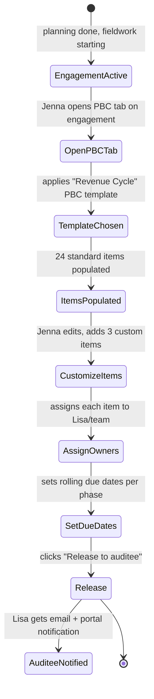
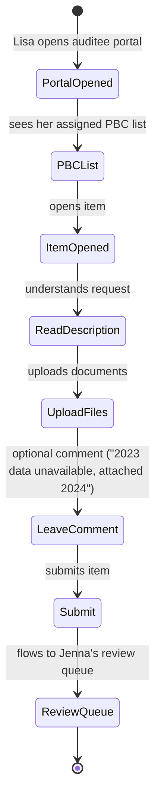
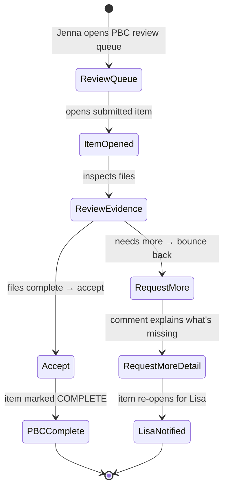

# UX — PBC Management (Prepared-By-Client requests)

> PBC — "Prepared By Client" — is the list of documents, data extracts, and attestations that auditees must provide to the audit team. It's the interface between AIMS and the auditee's world. Poor PBC UX is the single largest source of auditee complaints in legacy tools: ambiguous requests, lost emails, duplicate asks, no visibility into what's still needed. AIMS v2 makes PBC a structured, auditee-facing workflow with SLA tracking, auto-reminder cadence, and evidence lineage.
>
> **Feature spec**: [`features/pbc-management.md`](../features/pbc-management.md)
> **Related UX**: [`fieldwork-and-workpapers.md`](fieldwork-and-workpapers.md) (evidence attaches to work papers), [`finding-authoring.md`](finding-authoring.md) (PBC responses become work paper citations)
> **Primary personas**: Jenna (author PBC requests), Lisa (auditee who fulfills them), David (supervisor reviews evidence)

---

## 1. UX philosophy for this surface

- **One place, not many emails.** Lisa never sees a PBC over email; she sees it in the auditee portal with a list she can check off. Email is a notifier, not a workflow.
- **Structured requests, not prose.** A PBC is: title, description, what format we want, what time period, who's responsible, when it's due. Templates enforce this structure — free-text-only PBCs are an escape hatch, not the norm.
- **Progressive disclosure for auditees.** Lisa's portal hides internal metadata (WP reference, audit risk rating). She sees: what you need, when it's due, how to upload.
- **SLA transparency.** Both sides see the clock. When it's 3 days before due, Lisa sees yellow; when overdue, red. Escalation happens automatically — audit team doesn't need to manually chase.
- **Evidence lineage on upload.** When Lisa uploads a doc, it becomes an `Evidence` record linked to the PBC item. The audit team can later cite that evidence in a work paper or finding with one click; the lineage traces back through PBC → Auditee upload → raw file.
- **No "done" without review.** Lisa submits; Jenna reviews. Lisa can't mark her own PBC complete — the state model enforces this.

---

## 2. Primary user journeys

### 2.1 Journey: Jenna authors a PBC list



### 2.2 Journey: Lisa fulfills PBC items



### 2.3 Journey: Jenna reviews PBC evidence



---

## 3. Screen — PBC authoring (internal)

Invoked from: Engagement dashboard → PBC tab → "Create PBC list" or "Add item."

### 3.1 Layout — PBC list (internal view)

```
┌─ PBC List · FY26 Q1 Revenue Cycle Audit ──────────────[DRAFT]──[Actions ▼]──┐
│                                                                              │
│  Status: DRAFT (not yet released)          Items: 27          Due: rolling  │
│                                                                              │
│  ┌─ Filter ───────────────────────────────────────────────────────────────┐ │
│  │ Category: [All ▼]  Assignee: [All ▼]  Status: [All ▼]  Due: [All ▼]    │ │
│  │                                                   [ + Add item ]        │ │
│  └─────────────────────────────────────────────────────────────────────────┘ │
│                                                                              │
│  ┌─ Category: Revenue controls (8) ───────────────────────────────────────┐ │
│  │ # │ Title                              │ Assignee │ Due     │ Status   │ │
│  │ 1 │ Revenue recognition policy doc     │ Lisa     │ 4/20    │ DRAFT    │ │
│  │ 2 │ Top-10 customer contracts          │ Lisa     │ 4/20    │ DRAFT    │ │
│  │ 3 │ GL detail, revenue accounts        │ Carlos   │ 4/25    │ DRAFT    │ │
│  │ 4 │ Deferred revenue aging             │ Carlos   │ 4/25    │ DRAFT    │ │
│  │ ... (4 more)                                                             │ │
│  └──────────────────────────────────────────────────────────────────────────┘│
│                                                                              │
│  ┌─ Category: AP / procurement (10) ──────────────────────────────────────┐  │
│  │ ... (10 items)                                                           │  │
│  └──────────────────────────────────────────────────────────────────────────┘│
│                                                                              │
│  ┌─ Category: Cash & banking (9) ─────────────────────────────────────────┐  │
│  │ ... (9 items)                                                            │  │
│  └──────────────────────────────────────────────────────────────────────────┘│
│                                                                              │
│            [ Save draft ]  [ Bulk edit ]  [ Preview as auditee ]            │
│                                                           [ Release → ]     │
└──────────────────────────────────────────────────────────────────────────────┘
```

### 3.2 Interactions

| Element | Behavior |
|---|---|
| Template application | On first open, modal offers template picker ("Revenue Cycle", "Payroll", "IT General Controls", "Custom"). Templates maintained by Kalpana. |
| Add item | Opens item editor (§3.3). |
| Bulk edit | Multi-select items → bulk edit due date, assignee, or category. |
| Preview as auditee | Opens a read-only view in a new tab showing exactly what Lisa will see. |
| Release | Opens confirm modal (§3.4). Once released, PBC list state → RELEASED; auditee notified. Subsequent additions require explicit amendment flow. |

### 3.3 Item editor (modal)

```
┌─ PBC item #1 · Revenue recognition policy doc ─────────────────────────────┐
│                                                                              │
│  Title (required, 80 chars)                                                  │
│  [ Revenue recognition policy documentation ___________________ ]            │
│                                                                              │
│  Description (what you need, why, how)                                      │
│  [ Please provide your current revenue recognition policy document,       ] │
│  [ effective as of FY25 close. If the policy was updated during the year, ] │
│  [ provide both versions with effective dates.                            ] │
│                                                                              │
│  Category:     [ Revenue controls ▼ ]                                       │
│  Due date:     [ 2026-04-20 ]   (16 days from release)                     │
│  Assignee:     [ Lisa Chen (Auditee) ▼ ]   [+ Add secondary]                │
│                                                                              │
│  Requested format(s):                                                       │
│   [x] PDF    [x] Word doc    [ ] Excel    [ ] CSV    [ ] Other              │
│                                                                              │
│  Time period:  From [ 2025-01-01 ]  To [ 2025-12-31 ]                       │
│                                                                              │
│  Priority:     ( ) Low   (●) Normal   ( ) High                              │
│                                                                              │
│  Internal notes (not shown to auditee)                                       │
│  [ Likely will need updated version — they changed accounting in Q3 2025 ]  │
│                                                                              │
│  Linked work paper (optional)                                                │
│  [ + Link to WP ]                                                            │
│                                                                              │
│                                                  [ Cancel ]  [ Save item ]  │
└──────────────────────────────────────────────────────────────────────────────┘
```

### 3.4 Release confirm

```
┌─ Release PBC list to auditee ─────────────────────────────────────────────┐
│                                                                            │
│  27 items will be released to Lisa Chen and 2 other auditees.              │
│                                                                            │
│  • Rolling due dates range from 2026-04-20 to 2026-05-30                   │
│  • Auto-reminders: 3 days before due, on due date, 3 days overdue          │
│  • Escalation: 7 days overdue → Lisa's manager + David Chen notified       │
│                                                                            │
│  Notification template:                                                    │
│  [ Use default — "FY26 Q1 Revenue Cycle Audit PBC" ▼ ]                    │
│                                                                            │
│  [x] Send email notifications now                                          │
│  [ ] Send SMS to auditees with phone on file (1 of 3)                      │
│                                                                            │
│                                           [ Cancel ]  [ Release → ]       │
└────────────────────────────────────────────────────────────────────────────┘
```

On release:
- All items transition DRAFT → PENDING
- PBC list state → RELEASED
- Auditees get email with portal link + summary
- SLA clocks start

---

## 4. Screen — Auditee PBC list (Lisa's view)

The auditee portal home. Cleaner and simpler than the internal view.

### 4.1 Layout

```
┌─ Your audit requests — FY26 Q1 Revenue Cycle Audit ────────────────────────┐
│                                                                             │
│  Welcome back, Lisa. You have 27 items to provide for this audit.           │
│                                                                             │
│  ┌─ Progress ────────────────────────────────────────────────────────────┐ │
│  │ [▓▓▓▓▓░░░░░░░░░░░░░░] 5 of 27 complete · 3 in review · 19 not started │ │
│  └────────────────────────────────────────────────────────────────────────┘ │
│                                                                             │
│  ┌─ Filter ──────────────────────────────────────────────────────────────┐ │
│  │ Status: [All ▼]  Due: [All ▼]                                          │ │
│  └────────────────────────────────────────────────────────────────────────┘ │
│                                                                             │
│  ┌─ Due this week (4) ───────────────────────────────────────────────────┐ │
│  │                                                                         │ │
│  │  ⚠ OVERDUE (2 days)   Revenue recognition policy doc      [Provide →] │ │
│  │     Due 2026-04-20                                                     │ │
│  │                                                                         │ │
│  │  🟡 Due in 3 days     Top-10 customer contracts           [Provide →] │ │
│  │     Due 2026-04-25                                                     │ │
│  │                                                                         │ │
│  │  🟡 Due in 3 days     GL detail, revenue accounts         [Provide →] │ │
│  │     Due 2026-04-25                                                     │ │
│  │                                                                         │ │
│  │  🟡 Due in 5 days     Deferred revenue aging              [Provide →] │ │
│  │     Due 2026-04-27                                                     │ │
│  └────────────────────────────────────────────────────────────────────────┘ │
│                                                                             │
│  ┌─ In review (3) ───────────────────────────────────────────────────────┐ │
│  │  ✓ Submitted          AP vendor master list              [View]       │ │
│  │  ✓ Submitted          Bank reconciliations Q4 2025       [View]       │ │
│  │  ⚠ Needs more info    Expense policy                     [Respond]    │ │
│  └────────────────────────────────────────────────────────────────────────┘ │
│                                                                             │
│  ┌─ Upcoming (19) ───────────────────────────────────────────────────────┐ │
│  │  ... (grouped by due week)                                              │ │
│  └────────────────────────────────────────────────────────────────────────┘ │
│                                                                             │
│  Need help? Contact your audit team: Jenna Patel, Senior Auditor           │
│  [ Message team ]                                                           │
└─────────────────────────────────────────────────────────────────────────────┘
```

### 4.2 Item fulfillment view

```
┌─ PBC · Revenue recognition policy doc ──────────────────[OVERDUE — 2 days]┐
│                                                                            │
│  Please provide your current revenue recognition policy document,          │
│  effective as of FY25 close. If the policy was updated during the year,    │
│  provide both versions with effective dates.                               │
│                                                                            │
│  Requested format:  PDF or Word                                            │
│  Time period:       2025-01-01 to 2025-12-31                              │
│  Due:              2026-04-20 (2 days overdue)                            │
│                                                                            │
│  ┌─ Upload evidence ────────────────────────────────────────────────────┐ │
│  │                                                                        │ │
│  │     [    Drag & drop files here   or   Browse    ]                    │ │
│  │                                                                        │ │
│  │   Accepted: PDF, Word. Max 50 MB per file.                            │ │
│  │                                                                        │ │
│  │   Uploaded files:                                                     │ │
│  │    📎 rev-rec-policy-v2.pdf (1.2 MB)                       [Remove] │ │
│  │    📎 rev-rec-policy-v3-Q3-update.pdf (1.4 MB)             [Remove] │ │
│  └────────────────────────────────────────────────────────────────────────┘│
│                                                                            │
│  Comment to audit team (optional)                                          │
│  [ Policy was updated effective Q3 2025 due to ASC 606 amendment. Both ]  │
│  [ versions attached. Effective date change was disclosed in 10-Q.     ]  │
│                                                                            │
│  Can't provide this?                                                       │
│  [ I cannot provide this item ]  (opens dialog to explain)                │
│                                                                            │
│                                    [ Save draft ]  [ Submit to audit team ]│
└────────────────────────────────────────────────────────────────────────────┘
```

### 4.3 "Can't provide" dialog

```
┌─ Can't provide this item? ────────────────────────────────────────────────┐
│                                                                            │
│  Please select a reason:                                                   │
│   ( ) Information does not exist                                           │
│   ( ) Information exists but is not accessible to me                       │
│   ( ) I don't understand what's being requested                            │
│   (●) Other                                                                │
│                                                                            │
│  Explanation (required, 50+ chars)                                         │
│  [ This policy was retired in 2023; we currently follow the parent  ]    │
│  [ company's group policy. I'll attach the parent policy instead.    ]    │
│                                                                            │
│  What happens next?                                                        │
│  The audit team will review your explanation and may:                      │
│   • Accept and close the item                                              │
│   • Clarify what they need                                                 │
│   • Route the item to a different owner                                    │
│                                                                            │
│                                              [ Cancel ]  [ Send ]         │
└────────────────────────────────────────────────────────────────────────────┘
```

---

## 5. Screen — Jenna's review queue

Invoked from: PBC tab → Review Queue filter, or from notification "Lisa submitted 3 items."

### 5.1 Layout

Two-pane: item list (left), evidence preview (right).

```
┌─ PBC review queue · FY26 Q1 Revenue Cycle Audit ──────────────────────────┐
│                                                                            │
│ ┌─ Submitted (8) ─────┐ ┌─ Item: Revenue recognition policy ────────────┐│
│ │                      │ │                                                ││
│ │ ● Revenue policy     │ │ Lisa Chen submitted 2026-04-22 14:33           ││
│ │   Lisa, 2h ago       │ │ Comment: "Policy was updated effective Q3...   ││
│ │                      │ │                                                ││
│ │ Top-10 contracts    │ │ Files (2):                                     ││
│ │   Lisa, 4h ago       │ │  📎 rev-rec-policy-v2.pdf                     ││
│ │                      │ │     [Preview]  [Download]                      ││
│ │ GL detail revenue   │ │                                                 ││
│ │   Carlos, 1d ago     │ │  📎 rev-rec-policy-v3-Q3-update.pdf           ││
│ │                      │ │     [Preview]  [Download]                      ││
│ │ ... (5 more)         │ │                                                 ││
│ │                      │ │ ┌─ PDF preview ──────────────────────────────┐││
│ │                      │ │ │  [Page 1 of 8]                              │││
│ │                      │ │ │                                              │││
│ │                      │ │ │  Revenue Recognition Policy v2               │││
│ │                      │ │ │  Effective: January 1, 2025                  │││
│ │                      │ │ │                                              │││
│ │                      │ │ │  (Rendered PDF content...)                   │││
│ │                      │ │ │                                              │││
│ │                      │ │ └──────────────────────────────────────────────┘││
│ │                      │ │                                                  ││
│ │                      │ │ Review decision:                                 ││
│ │                      │ │                                                  ││
│ │                      │ │ [ Request more info ]  [ Accept evidence ]      ││
│ │                      │ │                                                  ││
│ │                      │ │ [Create WP from this]  [Link to existing WP]    ││
│ └──────────────────────┘ └────────────────────────────────────────────────┘│
└────────────────────────────────────────────────────────────────────────────┘
```

### 5.2 Interactions

| Element | Behavior |
|---|---|
| Item list | Sorted by submit time, newest first by default. Filters: overdue items, items with comments, items on my WPs. |
| PDF/image preview | Inline renderer. Zoom, rotate, page nav. |
| Accept evidence | Dialog: "Mark item complete and move Evidence to work paper repository?" Optional: auto-create a WP. |
| Request more info | Opens comment composer: required explanation (min 50 chars), optional new due date (default +7 days). Item state returns to PENDING with badge "Needs more info" for Lisa. |
| Create WP from this | Shortcut: opens new WP authoring with this evidence pre-attached. |
| Link to existing WP | Opens WP picker; evidence files added as attachments to the chosen WP. |

---

## 6. Amendment flow (adding items post-release)

Once a PBC list is RELEASED, direct additions are discouraged (surprising to auditees). The amendment flow:

- Jenna adds new items → status: DRAFT_AMENDMENT (not visible to auditee yet)
- When ready, Jenna clicks "Amend PBC list" → confirm modal explains "adding N items to active PBC list; auditees will be re-notified"
- On commit, items transition to PENDING; auditees get a new email: "Audit team has added N items to your PBC list"

Auditee sees clearly-labeled "Added later" badge next to amendment items.

---

## 7. SLA & escalation visualization

Both sides see a countdown per item:
- Green: >7 days to due
- Yellow: 1-7 days to due
- Red: overdue

Escalations (per feature spec):
- **T-3 days**: Lisa gets reminder email + in-app banner
- **T=0 (due date)**: Lisa gets "Due today" reminder
- **T+3 days overdue**: Lisa + her secondary contact notified
- **T+7 days overdue**: Lisa's manager (from `org.personnel`) + audit supervisor notified; item flagged RED in audit team queue
- **T+14 days overdue**: CAE-level notification; audit team can open an escalation finding

Escalation rules configurable per tenant (via admin console) — defaults provided.

---

## 8. EVIDENCE_UNDER_REVIEW state

Per feature spec, when Lisa submits an item, SLA clock **pauses** while it's in audit-team review. This prevents auditees being penalized for audit-team delays.

UX reflection:
- Item badge changes from "Submitted" (blue) to "In review" — clock icon shows paused clock
- Lisa sees: "Submitted 2026-04-22. Audit team reviewing."
- On "Request more info" → clock resumes from where it paused (or restarts if new due date set)

---

## 9. Loading, empty, error states

| State | Treatment |
|---|---|
| First-time engagement, no PBC list | Empty state: "No PBC list yet. Create one to track what the auditee needs to provide." CTA: "Create PBC list" (opens template picker). |
| Auditee portal, no items | "You have no outstanding audit requests. We'll email you when new ones are added." |
| File upload fails (size, type, network) | Inline error on file row; suggestion: "Try a smaller file, or split into multiple files." Partial uploads preserved. |
| Evidence preview fails (corrupt PDF, unsupported format) | "Preview unavailable. [Download to view]." |
| Template not loading | Falls back to blank PBC list creation with warning "Template unavailable. Items will be added manually." |
| Auditee re-challenge needed (session expired mid-upload) | Re-auth modal; uploads resume after re-auth. |

---

## 10. Responsive behavior

Auditee portal is mobile-aware — Lisa may check status on phone.

- **xl/lg/md**: Full two-column layouts as drawn.
- **sm (<768px)**: Single column. PBC list becomes vertical cards. File upload via phone file picker / camera (for photos of paper docs). Review queue for internal users is desktop-only with a "Best on desktop" warning on mobile.

---

## 11. Accessibility

- Upload dropzone is keyboard-accessible via focus + `Enter` to open file picker. `aria-label`: "Upload evidence for Revenue recognition policy item."
- Status badges (PENDING, SUBMITTED, NEEDS_INFO, COMPLETE, OVERDUE) have text labels in addition to color/icon.
- SLA indicators have `aria-label` with absolute dates: "Due 2026-04-20, 2 days overdue."
- Comment textareas have `aria-describedby` pointing at helper text.
- Auditee portal supports browser auto-translate (no element-blocking CSS).

---

## 12. Keyboard shortcuts

Within internal PBC list:

| Shortcut | Action |
|---|---|
| `n` | New item |
| `/` | Focus filter |
| `j` / `k` | Next / previous item in list |
| `Enter` | Open selected item |
| `⌘+Shift+R` | Release (if DRAFT) |

Within review queue:

| Shortcut | Action |
|---|---|
| `a` | Accept evidence on focused item |
| `r` | Request more info |
| `j` / `k` | Next / previous submitted item |

---

## 13. Microinteractions

- **Item submitted (auditee)**: full-screen checkmark overlay, "Submitted to audit team. We'll let you know if we need anything else." 2.5s then return to list. Item row animates to "In review" with a 300ms color morph.
- **Drag-drop file**: dropzone highlights blue on hover; progress bar per file; checkmark pulse on each successful upload.
- **SLA color change**: green → yellow → red transitions are 500ms color morphs on badge backgrounds at midnight local time.
- **Accept evidence**: item collapses in queue with 200ms height animation; completion count (`6 of 27 complete`) bumps with subtle counter animation.

---

## 14. Analytics & observability

- `ux.pbc.list.created { engagement_id, template_id, item_count }`
- `ux.pbc.item.added { pbc_list_id, category, requested_format_count }`
- `ux.pbc.released { pbc_list_id, item_count, auditee_count }`
- `ux.pbc.auditee.opened { pbc_list_id, auditee_id, time_since_release }`
- `ux.pbc.auditee.submitted { item_id, file_count, total_size_bytes, time_since_notify_hours }`
- `ux.pbc.auditee.cant_provide { item_id, reason_category }`
- `ux.pbc.review.accepted { item_id, review_time_hours, created_wp }`
- `ux.pbc.review.requested_more { item_id, reason_length }`
- `ux.pbc.escalation { pbc_list_id, trigger, escalation_level }`

KPIs:
- **Auditee first-submission time** (target: median ≤ 5 business days after release)
- **Review SLA** (target: p90 accepted or bounced within 2 business days of submit)
- **Escalation rate** (target: <10% of items reach T+7 overdue)
- **"Can't provide" rate** (target: <5% — higher indicates PBC item quality issue)
- **Review rework rate** (% items that go through multiple submit cycles; target ≤ 20%)

---

## 15. Open questions / deferred

- **PBC item inheritance from prior-year engagements** (copy PBC list, refresh dates, same auditee): MVP 1.0 supports template-level, per-engagement inheritance deferred to MVP 1.5.
- **Automated evidence parsing** (OCR, GL data validation): deferred to v2.1.
- **SMS reminders as default**: deferred — per feature spec, opt-in at tenant config.
- **Auditee can forward PBC item**: MVP 1.0 supports via "Add secondary assignee" authored by audit team; auditee-initiated forwarding deferred to MVP 1.5.

---

## 16. References

- Feature spec: [`features/pbc-management.md`](../features/pbc-management.md)
- Related UX: [`fieldwork-and-workpapers.md`](fieldwork-and-workpapers.md), [`finding-authoring.md`](finding-authoring.md)
- Data model: [`data-model/pbc.md`](../data-model/pbc.md), [`data-model/evidence.md`](../data-model/evidence.md)
- API: [`api-catalog.md §3.8`](../api-catalog.md) (`pbc.*` tRPC namespace)
- Personas: [`02-personas.md §4-5`](../02-personas.md) (Jenna, Lisa)

---

*Last reviewed: 2026-04-22. Phase 6 (UX) draft — pending external review.*
