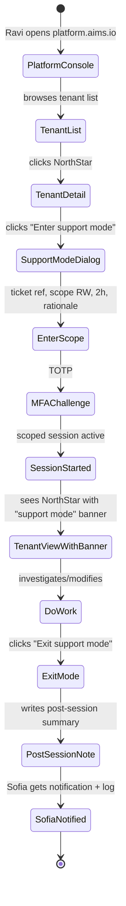
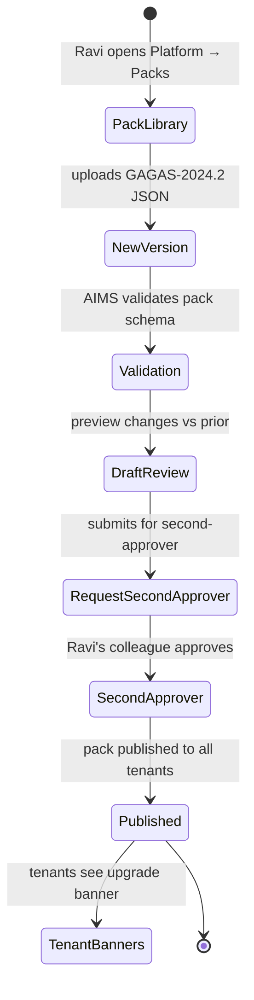
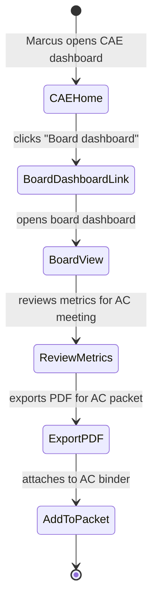

# UX — Platform Admin & Board Reporting

> Two complementary UX surfaces. Platform admin is Ravi's internal-only tooling for operating AIMS across all tenants — support mode, break-glass, pack publishing, incident response. Board reporting is Marcus's quarterly output for the Audit Committee — the CAE-facing dashboard + (MVP 1.5) presentation pack + communication log. Combined here because they're both "operational infrastructure" layered above per-tenant product workflow.
>
> **Feature spec**: [`features/platform-admin-and-board-reporting.md`](../features/platform-admin-and-board-reporting.md)
> **Related UX**: [`tenant-onboarding-and-admin.md`](tenant-onboarding-and-admin.md), [`report-generation.md`](report-generation.md) (board pack export)
> **Primary personas**: Ravi (Platform Admin, internal AIMS), Marcus (CAE, board reporting), secondary: AIMS CSM team

---

## 1. UX philosophy

- **Platform admin is separate product.** Different visual system, different URL (`platform.aims.io`), explicit "internal only" framing. Never blends with customer surfaces.
- **Support-mode is visible and scoped.** When Ravi enters a tenant to debug, the tenant admin (Sofia) sees he's there — real-time — per ADR-0005 + DPA terms. Ravi sees the tenant as if he were a user, with a prominent "You are in support mode" banner.
- **Break-glass is a ceremony.** Two-person rule enforced via UI; cannot be bypassed; approval from another platform admin is a time-bounded authorization.
- **Board dashboard is exec-grade.** No jargon. High-signal metrics. Prints cleanly. Aggregates live data with cache fallback.
- **Board pack (MVP 1.5) is a report, not a dashboard export.** Presentation-quality, narrative-wrapped, with CAE letter and AC-specific framing.

---

## 2. Primary user journeys

### 2.1 Journey: Ravi enters support mode



### 2.2 Journey: Ravi publishes pack update (two-person rule)



### 2.3 Journey: Marcus views board dashboard



---

## 3. Screen — Platform admin console

Separate UI (platform.aims.io), different color accent (dark mode default), "internal-only" watermark.

### 3.1 Layout — tenant list

```
┌─ AIMS Platform Console — Tenants ──────────────────────── [Ravi · MFA active]┐
│                                                                                  │
│  INTERNAL ONLY — access logged                                                   │
│                                                                                  │
│  ┌─ Filter ─────────────────────────────────────────────────────────────┐     │
│  │ Plan: [All ▼]  Region: [All ▼]  Health: [All ▼]  [ 🔍 search ______ ]│     │
│  └───────────────────────────────────────────────────────────────────────┘     │
│                                                                                  │
│  ┌── Tenants (87 total) ───────────────────────────────────────────────┐      │
│  │ Tenant               │ Plan   │ Users │ Engagements │ Health         │      │
│  │─────────────────────────────────────────────────────────────────────│      │
│  │ NorthStar Internal   │ Pro    │ 14    │ 34 (18 act) │ ✓              │      │
│  │ CPA Firm X           │ Ent    │ 48    │ 112 (42 act)│ ✓              │      │
│  │ Agency Y             │ Gov    │ 22    │ 56 (28 act) │ ⚠ 3 SLO breach │      │
│  │ Startup Z            │ Starter│ 5     │ 8 (4 act)   │ ✓              │      │
│  │ ... (more)                                                           │      │
│  └──────────────────────────────────────────────────────────────────────┘      │
│                                                                                  │
│  [ Export report ]  [ Provision new tenant ]                                    │
└──────────────────────────────────────────────────────────────────────────────────┘
```

### 3.2 Tenant detail + support mode

Clicking a tenant opens detail with per-tenant quick-stats and action bar:

```
┌─ Tenant: NorthStar Internal Audit ───────────────────────────────────────────┐
│                                                                                 │
│  Plan:          Pro (contract 2027-01-15)                                       │
│  Users:         14 active · 2 pending · 1 suspended                             │
│  Storage:       4.2 GB of 100 GB                                               │
│  SSO:           Okta (active)                                                   │
│  Region:        us-east-1                                                       │
│  Health:        ✓ (all SLOs green)                                              │
│                                                                                 │
│  Actions                                                                        │
│   [ Enter support mode ]  [ Break-glass ]  [ View audit log ]                  │
│   [ Billing ]  [ Incident history ]                                             │
└─────────────────────────────────────────────────────────────────────────────────┘
```

### 3.3 Enter support-mode dialog

```
┌─ Enter support mode — NorthStar Internal Audit ──────────────────────────┐
│                                                                             │
│  You are about to enter a scoped support session in this tenant.          │
│                                                                             │
│  Ticket reference (required):  [ ZD-4821 _______________ ]                │
│  Scope:     (●) Read-only   ( ) Read-write                               │
│  Duration:  (●) 1 hour   ( ) 2 hours   ( ) 4 hours (max)                 │
│  Rationale (200+ chars, required):                                         │
│  [ Customer reported incorrect classification on F-2026-0042. Need to ]  │
│  [ verify pack resolver output and check annotation history. Will not ]  │
│  [ modify customer data unless write scope later explicitly requested. ] │
│                                                                             │
│  Customer (Sofia Rodriguez) will be notified that you've entered.          │
│  All actions will be logged with elevated visibility.                      │
│                                                                             │
│  MFA (step-up):  [ TOTP ______ ]                                          │
│                                                                             │
│                                           [ Cancel ]  [ Enter → ]        │
└─────────────────────────────────────────────────────────────────────────────┘
```

On enter:
- Session created with expiry timer
- Ravi lands in NorthStar's tenant UI with a persistent top banner
- Sofia (NorthStar admin) gets immediate notification
- All of Ravi's actions prefixed in audit log with `[SUPPORT:ZD-4821]`

### 3.4 Support-mode banner (visible to Ravi inside customer tenant)

```
┌─ ⚠ SUPPORT MODE · NorthStar Internal Audit · ZD-4821 · 58 min remaining ───┐
│                                        [Exit session early]  [Extend] (admin)│
└─────────────────────────────────────────────────────────────────────────────┘
```

Red banner. Stays at top of every page. Clicking "Exit session early" opens post-session summary dialog:

```
┌─ End support session ─────────────────────────────────────────────────┐
│                                                                         │
│  Summary (required, 100+ chars):                                       │
│  [ Verified F-2026-0042 has correct classification. Pack resolver ]  │
│  [ output was correct. Issue was user misreading UI. Advised ticket ]│
│  [ ZD-4821 accordingly.                                              ] │
│                                                                         │
│  Customer will receive your summary along with full action log.        │
│                                                                         │
│                                          [ End session → ]            │
└─────────────────────────────────────────────────────────────────────────┘
```

### 3.5 Break-glass

Available from tenant detail when P1 incident warrants production-DB-level access. Requires second approver:

```
┌─ Break-glass access ─────────────────────────────────────────────────┐
│                                                                        │
│  ⚠ Break-glass access grants elevated direct-DB access for             │
│     incident response. Two-person rule enforced.                      │
│                                                                        │
│  Incident ID (required):   [ INC-2026-0412 ]                         │
│  Access type:   [x] DB read  [x] Log files  [ ] DB write             │
│  Max duration:  [ 2 hours ▼ ]                                         │
│  Rationale (200+):                                                    │
│  [ Investigating reported data loss in tenant NorthStar engagement  ] │
│  [ FY26 Q1 Revenue Cycle. Customer reports 3 WPs vanished after    ] │
│  [ pack upgrade. Need to query pack migration log + WP table        ] │
│  [ directly.                                                         ] │
│                                                                        │
│  Second approver (required):                                           │
│   [ Ping another platform admin: @alex · @sam · @jen ]                │
│   [ Status: awaiting approval ]                                       │
│                                                                        │
│                                         [ Cancel ] [ Request access ]│
└────────────────────────────────────────────────────────────────────────┘
```

Second approver sees the request as a high-priority notification with 15-min SLA; clicks "Approve" or "Deny" with rationale. Once approved, access granted for the requested duration.

---

## 4. Screen — Pack publisher

Invoked from: Platform → Pack library.

### 4.1 Layout

```
┌─ Platform Pack Library ──────────────────────────────────────────────────┐
│                                                                             │
│  Published packs (12)                                                       │
│                                                                             │
│  GAGAS — Government Auditing Standards                                     │
│   • 2024.2 (latest, published 2026-04-01) — in use by 42 tenants          │
│   • 2024.1 — in use by 45 tenants                                         │
│   • 2022.1 (deprecated 2024) — in use by 2 tenants                        │
│   [ + New version ]                                                       │
│                                                                             │
│  COSO — COSO Framework                                                     │
│   • 2013.1 — in use by 67 tenants                                         │
│                                                                             │
│  IIA — Global Internal Audit Standards                                     │
│   • 2024.1 — in use by 34 tenants                                         │
│                                                                             │
│  ... (more)                                                                 │
│                                                                             │
│  Drafts (3) · Pending approval (1)                                         │
└─────────────────────────────────────────────────────────────────────────────┘
```

### 4.2 New version publication flow

Multi-step:
1. **Upload JSON**: pack definition file; AIMS validates against schema
2. **Metadata**: version, effective date, changelog notes, migration notes
3. **Preview**: shows dimension diff vs prior, estimated impact across tenants
4. **Submit for second approval**: routes to another platform admin
5. **Publication**: on second approval, pack goes live; tenants get upgrade banners per [pack-attachment.md §7](pack-attachment.md)

---

## 5. Screen — Incident response console

Invoked from: Platform → Incidents.

### 5.1 Layout

```
┌─ Incident response ──────────────────────────────────────────────────────┐
│                                                                             │
│  Active incidents (0)     Recent (past 30d): 3                             │
│                                                                             │
│  SLO health                                                                 │
│  ┌──────────────────────────────────────────────────────────────────────┐││
│  │ Service           │ SLO    │ Actual 30d │ Status                        │││
│  │ API               │ 99.9%  │ 99.94%     │ ✓                              │││
│  │ PDF render        │ 99.5%  │ 99.61%     │ ✓                              │││
│  │ Search            │ 99.0%  │ 98.88%     │ ⚠ slightly below               │││
│  │ Webhooks          │ 99.0%  │ 99.12%     │ ✓                              │││
│  └──────────────────────────────────────────────────────────────────────┘││
│                                                                             │
│  Queue health (SQS)                                                        │
│  ┌──────────────────────────────────────────────────────────────────────┐││
│  │ Queue               │ Depth │ Oldest msg age │ DLQ                     │││
│  │ events-outbox       │ 12    │ 2s             │ 0                       │││
│  │ notifications       │ 0     │ —              │ 0                       │││
│  │ pdf-render          │ 3     │ 40s            │ 2 ⚠                      │││
│  └──────────────────────────────────────────────────────────────────────┘││
│                                                                             │
│  Error rates (by service · past 24h)                                       │
│   ...                                                                       │
│                                                                             │
│  Recent deployments                                                         │
│   v2.1.4 deployed 2026-04-22 09:12 (Ravi) — no rollback                   │
│   v2.1.3 deployed 2026-04-21 14:30 (Sam) — no rollback                    │
└─────────────────────────────────────────────────────────────────────────────┘
```

---

## 6. Screen — Board dashboard (Marcus)

Invoked from: CAE dashboard → "Board dashboard" link, OR direct /board route.

### 6.1 Layout

Print-ready, high-density, exec-grade:

```
┌─ Board Dashboard — NorthStar Internal Audit ─────────── [FY26 Q1 ▼] [PDF]┐
│                                                                              │
│  Period: October 2025 – March 2026       CAE: Marcus Thompson               │
│                                                                              │
│  ┌─ Annual plan execution ──────────────────────────────────────────┐     │
│  │ Planned: 34 engagements · Completed: 18 (53%)                      │     │
│  │ On plan: 16 · Behind: 2                                             │     │
│  │ Hours planned / actual: 12,400 / 13,050 (+5% variance)              │     │
│  └──────────────────────────────────────────────────────────────────────┘   │
│                                                                              │
│  ┌─ Findings summary ──────────────────────────────────────────────┐      │
│  │ 137 findings this fiscal year                                      │      │
│  │  • Material: 5  · Significant: 32  · Minor: 100                    │      │
│  │ (bar chart by classification)                                       │      │
│  └──────────────────────────────────────────────────────────────────────┘   │
│                                                                              │
│  ┌─ CAP compliance ─────────────────────────────────────────────────┐     │
│  │ Open: 143 · On track: 96 (67%)                                     │     │
│  │ Overdue: 47 · Beyond 30d: 18                                       │     │
│  │ Closure YTD: 87 · Cycle time median: 72 days                      │     │
│  └──────────────────────────────────────────────────────────────────────┘   │
│                                                                              │
│  ┌─ Independence & CPE ───────────────────────────────────────────────┐  │
│  │ Independence declared: 100% for all active engagements              │  │
│  │ CPE on track: 94% of team                                            │  │
│  │ CPE overdue: 1 team member (Alex Nelson — biennium end 2026-09-30)  │  │
│  └──────────────────────────────────────────────────────────────────────┘  │
│                                                                              │
│  ┌─ Peer review status ───────────────────────────────────────────────┐ │
│  │ Last review: 2024 Q3 (passed without findings)                      │ │
│  │ Next review due: 2027 Q3                                             │ │
│  │ QA sampling YTD: 8 of 34 engagements (23%)                           │ │
│  └──────────────────────────────────────────────────────────────────────┘ │
│                                                                              │
│  ┌─ Emerging risks ───────────────────────────────────────────────────┐ │
│  │ • Cloud expense governance — added 2026-02-14 to universe          │ │
│  │ • M&A integration (TargetCo) — added to FY27 plan                  │ │
│  │ • New GL system migration — under risk assessment                 │ │
│  └──────────────────────────────────────────────────────────────────────┘ │
│                                                                              │
│  Data freshness: 4 min ago             [Refresh]  [Export PDF]             │
└──────────────────────────────────────────────────────────────────────────────┘
```

### 6.2 PDF export

Generates print-quality PDF with:
- Tenant-branded cover
- Summary narrative (auto-generated + editable in MVP 1.5)
- All dashboard panels
- Executive findings highlights
- Footer with generation timestamp + hash for verification

Exports added to AC binder preparation workflow (MVP 1.5 adds AC communication log integration).

---

## 7. MVP 1.5 surfaces (deferred, mentioned for completeness)

### 7.1 Board presentation pack builder

Wizard-based:
- Select sections (executive summary, plan exec, material findings, CAP status, CPE compliance, independence status, outlook)
- Choose format (slides PDF, Word)
- Customize executive summary narrative
- Include CAE letter
- Export

### 7.2 Audit Committee communication log

Structured log:
- Communication (quarterly meeting / special briefing / notification)
- Date, attendees, topics
- Decisions / actions
- Attachments
- AC response tracking

Used for peer review evidence under IIA GIAS Principle 8.

---

## 8. Loading, empty, error states

| State | Treatment |
|---|---|
| Tenant list loads slowly | Skeleton rows; target <2s for 100 tenants |
| Support mode session timeout approaching | 5-min warning toast in Ravi's UI; extend or end |
| Break-glass second approver timeout | Request auto-expires after 15 min; Ravi sees "Request expired. [Re-submit]" |
| Board dashboard data aggregation fails | Cached snapshot displayed with "Last refreshed 4h ago" warning |
| Pack validation fails | Inline errors listed (schema violations, dimension conflicts); commit blocked |

---

## 9. Responsive behavior

Platform console is desktop-only (Ravi is always at workstation). Board dashboard is desktop + print optimized (Marcus may view on iPad during AC meeting; optimized layout for iPad landscape).

---

## 10. Accessibility

- Platform admin surfaces maintain the same WCAG 2.1 AA baseline as customer product
- Support mode banner is `role="banner" aria-label="Support mode session active"`
- Break-glass dialog announces two-person-rule requirements clearly
- Board dashboard charts have fallback `<table>` representations

---

## 11. Keyboard shortcuts (platform admin)

| Shortcut | Action |
|---|---|
| `/` | Focus search |
| `g t` | Go to tenants |
| `g i` | Go to incidents |
| `g p` | Go to packs |
| `g a` | Go to platform audit log |

---

## 12. Microinteractions

- **Support-mode banner**: persistent red ribbon with a pulsing dot to keep presence felt
- **Break-glass approval received**: full-screen affirmation "Access granted — session starts"
- **Pack published**: confetti-free ceremonial overlay with "Pack GAGAS-2024.2 live for 42 tenants" message
- **Board dashboard refresh**: smooth re-render; data cells flash amber on value change

---

## 13. Analytics & observability

Platform-level events (distinct log stream, elevated sensitivity):
- `platform.admin.support_mode.entered { tenant_id, scope, duration_requested_sec }`
- `platform.admin.support_mode.exited { tenant_id, actual_duration_sec }`
- `platform.admin.break_glass.requested { tenant_id, incident_id }`
- `platform.admin.break_glass.approved { tenant_id, approver_id }`
- `platform.admin.break_glass.used { tenant_id, actions_count }`
- `platform.admin.pack.published { pack_id, version, affected_tenant_count }`
- `ux.board.dashboard_viewed { fiscal_period }`
- `ux.board.dashboard_exported { format }`

KPIs (platform):
- **Support-mode sessions / month** (trending indicator of support load)
- **Break-glass frequency** (target: <1 per month; higher indicates systemic incident pattern)
- **Pack publication lead time** (from draft → tenant banners visible; target p90 ≤ 2 business days)
- **Incident MTTR** (target: P1 <1 hour, P2 <4 hours)

KPIs (board):
- **Board dashboard view count by CAE** (target: ≥ 2/month indicates active governance)
- **Dashboard export PDF** used for AC meeting (correlates with AC prep cycle)

---

## 14. Open questions / deferred

- **SQS inspector UI**: MVP 1.5 (see feature spec §2.4)
- **Regional silo provisioning automation**: v2.2+
- **Board presentation pack builder**: MVP 1.5
- **AC communication log**: MVP 1.5
- **Platform-wide anomaly detection**: deferred

---

## 15. References

- Feature spec: [`features/platform-admin-and-board-reporting.md`](../features/platform-admin-and-board-reporting.md)
- Related UX: [`tenant-onboarding-and-admin.md`](tenant-onboarding-and-admin.md), [`report-generation.md`](report-generation.md)
- ADRs: [`references/adr/0002-tenant-isolation-two-layer.md`](../references/adr/0002-tenant-isolation-two-layer.md), [`references/adr/0005-session-revocation-hybrid.md`](../references/adr/0005-session-revocation-hybrid.md)
- API: [`api-catalog.md §3.18`](../api-catalog.md) (`platformAdmin.*`, `boardDashboard.*`)

---

*Last reviewed: 2026-04-22. Phase 6 (UX) draft — pending external review.*
