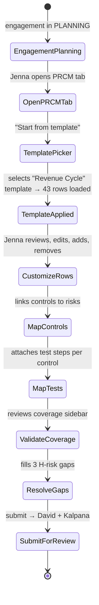
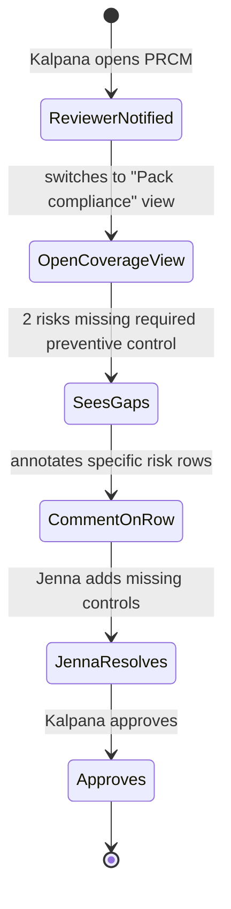
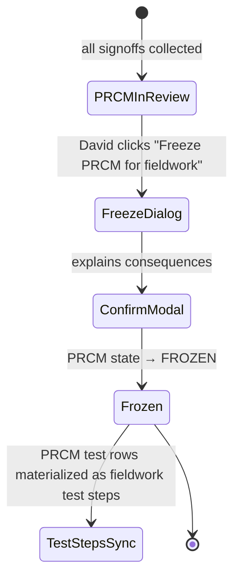

# UX — PRCM Matrix (Process-Risk-Control Mapping)

> PRCM is the matrix that maps business processes → risks → controls → tests. It's the scaffolding that drives fieldwork — each control in PRCM becomes a test step; each test step produces a WP; each WP can produce observations → findings. PRCM is where the engagement's methodology meets its scope, and where pack compliance gets operationalized. UX must handle the density (100s of rows), relationships (bidirectional links), and evolving state (initial draft → refined → frozen for fieldwork).
>
> **Feature spec**: [`features/prcm-matrix.md`](../features/prcm-matrix.md)
> **Related UX**: [`apm-workflow.md`](apm-workflow.md) (PRCM is referenced from APM §8 Procedures), [`fieldwork-and-workpapers.md`](fieldwork-and-workpapers.md) (test steps flow from PRCM)
> **Primary personas**: Jenna (primary author), David (supervisor review), Kalpana (methodology — pack-control alignment)

---

## 1. UX philosophy for this surface

- **Matrix as first-class citizen.** The artifact is literally a matrix. Don't hide it behind forms; let users see and manipulate the grid.
- **Four levels of detail on one canvas.** Process → Risk → Control → Test. UX lets users expand/collapse hierarchies without losing context. Default view: risks grouped by process; drill into control → test.
- **Coverage is the primary quality metric.** "Does every material risk have at least one control tested?" UX surfaces coverage gaps in a prominent sidebar.
- **Pack alignment is checked live.** As Jenna types controls, the pack resolver validates that they meet pack-required control categories (e.g., GAGAS §6.49 requires preventive + detective controls for high risks).
- **Frozen state is real.** Once engagement enters fieldwork, PRCM structure is frozen — adding test steps is allowed, but modifying risk mappings requires explicit unfreeze + rationale.

---

## 2. Primary user journeys

### 2.1 Journey: Jenna builds PRCM from PRCM library template



### 2.2 Journey: Kalpana reviews pack-control alignment



### 2.3 Journey: David freezes PRCM for fieldwork



---

## 3. Screen — PRCM matrix

Invoked from: engagement dashboard → PRCM tab.

### 3.1 Layout (default view: grouped by process)

```
┌─ PRCM · FY26 Q1 Revenue Cycle Audit ──────────────[DRAFT]──[Actions ▼]─────┐
│                                                                                │
│ ┌─ Filter ───────────────────────────────────────────────────────────────┐  │
│ │ Process: [All ▼] Risk: [All ▼] Pack: [All ▼] [ 🔍 search ______ ]     │  │
│ │ View: [By process ▼]   [Show coverage ▼]                                │  │
│ └─────────────────────────────────────────────────────────────────────────┘  │
│                                                                                │
│ ┌─ Layout: Hierarchical grid ─────────────────────────────────────────────┐  │
│ │ ▼ Process: Order-to-Cash (P-OC)   · 3 risks · 8 controls · 12 tests     │  │
│ │   ▼ R-OC-01: Revenue recognized before delivery    [HIGH]               │  │
│ │     ▼ C-OC-01: Shipping docs required for revenue trigger   [Prev]      │  │
│ │       T-OC-01-01: Sample 40 shipments, verify doc exists    [Planned]   │  │
│ │       T-OC-01-02: Walkthrough process                        [Planned]   │  │
│ │     ▼ C-OC-02: Monthly revenue cutoff review        [Detect]            │  │
│ │       T-OC-02-01: Review last 5 cutoff adjustments          [Planned]   │  │
│ │   ▼ R-OC-02: Incorrect pricing applied             [MED]                │  │
│ │     ▶ C-OC-03: Price master approval workflow      [Prev]               │  │
│ │     ▶ C-OC-04: Deviation analysis                  [Detect]             │  │
│ │   ▼ R-OC-03: Sales returns not recognized          [MED]                │  │
│ │     ▶ C-OC-05: Returns authorization workflow     [Prev]                │  │
│ │                                                                           │  │
│ │ ▼ Process: Procure-to-Pay (P-PP)   · 4 risks · 9 controls · 14 tests   │  │
│ │   ▶ R-PP-01: Unauthorized purchases                [HIGH]               │  │
│ │   ▶ R-PP-02: Duplicate payments                    [MED]                │  │
│ │   ▶ R-PP-03: Vendor master inaccurate             [MED]                │  │
│ │   ▶ R-PP-04: SoD weakness in approvals            [HIGH]  ⚠ no control  │  │
│ │                                                                           │  │
│ │ ▶ Process: Financial Reporting (P-FR)  · 2 risks · 4 controls · 6 tests │  │
│ │                                                                           │  │
│ │ [+ Add process]                                                           │  │
│ └─────────────────────────────────────────────────────────────────────────┘  │
│                                                                                │
│  7 of 9 risks with >=1 tested control · 2 gaps ⚠    [Export][Freeze for fw]  │
└────────────────────────────────────────────────────────────────────────────────┘
```

### 3.2 Row actions

Right-click or hover `⋮` on any row:
- **Add risk** (under a process row)
- **Add control** (under a risk row)
- **Add test** (under a control row)
- **Edit**
- **Duplicate** (useful for similar controls across processes)
- **Delete** (confirm dialog)
- **Link to existing control/test** (if already elsewhere)

### 3.3 Hierarchy expand/collapse

Single row expand: `▶` → `▼`. All-expand / all-collapse in toolbar. Expanded state persists per-user per-engagement.

### 3.4 Inline edit

Double-click any cell to edit in place. Tab advances to next cell. Fields with pack-prescribed validation (control category, test type) use dropdowns.

---

## 4. Detail drawer

Clicking a row opens a side drawer (right 40%):

### 4.1 Control detail

```
┌─ C-OC-01 · Shipping docs required for revenue trigger ──────────── [×] ┐
│                                                                          │
│  Process:   P-OC (Order-to-Cash)                                        │
│  Risk:      R-OC-01 (Revenue before delivery) [change]                  │
│  Category:  [ Preventive ▼ ]                                            │
│  Frequency: [ Per transaction ▼ ]                                       │
│  Owner:     [ AP clerk role ]                                           │
│                                                                          │
│  Description                                                             │
│  [ Revenue may only be recognized in the GL after verified shipping     ]│
│  [ documents are matched to the sales order in the ERP. System enforces ]│
│  [ the rule via workflow block.                                          ]│
│                                                                          │
│  Pack alignment                                                          │
│   ✓ GAGAS-2024.1 §6.49 — preventive control present for high risk      │
│   ✓ COSO-2013 principle 11 — IT control mapping                         │
│                                                                          │
│  Test steps (2)                                                         │
│   T-OC-01-01  Sample 40 shipments, verify doc exists       [Planned]    │
│   T-OC-01-02  Walkthrough process                           [Planned]    │
│   [+ Add test step]                                                      │
│                                                                          │
│  Linked work papers (0)  — populated as fieldwork progresses            │
│                                                                          │
│  [ Save ]  [ Delete control ]                                           │
└──────────────────────────────────────────────────────────────────────────┘
```

### 4.2 Test step detail (within PRCM)

Essentially same as fieldwork test step drawer (see [fieldwork-and-workpapers.md §3.3](fieldwork-and-workpapers.md)), but scoped to planning metadata — procedure description, planned budget hours, sampling parameters. Execution-mode fields (results, evidence) unavailable until fieldwork phase.

---

## 5. Coverage sidebar

Toggleable right-panel: "Show coverage." Renders live coverage analysis:

```
┌─ Coverage analysis ────────────────────────────┐
│                                                 │
│  Risks by coverage                              │
│   ✓ Tested (preventive + detective):    4       │
│   ⚠ Tested (preventive only):            2       │
│   ⚠ Tested (detective only):             1       │
│   🔴 No tested control:                  2       │
│                                                 │
│  Gaps                                           │
│   🔴 R-PP-04 SoD weakness in approvals         │
│      No control mapped.                         │
│      [ Add control ]                            │
│                                                 │
│   🔴 R-FR-02 Manual journal entry abuse        │
│      No test step on C-FR-03.                  │
│      [ Add test step ]                          │
│                                                 │
│   ⚠ R-OC-02 Incorrect pricing                  │
│      Only preventive control tested.            │
│      GAGAS-2024.1 §6.49 recommends both.       │
│      [ Add detective control ]                  │
│                                                 │
│  Pack requirements                              │
│   GAGAS-2024.1                                  │
│    • Every H risk must have both kinds of       │
│      control (§6.49): 3 of 5 met                │
│    • Sampling method disclosed per control:    │
│      7 of 9 met                                 │
│                                                 │
│   COSO-2013                                     │
│    • Principle 11 (IT GC): 4 of 4 met ✓        │
│                                                 │
│  6 of 9 risks fully covered — 67%               │
└─────────────────────────────────────────────────┘
```

Coverage recomputes within 500ms of any row edit. Rows contributing to gaps are subtly highlighted amber; rows with critical gaps red.

---

## 6. Template picker (first open)

```
┌─ Start your PRCM ──────────────────────────────────────────────────────┐
│                                                                          │
│  Start from:                                                             │
│   (●) Prior year's PRCM for this auditee                                │
│       FY25 Q1 Revenue Cycle Audit (43 rows)                              │
│                                                                          │
│   ( ) Library template                                                   │
│       [ Revenue Cycle — CPA firm ▼ ]   [browse]                         │
│                                                                          │
│   ( ) Blank                                                              │
│                                                                          │
│   ( ) Copy from another engagement                                       │
│       [ search engagements ... ]                                         │
│                                                                          │
│                                          [ Cancel ]  [ Start → ]        │
└──────────────────────────────────────────────────────────────────────────┘
```

Library templates maintained by Kalpana (tenant-level) and optionally platform-published templates from AIMS. Copy-from preserves lineage (PRCM rows show "From FY25 Q1 Revenue Cycle PRCM" badge).

---

## 7. Freeze for fieldwork

Once PRCM is approved, David clicks "Freeze for fieldwork":

```
┌─ Freeze PRCM ─────────────────────────────────────────────────────────┐
│                                                                         │
│  Freezing PRCM does the following:                                     │
│   • Risk/control/test structure becomes immutable                      │
│   • Test steps materialize in Fieldwork tab                            │
│   • Any structural change from now requires rationale + re-approval    │
│                                                                         │
│  Coverage summary:                                                     │
│   9 risks · 21 controls · 34 test steps                                │
│   Coverage: 67%    Pack compliance: GAGAS 3/5 ⚠                       │
│                                                                         │
│  ⚠ Pack compliance incomplete. Freeze anyway? Document rationale:      │
│  [ Decision: accept GAGAS §6.49 gap because auditee compensating  ]   │
│  [ control being implemented by next quarter. Covered separately   ]  │
│  [ in §12 emerging risks.                                           ]  │
│                                                                         │
│                                       [ Cancel ]  [ Freeze PRCM ]     │
└─────────────────────────────────────────────────────────────────────────┘
```

On freeze:
- PRCM state → FROZEN
- Test rows materialized as `FieldworkTestStep` records
- Audit log entry with structure hash

---

## 8. Unfreeze flow

Post-freeze PRCM changes require "Unfreeze" action:
- Rationale required (200+ chars)
- Rerouted to David + Kalpana approval
- Once unfrozen, changes can be made; re-freezing advances a version (v1.1, v1.2)

---

## 9. Views and export

View toggles:
- **By process** (default grouping)
- **By risk tier** (H risks first, then M, then L)
- **By control owner** (useful for walkthroughs)
- **Coverage heatmap** (visual matrix; cells colored by testing status)
- **Pack compliance** (per-pack checklist against PRCM rows)

Export:
- **Excel** with multi-sheet (Processes / Risks / Controls / Tests / Coverage)
- **PDF** formatted for report appendix
- **CSV** for ingestion by downstream tools

---

## 10. Loading, empty, error states

| State | Treatment |
|---|---|
| New engagement, no PRCM | Empty: "Build your PRCM — the matrix that maps risks to controls to tests." CTAs: "Start" (template picker), "Learn more." |
| Template loading | Spinner with "Loading Revenue Cycle template (43 rows)..." |
| Row edit conflict (two users editing same row) | Last-write-wins with warning toast: "David edited this row while you were working. [View diff] [Keep yours]" |
| Pack validation error | Row border red; hover shows pack rule violated. |
| Coverage recompute lag | Coverage sidebar shows "Computing..." spinner while grid remains interactive. |
| Freeze with >0% coverage gap | Warning modal but allowed with documented rationale (no hard block; overrides logged). |

---

## 11. Responsive behavior

PRCM is a desktop workflow — grid density doesn't translate to mobile. Mobile shows a simplified read-only view ("PRCM is best viewed on a larger screen"). Tablet works but cramped — auto-collapses coverage sidebar.

---

## 12. Accessibility

- Grid uses ag-Grid with full ARIA grid semantics.
- Row expand/collapse is `<button aria-expanded>`.
- Coverage sidebar has descriptive `aria-label`s.
- Color-coded gap indicators have text equivalents ("HIGH risk, no control mapped").
- Freeze dialog announces consequences via `aria-live`.

---

## 13. Keyboard shortcuts

| Shortcut | Action |
|---|---|
| `/` | Focus filter |
| `j` / `k` | Next/prev row |
| `h` / `l` | Collapse/expand row |
| `n p` / `n r` / `n c` / `n t` | New process / risk / control / test |
| `Enter` | Open drawer |
| `Esc` | Close drawer |
| `d` | Duplicate focused row |
| `Del` | Delete focused row |

---

## 14. Microinteractions

- **Row added**: slides in from top of parent hierarchy; coverage sidebar updates with animated counter.
- **Gap resolved**: amber highlight fades out; coverage percentage ticks up with counter animation.
- **Freeze**: screen transitions to "frozen" appearance — subtle grey tint + lock icon in header.

---

## 15. Analytics & observability

- `ux.prcm.created { engagement_id, from_template_or_copy }`
- `ux.prcm.row_added { row_type, process_id }`
- `ux.prcm.row_edited { row_id, row_type }`
- `ux.prcm.coverage_gap_shown { engagement_id, gap_count, gap_risk_tiers }`
- `ux.prcm.frozen { engagement_id, risk_count, control_count, test_count, coverage_percent }`
- `ux.prcm.unfrozen { engagement_id, reason_length }`
- `ux.prcm.exported { format }`

KPIs:
- **PRCM cycle time** (Draft → Frozen; target median ≤ 7 business days)
- **Coverage at freeze** (% risks fully covered; target ≥75% median)
- **Pack compliance at freeze** (target ≥80%)
- **Template adoption** (target ≥70% use template or copy-forward)
- **Unfreeze frequency** (target <10% of PRCMs unfrozen during fieldwork)

---

## 16. Open questions / deferred

- **AI-suggested controls based on risk text**: deferred to v2.1.
- **Cross-engagement benchmarking** (how does my PRCM compare to similar engagements?): deferred to v2.1.
- **Real-time coverage recompute as user types** (currently debounced 500ms): acceptable for MVP.
- **Visual coverage heatmap**: included as view toggle but full visualization lib deferred.

---

## 17. References

- Feature spec: [`features/prcm-matrix.md`](../features/prcm-matrix.md)
- Related UX: [`apm-workflow.md`](apm-workflow.md), [`fieldwork-and-workpapers.md`](fieldwork-and-workpapers.md)
- Data model: [`data-model/prcm.md`](../data-model/prcm.md)
- API: [`api-catalog.md §3.12`](../api-catalog.md) (`prcm.*` tRPC namespace)

---

*Last reviewed: 2026-04-22. Phase 6 (UX) draft — pending external review.*
