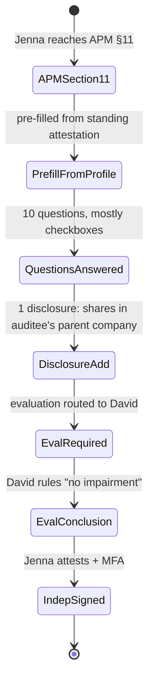
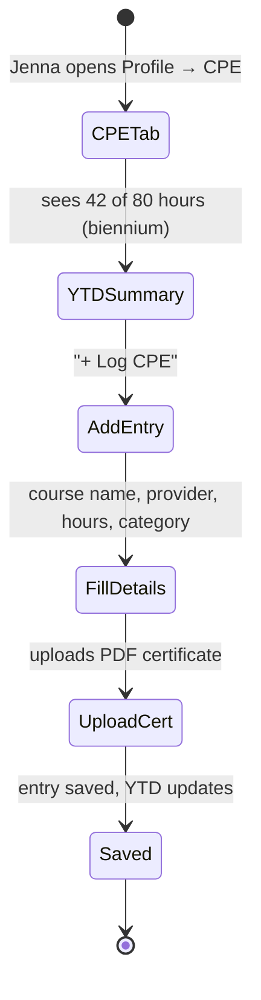
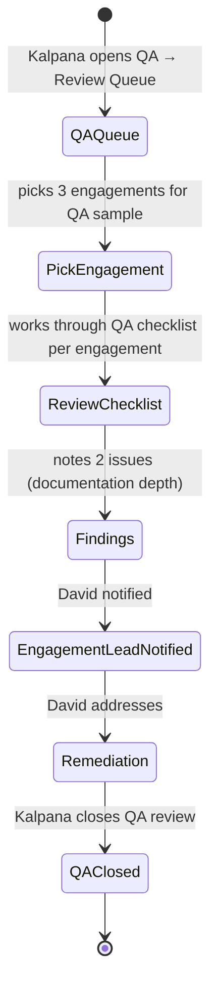

# UX — QA, Independence & CPE

> Three related but distinct professional-standards surfaces combined into one file. QA is the ongoing quality review program (peer review under GAGAS §5.60-5.80). Independence is per-engagement attestation by each team member that they have no disqualifying relationships. CPE is annual continuing education tracking (GAGAS §4.16 requires 80 hours per 2-year period). All three are compliance-driven, low-frequency-per-user, but critical to pass peer review. UX must make them feel like hygiene, not theater.
>
> **Feature spec**: [`features/qa-independence-cpe.md`](../features/qa-independence-cpe.md)
> **Related UX**: [`apm-workflow.md §11`](apm-workflow.md) (independence declared within APM), [`tenant-onboarding-and-admin.md`](tenant-onboarding-and-admin.md) (user profile holds CPE data)
> **Primary personas**: Jenna (declares independence per engagement, tracks CPE), Kalpana (QA reviewer, methodology), Marcus (owns overall QA program), external peer reviewer (annual)

---

## 1. UX philosophy

- **Standing state beats event state.** Independence is a standing attestation — "I have no disqualifying relationships." Users re-attest per engagement, but the system remembers and pre-fills. CPE is a standing year-to-date total. QA is a rolling program, not a discrete event.
- **Proactive compliance nudging.** "You're behind on CPE — suggested courses here." Not compliance-as-gotcha at performance review time.
- **Evidence-first for CPE.** A CPE entry without a certificate is a weak claim. UX requires (or strongly encourages) certificate upload at entry time.
- **Peer review mode is a different mental model.** Once per 3 years, an external peer reviewer needs access to a read-only cross-section of audits + QA artifacts. This is a separate UX mode, with clear scope boundaries and full audit-log visibility.
- **Independence matrix makes conflicts obvious.** Flag: team member X has worked on this auditee's team at prior employer in past 3 years. Visual heatmap makes it impossible to miss.

---

## 2. Primary user journeys

### 2.1 Journey: Jenna declares independence for an engagement



### 2.2 Journey: Jenna logs CPE



### 2.3 Journey: Kalpana runs a QA review



---

## 3. Screen — Independence declaration

Embedded in APM §11, can also be accessed standalone from Profile → Independence.

### 3.1 Layout

```
┌─ Independence declaration · FY26 Q1 Revenue Cycle Audit ──────────────────┐
│                                                                              │
│  Declarer:  Jenna Patel (Senior Auditor)                                    │
│  Auditee:   NorthStar Corp                                                  │
│  Engagement period: 2026-04-01 → 2026-06-30                                  │
│                                                                              │
│  Standing attestation:  "None of the conditions below apply to me."         │
│  (Pre-filled from your profile. Review each and disclose if applicable.)    │
│                                                                              │
│  ┌─ Financial relationships ────────────────────────────────────────────┐ │
│  │ [x] I do not hold equity or debt interests in the auditee             │ │
│  │ [x] I do not hold equity or debt interests in the auditee's parent    │ │
│  │ [x] No immediate family member holds such interests                   │ │
│  │ [x] I have no loan or deposit relationship with the auditee          │ │
│  └─────────────────────────────────────────────────────────────────────── ┘│
│                                                                              │
│  ┌─ Professional relationships ─────────────────────────────────────────┐  │
│  │ [x] I have not served in a management role at the auditee            │  │
│  │     in the past 3 years                                               │  │
│  │ [x] No immediate family member serves in a management role there      │  │
│  │ [x] I have no other business relationship with the auditee           │  │
│  └─────────────────────────────────────────────────────────────────────── ┘│
│                                                                              │
│  ┌─ Personal relationships ─────────────────────────────────────────────┐  │
│  │ [ ] I have no close personal relationship with auditee management    │  │
│  │     ⚠ Disclose: [ Former classmate of CFO Lisa Chen. Last contact  ] │  │
│  │                 [ 2019. No ongoing social relationship.              ] │  │
│  └─────────────────────────────────────────────────────────────────────── ┘│
│                                                                              │
│  ┌─ Evaluation (on disclosure) ─────────────────────────────────────────┐  │
│  │ Disclosure triggers evaluation per GAGAS §3.27.                       │  │
│  │ Routed to David Chen for impairment evaluation.                       │  │
│  │ [Pending David's evaluation]                                          │  │
│  └─────────────────────────────────────────────────────────────────────── ┘│
│                                                                              │
│  Supervisor evaluation conclusion                                            │
│   [Pending]                                                                  │
│                                                                              │
│  Attestation:                                                                │
│  [ ] I attest that my responses are accurate as of 2026-04-22.              │
│  MFA:  [ ______ ]                                                           │
│                                                                              │
│                                       [ Save draft ]  [ Submit declaration ]│
└──────────────────────────────────────────────────────────────────────────────┘
```

### 3.2 Evaluation flow (on disclosure)

If any question is un-ticked (disclosure):
- A textarea appears for explanation (required, min 100 chars)
- On submit, declaration routes to supervisor for impairment evaluation
- Supervisor sees standalone screen with disclosure, context (team, engagement, historical patterns), "no impairment" / "impairment — safeguards" / "impairment — remove from engagement"
- Result persisted; team member notified

### 3.3 Historical view

Profile → Independence history shows all past declarations (engagement, date, disclosures made, evaluations). Filterable by fiscal year.

---

## 4. Screen — CPE dashboard (user's own)

Invoked from: Profile → CPE.

### 4.1 Layout

```
┌─ Your CPE — Jenna Patel ──────────────────────────────────────────────────┐
│                                                                              │
│  Biennium: 2025-10-01 → 2027-09-30   (12 months elapsed, 12 remaining)     │
│                                                                              │
│  ┌─ Progress ────────────────────────────────────────────────────────────┐│
│  │                                                                         ││
│  │ [▓▓▓▓▓▓▓▓▓▓░░░░░░░░░░░░] 42 of 80 hours — 53% — ON TRACK              ││
│  │                                                                         ││
│  │ Categories (GAGAS minimums):                                           ││
│  │  • Government auditing: 16 of 24 required (67%)  ✓ on track           ││
│  │  • Other related topics: 26 of 56 (46%)         ✓ on track           ││
│  │                                                                         ││
│  │ To stay on track: 38 more hours in next 12 months (avg 3.2 hrs/mo)    ││
│  └─────────────────────────────────────────────────────────────────────── ┘│
│                                                                              │
│  ┌─ Recent entries (10) ─────────────────────────────────────── [+ Log]─┐ │
│  │ Date       │ Course                             │ Provider  │ Hours │ Cert│
│  │ 2026-04-10 │ Fraud Risk Assessment              │ AICPA     │ 4.0   │ ✓  │
│  │ 2026-03-15 │ GAGAS 2024 — Updates              │ AGA       │ 8.0   │ ✓  │
│  │ 2026-02-20 │ Data Analytics in Audit            │ ISACA     │ 6.0   │ ✓  │
│  │ 2026-01-12 │ Ethics for the Internal Auditor    │ IIA       │ 4.0   │ ✓  │
│  │ ... (6 more)                                                           │ │
│  └────────────────────────────────────────────────────────────────────────┘│
│                                                                              │
│  [ Suggested courses based on your gaps ]                                   │
│                                                                              │
│  Export for peer review:  [ PDF transcript ]                                │
└──────────────────────────────────────────────────────────────────────────────┘
```

### 4.2 Log CPE dialog

```
┌─ Log CPE ────────────────────────────────────────────────────────────┐
│                                                                        │
│  Course name: [ Advanced Sampling Techniques ______________ ]         │
│  Provider:    [ AGA ▼ ]   [+ Add provider]                            │
│  Completion date: [ 2026-04-22 ]                                      │
│  Hours:           [ 8.0 ]                                             │
│  Category:                                                             │
│   (●) Government auditing                                             │
│   ( ) Other related topics                                            │
│                                                                        │
│  Certificate (strongly recommended)                                    │
│   📎 [ Drop PDF or browse ]                                            │
│                                                                        │
│  Notes (optional)                                                      │
│  [ Relevant to upcoming Q2 revenue audit work. ]                      │
│                                                                        │
│                                          [ Cancel ]  [ Save ]         │
└────────────────────────────────────────────────────────────────────────┘
```

### 4.3 Suggested courses

Based on category gaps, upcoming engagement requirements, recent pack updates:

```
Suggested — Government auditing gaps
 • GAGAS 2024 Updates — AICPA (8 hrs) — covers ASC 606 audit changes
 • Data Integrity for Government Audits — AGA (4 hrs)
 • [View all suggestions]
```

Suggestions link out to provider sites; AIMS doesn't host courses.

---

## 5. Screen — CPE team dashboard (Marcus's view)

Invoked from: Admin → CPE compliance.

### 5.1 Layout

```
┌─ CPE compliance — team ──────────────────────────────────────────────────┐
│                                                                             │
│  14 team members · 11 on track · 2 behind · 1 overdue                      │
│                                                                             │
│  ┌─ Status breakdown ─────────────────────────────────────────────────┐   │
│  │ Member             │ Biennium end │ YTD hrs │ Req │ Status          │   │
│  │─────────────────────────────────────────────────────────────────────│   │
│  │ Marcus Thompson    │ 2027-09-30   │ 68      │ 80  │ On track ✓      │   │
│  │ Jenna Patel        │ 2027-09-30   │ 42      │ 80  │ On track ✓      │   │
│  │ David Chen         │ 2027-09-30   │ 35      │ 80  │ On track ✓      │   │
│  │ Tim Wong           │ 2026-12-31   │ 28      │ 80  │ BEHIND ⚠        │   │
│  │ Kalpana Rao        │ 2027-09-30   │ 72      │ 80  │ On track ✓      │   │
│  │ Alex Nelson        │ 2026-09-30   │ 45      │ 80  │ OVERDUE 🔴      │   │
│  │ ... (8 more)                                                        │   │
│  └──────────────────────────────────────────────────────────────────────┘   │
│                                                                             │
│  [ Send CPE reminder to BEHIND/OVERDUE members ]  [ Export transcript ]    │
└─────────────────────────────────────────────────────────────────────────────┘
```

"BEHIND" = projected to miss minimum if current rate continues; "OVERDUE" = biennium ended with insufficient hours (non-compliant).

---

## 6. Screen — QA review queue

Invoked from: top nav → QA (Kalpana or Marcus's role).

### 6.1 Layout

```
┌─ QA program ──────────────────────────────────────────────────────────────┐
│                                                                             │
│  Current: Annual QA (FY26) · 8 of 34 engagements sampled · 5 complete     │
│                                                                             │
│  ┌─ Sampled engagements ─────────────────────────────────────────────────┐│
│  │ Engagement                    │ Lead   │ Status        │ QA Reviewer   ││
│  │ FY26 Q1 Revenue Cycle         │ Jenna  │ COMPLETE ✓    │ Kalpana       ││
│  │ FY26 Q1 AP Procurement        │ Jenna  │ IN PROGRESS   │ Kalpana       ││
│  │ FY26 Payroll                  │ David  │ COMPLETE ✓    │ Marcus        ││
│  │ FY26 IT GCC                   │ David  │ COMPLETE ✓    │ Kalpana       ││
│  │ FY26 Vendor Onboarding        │ Tim    │ PENDING       │ Kalpana       ││
│  │ ... (3 more sampled)                                                    ││
│  └─────────────────────────────────────────────────────────────────────────┘│
│                                                                             │
│  [ Sample more engagements ]  [ External peer review prep ]                │
└─────────────────────────────────────────────────────────────────────────────┘
```

### 6.2 QA checklist

Per engagement, Kalpana works through a tenant-configured checklist (derived from pack requirements + organization standards):

```
┌─ QA review · FY26 Q1 AP Procurement ─────────────────────────────────────┐
│                                                                             │
│  ┌─ Planning (8 items) ────────────────────────────────────────────── ───┐│
│  │ [x] APM complete, signed                                               ││
│  │ [x] Risk assessment tied to universe                                   ││
│  │ [x] Independence declarations on file                                  ││
│  │ [x] Packs attached and resolved                                        ││
│  │ [x] PRCM coverage meets pack requirement                               ││
│  │ [ ] Budget approved by Director     ⚠ Comment: "Budget not evidenced" ││
│  │ [x] Team roster appropriate skill mix                                  ││
│  │ [x] Timeline realistic                                                 ││
│  └─────────────────────────────────────────────────────────────────────────┘│
│                                                                             │
│  ┌─ Fieldwork (14 items) ──────────────────────────────────────────── ───┐│
│  │ ... (14 items)                                                         ││
│  └─────────────────────────────────────────────────────────────────────────┘│
│                                                                             │
│  ┌─ Findings & reporting (6 items) ────────────────────────────────── ───┐│
│  │ ... (6 items)                                                          ││
│  └─────────────────────────────────────────────────────────────────────────┘│
│                                                                             │
│  Gaps identified: 1                                                         │
│  [ Send gaps to engagement lead ]  [ Mark QA complete ]                     │
└─────────────────────────────────────────────────────────────────────────────┘
```

### 6.3 Peer review prep

Generates external peer reviewer package: scope document, access credentials (scoped read-only), prepared QA evidence, hash-verified audit log exports. All per peer review prep feature spec.

---

## 7. Screen — External peer reviewer workspace

Scoped login from peer review prep. Shown to external auditor (e.g., AICPA peer reviewer).

### 7.1 Layout

Simplified workspace with:
- Read-only engagement list (sampled for review)
- QA evidence bundle
- Audit log export with hash chain visible
- Questions/comments back to AIMS team
- Time-bounded access with explicit session expiry

No authoring, no modification. All reads logged.

---

## 8. Loading, empty, error states

| State | Treatment |
|---|---|
| First-time tenant, no CPE entries | CPE dashboard empty state: "No CPE logged yet. Start tracking courses as you complete them. [+ Log]" |
| Member near biennium-end without hours | Persistent banner: "Your biennium ends in 45 days and you're 30 hours short. [View suggested courses]" |
| Independence declaration conflict detected | "Alert: Jenna has worked on this auditee's prior team. Evaluation required." |
| Certificate upload fails | Inline error; entry can be saved without cert but flagged "Cert missing." |
| QA checklist template not loaded | Falls back to minimal required items; Kalpana notified to update tenant config. |

---

## 9. Responsive behavior

- **Desktop**: full layouts.
- **Tablet**: simplified QA checklist list/detail split.
- **Mobile**: CPE logging works (add entry); QA reviews deferred to desktop.

---

## 10. Accessibility

- Independence checkboxes are proper `<input type="checkbox">` with associated `<label>`.
- CPE progress bars have `<progress>` semantics with `aria-valuemin/max/now`.
- QA checklist uses nested `<fieldset>` / `<legend>` for grouping.
- Disclosures routed for evaluation announce via `aria-live`.

---

## 11. Keyboard shortcuts

CPE log:

| Shortcut | Action |
|---|---|
| `n` | New CPE entry |
| `e` | Edit selected entry |

QA review:

| Shortcut | Action |
|---|---|
| `j` / `k` | Next / prev checklist item |
| `Space` | Toggle checked state on focused item |
| `c` | Add comment on focused item |

---

## 12. Microinteractions

- **CPE entry saved**: YTD progress bar smoothly fills to new percentage; category sub-bars animate.
- **Independence declaration submitted**: signature-style animation; attestation row collapses to "Signed by Jenna · 2026-04-22."
- **QA gap added**: counter bumps with pulse.

---

## 13. Analytics & observability

- `ux.independence.declaration_submitted { engagement_id, had_disclosure, evaluation_required }`
- `ux.independence.evaluation_completed { engagement_id, outcome }`
- `ux.cpe.entry_logged { category, hours, has_certificate }`
- `ux.cpe.suggestion_clicked { suggested_course_id }`
- `ux.qa.review_opened { engagement_id, reviewer_id }`
- `ux.qa.checklist_item_flagged { item_key, severity }`
- `ux.qa.review_complete { engagement_id, gap_count }`
- `ux.qa.peer_review_prep_generated { fiscal_year, engagement_count }`

KPIs:
- **Independence compliance** (100% of team declares per engagement; target 100%)
- **CPE compliance rate** (% of team meeting biennium minimum; target ≥95%)
- **QA gap resolution** (average days to close QA-flagged gap; target ≤ 10 business days)
- **Peer review readiness** (time to generate peer review prep; target < 2 hours)

---

## 14. Open questions / deferred

- **CPE provider integration** (auto-ingest completions from AICPA learning platform): deferred to v2.1.
- **AI-assisted CPE suggestions based on engagement workload**: deferred to v2.1.
- **Multi-jurisdiction CPE rules** (different countries have different minimums): MVP 1.0 supports US GAGAS; international rules deferred to v2.2+.
- **QA sampling AI** (pick engagements with highest review value): deferred.

---

## 15. References

- Feature spec: [`features/qa-independence-cpe.md`](../features/qa-independence-cpe.md)
- Related UX: [`apm-workflow.md`](apm-workflow.md), [`tenant-onboarding-and-admin.md`](tenant-onboarding-and-admin.md)
- API: [`api-catalog.md §3.14`](../api-catalog.md) (`independence.*`, `cpe.*`, `qa.*`)
- Personas: [`02-personas.md §2-3,5`](../02-personas.md)

---

*Last reviewed: 2026-04-22. Phase 6 (UX) draft — pending external review.*
