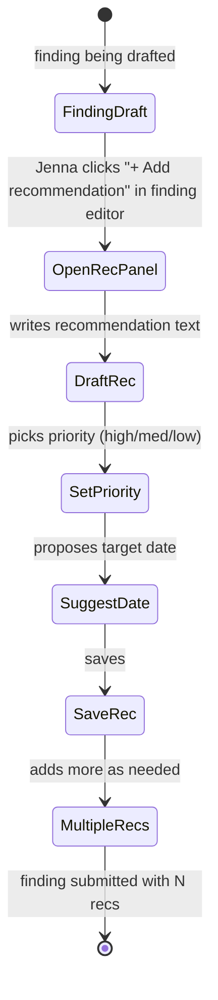
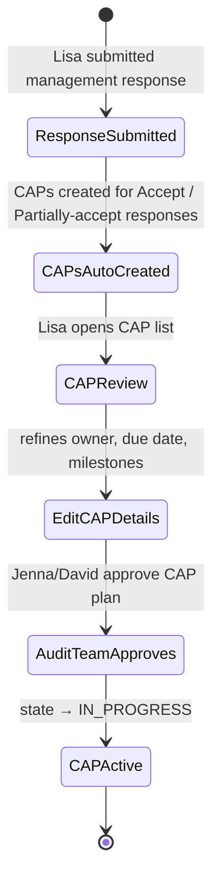
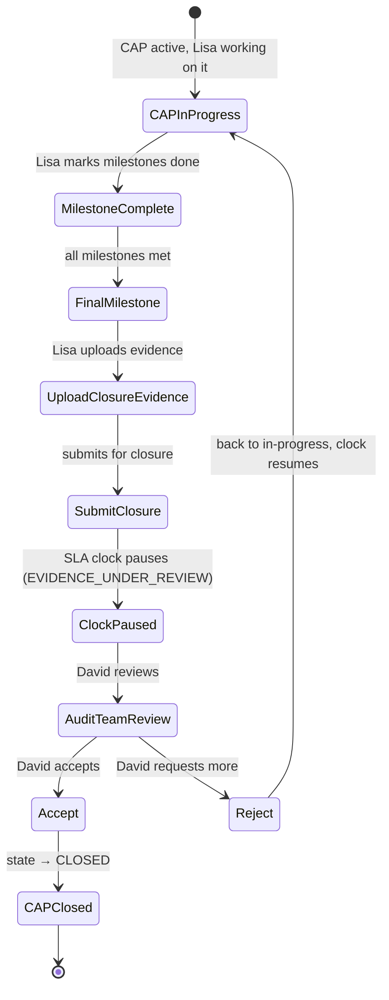
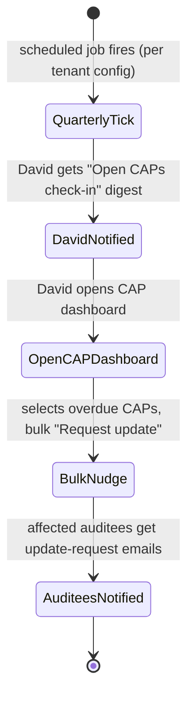

# UX — Recommendations & Corrective Action Plans (CAPs)

> Recommendations are what the audit team asks the auditee to do about a finding. CAPs are the auditee's commitment to do it — with owner, deadline, and milestones — plus the ongoing tracking as the work progresses. This surface is critical because unresolved CAPs are the #1 thing that surfaces at Audit Committee meetings. The UX has to make tracking feel light for the auditee while giving the audit team unambiguous visibility into what's on fire.
>
> **Feature spec**: [`features/recommendations-and-caps.md`](../features/recommendations-and-caps.md)
> **Related UX**: [`finding-authoring.md`](finding-authoring.md) (recommendations attach to findings), [`dashboards-and-search.md`](dashboards-and-search.md) (CAP dashboard), [`notifications-and-activity.md`](notifications-and-activity.md) (CAP reminders)
> **Primary personas**: Jenna (author recommendations), Lisa (commit & execute CAPs), David (monitor CAP progress), Marcus (review aggregate CAP health)

---

## 1. UX philosophy for this surface

- **Recommendation = finding's remediation proposal; CAP = auditee's commitment.** These are two different objects with a relationship. The UX separates them: recommendations appear in reports and with findings; CAPs appear in auditee inboxes and in follow-up tracking. Conflating them (as legacy tools do) confuses everyone.
- **Milestones are first-class.** A CAP isn't one deadline — it's a plan with intermediate checkpoints. The UX encourages (but doesn't require) breaking CAPs into 2-5 milestones. Progress tracking is milestone-granular.
- **Evidence of closure is required.** CAPs don't close on "done by" date — they close when the auditee uploads evidence AND the audit team accepts it. This is non-negotiable per GAGAS follow-up procedures.
- **Follow-up cadence is rhythmic, not one-off.** The audit team checks in with CAP owners on a schedule (quarterly by default; configurable per CAP risk). UX supports this rhythm rather than making follow-up feel ad-hoc.
- **Aging is visually loud.** A CAP 30 days overdue looks dramatically different from a CAP 3 days overdue. Auditees feel appropriate pressure; audit team can prioritize their chase calls.
- **EVIDENCE_UNDER_REVIEW pauses the clock.** Per feature spec, when auditee submits closure evidence, the CAP SLA clock pauses until audit team accepts/rejects. Prevents auditee being penalized for audit-team delays.

---

## 2. Primary user journeys

### 2.1 Journey: Jenna authors recommendations (inside finding editor)



### 2.2 Journey: Lisa commits to CAPs



### 2.3 Journey: Lisa submits CAP closure evidence



### 2.4 Journey: Quarterly follow-up cadence



---

## 3. Screen — Recommendation authoring (inside finding editor)

Already referenced in `finding-authoring.md §4.1` as a "Recommendations (0) [+ Add recommendation]" collapsible region. Details here:

### 3.1 Layout — Add recommendation inline drawer

```
┌─ Recommendations for F-2026-0042 ──────────────────────────────── [+ Add] ┐
│                                                                             │
│  ┌─ REC-042-01 ──────────────────────────────────────────── [edit][×] ─┐  │
│  │ Update AP system config to enforce 2-approver rule above $1k.        │  │
│  │ Priority: HIGH   ·   Target: 2026-05-15   ·   Owner: Lisa Chen       │  │
│  │                                                                        │  │
│  │ Category: Preventive control   ·   Effort: Low                        │  │
│  └────────────────────────────────────────────────────────────────────────┘│
│                                                                             │
│  ┌─ REC-042-02 ──────────────────────────────────────────── [edit][×] ─┐  │
│  │ Implement quarterly review of AP approval configuration.             │  │
│  │ Priority: MEDIUM ·   Target: 2026-06-30  ·   Owner: IT Controls      │  │
│  │                                                                        │  │
│  │ Category: Detective control   ·   Effort: Low                        │  │
│  └────────────────────────────────────────────────────────────────────────┘│
│                                                                             │
│  [+ Add recommendation]                                                     │
└─────────────────────────────────────────────────────────────────────────────┘
```

### 3.2 Add/edit modal

```
┌─ New recommendation ──────────────────────────────────────────────────────┐
│                                                                            │
│  Recommendation text (what should the auditee do?)                         │
│  [ Update AP system configuration to enforce the 2-approver rule for   ]  │
│  [ transactions above $1,000, consistent with the 2022 policy change.  ]  │
│                                                                            │
│  Priority:   (●) High   ( ) Medium   ( ) Low                              │
│  Category:   [ Preventive control ▼ ]                                     │
│  Effort:     ( ) Low   (●) Medium   ( ) High   ( ) Unknown                │
│                                                                            │
│  Target date (suggested):  [ 2026-05-15 ]                                 │
│  Owner (suggested):         [ Lisa Chen ▼ ]                                │
│                                                                            │
│  ⓘ Auditee will review and may adjust owner / date during response.        │
│                                                                            │
│                                              [ Cancel ]  [ Add ]          │
└────────────────────────────────────────────────────────────────────────────┘
```

---

## 4. Screen — CAP list (audit team view)

Invoked from: engagement dashboard → CAPs tab, OR tenant-wide Dashboards → CAP tracker.

### 4.1 Layout — engagement-scoped CAP list

```
┌─ CAPs · FY26 Q1 Revenue Cycle Audit ──────────────────────────────────────┐
│                                                                            │
│  12 CAPs · 4 overdue · 6 in progress · 2 closed              [ Export ]   │
│                                                                            │
│  ┌─ Filter ───────────────────────────────────────────────────────────┐   │
│  │ Status: [All ▼]  Owner: [All ▼]  Aging: [All ▼]  Finding: [All ▼]  │   │
│  └─────────────────────────────────────────────────────────────────────┘   │
│                                                                            │
│  ┌─ 🔴 Overdue (4) ────────────────────────────────────────────────────┐  │
│  │                                                                       │  │
│  │  CAP-042-01  Update AP config to enforce 2-approver $1k+             │  │
│  │    Owner: Lisa Chen   ·   Due: 2026-05-15 (21 days overdue)         │  │
│  │    Finding: F-2026-0042 (Significant)                               │  │
│  │    Milestones: 2/3 complete                                          │  │
│  │    [View]  [Request update]                                          │  │
│  │                                                                       │  │
│  │  CAP-038-02  Restrict IT admin access list                           │  │
│  │    Owner: Maria Rodriguez   ·   Due: 2026-05-01 (35 days overdue)   │  │
│  │    Finding: F-2026-0038 (Material)                                  │  │
│  │    Milestones: 1/4 complete   ⚠ No update in 28 days                │  │
│  │    [View]  [Escalate]                                                │  │
│  │                                                                       │  │
│  │  ... (2 more overdue)                                                │  │
│  └────────────────────────────────────────────────────────────────────────┘│
│                                                                            │
│  ┌─ 🟡 In progress (6) ──────────────────────────────────────────────┐   │
│  │  ... (6 CAPs)                                                        │   │
│  └─────────────────────────────────────────────────────────────────────┘   │
│                                                                            │
│  ┌─ 🔵 Under review (0) ──────────────────────────────────────────────┐   │
│  └──────────────────────────────────────────────────────────────────────┘  │
│                                                                            │
│  ┌─ ✓ Closed (2) ─────────────────────────────────────────────────────┐   │
│  │  ... (2 CAPs)                                                        │   │
│  └──────────────────────────────────────────────────────────────────────┘  │
└────────────────────────────────────────────────────────────────────────────┘
```

### 4.2 Aging visual language

- **0-7 days before due**: green border, no decoration
- **<0 days (overdue) — 0 to 7 days**: amber border, yellow due-date label
- **8-30 days overdue**: red border, red due-date label, "OVERDUE Nd" badge
- **>30 days overdue**: red border + red card tint + stale indicator "⚠ No update in Nd"
- **EVIDENCE_UNDER_REVIEW**: blue border, clock-paused icon

### 4.3 Actions from list

| Action | Behavior |
|---|---|
| Request update | Sends a templated nudge email + in-app notification to CAP owner. Multi-select enables bulk. |
| Escalate | Opens escalation modal: notifies owner's manager + CAE. Requires a rationale. Used for severely overdue CAPs. |
| View | Opens CAP detail page. |

---

## 5. Screen — CAP detail

Primary screen for operating a single CAP (both audit team and auditee use variations of this).

### 5.1 Layout (audit team view)

```
┌─ CAP-042-01 · Update AP config to enforce 2-approver $1k+ ─────[IN PROGRESS]┐
│                                                                               │
│  Finding:         F-2026-0042 · Weak SoD in AP approval [open]               │
│  Recommendation:  REC-042-01                                                  │
│  Owner:           Lisa Chen (CFO)                [Re-assign]                  │
│  Status:          IN PROGRESS                    [Change]                     │
│  Target date:     2026-05-15 (21 days overdue)  [Reschedule]                  │
│  Committed date:  2026-05-15 (not changed)                                   │
│  Priority:        HIGH                                                         │
│                                                                               │
│  ┌─ Description ───────────────────────────────────────────────────────┐    │
│  │ Update AP system configuration to enforce the 2-approver rule for    │    │
│  │ transactions above $1,000 consistent with 2022 policy change.        │    │
│  └────────────────────────────────────────────────────────────────────────┘  │
│                                                                               │
│  ┌─ Milestones (2 of 3 complete) ──────────────────────────────────────┐   │
│  │ ✓ 2026-04-15 — Analysis of current config & impact                    │   │
│  │ ✓ 2026-04-28 — Change request approved by CAB                         │   │
│  │ ○ 2026-05-15 — Production deployment (target)                         │   │
│  └─────────────────────────────────────────────────────────────────────────┘│
│                                                                               │
│  ┌─ Updates (4) ──────────────────────────────────────────────── [Request] ┐│
│  │ Apr 21 · Lisa Chen                                                       ││
│  │  "CAB approval received. Deployment window scheduled for 5/12-5/15."    ││
│  │                                                                           ││
│  │ Apr 10 · Lisa Chen                                                       ││
│  │  "Analysis complete. Config change documented and routed to CAB."       ││
│  │                                                                           ││
│  │ Mar 28 · Lisa Chen                                                       ││
│  │  "Working with IT team on change approval process."                     ││
│  │                                                                           ││
│  │ Mar 15 · Lisa Chen                                                       ││
│  │  "Plan accepted. Starting analysis this week."                           ││
│  └────────────────────────────────────────────────────────────────────────── ┘│
│                                                                               │
│  ┌─ Evidence (0) ──────────────────────────────────────────── [Upload] ────┐│
│  │ No closure evidence submitted yet.                                       ││
│  └──────────────────────────────────────────────────────────────────────────┘│
│                                                                               │
│  Follow-up cadence: Quarterly (next: 2026-07-01)                             │
│                                                                               │
│   [ Escalate ]  [ Request update ]  [ Reopen finding ]                       │
└───────────────────────────────────────────────────────────────────────────────┘
```

### 5.2 Layout (auditee view — Lisa)

Same structure but narrower action set — she can't escalate to herself, can't reopen the finding:

```
┌─ CAP-042-01 · Update AP config to enforce 2-approver $1k+ ─────[IN PROGRESS]┐
│  (same content as above, but bottom actions are:)                            │
│                                                                               │
│   [ Add update ]  [ Mark milestone done ]  [ Upload closure evidence ]       │
│                   [ Request extension ]                                       │
└───────────────────────────────────────────────────────────────────────────────┘
```

### 5.3 "Upload closure evidence" flow

```
┌─ Close CAP-042-01 — submit evidence ────────────────────────────────────┐
│                                                                           │
│  Please upload evidence that this corrective action has been completed.   │
│  The audit team will review and either accept the closure or request     │
│  additional information.                                                   │
│                                                                           │
│  Evidence files                                                           │
│  [ Drag & drop or browse ]                                                │
│   📎 config-change-screenshot.png                                        │
│   📎 post-deployment-test-results.pdf                                    │
│                                                                           │
│  Completion note (what was done; what evidence shows)                     │
│  [ Config updated in prod 2026-05-14. Post-deployment test confirmed  ] │
│  [ 2-approver now enforced for all AP txns >$1k. Screenshot from sys  ] │
│  [ showing config; test results attached. Control is operating as     ] │
│  [ designed.                                                           ] │
│                                                                           │
│  ⓘ Once submitted, the SLA clock pauses while audit team reviews.        │
│                                                                           │
│                                            [ Cancel ]  [ Submit → ]      │
└───────────────────────────────────────────────────────────────────────────┘
```

On submit:
- CAP state → EVIDENCE_UNDER_REVIEW
- SLA clock paused
- David notified (CAP owner's linked reviewer from finding)
- Lisa can't edit milestones or add updates while under review

### 5.4 Audit team review

When David opens a CAP in EVIDENCE_UNDER_REVIEW:

```
┌─ CAP-042-01 · Evidence submitted 2026-05-16 by Lisa Chen ────[UNDER REVIEW]┐
│                                                                              │
│  Lisa's completion note:                                                     │
│   "Config updated in prod 2026-05-14. Post-deployment test confirmed        │
│    2-approver now enforced for all AP txns >$1k..."                         │
│                                                                              │
│  Evidence (2)                                                                │
│   📎 config-change-screenshot.png  [Preview]                                │
│   📎 post-deployment-test-results.pdf  [Preview]                            │
│                                                                              │
│  Review options:                                                             │
│   ( ) Close CAP — evidence sufficient                                       │
│   (●) Request more — evidence incomplete                                    │
│   ( ) Partial — close this milestone only, CAP continues                    │
│                                                                              │
│  Comment (shown to Lisa)                                                     │
│  [ Please also provide the CAB approval record and a 30-day sample    ]    │
│  [ showing the control operated in Production.                         ]    │
│                                                                              │
│  Due date extension: [ +14 days ▼ ]                                         │
│                                                                              │
│                                             [ Cancel ]  [ Send decision ]  │
└──────────────────────────────────────────────────────────────────────────────┘
```

---

## 6. Milestone editing

From CAP detail, "Edit milestones" action opens a focused modal:

```
┌─ Edit milestones — CAP-042-01 ──────────────────────────────────────────┐
│                                                                           │
│  ✓ 2026-04-15  Analysis of current config & impact                        │
│                [Title] [Date] [Owner] [Status]                            │
│                                                                           │
│  ✓ 2026-04-28  Change request approved by CAB                             │
│                                                                           │
│  ○ 2026-05-15  Production deployment                                      │
│                                                                           │
│  [+ Add milestone]                                                        │
│                                                                           │
│  ⓘ Milestones are visible to audit team. Changing dates after commitment │
│    requires rationale.                                                    │
│                                                                           │
│                                           [ Cancel ]  [ Save ]           │
└───────────────────────────────────────────────────────────────────────────┘
```

Auditees can edit milestones freely until audit team accepts CAP plan; after acceptance, editing date requires rationale and notifies audit team.

---

## 7. CAP dashboard (tenant-wide)

Invoked from: top-level Dashboards → CAP tracker. Shows all open CAPs across all engagements.

### 7.1 Layout

```
┌─ CAP tracker · All engagements ────────────────────────────────────────────┐
│                                                                             │
│  ┌─ Summary ──────────────────────────────────────────────────────────┐   │
│  │ 143 open CAPs  ·  47 overdue  ·  18 > 30 days overdue               │   │
│  │ 22 CAPs awaiting closure review  ·  87 closed YTD                   │   │
│  └─────────────────────────────────────────────────────────────────────┘   │
│                                                                             │
│  ┌─ Heatmap: CAPs by aging × priority ────────────────────────────────┐   │
│  │                  On track   Due soon   Overdue   >30d overdue        │   │
│  │  High            12          8          14        6                   │   │
│  │  Medium          34          22         19        8                   │   │
│  │  Low             11          4          4         1                   │   │
│  └─────────────────────────────────────────────────────────────────────┘   │
│                                                                             │
│  ┌─ Trend ────────────────────────────────────────────────────────────┐   │
│  │ [ Line chart: open CAPs over past 12 months ]                        │   │
│  └──────────────────────────────────────────────────────────────────────┘  │
│                                                                             │
│  ┌─ Top owners with overdue CAPs ─────────────────────────────────────┐   │
│  │ Maria Rodriguez (IT Controls)  ........  12 overdue                  │   │
│  │ Lisa Chen (CFO)  ......................  8 overdue                   │   │
│  │ James Park (HR) .......................  5 overdue                   │   │
│  └──────────────────────────────────────────────────────────────────────┘  │
│                                                                             │
│  [ Filter: All engagements ▼ ]   [ Drill into list ]                        │
└─────────────────────────────────────────────────────────────────────────────┘
```

Drill-in opens the flat CAP list scoped to the filter (same UI as §4.1 but cross-engagement).

---

## 8. Reopening and disputes

- **Reopen**: David can reopen a CLOSED CAP if subsequent evidence shows control failure. Creates a new milestone chain; logs rationale; notifies owner.
- **Dispute**: If auditee refuses a recommendation (rejected during response), no CAP is created, but the finding displays `Recommendation rejected — audit team monitoring`. Jenna can escalate to a new finding in next year's engagement, or formally ask Marcus (CAE) to re-engage.

UI for reopening is a confirmation modal with a required rationale (min 100 chars).

---

## 9. Loading, empty, error states

| State | Treatment |
|---|---|
| No CAPs yet (new engagement, no findings closed) | Empty: "No CAPs yet. CAPs are created when the auditee accepts recommendations." No CTA — workflow, not user-initiated. |
| Auditee has no CAPs assigned | Auditee view shows: "No active corrective actions assigned to you. We'll notify you when your audit responses result in CAPs." |
| Evidence upload fails | Per attachment row; retry inline; partial upload preserved. |
| Concurrent milestone edit | Soft conflict: last-write-wins with "Lisa also edited. Your changes preserved as conflict — review [here]." |
| Tenant's follow-up cadence changes | Existing CAPs keep old cadence unless explicitly re-set. Banner on dashboard: "New default cadence applied to new CAPs. [Apply to existing]" |

---

## 10. Responsive behavior

- **xl/lg**: full layouts as drawn.
- **md**: CAP detail becomes single-column with tabs (Milestones / Updates / Evidence).
- **sm**: auditee-facing CAP detail works on mobile — milestone tick, upload evidence, add update. Internal CAP list is view-only on mobile (no bulk actions).

---

## 11. Accessibility

- Status + aging combinations always have text labels alongside color ("Overdue 21 days, HIGH priority").
- Milestone tick/untick is a `<button aria-pressed>` for screen readers.
- CAP state changes announce via `aria-live="polite"`.
- Evidence upload dropzone keyboard-accessible.
- Dashboard heatmap has a fallback `<table>` with category labels for screen readers.

---

## 12. Keyboard shortcuts

CAP list:

| Shortcut | Action |
|---|---|
| `/` | Focus filter |
| `j` / `k` | Next / prev CAP |
| `Enter` | Open CAP |
| `r` | Request update on selected |
| `e` | Escalate |

CAP detail:

| Shortcut | Action |
|---|---|
| `u` | Add update |
| `m` | Edit milestones |
| `⌘+Enter` | Submit evidence (auditee) |

---

## 13. Microinteractions

- **Milestone ticked**: checkmark fills with 300ms scale animation; progress bar (at top of milestones region) animates to new percentage.
- **Evidence uploaded**: file row fades in; subtle green flash around "Submit" button now enabling.
- **CAP closed**: card collapses from list with 400ms animation; celebratory checkmark overlay appears briefly in audit-team queue; "Closed YTD" counter bumps.
- **Aging transition (day rollover)**: cards that crossed a threshold overnight animate from green → amber (or amber → red) on first load of the day.

---

## 14. Analytics & observability

- `ux.rec.added { finding_id, priority, has_target_date }`
- `ux.cap.created { cap_id, from_recommendation, initial_owner }`
- `ux.cap.plan_accepted { cap_id, milestone_count, time_to_acceptance_hours }`
- `ux.cap.milestone_completed { cap_id, milestone_index, was_on_time }`
- `ux.cap.update_added { cap_id, who, length_chars }`
- `ux.cap.evidence_submitted { cap_id, file_count, cycle_time_days }`
- `ux.cap.closed { cap_id, total_cycle_days, had_extension, milestone_count }`
- `ux.cap.reopened { cap_id, reason_length }`
- `ux.cap.escalated { cap_id, escalation_level }`
- `ux.cap.extension_requested { cap_id, days_extension, granted }`

KPIs:
- **Median CAP cycle time** (from IN_PROGRESS → CLOSED, target by priority: HIGH ≤ 90d, MED ≤ 180d, LOW ≤ 365d)
- **Overdue fraction** (target <15%)
- **Extension rate** (target <20% of CAPs request extension; trend monitored)
- **Review turnaround** (evidence submitted → audit team decision; target p90 ≤ 5 business days)
- **Reopen rate** (target <5% — high values indicate closure criteria too lenient)

---

## 15. Open questions / deferred

- **Multi-owner CAPs** (two auditees jointly responsible): MVP 1.0 supports single owner + watchers; true co-ownership deferred to MVP 1.5.
- **Linked risk reduction tracking**: e.g., risk rating of a PRCM control updates when related CAPs close; deferred to v2.1.
- **Predictive at-risk flagging** (ML model predicts likelihood of miss based on update cadence): deferred to v2.1.
- **CAP templates** (common remediation patterns): MVP 1.0 has tenant-level templates via recommendation category; full library deferred.

---

## 16. References

- Feature spec: [`features/recommendations-and-caps.md`](../features/recommendations-and-caps.md)
- Related UX: [`finding-authoring.md`](finding-authoring.md), [`dashboards-and-search.md`](dashboards-and-search.md), [`notifications-and-activity.md`](notifications-and-activity.md)
- Data model: [`data-model/recommendation.md`](../data-model/recommendation.md), [`data-model/cap.md`](../data-model/cap.md)
- API: [`api-catalog.md §3.10`](../api-catalog.md) (`cap.*`, `recommendation.*` tRPC namespaces)

---

*Last reviewed: 2026-04-22. Phase 6 (UX) draft — pending external review.*
