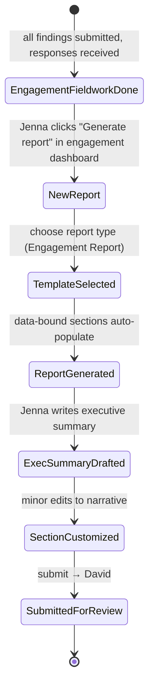
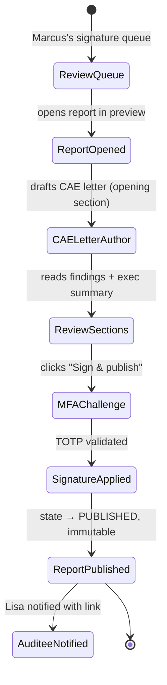

# UX — Report Generation

> Reports are the external deliverable of an audit engagement. Internally, AIMS has 12+ report types (engagement report, findings register, annual summary, APM, PRCM export, board pack, etc.). They share one authoring model: composed from structured source data (findings, recommendations, CAPs, test results) with an editorial layer on top (letter, executive summary, narrative sections). UX goal is to make "regenerate this report from latest data" a one-click action, while preserving editorial content across regenerations.
>
> **Feature spec**: [`features/report-generation.md`](../features/report-generation.md)
> **Related UX**: [`finding-authoring.md`](finding-authoring.md) (source data), [`engagement-management.md`](engagement-management.md) (invocation context), [`platform-admin-and-board-reporting.md`](platform-admin-and-board-reporting.md) (board pack)
> **Primary personas**: Jenna (drafts engagement reports), David (reviews & signs off), Marcus (authors CAE letters, signs reports), Kalpana (approves reports for methodology compliance)

---

## 1. UX philosophy for this surface

- **Composed, not edited.** Unlike a Word doc, an AIMS report has a tree of source-linked sections. Each section is either data-bound (regenerated from current findings, WPs, tests) or editorial (Jenna's executive summary, Marcus's CAE letter). Users don't "edit the report"; they edit the editorial layer and refresh the data layer.
- **Provenance preserved across regen.** If Jenna customizes section 4 to hide a finding as "under management review," regenerating the report because a CAP was added later must not overwrite her section 4 customization. Every editorial change is tracked; regen only replaces data-bound content.
- **Preview is the canvas.** The primary authoring surface is a PDF-like preview. Section-by-section editing is inline within the preview. No separate "source" view with markup to learn.
- **Signoff is a ceremony.** A report moving from DRAFT to PUBLISHED goes through one or more signoff stages (supervisor review → CAE signature → board approval depending on report type). Signoffs are legally meaningful; UX emphasizes finality with confirmation dialogs, password/MFA re-challenge for CAE signature, and a visible "this is a legal signature" warning.
- **Export formats are not re-authoring.** PDF is primary. Word/HTML are secondary exports. No scenario where a user exports to Word, edits, re-imports — that would shatter provenance. Word export is read-only reference, not a round-trip.

---

## 2. Primary user journeys

### 2.1 Journey: Jenna drafts engagement report



### 2.2 Journey: Marcus signs off on report



### 2.3 Journey: Regen after a CAP is added

```mermaid
stateDiagram-v2
    [*] --> ReportPublished: previously published
    ReportPublished --> LateCAPAdded: new CAP approved after publish
    LateCAPAdded --> RegenOffered: Jenna opens report; banner: "3 data changes since publish"
    RegenOffered --> DiffPreview: Jenna clicks "Preview changes"
    DiffPreview --> AcceptRegen: Jenna accepts
    AcceptRegen --> NewVersion: report v1.1 created, v1.0 preserved
    NewVersion --> CAEResign: requires CAE re-signoff
    CAEResign --> [*]
```



---

## 3. Screen — Report composer

The main authoring surface. Two panes: **Outline** (left, 260px) and **Preview** (center, flex).

### 3.1 Layout

```
┌─ Engagement Report · FY26 Q1 Revenue Cycle Audit ─────[DRAFT v0.3]─[Actions ▼]┐
│                                                                                │
│ ┌─ Outline ────────────┐ ┌─ Preview (page 4 of 23) ─────────────────────────┐│
│ │                       │ │                                                   ││
│ │ ▼ Front matter        │ │       Engagement Report                           ││
│ │   Cover               │ │       FY26 Q1 Revenue Cycle Audit                 ││
│ │   Table of contents ✓ │ │                                                   ││
│ │   CAE letter          │ │       ─────────────────────────────────────      ││
│ │                       │ │                                                   ││
│ │ ▼ Executive summary   │ │       4. Findings                                 ││
│ │   Overview            │ │                                                   ││
│ │   Key findings   🖊    │ │       The audit identified 3 findings:            ││
│ │                       │ │                                                   ││
│ │ ▼ Scope & approach   │ │       ┌─────────────────────────────────────┐     ││
│ │   Objectives ✓       │ │       │ F-2026-0042 · Significant            │     ││
│ │   Scope ✓            │ │       │ Weak segregation of duties in AP...  │     ││
│ │   Methodology ✓      │ │       │                                       │     ││
│ │   Pack disclosure ✓  │ │       │ Criteria: Per policy §4.2...         │     ││
│ │                       │ │       │ Condition: Testing of 40 txns...     │     ││
│ │ ▼ Findings           │ │       │ Cause: System config not updated...  │     ││
│ │   4.1 F-2026-0042 ✓  │ │       │ Effect: Est. $840k exposure...       │     ││
│ │   4.2 F-2026-0038 ✓  │ │       │                                       │     ││
│ │   4.3 F-2026-0031 ✓  │ │       │ Recommendations: REC-042-01, REC-042-2│     ││
│ │                       │ │       │ Management response: Accepted        │     ││
│ │ ▼ Recommendations    │ │       │                                       │     ││
│ │   5.1 REC-042-01 ✓   │ │       │ [ Regenerate from source ]           │     ││
│ │   ...                │ │       └───────────────────────────────────────┘     ││
│ │                       │ │                                                    ││
│ │ ▼ Appendices         │ │       (continued on next page...)                 ││
│ │   A. Scope details ✓ │ │                                                    ││
│ │   B. Glossary ✓      │ │                                                    ││
│ │                       │ └────────────────────────────────────────────────────┘│
│ │ [+ Add section]       │                                                       │
│ └───────────────────────┘ Zoom: [75% ▼]  [← 4 of 23 →]   [Data freshness: 2h]  │
│                                                                                │
│   [ Save ]  [ Preview PDF ]  [ Regenerate data ]  [ Submit for review → David ]│
└────────────────────────────────────────────────────────────────────────────────┘
```

### 3.2 Section types and indicators

| Icon | Meaning |
|---|---|
| ✓ (green check) | Section is data-bound and fresh (regenerated within freshness threshold) |
| 🖊 (pencil) | Section has editorial (human-written) content |
| ⟳ (regen) | Section has stale data-bound content; a refresh is available |
| ⚠ | Section has validation errors (missing required fields, pack violations) |
| 🔒 | Section is locked — cannot be edited until unlocked |

Sections are either:

- **Data-bound (generated)** — e.g., `Findings list`, `Recommendation table`, `Pack disclosure`. Content is pulled live from source data (findings, CAPs, packs). User can toggle individual entries on/off but cannot edit prose. Regenerating replaces contents entirely.
- **Editorial (authored)** — e.g., `CAE letter`, `Executive summary`, `Scope narrative`. User-authored rich text. Regeneration never touches editorial sections.
- **Hybrid** — e.g., `Objectives` is structured fields (period, auditee, scope statement) pulled from engagement metadata, but Jenna can add a narrative paragraph. The structured part refreshes; the narrative is preserved.

### 3.3 Inline editing

Click into any preview section to edit:

- Editorial sections: TipTap editor with report-safe toolbar (no tables inside findings, tables allowed in narrative sections).
- Data-bound sections: read-only in preview. To customize, open "Section settings" (gear icon in section header) which lets user:
  - Toggle specific findings/recs on or off
  - Reorder within section
  - Add a prefix/suffix narrative paragraph (hybrid)
  - Override title/numbering

Changes autosave every 10s of idle.

### 3.4 Preview navigation

- Page arrows (← 4 of 23 →) navigate paginated preview.
- Outline click jumps to that section.
- Zoom dropdown: 50 / 75 / 100 / 125 / Fit page / Fit width.
- Data freshness indicator (`Data freshness: 2h`) shows how long since data-bound sections were regenerated. Clickable → opens regen dialog.

---

## 4. Regenerate-from-source dialog

Invoked from: `Regenerate data` button in footer, or `Regenerate from source` button within any data-bound section.

### 4.1 Layout

```
┌─ Regenerate report data ────────────────────────────────────────────────────┐
│                                                                              │
│  Data has changed since last generation (2h ago):                            │
│                                                                              │
│   • 1 new CAP on F-2026-0042 (added 2026-04-21 15:22)                        │
│   • 1 finding classification changed: F-2026-0031 Minor → Significant        │
│   • 2 management responses received                                          │
│                                                                              │
│  ┌─ What will update ───────────────────────────────────────────────────┐   │
│  │ ✓ Findings list (3 findings, 1 re-classified)                         │   │
│  │ ✓ Recommendation status table (2 new statuses)                        │   │
│  │ ✓ CAP tracker appendix (1 CAP added)                                  │   │
│  │ — Executive summary (editorial, preserved)                            │   │
│  │ — CAE letter (editorial, preserved)                                   │   │
│  │ — Scope narrative (editorial, preserved)                              │   │
│  └────────────────────────────────────────────────────────────────────────┘  │
│                                                                              │
│  ┌─ Diff preview ──────────────────────────────────────────────────────────┐│
│  │ [Show side-by-side diff]                                                 ││
│  └──────────────────────────────────────────────────────────────────────────┘│
│                                                                              │
│         [ Cancel ]  [ Regenerate data-bound sections only ]  [ Preview diff ]│
└──────────────────────────────────────────────────────────────────────────────┘
```

### 4.2 Diff preview (optional deeper view)

Side-by-side: before/after for each affected section. Additions green, deletions red, modifications amber. Editorial sections shown as "preserved — no change" with grey backgrounds.

### 4.3 Confirm & apply

On confirm, regen runs:
- Server pulls fresh source data
- Replaces data-bound sections
- Preserves editorial sections verbatim
- Bumps report version (v0.3 → v0.4 if still draft; v1.0 → v1.1 if already published and being re-issued)
- Audit log entry with delta summary

If the report was PUBLISHED, regen produces a new version and prompts: "Publishing v1.1 requires CAE re-signoff."

---

## 5. Report template picker

Invoked from: engagement dashboard → "Generate report" button, or standalone (Reports hub) → "New report."

### 5.1 Layout

```
┌─ New report ────────────────────────────────────────────────────────────────┐
│                                                                              │
│  Engagement:  FY26 Q1 Revenue Cycle Audit  [change]                         │
│                                                                              │
│  Report type                                                                 │
│                                                                              │
│  ┌──────────────────────┐  ┌──────────────────────┐  ┌──────────────────────┐│
│  │ Engagement Report    │  │ Findings Register    │  │ Recommendation Status││
│  │ Full GAGAS report    │  │ Detailed finding     │  │ CAP tracker export   ││
│  │ with CAE letter      │  │ exposition           │  │                      ││
│  │ ~25 pages            │  │ ~15 pages            │  │ ~5 pages             ││
│  │                      │  │                      │  │                      ││
│  │ [ Select ]           │  │ [ Select ]           │  │ [ Select ]           ││
│  └──────────────────────┘  └──────────────────────┘  └──────────────────────┘│
│                                                                              │
│  ┌──────────────────────┐  ┌──────────────────────┐  ┌──────────────────────┐│
│  │ APM (Audit Planning  │  │ PRCM Export          │  │ Annual Summary       ││
│  │ Memo)                │  │                      │  │ (tenant-wide)        │
│  │ 14-section planning  │  │ Matrix export        │  │                      ││
│  │ memo                 │  │ w/ annotations       │  │ CAE year-end report  ││
│  │                      │  │                      │  │                      ││
│  │ [ Select ]           │  │ [ Select ]           │  │ [ Select ]           ││
│  └──────────────────────┘  └──────────────────────┘  └──────────────────────┘│
│                                                                              │
│  [ Show all report types (12) ]                                              │
│                                                                              │
│                                                          [ Cancel ]  [ Next ]│
└──────────────────────────────────────────────────────────────────────────────┘
```

### 5.2 Template options (after selection)

Step 2 of new-report wizard:

- **Branding**: tenant default (pulled from tenant config) or custom for this report
- **Pack disclosure depth**: summary / detailed / full dimension matrix
- **Include sections** (checkboxes for optional sections): e.g., "Include pack annotation history"
- **Signoff chain**: show the roles that will review this report (read-only; pulled from report type + tenant config)

Confirm creates the report in DRAFT with all sections populated from latest source data.

---

## 6. Signoff & publish flow

Invoked from: `Submit for review → David` button in composer footer. Progresses through states based on report type's configured signoff chain.

### 6.1 Review flow (David → Kalpana → Marcus)

Each reviewer sees the report in a mode similar to the finding reviewer: full preview, inline commenting, but no section editing. Reviewer actions:

- **Leave comment on section** — anchored inline, visible to next reviewer and author
- **Return for revision** — sends report back to DRAFT with consolidated comments
- **Approve & advance** — moves to next signoff stage

### 6.2 Marcus's signature (final signoff)

```
┌─ Sign report · FY26 Q1 Revenue Cycle Audit v1.0 ───────────────────────────┐
│                                                                              │
│  ⚠ You are about to apply your electronic signature as CAE.                  │
│                                                                              │
│  This signature is legally equivalent to a handwritten signature under       │
│  your tenant's DPA and the U.S. ESIGN Act. The report will become           │
│  immutable and be distributed per the recipient list below.                  │
│                                                                              │
│  Signing as: Marcus Thompson, Chief Audit Executive                          │
│  Signing date: 2026-04-22 10:47 EDT                                          │
│                                                                              │
│  Distribution list:                                                          │
│   • Lisa Chen (Auditee, CFO)                                                 │
│   • Audit Committee (via board portal)                                       │
│   • Internal retention archive                                               │
│                                                                              │
│  MFA challenge (required for signature)                                      │
│  [ 6-digit TOTP code _______ ]                                               │
│                                                                              │
│  Attestation (required, type "I attest"):                                    │
│  [ ___________________ ]                                                     │
│                                                                              │
│                                      [ Cancel ]  [ Sign & publish ]          │
└──────────────────────────────────────────────────────────────────────────────┘
```

TOTP validates against Marcus's registered authenticator. Typed attestation must match exactly (case-insensitive, whitespace-normalized). On success:

- Report state → PUBLISHED
- Content hash appended to audit-log chain
- PDF rendered and archived (S3 with write-lock object lock)
- Distribution notifications sent
- Report becomes immutable — further edits create a new version requiring re-signoff

### 6.3 Post-publish view

Report detail page shows a "Published" banner with signature metadata:

```
┌─ [PUBLISHED] Engagement Report · v1.0 ──────────────────────────────────────┐
│  Signed by Marcus Thompson (CAE) on 2026-04-22 10:47 EDT                     │
│  Audit log hash: sha256:a4c2f1...                                           │
│  [ Download PDF ]  [ View signature evidence ]  [ Issue new version ]        │
└──────────────────────────────────────────────────────────────────────────────┘
```

---

## 7. Report versioning

Each report has a version chain:

- Draft versions: v0.1, v0.2, ... (incremented on every save/regen while in DRAFT/IN_REVIEW)
- Published versions: v1.0, v1.1, v2.0 (major on material change, minor on data refresh)
- Each published version preserved indefinitely; retrievable via version dropdown in report header

Version dropdown:

```
┌─ Version ─────────────────────────────────────────────────┐
│ ● v1.1  Published 2026-05-15 — data refresh post-CAP      │
│   v1.0  Published 2026-04-22 — initial release            │
│   v0.3  Draft                                              │
│   v0.2  Draft                                              │
│   v0.1  Draft                                              │
└────────────────────────────────────────────────────────────┘
```

Clicking an earlier version opens in read-only preview with a yellow banner: "Viewing v1.0 (published 2026-04-22). This is not the latest. [View latest v1.1]."

---

## 8. Export formats

From the report detail page or composer `Actions ▼` menu:

- **PDF** (primary) — embedded fonts, tenant branding, audit-log hash in footer. Rendered via headless Chromium.
- **Word (.docx)** (reference only) — flagged: "Word export is for reference. Edits made in Word do not round-trip back to AIMS."
- **HTML bundle** (for internal archival integrations)
- **JSON snapshot** (for downstream systems; includes structured section data + rendered text)

Each export is logged to audit trail with the export format and recipient (if sent via notifications).

---

## 9. Loading, empty, error states

| State | Treatment |
|---|---|
| No reports exist for engagement | Empty state on Reports tab: "No reports yet. Generate a report once fieldwork findings are submitted." CTA: "Generate report". If no findings exist yet, primary CTA is disabled with tooltip: "At least one finding must be submitted before generating a report." |
| Regen in progress | Preview pane shows skeleton. Progress indicator: "Regenerating sections 4, 5, 6..." Cancel button available. |
| Data-bound section has no source | E.g., Findings section but no findings exist. Section renders with placeholder: "No findings to report." Author can leave or remove the section entirely. |
| Regen failed (e.g., API timeout) | Banner: "Regen failed. Previous version preserved. [Retry]". No partial state. |
| Pack validation error on publish | Signoff blocked. Error panel: "Pack GAGAS-2024.1 requires section 6.39 to include root cause analysis. F-2026-0042's Cause element is empty." Click to jump to finding for fix. |
| Concurrent editing (rare — report is single-author workflow) | Last-write-wins with warning: "Marcus was also editing. Your changes have been saved as a new version branch. [Merge] [Keep yours] [Keep his]". |
| Network loss during signoff | MFA challenge re-shown on reconnect; nothing persisted until TOTP + attestation complete. |

---

## 10. Responsive behavior

Report composer is desktop-only in MVP 1.0. Previewing a published report is responsive:

- **xl/lg**: Full composer with outline + preview as drawn.
- **md**: Composer hidden from non-authors; authors see warning "Best on desktop." Published report preview works with zoom controls.
- **sm**: Preview-only. Zoom & pagination works. Edit actions disabled.

---

## 11. Accessibility

- Outline is a `<nav><ol>` with `aria-current="page"` on the active section.
- Section completion indicators (✓ / ⟳ / 🖊) have text equivalents for screen readers.
- Preview pane is `<main role="main">`; section headings preserve `<h2>/<h3>/<h4>` hierarchy.
- Regen dialog traps focus; keyboard shortcut `Esc` cancels; `Enter` confirms.
- Signoff dialog: MFA input is `aria-required=true`; attestation `aria-describedby` explains exact string required.
- State changes (Draft → Published) announce via `aria-live="polite"`.
- Color-coded diff uses icons ± for screen readers: `<span class="sr-only">Added</span>` on green blocks.

---

## 12. Keyboard shortcuts

Within composer:

| Shortcut | Action |
|---|---|
| `⌘+S` / `Ctrl+S` | Save |
| `⌘+P` / `Ctrl+P` | Preview PDF |
| `⌘+Shift+R` | Regenerate data |
| `j` / `k` | Next / previous section in outline |
| `Enter` (on outline item) | Jump to section |
| `⌘+Enter` | Submit for review |
| `/` | Focus outline search |

Within signoff dialog:

| Shortcut | Action |
|---|---|
| `Esc` | Cancel |
| (no default Enter bind — signature requires explicit click) |

---

## 13. Microinteractions

- **Section regen complete**: Affected sections in preview pulse amber for 500ms, then settle. Outline icons flip from ⟳ to ✓.
- **Signoff applied**: Full-screen overlay with a large checkmark, "Report published" label, and a downloading spinner for the rendered PDF. Auto-redirects to published view after 3s.
- **Comment added**: Tiny bubble slides in beside the anchored text with a subtle bounce; outline section badge increments "1 comment."
- **Data freshness indicator color**: Green (<1h), amber (1-24h), red (>24h with `Actions suggest regen`).

All animations respect `prefers-reduced-motion`.

---

## 14. Analytics & observability

- `ux.report.created { report_type, engagement_id, template_version }`
- `ux.report.section.edited { report_id, section_key, kind }` (editorial/data-bound customization)
- `ux.report.regen.opened { report_id }`
- `ux.report.regen.committed { report_id, delta_summary }`
- `ux.report.signoff.opened { report_id, stage, signer_role }`
- `ux.report.signoff.approved { report_id, stage }`
- `ux.report.signoff.returned { report_id, stage, reason_length }`
- `ux.report.published { report_id, version, signer_id, pack_digest }`
- `ux.report.export { report_id, format }`

KPIs:
- **Time from fieldwork-complete to report-published** (target: median ≤ 10 business days for engagement reports)
- **Regen adoption** (target: ≥70% of published reports were regenerated at least once from source after first draft, indicating users trust regen)
- **Rework loops** (reports returned for revision > 0; target ≤ 2 per report median)
- **Signoff latency** (from submit to publish; target p90 ≤ 5 business days)

---

## 15. Open questions / deferred

- **Redlining across versions** (v1.0 → v1.1 track-changes view): deferred to MVP 1.5.
- **Co-authored editorial sections** (Marcus and Jenna editing CAE letter simultaneously): MVP uses pessimistic locking; Yjs deferred to MVP 1.5 (same as APM).
- **Narrative AI drafting** (GPT-generated executive summary): deferred to v2.1 with explicit human attestation gate.
- **Board pack export**: covered separately in `platform-admin-and-board-reporting.md`; deferred to MVP 1.5.
- **External distribution tracking** (read-receipt for auditees): deferred. Today, distribution is just notification-sends; read tracking requires portal login.

---

## 16. References

- Feature spec: [`features/report-generation.md`](../features/report-generation.md)
- Related UX: [`finding-authoring.md`](finding-authoring.md), [`engagement-management.md`](engagement-management.md), [`platform-admin-and-board-reporting.md`](platform-admin-and-board-reporting.md)
- Data model: [`data-model/report.md`](../data-model/report.md)
- API: [`api-catalog.md §3.7`](../api-catalog.md) (`report.*` tRPC namespace)
- Personas: [`02-personas.md §2,4-6`](../02-personas.md)

---

*Last reviewed: 2026-04-22. Phase 6 (UX) draft — pending external review.*
