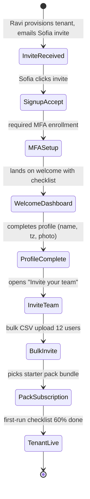
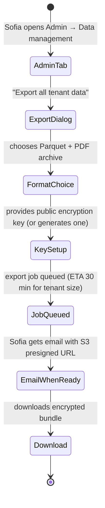

# UX — Tenant Onboarding & Admin

> Tenant onboarding is the time between "customer signed contract" and "customer's team is using AIMS for real work." Every week of delay here kills adoption and renewal probability. UX must make setup feel fast, clear, and safe — with progressive enablement (basic working state in hours, full maturity in weeks). Tenant admin is the ongoing tooling Sofia (customer admin) uses: user management, roles, SSO config, data export, pack subscriptions.
>
> **Feature spec**: [`features/tenant-onboarding-and-admin.md`](../features/tenant-onboarding-and-admin.md)
> **Related UX**: [`identity-auth-sso.md`](identity-auth-sso.md) (SSO setup flow), [`pack-attachment.md`](pack-attachment.md) (pack subscription is managed here), [`platform-admin-and-board-reporting.md`](platform-admin-and-board-reporting.md) (AIMS's internal onboarding console)
> **Primary personas**: Sofia (Tenant Admin, Segment A/B), Marcus (CAE — configures audit team roles), Ravi (Platform Admin — behind-the-scenes provisioning)

---

## 1. UX philosophy for this surface

- **Working > Perfect.** New tenants get a working system before a configured one. Sensible defaults everywhere; configuration as progressive enhancement.
- **Checklist, not a wizard.** Onboarding steps are a checklist that surfaces across sessions. Users can stop/resume; they don't have to complete onboarding in one sitting.
- **Admin surfaces are structured tables.** No creative UI for user management, role permissions, SSO config — standard table + detail-drawer patterns are what admins expect.
- **Import over Add-one-at-a-time.** CSV import for users is a first-class path. "Add user" is for exceptions.
- **Destructive actions are speed-bumped.** Delete user / rotate SSO cert / export-then-wipe tenant: all require MFA + typed attestation.
- **Data portability is a promise.** Sofia can export everything at any time — full Parquet dump, encrypted with a key she controls. This is in the DPA; UX makes it a 2-click action.

---

## 2. Primary user journeys

### 2.1 Journey: Sofia's first 10 minutes



### 2.2 Journey: Sofia configures SSO

```mermaid
stateDiagram-v2
    [*] --> SecurityTab: Sofia opens Security → SSO
    SecurityTab --> IdPPicker: picks Okta (SAML)
    IdPPicker --> XMLConfig: uploads IdP metadata XML
    XMLConfig --> AIMSSPMetadata: AIMS shows its SP metadata for reciprocal config
    AIMSSPMetadata --> TestConnection: Sofia tests SSO with a test account
    TestConnection --> TestSuccess: assertion validates
    TestSuccess --> EnableSSO: confirmation: "enforce SSO for all users?"
    EnableSSO --> SSOLive: SSO active; next login via IdP
    SSOLive --> [*]
```



### 2.3 Journey: Export everything (data portability)



---

## 3. Screen — First-run welcome & checklist

Invoked from: tenant's first signed-in session.

### 3.1 Layout

```
┌─ Welcome to AIMS — let's get you set up ──────────────────────────────────┐
│                                                                              │
│  Hi Sofia,                                                                  │
│  You've been set up as the Tenant Admin for NorthStar Internal Audit.       │
│                                                                              │
│  ┌─ Setup checklist (3 of 8 complete) ───────────────────────────────────┐ │
│  │                                                                         │ │
│  │ [▓▓▓░░░░░] 38%                                                          │ │
│  │                                                                         │ │
│  │  ✓ Profile set up                                          (complete)  │ │
│  │  ✓ MFA enrolled                                            (complete)  │ │
│  │  ✓ Payment verified (Stripe)                               (complete)  │ │
│  │                                                                         │ │
│  │  ○ Invite your audit team                                  [Start →]   │ │
│  │  ○ Configure SSO (optional)                                [Configure] │ │
│  │  ○ Subscribe to standards packs                            [Choose]    │ │
│  │  ○ Set tenant branding (logo, colors)                      [Set up]    │ │
│  │  ○ Create first engagement                                 [Create]    │ │
│  │                                                                         │ │
│  │  💡 Tip: You don't have to complete these now. We'll keep this list   │ │
│  │     handy at the top of your dashboard until you're done.              │ │
│  └─────────────────────────────────────────────────────────────────────────┘│
│                                                                              │
│  Questions? [ Book 30-min onboarding call with our team ]                   │
│  Or: [ Browse getting-started docs ]                                        │
│                                                                              │
│                                        [ Skip for now — explore AIMS ]     │
└──────────────────────────────────────────────────────────────────────────────┘
```

The checklist persists at the top of the admin dashboard until completed or explicitly dismissed.

### 3.2 Progressive completion indicators

- Checklist item status updates in real-time (e.g., first user invited → "Invite your audit team" ticks)
- Percentages animated smoothly
- Dismissing the checklist requires explicit "I don't need this" click (not auto-dismiss) so users can always find it

---

## 4. Screen — User management

Invoked from: Admin → Users.

### 4.1 Layout

```
┌─ Users — NorthStar Internal Audit ────────────────────────────────────────┐
│                                                                             │
│  14 active users · 2 pending invites · 1 suspended     [+ Invite users]   │
│                                                                             │
│  ┌─ Filter ─────────────────────────────────────────────────────────────┐│
│  │ Status: [Active ▼]  Role: [All ▼]  SSO: [All ▼]  [ 🔍 search ______ ]││
│  └───────────────────────────────────────────────────────────────────────┘│
│                                                                             │
│  ┌── Table ─────────────────────────────────────────────────────────────┐│
│  │ Name            │ Email              │ Role      │ SSO │ Last active ││
│  │──────────────────────────────────────────────────────────────────────││
│  │ Marcus Thompson │ marcus@ns.com      │ CAE       │ ✓   │ 2h ago     ││
│  │ Jenna Patel     │ jenna@ns.com       │ Senior    │ ✓   │ 20 min ago ││
│  │ David Chen      │ david@ns.com       │ Supervisor│ ✓   │ 1h ago     ││
│  │ Kalpana Rao     │ kalpana@ns.com     │ Methodology│ ✓  │ 3h ago     ││
│  │ Tim Wong        │ tim@ns.com         │ Staff     │ ✓   │ 30 min ago ││
│  │ ...                                                                   ││
│  └───────────────────────────────────────────────────────────────────────┘│
│                                                                             │
│  [ Bulk CSV import ]  [ Export users ]                                     │
└─────────────────────────────────────────────────────────────────────────────┘
```

### 4.2 Invite users — single

```
┌─ Invite user ─────────────────────────────────────────────────────────┐
│                                                                         │
│  Email:    [ new.person@ns.com ]                                       │
│  Name:     [ Full name ]                                               │
│  Role:     [ Senior Auditor ▼ ]                                        │
│                                                                         │
│  [ ] Send custom welcome message                                       │
│                                                                         │
│  The user will receive an email invite (or be auto-created via SSO     │
│  if they log in with your SSO provider).                                │
│                                                                         │
│                                       [ Cancel ]  [ Send invite ]     │
└─────────────────────────────────────────────────────────────────────────┘
```

### 4.3 Invite users — CSV bulk

```
┌─ Bulk CSV import — users ─────────────────────────────────────────────┐
│                                                                         │
│  CSV must have columns: email, name, role                              │
│  Download: [ CSV template ]                                            │
│                                                                         │
│  [ Drop CSV or browse ]                                                 │
│                                                                         │
│  Preview (from uploaded file, 12 rows):                                │
│   ┌──────────────────────────────────────────────────────────────┐    │
│   │ Row │ Email              │ Name         │ Role      │ Valid? │    │
│   │──────────────────────────────────────────────────────────────│    │
│   │  1  │ jane@ns.com        │ Jane Doe     │ Senior    │ ✓      │    │
│   │  2  │ alex@ns.com        │ Alex Kim     │ Staff     │ ✓      │    │
│   │  3  │ invalid            │ ???          │ Senior    │ ⚠      │    │
│   │  ...                                                          │    │
│   └──────────────────────────────────────────────────────────────┘    │
│                                                                         │
│  1 row has validation errors. Fix or skip invalid rows.                │
│                                                                         │
│                                [ Cancel ]  [ Skip invalid & import ]   │
└─────────────────────────────────────────────────────────────────────────┘
```

### 4.4 User detail drawer

Clicking a user:

```
┌─ Jenna Patel ──────────────────────────────────────────────── [×] ┐
│                                                                      │
│  Email:    jenna@ns.com       [SSO verified ✓]                     │
│  Role:     Senior Auditor     [Change]                             │
│  Status:   Active             [Suspend] [Deactivate]               │
│                                                                      │
│  Permissions (computed from role + overrides)                       │
│   ✓ Author findings                                                 │
│   ✓ Author WPs                                                      │
│   ✗ Approve findings                                                │
│   ✗ Access platform admin console                                   │
│   [+ Add permission override]                                       │
│                                                                      │
│  MFA:           Enrolled (TOTP + backup codes)                       │
│  Last login:    2026-04-22 09:12 EDT                                │
│  Current session: Active, expires in 6h                             │
│  [Revoke all active sessions]                                       │
│                                                                      │
│  CPE status: ✓ On track (42 of 80 hrs this biennium)                │
│                                                                      │
│  Recent activity: 47 events in past 7 days [View audit log]         │
└──────────────────────────────────────────────────────────────────────┘
```

---

## 5. Screen — Roles & permissions

Invoked from: Admin → Roles.

### 5.1 Layout

Matrix view — roles as columns, permissions as rows:

```
┌─ Roles & permissions ─────────────────────────────────────────────────────┐
│                                                                             │
│  Built-in roles (read-only)                Custom roles   [+ New role]     │
│                                                                             │
│ ┌─ Permission matrix ──────────────────────────────────────────────────┐  │
│ │                           │ CAE │ Dir │ Super │ Senior │ Staff │ QA │  │
│ │───────────────────────────────────────────────────────────────────── │  │
│ │ Create engagement         │  ✓  │  ✓  │   ✓   │   ✗    │   ✗   │ ✗ │  │
│ │ Edit engagement           │  ✓  │  ✓  │   ✓   │   ✓    │   ✗   │ ✗ │  │
│ │ Author findings           │  ✓  │  ✓  │   ✓   │   ✓    │   ✓   │ ✗ │  │
│ │ Approve findings          │  ✓  │  ✓  │   ✓   │   ✗    │   ✗   │ ✗ │  │
│ │ Sign reports              │  ✓  │  ✗  │   ✗   │   ✗    │   ✗   │ ✗ │  │
│ │ Modify packs              │  ✗  │  ✗  │   ✗   │   ✗    │   ✗   │ ✓ │  │
│ │ Invite users              │  ✗  │  ✗  │   ✗   │   ✗    │   ✗   │ ✗ │  │
│ │ Configure SSO             │  ✗  │  ✗  │   ✗   │   ✗    │   ✗   │ ✗ │  │
│ │ View audit log            │  ✓  │  ✓  │   ✓   │   ✗    │   ✗   │ ✓ │  │
│ │ ...                                                                    │  │
│ └─────────────────────────────────────────────────────────────────────── ┘  │
│                                                                             │
│  Admin permissions (Tenant Admin role only — Sofia):                       │
│   ✓ Invite users · Configure SSO · Modify roles · Export data              │
└─────────────────────────────────────────────────────────────────────────────┘
```

Custom roles can be created but inherit a base set; can extend but not reduce default permissions for safety.

---

## 6. Screen — SSO configuration

Invoked from: Admin → Security → SSO.

### 6.1 Layout

```
┌─ SSO — Single Sign-On ────────────────────────────────────────────────────┐
│                                                                             │
│  Status: Not configured                                                     │
│                                                                             │
│  ┌─ Provider ────────────────────────────────────────────────────────────┐│
│  │ ( ) Microsoft Entra (Azure AD) — SAML                                  ││
│  │ (●) Okta — SAML                                                        ││
│  │ ( ) Google Workspace — SAML                                            ││
│  │ ( ) Generic SAML 2.0                                                   ││
│  │ ( ) OIDC — contact support to enable                                   ││
│  └────────────────────────────────────────────────────────────────────────┘│
│                                                                             │
│  Step 1: Set up AIMS as an app in Okta                                     │
│   AIMS SP metadata:                                                         │
│    • Entity ID:   https://app.aims.io/saml/northstar                       │
│    • ACS URL:     https://app.aims.io/saml/northstar/acs                   │
│    • NameID:      email address                                             │
│   [ Download SP metadata XML ]                                              │
│                                                                             │
│  Step 2: Paste your Okta IdP metadata                                       │
│  [ paste XML or upload file ]                                               │
│                                                                             │
│  Step 3: Test SSO                                                           │
│   [ Test connection with your account ]                                    │
│                                                                             │
│  Step 4: Enforce SSO for users                                              │
│   (●) Optional — users may log in via SSO or password                      │
│   ( ) Required — all users MUST log in via SSO                             │
│   ( ) Required except: [ select bypass users ]                             │
│                                                                             │
│                                  [ Save as draft ]  [ Activate SSO ]       │
└─────────────────────────────────────────────────────────────────────────────┘
```

### 6.2 Test connection

- Opens SAML flow in a new window using Sofia's own account
- On success: "Logged in as Sofia Rodriguez via Okta. Attribute map looks good."
- On failure: detailed error with remediation hints ("Missing NameID attribute", "Signature validation failed — check cert", etc.)

### 6.3 Activate SSO warning

```
┌─ Activate SSO — confirm ─────────────────────────────────────────────┐
│                                                                        │
│  You're about to require SSO for all users in your tenant.            │
│                                                                        │
│  14 active users affected                                             │
│   • 12 will be auto-matched by email                                  │
│   • 2 users don't have IdP accounts:                                  │
│     - bob@partner.com (external auditor)                              │
│     - sara@ns.com (recent hire, not yet in Okta)                      │
│                                                                        │
│  These users won't be able to log in until added to Okta. Do you      │
│  want to keep them as SSO bypass (password login) for now?            │
│                                                                        │
│  [x] Keep bob@partner.com as SSO bypass                               │
│  [ ] Keep sara@ns.com as SSO bypass                                   │
│                                                                        │
│  Type "ACTIVATE SSO" to confirm:                                       │
│  [ ___________ ]                                                      │
│                                                                        │
│                                       [ Cancel ]  [ Activate ]        │
└────────────────────────────────────────────────────────────────────────┘
```

---

## 7. Screen — Data management (export & import)

Invoked from: Admin → Data management.

### 7.1 Layout

```
┌─ Data management ─────────────────────────────────────────────────────────┐
│                                                                             │
│  ┌─ Data export ─────────────────────────────────────────────────────────┐│
│  │ Export all tenant data in Parquet + PDF archive format.                ││
│  │ Use for: backup, compliance snapshot, migration.                       ││
│  │ [ Export now ]    Last exported: 2026-01-14 by Sofia                   ││
│  └────────────────────────────────────────────────────────────────────────┘│
│                                                                             │
│  ┌─ Scoped imports ──────────────────────────────────────────────────────┐│
│  │ Import CSV for these object types only:                                ││
│  │  • Audit universe entities     [ Import ]                              ││
│  │  • Staff / personnel roster    [ Import ]                              ││
│  │  • Archived engagements (r/o)  [ Import ]                              ││
│  │                                                                         ││
│  │ In-flight engagements cannot be imported (per data model constraints).││
│  └────────────────────────────────────────────────────────────────────────┘│
│                                                                             │
│  ┌─ Tenant deletion ─────────────────────────────────────────────────────┐│
│  │ Request tenant deletion — requires 30 day cooling-off period.          ││
│  │ [ Request deletion ]   Irreversible.                                    ││
│  └────────────────────────────────────────────────────────────────────────┘│
└─────────────────────────────────────────────────────────────────────────────┘
```

### 7.2 Export-now flow

Multi-step dialog:
1. **Format**: Parquet + PDF (default) / Parquet only / PDF only
2. **Encryption**: AIMS-provided key (simple) / Your public key (secure — provides PEM textarea)
3. **Scope**: All data (default) / Specific fiscal years
4. **Confirm**: estimated bundle size, ETA
5. Job queued; email/notification on completion

---

## 8. Screen — Tenant branding

Invoked from: Admin → Branding.

Simple: logo upload, color picker for primary/secondary, preview panel showing where branding appears (login screen, reports, emails).

---

## 9. Screen — Billing & subscription

Invoked from: Admin → Billing. Read-heavy, minimal interaction.

- Current plan (tier, seat count, pack bundle)
- Current month usage (active users, engagement count, storage)
- Next invoice date + amount
- Payment method (Stripe card or ACH on file)
- Invoice history (download PDFs)
- Plan change: "Contact your CSM to modify"

---

## 10. Loading, empty, error states

| State | Treatment |
|---|---|
| First-time, no users beyond Sofia | User table shows her alone + CTA "Invite your team." |
| CSV import with all invalid rows | "All rows failed validation. [Review errors]" Import blocked. |
| SSO test fails | Error detail in dialog; common causes enumerated; "Contact support" link. |
| Data export job fails mid-run | Email notification explains; retry button available. |
| Role change affecting active user sessions | "Jenna's role changed. Active sessions may continue with old permissions for up to 5 minutes." Hash-blocked sessions can be force-revoked. |
| Tenant approaching seat limit | Banner: "14 of 15 seats used. [Upgrade plan]" |

---

## 11. Responsive behavior

Admin surfaces are desktop-first but should work on tablet for emergency use (revoke session, suspend user). Mobile is view-only.

---

## 12. Accessibility

- Permission matrix is a proper semantic `<table>` with row/column headers.
- SSO configuration steps use a semantic `<ol>` with numbered headings.
- CSV upload supports keyboard file picker.
- Destructive confirmations require typed attestation (avoids click-through accidents).

---

## 13. Keyboard shortcuts

Common in admin surfaces:

| Shortcut | Action |
|---|---|
| `/` | Focus search |
| `n u` | New user |
| `n r` | New role |
| `⌘+K` | Command palette (jump to any admin section) |

---

## 14. Microinteractions

- **Invite sent**: toast with "Invite sent to jane@ns.com. Tracker: [Pending]"
- **SSO test success**: checkmark animation + "Great — we found your account."
- **SSO activation**: progress bar showing "Migrating sessions..." 1-2s.
- **Checklist item tick**: subtle confetti-free green fill animation; progress bar bumps.

---

## 15. Analytics & observability

- `ux.onboarding.checklist_item_completed { item_key, time_from_tenant_creation_minutes }`
- `ux.onboarding.first_engagement_created { time_from_tenant_creation_minutes }`
- `ux.admin.user_invited { role, via_csv_bulk }`
- `ux.admin.sso_tested { provider, success }`
- `ux.admin.sso_activated { provider, user_count_affected, bypass_count }`
- `ux.admin.role_changed { user_id, from_role, to_role }`
- `ux.admin.export_requested { format, scope, user_key_provided }`

KPIs:
- **Time to first engagement** (from tenant creation; target: median ≤ 5 business days)
- **Setup checklist completion** (target: 80% at 14 days)
- **SSO activation rate** (target: ≥50% of Segment A within 30 days)
- **CSV import success rate** (target: >90% of uploads result in at least 1 successful row)

---

## 16. Open questions / deferred

- **Self-serve plan upgrades**: deferred — plan changes go through CSM for now.
- **Multi-tenant identity federation** (one Sofia across multiple audit orgs): deferred to v2.1.
- **Just-in-time user provisioning via SCIM**: MVP 1.5.
- **Audit-log-driven anomaly detection** (suspicious admin actions): deferred to v2.1.

---

## 17. References

- Feature spec: [`features/tenant-onboarding-and-admin.md`](../features/tenant-onboarding-and-admin.md)
- Related UX: [`identity-auth-sso.md`](identity-auth-sso.md), [`pack-attachment.md`](pack-attachment.md), [`platform-admin-and-board-reporting.md`](platform-admin-and-board-reporting.md)
- API: [`api-catalog.md §3.13`](../api-catalog.md) (`tenant.*`, `user.*` tRPC namespaces)

---

*Last reviewed: 2026-04-22. Phase 6 (UX) draft — pending external review.*
